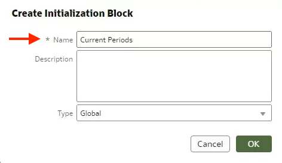
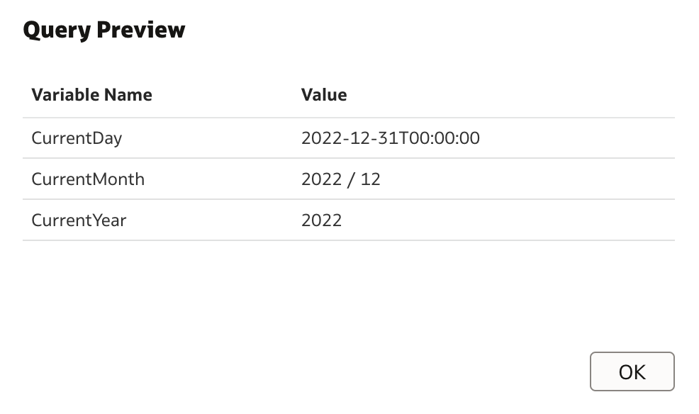
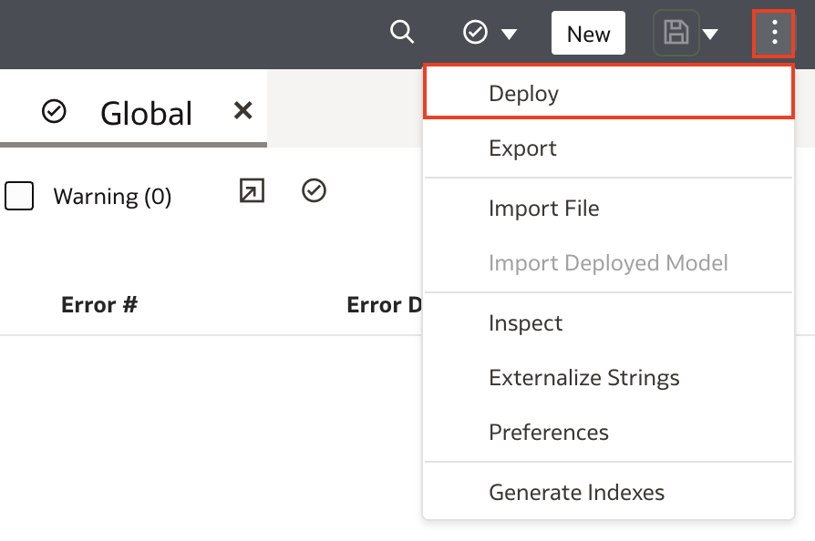

# Create Initialization Blocks and Variables

## Introduction

In this lab, you create a global initialization block with three variables that users of the deployed semantic model can use when creating expressions in Oracle Analytics.

You can create three types of initialization blocks:

* Global
* Session
* Static

You select the initialization block type based on the type of variables that you want it to run. You create global variables that Oracle Analytics consumers can use in expressions like the CurrentPeriod initialization in this tutorial. You can create session variables to select the Oracle Analytics consumer's department, sales region, or other pertinent details when the consumer signs in. You can create static initialization block with variables that hold values that don't change such as minimum credit score, preferred credit score, or a constant in mixture.

Estimated Time: 25 minutes

### Objectives

In this lab, you will:
* Create a global initialization block with three variables that users of the deployed semantic model can use when creating expressions in Oracle Analytics Cloud.

### Prerequisites

This lab assumes you have:
* Access to Oracle Analytics Cloud
* Access to DV Content Author, BI Data Model Author, or a BI Service Administrator Problems
* Access to the Sample Sales Semantic Model

## Task 1: Create an Initialization Block

Begin with step 3 if you're continuing this tutorial directly after completing the steps in the Create Aggregate Tables tutorial.

1. If you closed your semantic model, sign in to Oracle Analytics Cloud using one of DV Content Author, BI Data Model Author or service administrator credentials. On the Home page, click the **Navigator**, and then click **Semantic Models**.
    
2. In the Semantic Models page, select **Sample Sales**, click **Actions menu**, and then select **Open**.
    
3. In the Semantic Modeler, click **Variables**.
    
4. In Variables, click **Create**, and click **Create Initialization Block**.
    
5. In Create Initialization Block, enter <code>Current Periods</code> in **Name** and click **OK**.
    
6. In Current Periods, enter the following in the **Select Statement** text block:

    <code> SELECT CALENDAR_DATE, PER_NAME_MONTH, PER_NAME_YEAR FROM BISAMPLE.SAMP_TIME_DAY_D WHERE CALENDAR_DATE = (SELECT MAX(BILL_DAY_DT) FROM BISAMPLE.SAMP_REVENUE_F)</code>

7. Click **Save**.
    
## Task 2: Create Variables

In this section, you create variables that are used in the initialization block.

1. In Current Periods, click **Add Variable**.
    
2. In Current PeriodsNew Variable_ 1, click **Row Menu**, and then select **Open Detail**.
    
3. In **Name**, enter <code>CurrentDay</code>.
    
4. Click **Add Variable**. Enter <code>CurrentMonth</code> to replace Current PeriodsNew Variable_ 1 in **Name**.

  

5. Click **Add Variable**. Enter <code>CurrentYear</code> to replace Current PeriodsNew Variable_ 1 in **Name**. Click **Save**.
    

## Task 3: Select the Connection Pool and Test the Query

1. In Current Periods, click **Select**.
    
2. In Select Source, expand **MySampleSalesDatabase**, click **NewConnectionPool_ 1**, and then click **Select**.
    
3. Click **Save**.

4. Click **Test Query**.
    

## Task 4: Deploy and Validate the Changes

In this section, you run the consistency checker, deploy the updated semantic model, and create a
workbook with the updated Sample Sales subject area.

1. Click the **Consistency Checker** and select **Include warnings**.

	

2. Oracle Analytics didn't find any errors in the Sample Sales semantic model. In the semantic model, click the **Page Menu** icon, and select **Deploy**. The message, **"Deploy successful"** appears in the status bar when the deployment process is complete.

  

3. Go back to the Oracle Analytics Cloud homepage and create a new workbook with the **Samples Sales** Subject Area. Add the following fields to a new visualization to validate this lesson:

    >**Note**: If you do not see the columns and your model deployment was successful, sign out and sign back in. If the columns are still not available, wait a few moments before trying again.

    * Time.Per Name Year
    * Time.Per Name Month
    * Time.Calendar Date
    * Base Facts.Revenue

  

4. Now, add an expression filter to test out your variable. Click the **Filter Bar Menu** and select **Create Expression Filter**.

  

5. Enter the expression from the screenshot. Click **Validate** and **Apply**.

  

You may now **proceed to the next lab**

## Learn More
* [Test Initialization Blocks](https://docs.oracle.com/en/cloud/paas/analytics-cloud/acmdg/create-and-configure-initialization-blocks.html#GUID-3CDC1C17-01F1-4EAC-BBCB-757487820ED9)

## Acknowledgements
* **Author** - Nagwang Gyamtso, Product Manager, Analytics Product Strategy
* **Contributors** - Pravin Janardanam, Gabrielle Prichard, Lucian Dinescu, Desmond Jung
* **Last Updated By/Date** - Nagwang Gyamtso, March, 2024
