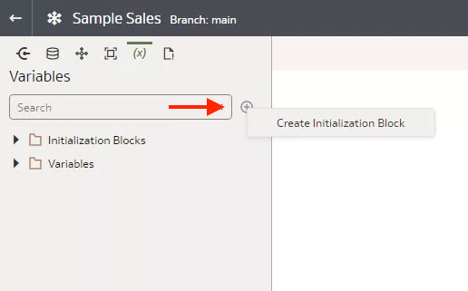
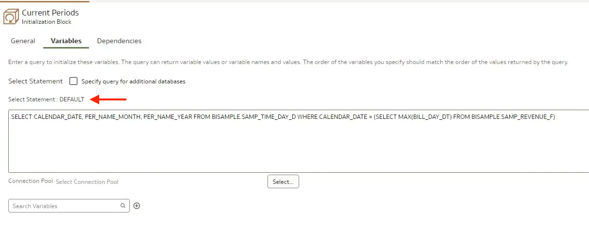
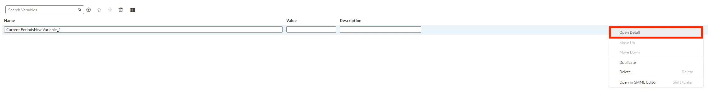

# Create Initialization Blocks and Variables

## Introduction

In this tutorial, you create a global initialization block with three variables that users of the deployed semantic model can use when creating expressions in Oracle Analytics.

Estimated Lab Time: 25 minutes

### About

You can create three types of initialization blocks:

* Global
* Session
* Static

You select the initialization block type based on the type of variables that you want it to run. You create global variables that Oracle Analytics consumers can use in expressions like the CurrentPeriod initialization in this tutorial. You can create session variables to select the Oracle Analytics consumer's department, sales region, or other pertinent details when the consumer signs in. You can create static initialization block with variables that hold values that don't change such as minimum credit score, preferred credit score, or a constant in mixture.

### Objectives

In this lab, you will:
* Create a global initialization block with three variables that users of the deployed semantic model can use when creating expressions in Oracle Analytics Cloud.

### Prerequisites

This lab assumes you have:
* Access to Oracle Analytics Cloud
* Access to DV Content Author, BI Data Model Author, or a BI Service Administrator Problems
* Access to the Sample Sales Semantic Model

## Task 1: Create an Initialization Block

Begin with step 3 if you're continuing this tutorial directly after completing the steps in the Create Aggregate Tables tutorial.

1. If you closed your semantic model, sign in to Oracle Analytics Cloud using one of DV Content Author, BI Data Model Author or service administrator credentials. On the Home page, click the **Navigator**, and then click **Semantic Models**.
    
2. In the Semantic Models page, select **Sample Sales**, click **Actions menu**, and then select **Open**.
    
3. In the Semantic Modeler, click **Variables**.
    
4. In Variables, click **Create**, and click **Create Initialization Block**.
    
5. In Create Initialization Block, enter <code>Current Periods</code> in **Name** and click **OK**.
    
6. In Current Periods, enter the following in the **Select Statement** text block:

</code>SELECT CALENDAR_ DATE, PER_ NAME_ MONTH, PER_ NAME_ YEAR FROM BISAMPLE.SAMP_ TIME_ DAY_ D WHERE CALENDAR_ DATE = (SELECT MAX(BILL_ DAY_ DT) FROM BISAMPLE.SAMP_ REVENUE_ F)</code>

    

7. Click **Save**.

## Task 2: Create Variables

In this section, you create variables that are used in the initialization block.

1. In Current Periods, click **Add Variable**.
    
2. In Current PeriodsNew Variable_ 1, click **Row Menu**, and then select **Open Detail**.
    
3. In **Name**, enter <code>CurrentDay</code>.
    
4. Click **Add Variable**. Enter <code>CurrentMonth</code> to replace Current PeriodsNew Variable_ 1 in **Name**.

5. Click **Add Variable**. Enter <code>CurrentYear</code> to replace Current PeriodsNew Variable_ 1 in **Name**. Click **Save**.
    

## Task 3: Select the Connection Pool and Test the Query

1. In Current Periods, click **Select**.
    
2. In Select Source, expand **MySampleSalesDatabase**, click **NewConnectionPool_ 1**, and then click **Select**.
    
3. Click **Save**.

4. Click **Test Query**.
    

## Learn More
* [Test Initialization Blocks](https://docs.oracle.com/en/cloud/paas/analytics-cloud/acmdg/create-and-configure-initialization-blocks.html#GUID-3CDC1C17-01F1-4EAC-BBCB-757487820ED9)

## Acknowledgements
* **Author** - Desmond Jung, Cloud Engineer, NACI
* **Contributors** - Nagwang Gyamtso, Product Manager, Analytics Product Strategy
* **Last Updated By/Date** - Desmond Jung, July 2023

