# Manage Logical Table Sources

## Introduction

In this tutorial, you add a physical table as an extension table of a logical table source for the D3 Customers logical table and then add a presentation table to the Sample Sales semantic model.

Estimated Lab Time: 25 minutes

### About
This tutorial describes how to build governed semantic models using the Semantic Modeler. 

### Objectives

In this lab, you will:
* Add a physical table as an extension table of a logical table source for the D3 Customers logical table
* Add a presentation table to the Sample Sales semantic model
* Create a workbook using the presentation tables from the semantic model

### Prerequisites

This lab assumes you have:
* Access to Oracle Analytics Cloud
* Access to DV Content Author, BI Data Model Author, or a BI Service Administrator Problems
* Access to the Sample Sales Semantic Model

## Task 1: Add an Extension Physical Table for a Logical Table Source

In this section, you add the D4 Addresses physical table as an extension table for the D3 Customers logical table source.

Begin with step 3 if you're continuing this tutorial directly after completing the steps in the Examine Semantic Model Markup Language (SMML) and Integrate Semantic Model With a Git Repository tutorial.

1. If you closed your semantic model, sign in to Oracle Analytics Cloud using one of DV Content Author, BI Data Model Author or service administrator credentials. On the Home page, click the **Navigator**, and then click **Semantic Models**.
	

2. In the Semantic Models page, select **Sample Sales**, click **Actions menu**, and then select **Open**.
	

3. Click the Logical layer, and then double-click **D3 Customers** in Sample Sales BM.

	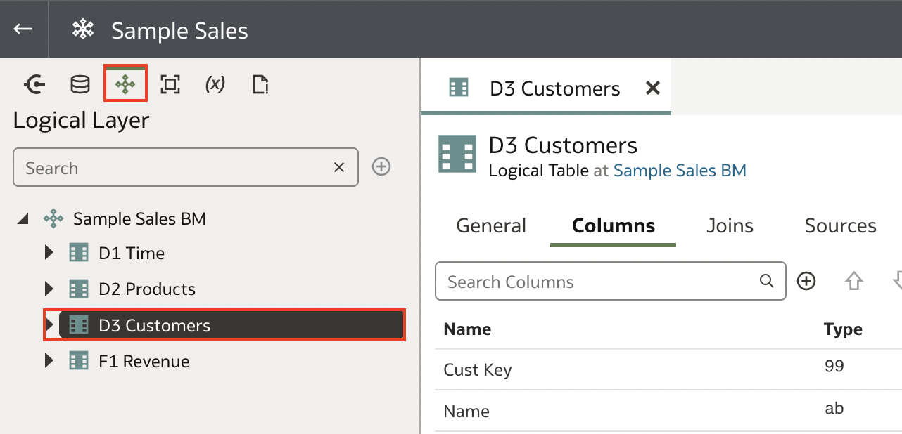

4. In D3 Customers, click **Sources**, and then click **Detail View**.

	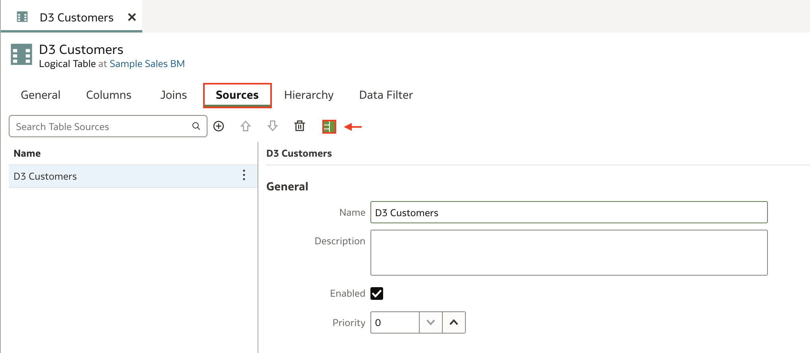

5. Scroll to the Table Mapping section, and then click **Add Table**.
	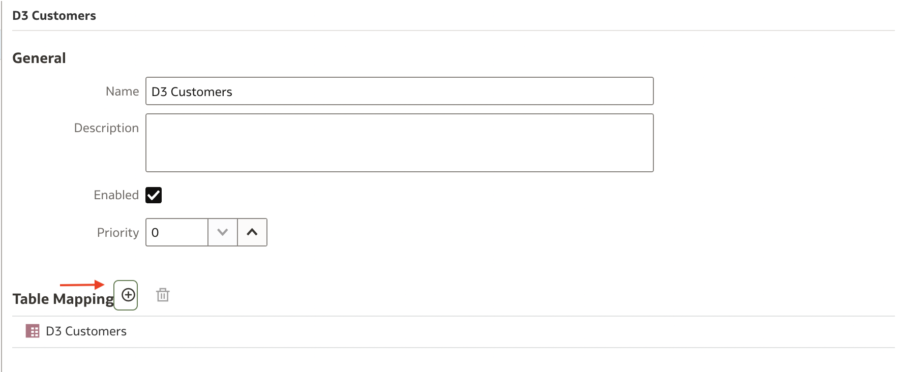

6. In Select Physical Table, expand **BISAMPLE**, click **D4 Addresses**, and then click **Select**.
	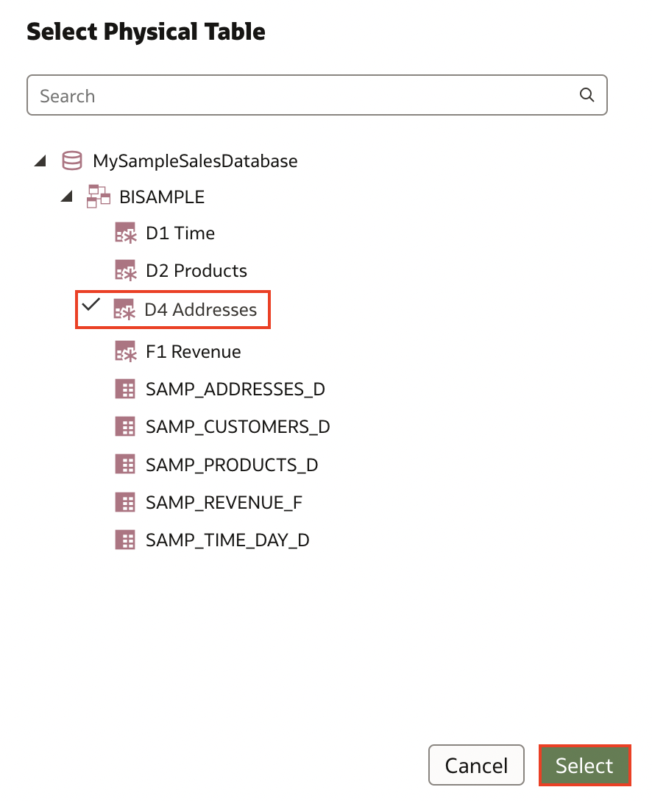

7. See the columns added from the D4 Addresses table.
	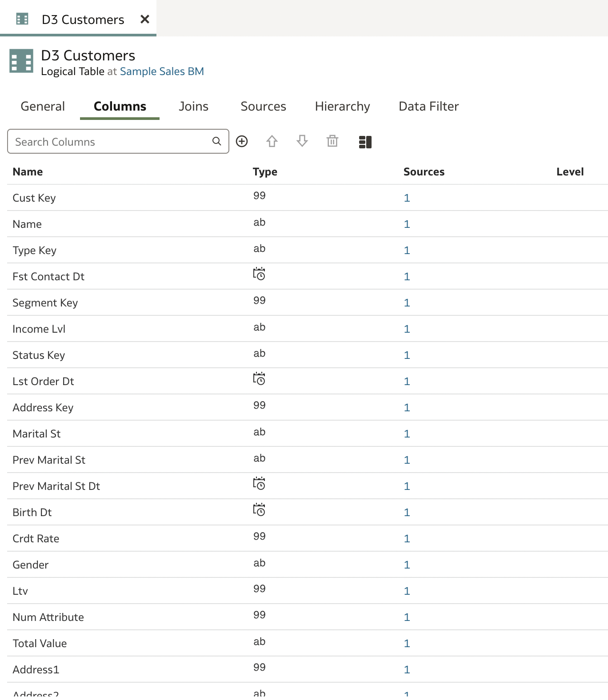

## Task 2: Manage Logical Table Sources

In this section, you rename logical table sources and view column mapping to physical tables.

1. Click the **Logical Layer**, expand **Sample Sales BM**.

	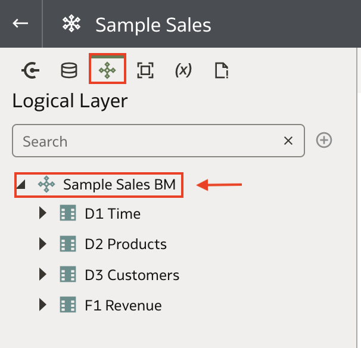

2. Double-click **D3 Customers**, click **Sources**, and then rename the D3 Customers logical table source (not the logical table) to **LTS1 Customers**.

	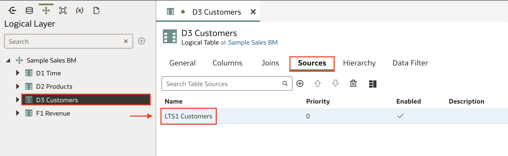

3. Select **LTS1 Customers**, click **Detail View**, and then scroll to the Column Mapping section.

	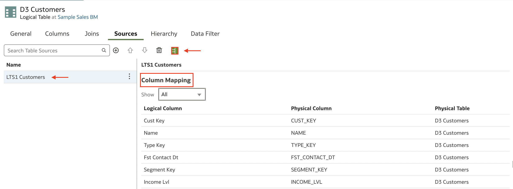

4. In Show, select **Mapped**.
	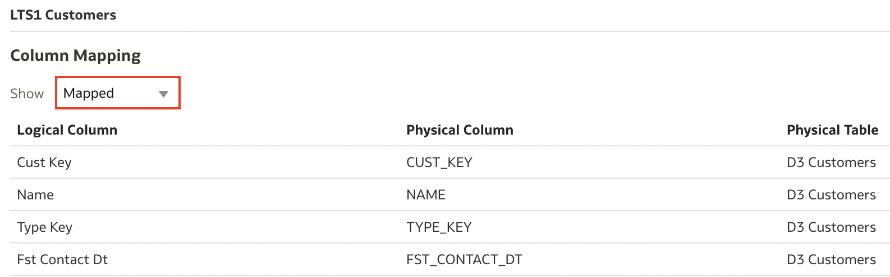

5. In the Logical Layer, double-click **D1 Time**, click **Sources**, and then rename the D1 Time logical table source to **LTS1 Time**.

	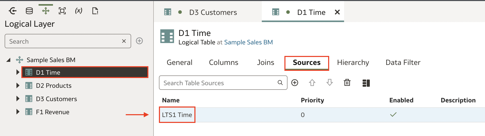

6. In the Logical Layer, double-click **D2 Products**, click **Sources**, and then rename the D2 Products logical table source to **LTS1 Products**.
	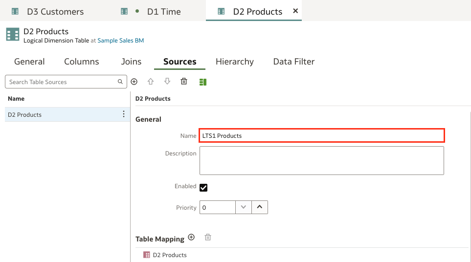

7. In the Logical Layer, double-click **F1 Revenue**, click **Sources**, and then rename the F1 Revenue logical table source to **LTS1 Revenue**.
	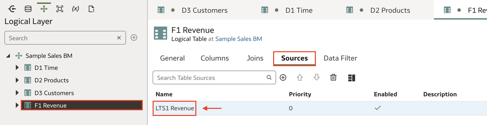

8. Click **Save**.

## Task 3: Create Presentation Layer Objects

In this section you add a presentation table to the Sample Sales semantic model.

1. Click the Presentation Layer, double-click **Sample Sales**, click **Add Table**, and then select **Create Presentation Table**. In Create Presentation Table, enter <code>Customer Regions</code> in **Name**, and then click **OK**. Click **Save**.

	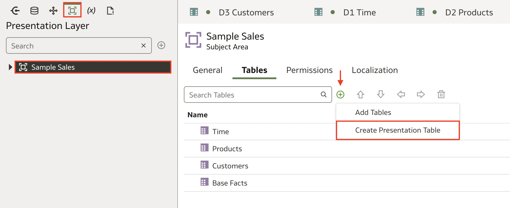
	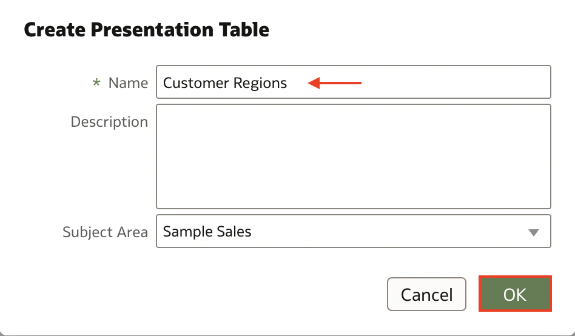

2. Click the **Logical Layer**, expand **D3 Customers**, hold down the **Ctrl** key, select and drag the following to Customer Regions **Columns** tab:
	* ADDRESS1
	* ADDRESS2
	* AREA
	* CITY
	* COUNTRY_NAME
	* ESTAB_NAME
	* POSTAL_CODE
	* REGION
	* STATE_PROVINCE
	* STATE_PROVINCE _ABBRV
	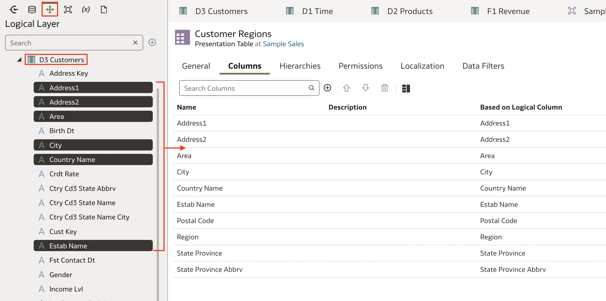

3. Click **Save**.

## Task 4: Deploy and Validate the Changes

In this section, you run the consistency checker, deploy the updated semantic model, and create a workbook with the updated Sample Sales subject area.

1. Click the Consistency Checker and select **Errors and Warnings**.
	Oracle Analytics didn't find any errors in the Sample Sales semantic model.

	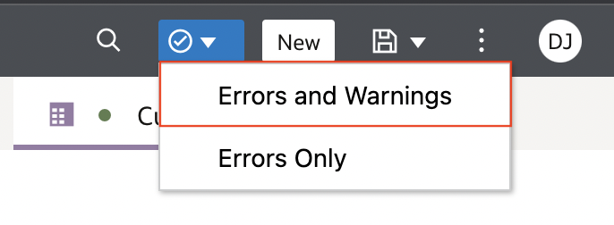

2. In the semantic model, click the Page Menu Page Menu icon, and select Deploy.
	The message, "Deploy successful" appears when the deployment process is complete.

	

3. Click **Go back**. On the Semantic Models page, click **Navigator**, and then click **Home**.
	

4. On the Home page, click **Create**, and then click **Workbook**.

	

5. In Add Data, click **Sample Sales**, and then click **Add to Workbook**.

	

6. In the Data panel, **expand the Products, Customers, Base Facts,** and **Customer Regions** folders.

	

7. Hold down the **Ctrl** or **Cmd** key, select **Name** from Customers, **Country Name** from Customer Regions, **Type** from Products, and **Revenue** from Base Facts.
	

8. Drag the data elements to the canvas.

	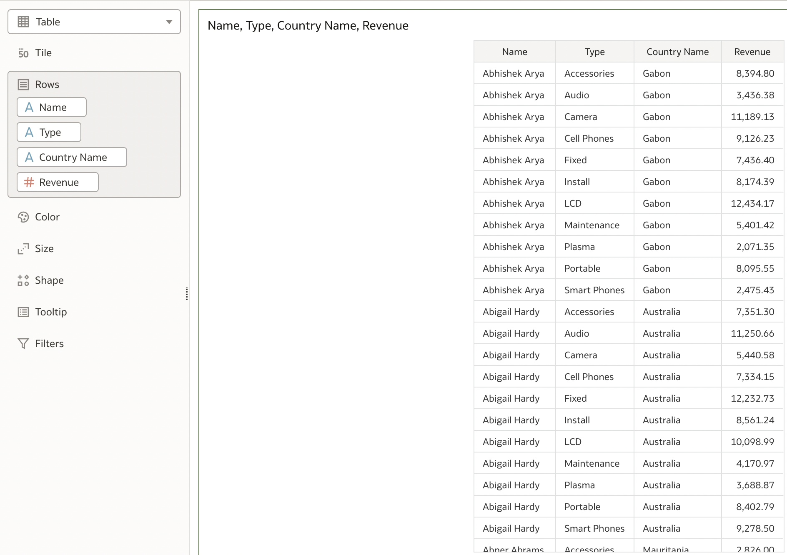

## Learn More
* [What Is a Semantic Model?](https://docs.oracle.com/en/cloud/paas/analytics-cloud/acmdg/what-is-semantic-model.html)
* [Understand a Semantic Model's Requirements](https://docs.oracle.com/en/cloud/paas/analytics-cloud/acmdg/understand-semantic-models-requirements.html)
* [Plan the Physical Layer](https://docs.oracle.com/en/cloud/paas/analytics-cloud/acmdg/plan-physical-layer.html#GUID-D7D6E064-F9C8-4B8B-A02F-B9E0358063F1)

## Acknowledgements
* **Author** - Desmond Jung, Cloud Engineer, NACI
* **Contributors** - Nagwang Gyamtso, Product Manager, Analytics Product Strategy
* **Last Updated By/Date** - Desmond Jung, July 2023
