# Create Parent-Child Hierarchies

## Introduction

Learn how to create logical parent-child hierarchies and presentation layer objects in your semantic model.

Estimated Lab Time: 25 minutes

### Objectives

In this lab, you will:
* Create logical parent-child hierarchies and presentation layer objects in your semantic model in Oracle Analytics Cloud.

### Prerequisites

This lab assumes you have:
* Access to Oracle Analytics Cloud
* Access to DV Content Author, BI Data Model Author, or a BI Service Administrator Problems
* Access to the Sample Sales Semantic Model

## Task 1: Add Physical Tables and Create Alias Tables

In this section, you add tables from the BISAMPLE data source to the physical layer of your semantic model, create alias tables, and define joins between the alias tables.

1. If you closed your semantic model, sign in to Oracle Analytics Cloud using one of DV Content Author, BI Data Model Author or service administrator credentials. On the Home page, click the **Navigator**, and then click **Semantic Models**.

	

2. In the Semantic Models page, select **Sample Sales**, click **Actions menu**, and then select **Open**.

	

3. Click the **Physical Layer**. Double-click **MySampleSalesDatabase**. Under Tables, expand the **Sample Sales** schema.

	

4. In the **Connections pane**, expand the **BISAMPLE** schema. Hold down the Ctrl key and select **SAMP_ EMPL_ D_ VH**, **SAMP_ EMPL_ PARENT_ CHILD_ MAP**, and **SAMP_ EMPL_ POSTN_ D**.

5. Drag the selected tables to **Sample Sales** in the Physical Layer. Drop the tables when **Add** appears. Click **Save**.
	
6. Under Tables in the Sample Sales schema, right-click **SAMP_ EMPL_ D_ VH** and select **Create Physical Table Alias**.
	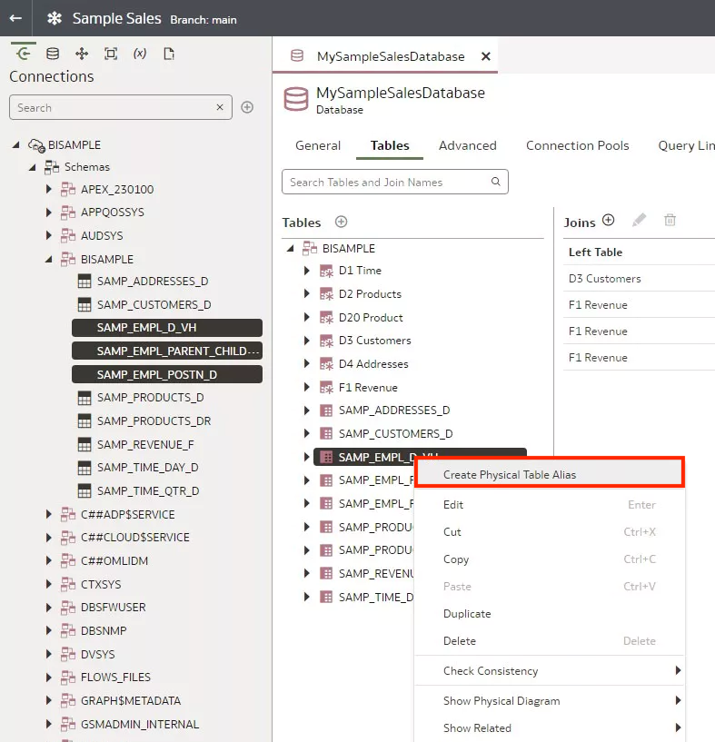
7. In Create Physical Table Alias, enter <code>D50 Sales Rep</code> in **Name**, and then click **OK**.
	
8. Right-click **SAMP_ EMPL_ PARENT_ CHILD_ MAP** and click **Create Physical Table Alias**.
	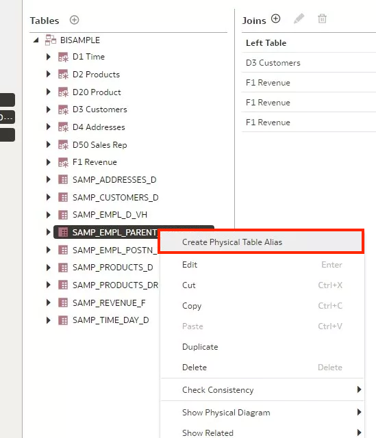
9. In Create Physical Table Alias, enter <code>D51 Sales Rep Parent Child</code>, and then click **OK**.
	
10. Right-click **SAMP_ EMPL_ POSTN_ D**, click **Create Physical Table Alias**.
	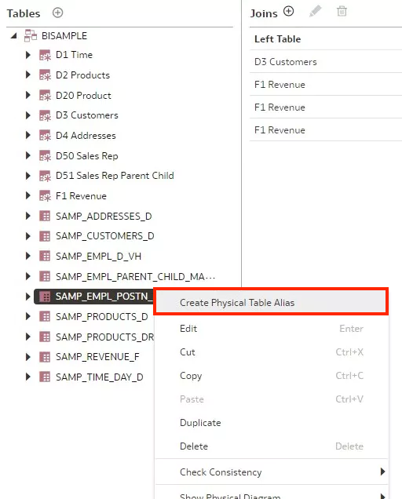
11. In Create Physical Table Alias, enter <code>D52 Sales Rep Position</code>, and then click **OK**. Click **Save**.
	

## Task 2: Create Joins

In this section, you define the joins between the added table and the existing F1 Revenue table.

1. In MySampleSalesDatabase, click **Add Join**. In Add Physical Join, click **List** in Left table, expand **MySampleSalesDatabase**, and select **D50 Sales Rep**. Under Right Table, click **List**, expand **MySampleSalesDatabase**, and select **D52 Sales Rep Position**.

	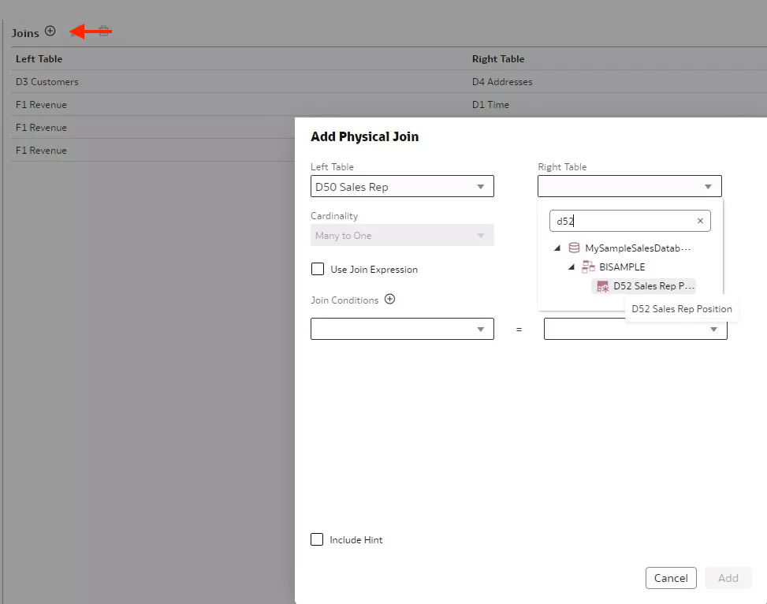

2. In Join Conditions, click **List** under the Left Table, and select **POSTN_ KEY**. Click **List** under the Right Table, select **POSTN_ KEY**, and then click **Add**.
	

3. Click **Add Join**. In Add Physical Join, click **List** in Left table, expand **MySampleSalesDatabase**, and select **D51 Sales Rep Parent Child**. Under Right Table, click **List**, expand **MySampleSalesDatabase**, and select **D50 Sales Rep**.

	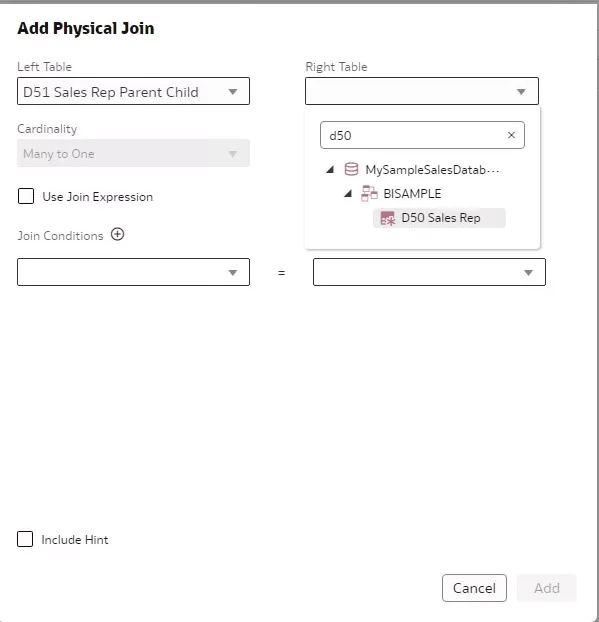

4. In Join Conditions, click **List** under the Left Table, and select **ANCESTOR_ KEY**. Click **List** under the Right Table, select **EMPLOYEE_ KEY**, and then click **Add**.
	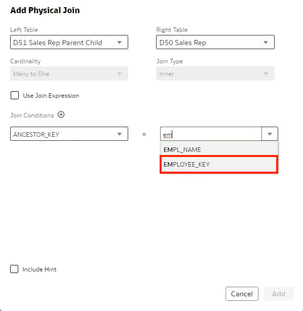
5. Click **Add Join**. In Add Physical Join, click **List** in Left table, expand **MySampleSalesDatabase**, and select **F1 Revenue**. Under Right Table, click **List**, expand **MySampleSalesDatabase**, and select **D51 Sales Rep Parent Child**.
	
6. In Join Conditions, click **List** under the Left Table, and select **EMPL_ KEY**. Click **List** under the Right Table, select **MEMBER_ KEY**, and then click **Add**.
	

7. In the Physical Layer, right-click **D51 Sales Rep Parent Child**, select **Show Physical Diagram**, and then click **Selected Tables** and **Direct Joins**.
	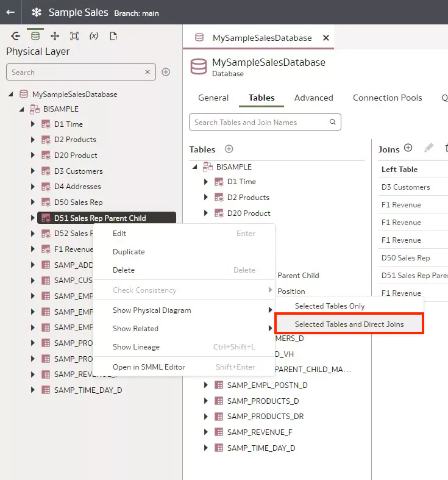
	

## Task 3: Add Logical Table

In this section you add a logical table and select columns from a physical layer table.

1. Click **Logical Layer**, and double-click **Sample Sales BM**.

	

2. n Dimensions, click **Add Table**, and then click **Create New Table**.

	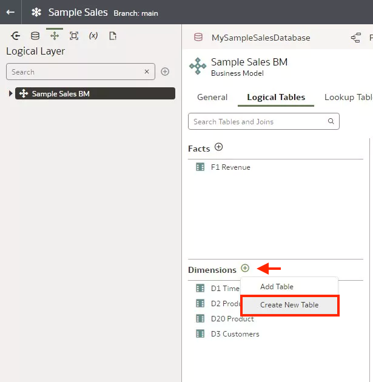

3. In Create Logical Table, enter <code>D5 Sales Rep</code> in Name and click **OK**.

The D5 Sales Rep Columns tab opens in the Semantic Modeler.

	

4. Click the **Physical Layer**, expand **MySampleSalesDatabase**, and then expand **Sample Sales**.

5. Expand **D50 Sales Rep**, hold down the Ctrl key, select all the columns in **D50 Sales Rep**, and drag them to the **D5 Sales Rep** columns tab. Click **Save**.
	
	
6. Click the **General** tab, click **Primary Key**, and then select **Employee Key**. Click **Save**.

	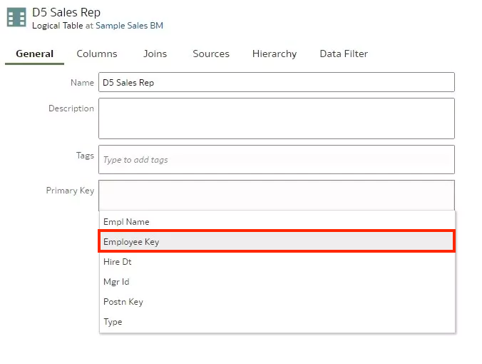

## Task 4: Add Source Tables and Columns

In this section, you update the logical layer table's sources.

1. In D5 Sales Rep, click the **Sources** tab. Double-click **D50 Sales Rep**. Click **Save**.

2. Click **Detail View**. In Table Mapping, click **Add Table**.

3. In Select Physical Table, expand **Sample Sales**, click **D52 Sales Rep Position**, and then click **Select**. Click **Save**.

	

4. Click the **Sources** tab. In Table Mapping, click **Add Table**., and add **D51 Sales Rep Parent Child**. Click **Save**.

	

5. Click the **Columns** tab. Hold down the Ctrl key, select **Member Key**, **Ancestor Key**, **Is Lef**, and then click **Delete**. Click **Save**.

	

## Task 5: Rename Columns

In this section, you rename columns to use names that are easy to understand.

1. In the **D5 Sales Rep Columns** tab, double-click **POSTN_ KEY**. Enter <code>Position Key</code>.

2. Double-click **Type**. Enter <code>Sales Rep Type</code>.

3. Double-click **Empl Name**. Enter <code>Sales Rep Name</code>.

4. Double-click **Emply Key**. Enter <code>Sales Rep Number</code>.

5. Double-click **Hire Dt**. Enter <code>Hire Date</code>.

6. Double-click **Mgr ID**. Enter <code>Manager Number</code>.

7. Double-click **Postn Desc**. <code>Enter Position</code>.

8. Double-click **Postn Level**. <code>Enter Position Level</code>.

9. Double-click **Distance**. <code>Enter Closure Distance</code>. Click **Save**.

	

10. Close **D5 Sales Rep**.

## Task 6: Create a Logical Join

In this section, you create joins between the sales rep alias tables and the F1 Revenue table.

In this section, you define the join between D5 Sales Rep and the F1 Revenue tables.

1. Click the **Logical Layer**. Expand **Sample Sales BM**, right-click **D5 Sales Rep**, select **Show Logical Diagram**, and then click **Selected Table and Direct Joins**.
	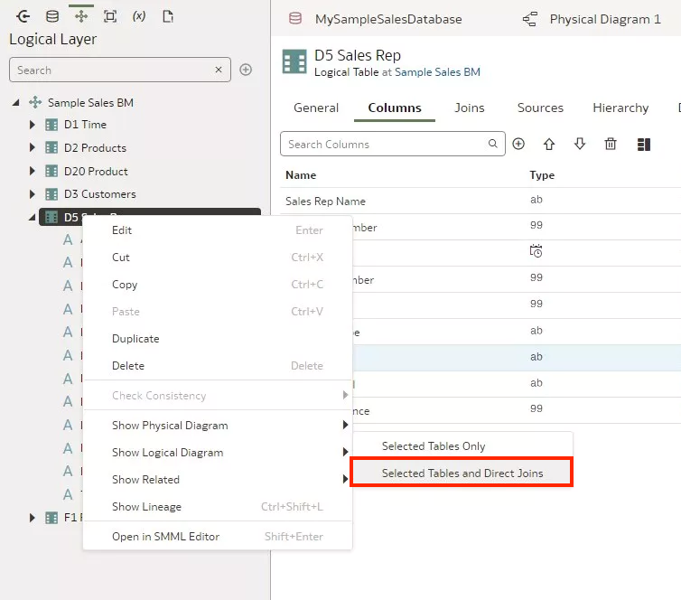
2. Drag **F1 Revenue** to the Logical Diagram. Select **F1 Revenue** and draw the join to **D5 Sales Rep**.
	
3. In the Add Join dialog, click **Add**. Click **Save**.
	

## Task 7: Create a Parent-Child Hierarchy

In this section, you create a parent-child hierarchy, set the member key, and set the parent key.

1. In the **Logical Layer**, double-click **D5 Sales Rep**.
	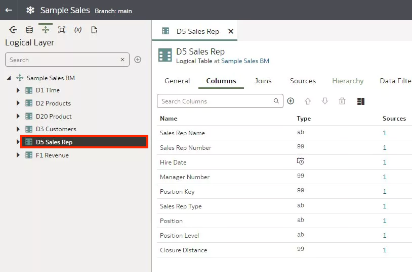
2. In **D5 Sales Rep**, click the **Hierarchy** tab. From Hierarchy Type, select **Parent-Child**.
	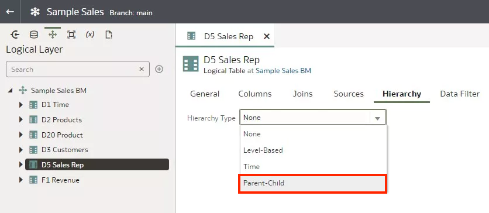
3. Under Parent-Child, click **Detail**.
	
4. In Detail, select **Sales Rep Number** from Member Key, select **Sales Rep Name** from Display Key, and then select **Manager Number** from Parent Key.
	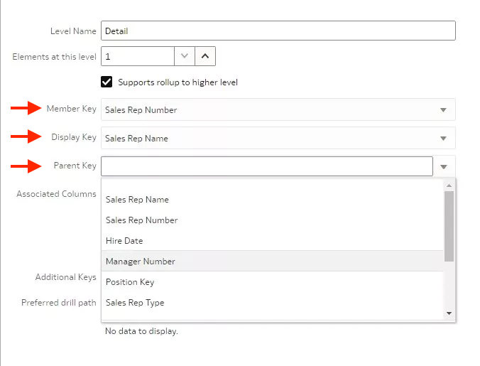
5. Click **Select** to define the parent-child relationship table.

6. In Select Physical Table, click **D51 Sales Rep Parent Child** and click **Select**.
	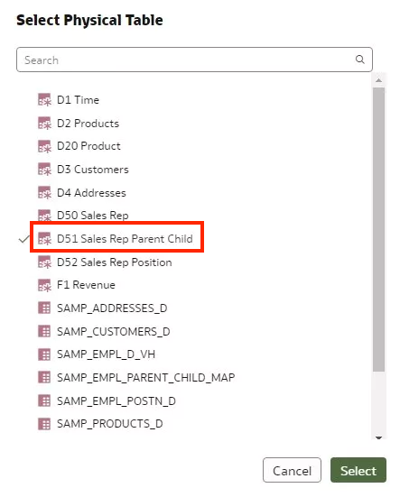
7. Under the Relationship Table, select **MEMBER_ KEY** from Member Key, select **ANCESTOR_ KEY** from Parent Key, select **DISTANCE** from Relationship Distance, and then select **IS_ LEAF** from Leaf Node Identifier. Click **Save**.
	

## Task 8: Specify Content Level of Detail

1. In D5 Sales Rep, click the **Columns** tab. Double-click **Sales Rep Name** and click **Detail View**. Under Level, select **Detail**.
	
2. Double-click **Sales Rep Number**. Under Level, select **Detail**. Click **Save**.
	
3. Click the **Hierarchy** tab. In Level Name, enter <code>Sales Rep Total</code> to replace **Total**.
	
4. Click the **Detail** level. In Level Name, enter <code>Sales Rep Detail</code> to replace **Detail**. Click **Save**.
	
5. Click the **Columns** tab. Double-click **Sales Rep Name**. Under Level, select **Sales Rep Detail**. Double-click **Sales Rep Number**. Under Level, select **Sales Rep Detail**. Click **Save**.
	

## Task 9: Create Presentation Layer Objects

In this section, you create the Sales Rep presentation table and presentation hierarchies.

1. Click the **Presentation Layer**. Double-click the **Sample Sales** subject area.
	
2. In the Tables tab, click **Add Tables**, and then click **Add Table**.
	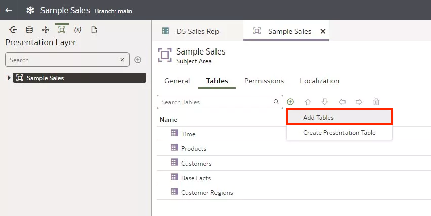
3. In Select Logical Table, click **D5 Sales Rep** and click **Select**.
	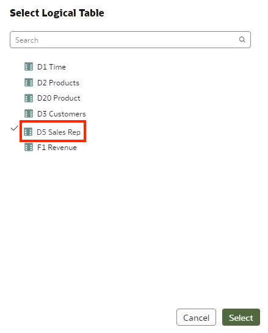
4. Double-click **D5 Sales Rep** in the Tables tab.
	
5. In D5 Sales Rep, click the **General** tab. In Name, enter <code>Sales Rep</code> to replace **D5 Sales Rep**, and then click **Save**.
	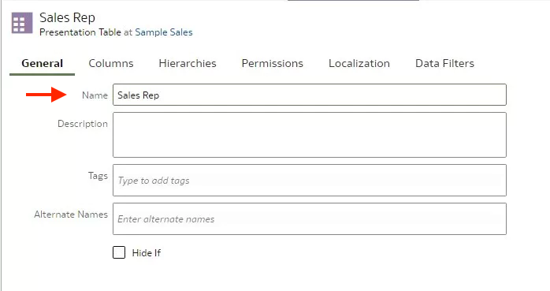
6. In Sales Rep, click the **Hierarchies** tab.
	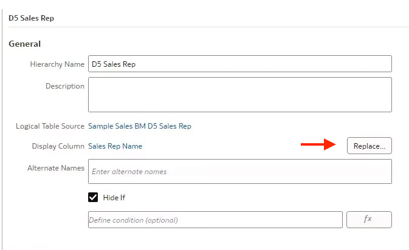
7. In the Hierarchies tab, next to Display Columns, click **Replace**. In Select Presentation Column, expand **Sales Rep**, click **Sales Rep Name** and then click **Select**.
	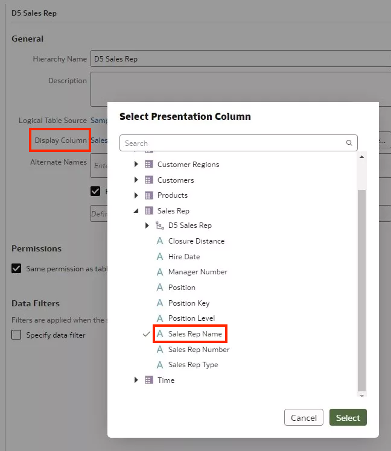
8. Click **Save**.

## Learn More
* [Create and Manage Parent-Child Hierarchies](https://docs.oracle.com/en/cloud/paas/analytics-cloud/acmdg/create-and-manage-parent-child-hierarchies.html#GUID-81468B64-80D2-4AB5-9E35-A7C19215D440)
* [What Are Driving Tables?](https://docs.oracle.com/en/cloud/paas/analytics-cloud/acmdg/work-logical-joins.html#GUID-D59DD499-4459-4E04-B8D9-25F42C045E43)
* [Manage Logical Tables Sources](https://docs.oracle.com/en/cloud/paas/analytics-cloud/acmdg/manage-logical-table-sources.html#ACMDG-GUID-700A5FA9-87B3-40A2-991A-9E0FA6341950)

## Acknowledgements
* **Author** - Desmond Jung, Cloud Engineer, NACI
* **Contributors** - Nagwang Gyamtso, Product Manager, Analytics Product Strategy
* **Last Updated By/Date** - Desmond Jung, July 2023
