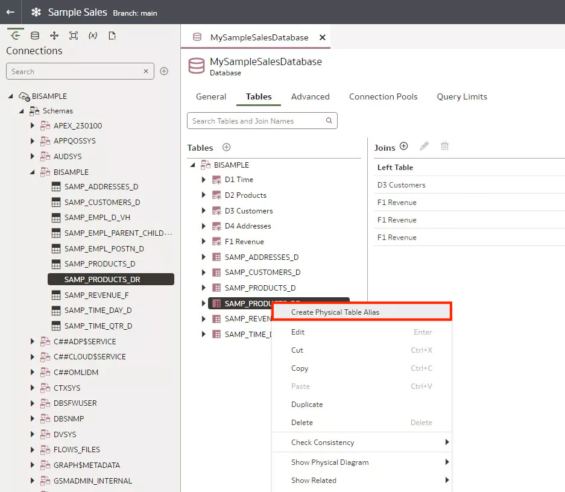
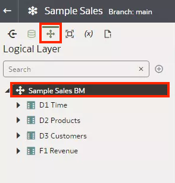
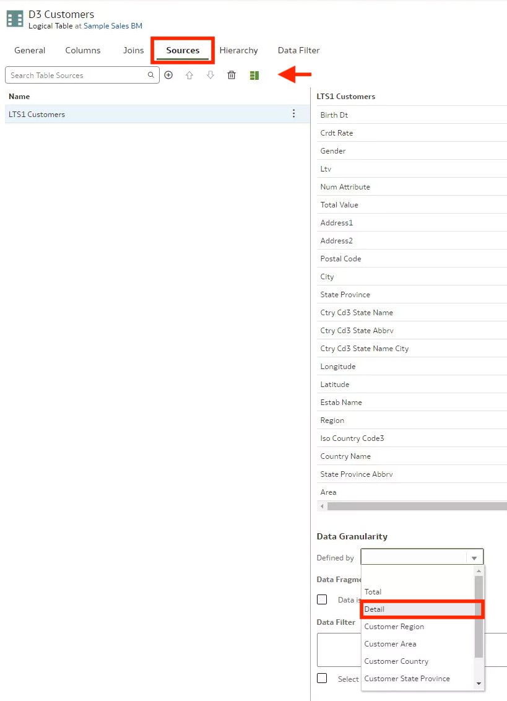

# Create Ragged and Skipped Level Hierarchies

## Introduction

In this lab, you continue building the Sample Sales semantic model by creating a skipped and ragged hierarchy.

Estimated Time: 25 minutes

### Objectives

In this lab, you will:
* Create ragged and skipped level hierarchies in the logical layer of a semantic model in OAC

### Prerequisites

This lab assumes you have:
* Access to Oracle Analytics Cloud
* Access to DV Content Author, BI Data Model Author, or a BI Service Administrator role
* Access to the Sample Sales Semantic Model
* All previous labs successfully completed

## Task 1: Add a Physical Table Source

In this section, you add a physical table, create an alias for that table, and then use it in a hierarchy.

Begin with step 3 if you're continuing this tutorial directly after completing the steps in the Create Calculated Measures tutorial.

1. If you closed your semantic model, sign in to Oracle Analytics Cloud using one of DV Content Author, BI Data Model Author or service administrator credentials. On the Home page, click the **Navigator**, and then click **Semantic Models**.
    

2. In the Semantic Models page, select **Sample Sales**, click **Actions menu**, and then select **Open**.

    

3. In your Sample Sales semantic model, click the **Physical Layer**. Double-click **MySampleSalesDatabase**. Under Tables, expand the **Sample Sales** schema.

    

4. Click **Connections**. Expand **Schemas**, then expand **BISAMPLE**. Select **SAMP_ PRODUCTS_ DR**, and drag it to the **BISAMPLE** schema.

    

5. Right-click **SAMP_ PRODUCTS_ DR** and select **Create Physical Table Alias**.

    

6. In Create Physical Table Alias, enter **"D20 Products"** in **Name**, and then click **OK**.

    

7. Double-click **D20 Products**. Click **Preview**.

    

## Task 2: Create a Join to the Fact Table

1. Go back to the **MySampleSalesDatabase** tab. Hold down the Ctrl Key (Command on Mac) and select **D20 Products** and **F1 Revenue**. Right-click and select **Show Physical Diagram** and **Select Tables and Direct Joins**.

  

2. Draw a join from **F1 Revenue** to **D20 Products**.

  

3. In **Join Conditions**, click the drop-down on the bottom left and select **PROD\_KEY**. Click the drop-down on the bottom right and select **PROD\_KEY**, and then click **Add**.

  

## Task 3: Add a Table to the Logical Layer
In this section, you add the D20 Product table to the logical layer.

1. Click **Logical Layer**. Double-click **Samples Sales BM**.

    

2. Click **Physical Layer**. From the BISAMPLE schema, select **D20 Products**, and drag it to **Dimensions** in the Sample Sales BM.

    

3. Click **Save**

## Task 4: Create a Ragged and Skipped Hierarchy

In this section, you use the D20 Product table to create the ragged and skipped hierarchy.

1. In the Dimensions pane, double-click **D20 Products**.

    

2. In the **Hierarchy tab**, select **Level-Based** from **Hierarchy Type**. Check both **Skipped Levels** and **Ragged** boxes.

    

3. Under Hierarchies, select the **Total** level and click **Add Level**. In Level Name, enter **"Product Brand"** to replace **Level-3**. Click the **Primary Key** field, select **Brand**.
    >**Note**: Make sure you are creating the level between **Total** and **Detail**, otherwise, you will run into errors when deploying the model.

    

4. Select **Product Brand** in Hierarchies, click **Add Level**. In Level Name, enter **"Product LOB"** to replace Level-4. Click the **Primary Key** field, select **LOB**.

    

5. Select **Product LOB**, click **Add Level**. In Level Name, enter **"Product Type"** to replace Level-5. Click the **Primary Key** field, select **Type**.

    

6. Select the **Detail** level. Make sure it is the lowest level and the details match the screenshot below:

  

6. **Save** the model and close D20 Products.

## Task 5: Create Presentation Table

Create a Presentation table called “Products (Ragged)” by dragging and dropping D20 Products from
the Logical Layer to the Presentation Layer.

1. From the **Presentation Layer** double-click **Sample Sales**.

  

2. From the **Logical Layer**, drag and drop **D20 Products** to the **Presentation Layer**.

  

3. Double-click **D20 Products** from the list of tables.

  

4. Click the **General** tab. In **Name** replace D20 Products with **"Products (Ragged)"**. **Save** the model.

  

## Task 6: Create a Logical Join

Check the join between F1 Revenue and D20 Products Logical table. If a join exists,
skip this task. Create a logical join between F1 Revenue and D20 Products. Select the 2
logical tables, right click → Show Logical Diagram → Selected Tables Only.

1. From the **Logical Layer** select **D20 Products** and **F1 Revenue**. Right-click and select **Show Logical Diagram**. Then click **Selected Tables Only**.

  

2. Drag a point from **F1 Revenue** to **D20 Products**. Confirm that the join conditions are identical to the conditions in the screenshot below and click **Add**. **Save the model**.

  

## Task 7: Specify Granularity of Logical Tables

In this section, you set the level of detail stored in the logical tables.

1. In the Logical Layer, double-click **D3 Customers**. Click the **Sources** tab. Select **LTS1 Customers** and click the **Detail view** icon to open the detail view. Scroll to Data Granularity. From Defined by, select **Detail**. **Save** and close D3 Customers.

  

2. In the Logical Layer, double-click **D2 Products**. Click the **Sources** tab. Select **LTS1 Products** and click the **Detail view** to open the detail view. Scroll to Data Granularity. From Defined by, select **Detail**. Close D2 Products.

  

3. In the Logical Layer, double-click **D20 Products**. Click the **Sources** tab. Select **D20 Products** and click the **Detail view** icon to open the detail view. Scroll to Data Granularity. From Defined by, select **Detail**. Close D20 Products.

  

4. In the Logical Layer, double-click **D1 Time**. Click the **Sources** tab. Select **LTS1 Time** and click the **Detail view** icon to open the detail view. Scroll to Data Granularity. From Defined by, select **Detail**. Close D1 Time.

  

5. In the Logical Layer, double-click **F1 Revenue**. Click the **Sources** table. Select **LTS1 Revenue** and click the **Detail view** icon to open the detail view. Scroll to Data Granularity. Click **Add Level** for each dimension table joined to F1 Revenue in your semantic model.

  

7. Add Data Granularity Levels for each of the following dimensions in the Detail **Level**:
    * D1 Time
    * D2 Products
    * D3 Customers
    * D20 Products

  

10. Click **Save**.

## Task 8: Deploy and Validate the Changes

In this section, you run the consistency checker, deploy the updated semantic model, and create a
workbook with the updated Sample Sales subject area.

1. Click the **Consistency Checker** and select **Include warnings**.

	

2. Oracle Analytics didn't find any errors in the Sample Sales semantic model. In the semantic model, click the **Page Menu** icon, and select **Deploy**. The message, **"Deploy successful"** appears in the status bar when the deployment process is complete.

  

3. Go back to the Oracle Analytics Cloud homepage and create a new workbook with the **Samples Sales** Subject Area. Add the following fields to a new visualization to validate this lesson:

    * Products (Ragged).Brand
    * Products (Ragged).Lob
    * Products (Ragged).Type
    * Products (Ragged).Prod Dsc
    * Base Facts.Revenue

  

You may now **proceed to the next lab**

## Learn More
* [About Working with Logical Hierarchies](https://docs.oracle.com/en/cloud/paas/analytics-cloud/acmdg/working-logical-hierarchies.html#GUID-9AF96F03-ABBA-43EF-80C9-A8ED6F018DE8)
* [About Data Granularity](https://docs.oracle.com/en/cloud/paas/analytics-cloud/acmdg/work-data-granularity.html#GUID-299129AF-FABC-43C3-9FD2-5CB927E0B744)

## Acknowledgements
* **Author** - Nagwang Gyamtso, Product Manager, Analytics Product Strategy
* **Contributors** - Pravin Janardanam, Gabrielle Prichard, Lucian Dinescu, Desmond Jung
* **Last Updated By/Date** - Nagwang Gyamtso, March, 2024
