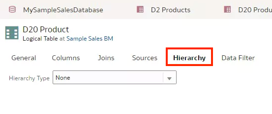
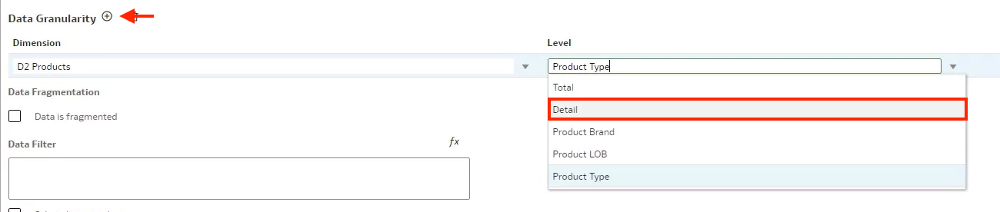
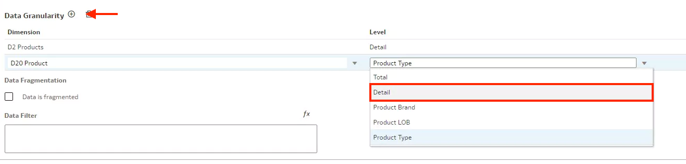
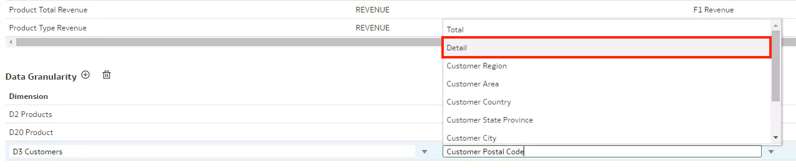

# Create Ragged and Skipped Level Hierarchies

## Introduction

In this lab, you continue building the Sample Sales semantic model by creating a skipped and ragged hierarchy.

Estimated Time: 25 minutes

### Objectives

In this lab, you will:
* Create ragged and skipped level hierarchies in the logical layer of a semantic model in OAC

### Prerequisites

This lab assumes you have:
* Access to Oracle Analytics Cloud
* Access to DV Content Author, BI Data Model Author, or a BI Service Administrator role
* Access to the Sample Sales Semantic Model
* All previous labs successfully completed

## Task 1: Add a Physical Table Source

In this section, you add a physical table, create an alias for that table, and then use it in a hierarchy.

Begin with step 3 if you're continuing this tutorial directly after completing the steps in the Create Calculated Measures tutorial.

1. If you closed your semantic model, sign in to Oracle Analytics Cloud using one of DV Content Author, BI Data Model Author or service administrator credentials. On the Home page, click the **Navigator**, and then click **Semantic Models**.
    
2. In the Semantic Models page, select **Sample Sales**, click **Actions menu**, and then select **Open**.
    
3. In your Sample Sales semantic model, click the **Physical Layer**. Double-click **MySampleSalesDatabase**. Under Tables, expand the **Sample Sales** schema.
    
4. Click **Connections**. Expand **BISAMPLE**, select **SAMP_ PRODUCTS_ DR**, and drag it to the **Sample Sales** schema.
    
5. Right-click **SAMP_ PRODUCTS_ DR** and select **Create Physical Table Alias**.
    
6. In Create Physical Table Alias, enter <code>D20 Product</code> in **Name**, and then click **OK**.
    
7. Double-click **D20 Product**. Click **Preview**.
    

## Task 2: Add a Table to the Logical Layer

In this section, you add the D20 Product table to the logical layer.

1. Click **Logical Layer**. Double-click **Samples Sales BM**.
    
2. Click **Physical Layer**. From the Sample Sales schema, select **D20 Product**, and drag it to **Dimensions** in the Sample Sales BM.
    
3. Click **Save**

## Task 3: Create a Ragged and Skipped Hierarchy

In this section, you use the D20 Product table to create the ragged and skipped hierarchy.

1. In the Dimensions pane, double-click **D20 Products**. Click **Hierarchy**.
    
2. In the Hierarchy tab, select **Level-Based** from Hierarchy Type, select **Ragged**, and then select **Skipped**.
    
3. Under Hierarchies, click **Add Level**. In Level Name, enter <code>Product Brand</code> to replace Level-3. Click the **Primary Key** field, select **Brand**.
    
4. Select **Product Brand** in Hierarchies, click **Add Level**. In Level Name, enter <code>Product LOB</code> to replace Level-4. Click the **Primary Key** field, select **LOB**.
    
5. Select **Product LOB**, click **Add Level**. In Level Name, enter <code>Product Type</code> to replace Level-5. Click the **Primary Key** field, select **Type**, and then click **Save**.
    
6. Close D20 Products.

## Task 4: Specify Granularity of Logical Tables

In this section, you set the level of detail stored in the logical tables.

1. In the Logical Layer, double-click **D3 Customers**. Click the **Sources** tab. Double-click **LTS1 Customers** to open the detail view. Scroll to Data Granularity. From Defined by, select **Detail**. Close D3 Customers.
    
2. In the Logical Layer, double-click **D2 Products**. Click the **Sources** tab. Double-click **LTS1 Products** to open the detail view. Scroll to Data Granularity. From Defined by, select **Detail**. Close D2 Products.
3. In the Logical Layer, double-click **D20 Products**. Click the **Sources** tab. Double-click **D20 Products** to open the detail view. Scroll to Data Granularity. From Defined by, select **Detail**. Close D20 Products.
4. In the Logical Layer, double-click **D1 Time**. Click the **Sources** tab. Double-click **LTS1 Time** to open the detail view. Scroll to Data Granularity. From Defined by, select **Detail**. Close D1 Time.
5. In the Logical Layer, double-click **F1 Revenue**. Click the **Sources** table. Double-click **LTS1 Revenue** to open the detail view.

6. Scroll to Data Granularity. Click **Add Level** for each dimension table joined to F1 Revenue in your semantic model.

7. Click **Add Level** to add the Detail granularity level for **D2 Products**.
    
8. Click **Add Level** to add the Detail granularity level for **D20 Products**.
    
9. Click **Add Level** to add the Detail granularity level for **D3 Customers**. From the Level list, select **Detail**.
    
10. Click **Save**.

You may now **proceed to the next lab**

## Learn More
* [About Working with Logical Hierarchies](https://docs.oracle.com/en/cloud/paas/analytics-cloud/acmdg/working-logical-hierarchies.html#GUID-9AF96F03-ABBA-43EF-80C9-A8ED6F018DE8)
* [About Data Granularity](https://docs.oracle.com/en/cloud/paas/analytics-cloud/acmdg/work-data-granularity.html#GUID-299129AF-FABC-43C3-9FD2-5CB927E0B744)

## Acknowledgements
* **Author** - Desmond Jung, Cloud Engineer, NACI
* **Contributors** - Pravin Janardanam, Nagwang Gyamtso
* **Last Updated By/Date** - Desmond Jung, July 2023

