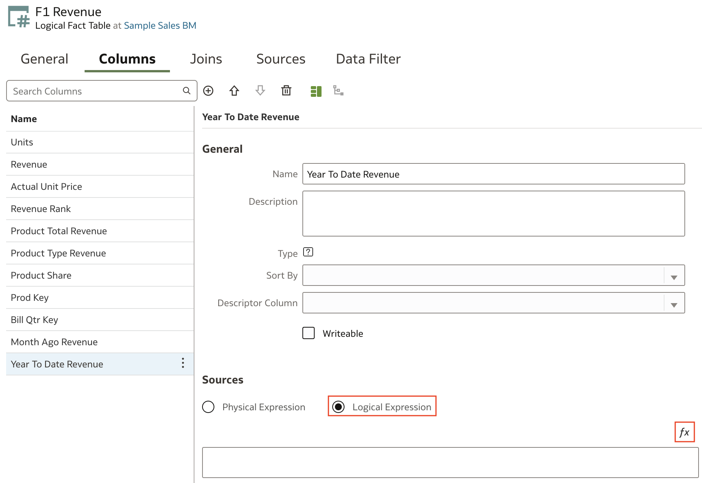

# Create Time Series Measures

## Introduction

This lab shows you how to create time series measures in your semantic model.

Estimated Time: 25 minutes

### Objectives

In this lab, you will:
* Create time series measures in your semantic model in Oracle Analytics Cloud

### Prerequisites

This lab assumes you have:
* Access to Oracle Analytics Cloud
* Access to DV Content Author, BI Data Model Author, or a BI Service Administrator Problems
* Access to the Sample Sales Semantic Model

## Task 1: Create a Measure with the AGO Function

In this section, you create a revenue measure column that uses the AGO time series function to represent a specific past period such as a month or year.

Begin with step 3 if you're continuing this tutorial directly after completing the steps in the Create Aggregate Tables tutorial.

1. If you closed your semantic model, sign in to Oracle Analytics Cloud using one of DV Content Author, BI Data Model Author or service administrator credentials. On the Home page, click the **Navigator**, and then click **Semantic Models**.

    

2. In the Semantic Models page, select **Sample Sales**, click **Actions menu**, and then select **Open**.

    

3. In the **Logical Layer**, double-click **F1 Revenue**, and then click **Add Column**.

    

4. In **New Column_ 1**, enter **"Month Ago Revenue"**, and then click **Detail View**.

    

5. Under Sources, click **Logical Expressions**. Click **Open Expression Editor**.

    

6. In the Expression Editor, enter **"Ago"** and select the **AGO** function.

  

7. In the AGO expression, for **measure**, enter **"Rev"**, and then select **Revenue**.

  

8. For **time_level**, enter **"Mon"**, and then select the time dimension **Month**.

  

9. For the **number of periods**, enter **"1"**, click **Validate**, and then click **Save** in the Expression Editor.

    

10. Click **Save**.

## Task 2: Create a Measure with the TODATE Function

In this section, you create a revenue measure column that used the TODATE time series function to determine year to date revenue.

1. In the Logical Layer, double-click **F1 Revenue**, and then click **Add Column** and select **Crete New Column**..

2. In New Column_ 1 name, enter **"Year To Date Revenue"** and then click **Detail View**. Then click **Logical Expressions**. Click **Open Expression Editor**.

    

3. In the Expression Editor, enter <code>To Da</code> in the search bar, and click **Search**. Double-click **TODATE**.

  

4. In the TODATE expression, enter **"Rev"** in **measure**, and from **F1 Revenue**, and select **Revenue**.

5. For time_ level, enter <code>Yea</code>, and then select **Year**. Click **Validate**, and then click **Save** in the Expression Editor.
    

6. Click **Save**.

    

## Task 3: Create a Measure with the PERIODROLLING Function

In this section, you create a revenue measure column that uses the period rolling function. The starting period is 2 months in the past as represented by -2, and the ending period in 0 for the current month.

1. In the Logical Layer, double-click **F1 Revenue**, and then click **Add Column** and select **Crete New Column**.

2. In **New Column_ 1**, enter **"Revenue 3 Period Rolling Sum"**, then click **Detail View**. Under Sources, click **Logical Expressions**. Click **Open Expression Editor**.

    

4. In the Expression Editor, enter **"Per"** in the search bar, and then double-click **Period Rolling**.

  

5. In the PERIODROLLING expression, enter **"Rev"** in measure, expand **F1 Revenue**, and then select **Revenue**.

6. Enter **"-2"** in **starting_ period_ offset** integer. Enter **"0"** in **ending_ period_ offset** integer. Click **Validate**, and then click **Save** in the Expression Editor.

    

7. Navigate to the **Presentation Layer** and expand **Sample Sales**. Double-click on **Base Facts** to open the Base Facts tab.

  

8. Navigate to the **Logical Layer**, expand **F1 Revenue**, hold down the Ctrl (command on Mac) key, select and drag the following to the **Base Facts** presentation table columns:

    * Month Ago Revenue
    * Year To Date Revenue
    * Revenue 3 Period Rolling Sum

  

9. Click **Save**.

## Task 4: Deploy and Validate the Changes

In this section, you run the consistency checker, deploy the updated semantic model, and create a
workbook with the updated Sample Sales subject area.

1. Click the **Consistency Checker** and select **Include warnings**.

	

2. Oracle Analytics didn't find any errors in the Sample Sales semantic model. In the semantic model, click the **Page Menu** icon, and select **Deploy**. The message, **"Deploy successful"** appears in the status bar when the deployment process is complete.

  

3. Go back to the Oracle Analytics Cloud homepage and create a new workbook with the **Samples Sales** Subject Area. Create a new visualization with the following columns to validate this lesson:

    >**Note**: If you do not see the columns and your model deployment was successful, sign out and sign back in. If the columns are still not available, wait a few moments before trying again.

    * Time.Per Name Month
    * Time.Per Name Year
    * Base Facts.Revenue
    * Base Facts.Month Ago Revenue
    * Base Facts.Year to Date Revenue

  

You may now **proceed to the next lab**

## Learn More
* [Model Time Series Data](https://docs.oracle.com/en/cloud/paas/analytics-cloud/acmdg/model-time-series-data.html#GUID-D390BE0D-EB9F-48EB-A686-A0AFDA12AD72)

## Acknowledgements
* **Author** - Nagwang Gyamtso, Product Manager, Analytics Product Strategy
* **Contributors** - Pravin Janardanam, Gabrielle Prichard, Lucian Dinescu, Desmond Jung
* **Last Updated By/Date** - Nagwang Gyamtso, March, 2024
