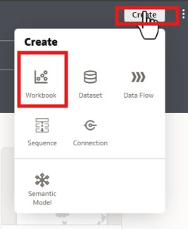
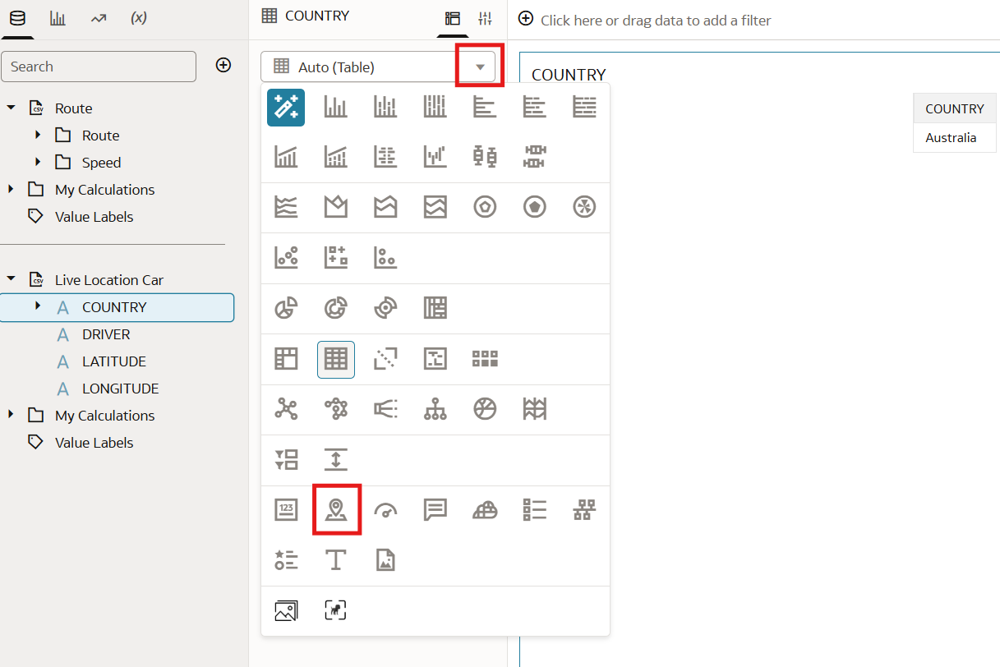
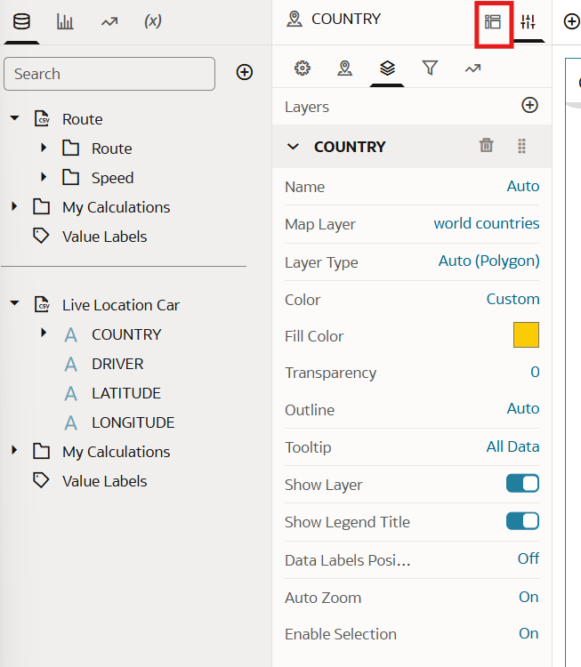
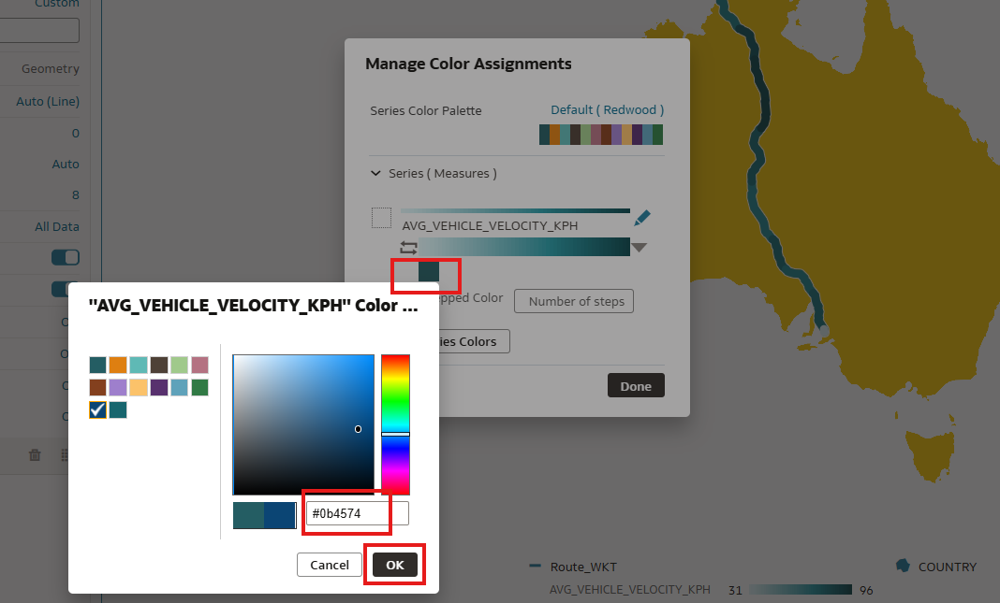
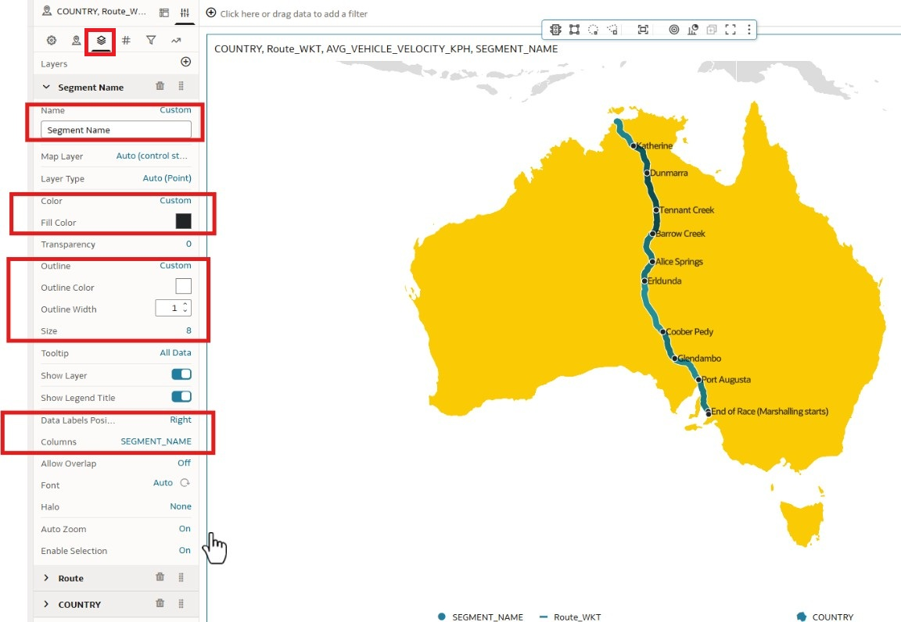
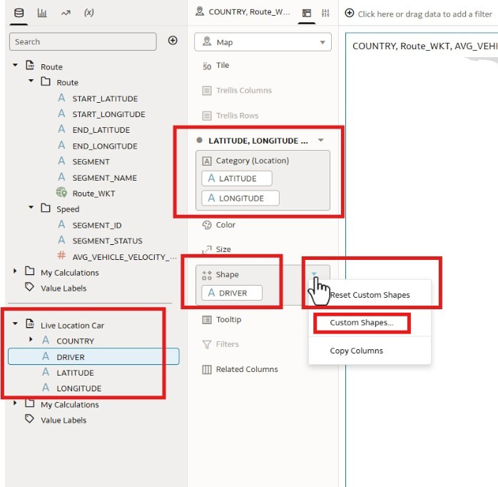
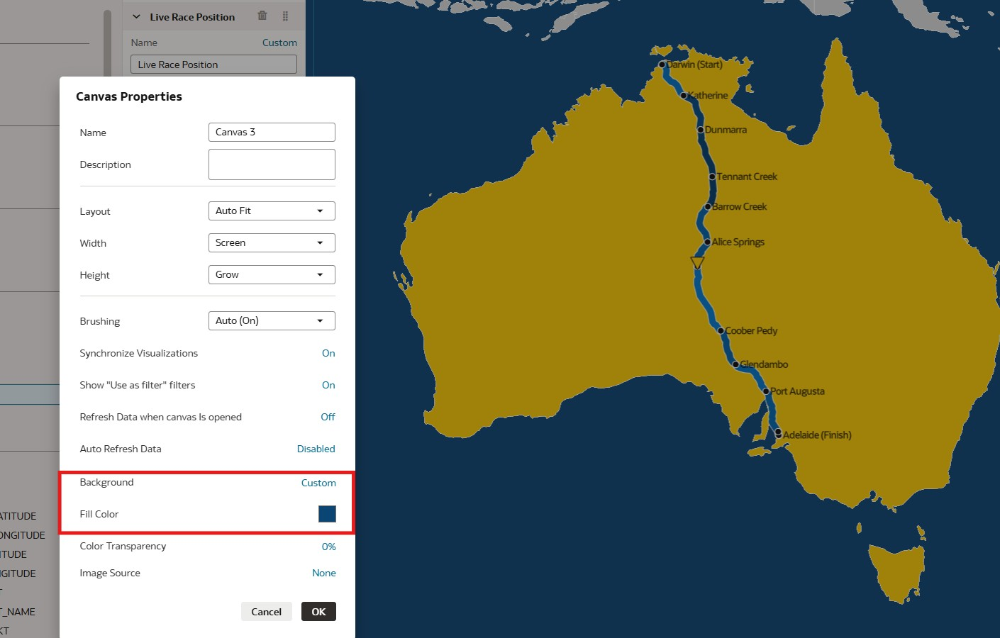
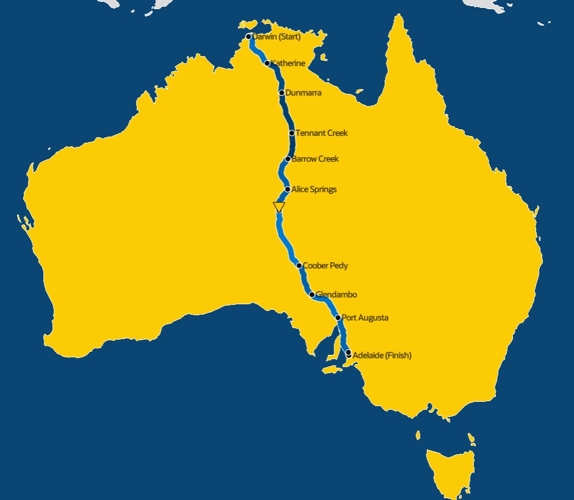

# Build Australia route race map: Add layers and background

## Introduction

In this exercise, you will generate a map of Australia and apply a background color. You will then add multiple layers to the map, including the route, speed, labels, and the car’s live location.

_Estimated Time:_ 30 minutes

### Objectives

In this lab, you will:

- Generate a map of Australia and give it a color
- Add multiple layers to the map
- Add color background

### Prerequisites

This lab assumes you have:

- An Oracle Free Tier, Always Free, Paid or Live Labs Cloud Account
- Provisioned Oracle Analytics Cloud
- All previous labs successfully completed

## Task 1: Import the data sets created in lab 2

1. Go to Create and select workbook (**Create**)

    

2. Import the data sets created in lab 3 , using the + icon .Use the Add Data to upload the data sets one by one in this workbook

    

3. The data pane looks like this when the data sets get uploaded

    

## Task 2: Create Australia map and add color to it

1. Expand the live location dataset and double click Country

    

2. From the visualization pane, change the viz type to Map

    

3. Select the properties panel

    

4. Go to Layers and then change the Map Layer to world countries and color to #fbcb05

    

    You have now created a map of Australia and applied color to it.
    Next we will layer it with speed, route and add labels.

## Task 3: Add layers to the map

1. Return to the grammar pane

    

2. Add a new layer to the map by selecting the three dots. Select add Data Layer

    

3. Expand the route dataset and drag Route WKT column in the category and expand the speed dataset and add Avg vehicle velocity to Color.

    
Notice that the Route WKT is marked with a globe icon, indicating that it is a geometry data type supported by OAC.

4. Go to properties and then Layers. Expand Route WKT.

    

5. For the Name, select Auto and then choose Custom option.

    

6. Rename the layer to Route

    

7. Change color of the race track by right clicking any point on the race track. Select Color and then Manage Assignments

    

8. Once the pop up window appears, enter the color #0b4574

    

9. Return to Grammar pane and add another layer by selecting the three dots

    

10. From the route dataset add Segment name in the Category

    

11. Go to the properties and then to layers. Expand the segment name layer and change name to Segment Name , color it Black and outline to custom size of 8, change the data labels option to  right and set columns to SEGMENT NAME

    

12. Go back to grammar and add layer 4 to the map

    

13. Expand the live location data set and drag latitude and longitude to category and driver to shape. Then click the arrow in the shape section.

    

14. Select the custom shapes and change the shape to down triangle

    

15. Go to properties and rename this layer to live race position, change color to #fbcb05, change outline to custom and size it to 18

    

## Task 4: Add color background

1. Go to canvas properties.

    

2. Select the custom option for the background and change the color as #0b4574

    

    Your visualization should look like this.

    

Congratulations on completing this workshop!

## **Acknowledgements**

- **Author** - Anita Gupta (Oracle Analytics Product Strategy)
- **Contributors** - Gautam Pisharam (Oracle Analytics Product Management)