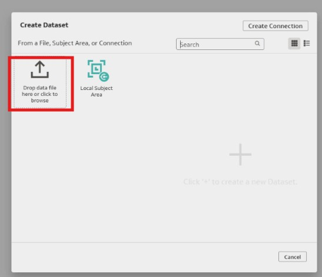
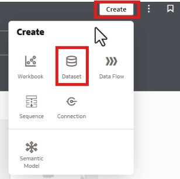
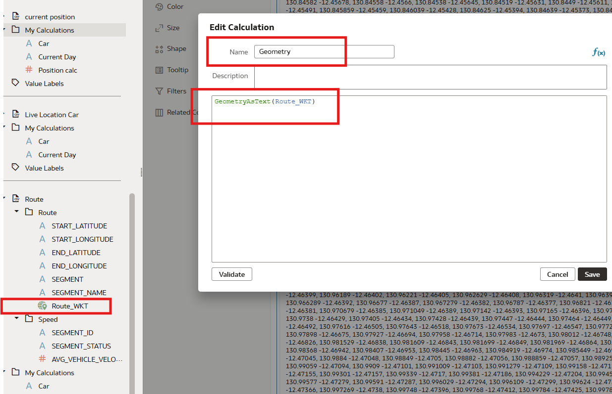
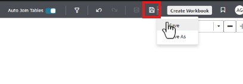

# Upload the csv file in OAC as datasets

## Introduction

In this lab, you will **upload the csv files** required to create the map provided in the resources section. First, we will upload the live race csv file and save it. Next, we will create another dataset by integrating two csv files (route and speed) into OAC using an inner join to produce a combined dataset.

_Estimated Time:_ 10 minutes

### Objectives

In this lab, you will:

- Upload the csv files in OAC as datasets

### Prerequisites

This lab assumes you have:

- An Oracle Free Tier, Always Free, Paid or Live Labs Cloud Account
- Provisioned Oracle Analytics Cloud
- All previous labs successfully completed
- All three csv files provided in the resources have been downloaded

## Task 1: Upload the live location csv file

1. Go to Create and select Dataset (**Create**)

    

2. A dialog box will open. Select the option Drag data file, then choose the live location csv file from your computer. **Drag data file here or click to browse**

    

3. Once the live location data loads, click **OK**

    

4. Go to the live location tab, select the columns Latitude and Longitude one by one, and change Treat As to Attribute.

    

5. Save the file and name it live location. Your live location file is now ready.

    

## Task 2: Upload the route and speed csv files as one joint file

1. Go to Create and select Dataset (**Create**)

    

2. A dialog box will open. Select the option drag data file, then choose the route csv file from your computer. **Drag data file here or click to browse**

    

3. Once the route data loads, click **OK**. Note that RouteWKT is geometry data type column. You can read this geometry data by creating a calculation using GeometryAsText(RouteWKT). Steps 4 to 7 are provided to demonstrate how to read this geometry data. This is optional, and you may go directly to Step 8 if you prefer to skip it.

    

4. Create a calculation to read the geometry data type.
  

5. A dialogue box will open, select the GeometryAsText function

  
6. Double click the GeometryAsText Function and add the route_wkt variable in the formula and give the calculation a name as geometry and save.
  
7. Open a new canvas and double click the calculated column, geometry.
  
We observe that the data is in linestring format.This demonstrates that GeometryAsText() enables reading geometry data types, indicating whether the data is a point, linestring, or polygon. In this case, the data type is a linestring.
8. Open the route data tab and go to **meta data icon**
    
9. Change all columns to Attribute
    
10. Go back to the Join Diagram tab and, at the top of the page, select the **+** button and Add File
    
11. Select the csv file speed from your computer. Once the speed file populates, click **OK**
    
12. Open the speed tab and change the highlighted column Segment ID to Attribute and Data Type to Text.
    
13. Go to the Join Diagram tab.Hover over the route data set to see a small circle on the right side. Click and drag the circle to the speed data set.
    
14. A Join box will appear. Create an inner join by selecting Segment from route data and Segment ID from speed data.
    
15. Save this file as route.
    

You have now loaded the csv files as **datasets** into OAC.
Next we will build the map and add layers to it.

Congratulations on completing this lab!

You may now _proceed to the next lab_.

## **Acknowledgements**

- **Author** - Anita Gupta (Oracle Analytics Product Strategy)
- **Contributors** - Gautam Pisharam (Oracle Analytics Product Management)
- **Last Updated By/Date** - Anita Gupta, November 2025
