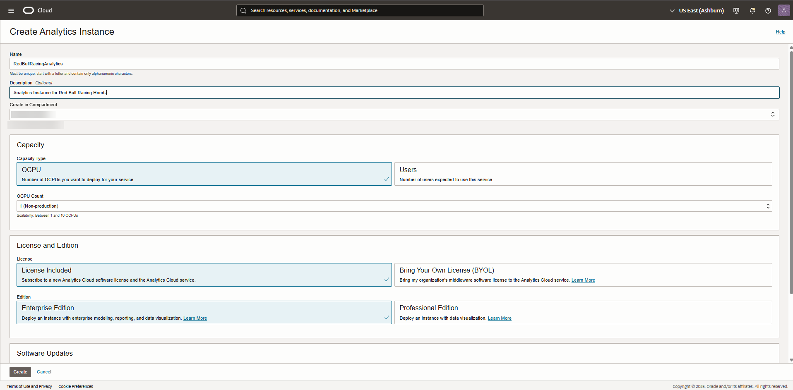

# Provision Analytics Cloud

## Introduction

In this lab, you will deploy an Oracle Analytics Cloud instance on Oracle Cloud Infrastructure.

> Provisioning Oracle Analytics Cloud can take up to 40 minutes.

<!--

-->

_Estimated Time:_ 5 minutes

### Objectives

In this lab, you will:

- Login as a federated user
- Create an Oracle Analytics Cloud Instance

### Prerequisites
This lab assumes you have:

- An Oracle Free Trial Account

## Task 1: Create an Oracle Analytics Cloud (OAC) Instance

1. Return to the Home Page and go to the **Menu** > **Analytics & AI** > **Analytics Cloud**.

   

2. Make sure you select the `root` compartment (unless you have permissions and experience selecting a different one) and click **Create Instance**.

   

3. Fill the web form with the following information and click **Create**:

   - **Name**: `RedBullRacingAnalytics`
   - **Description**: `Analytics Instance for Red Bull Racing Honda`
   - **Create in Compartment**: `root` compartment, unless you have permissions and experience selecting a different one
   - **Capacity**: `OCPU` and `1 - Non Production`
   - **License Type**: `License Included`
   - **Edition**: `Enterprise Edition`

    > **Note:** **1 OCPU** OAC instance is for **Trials Only;** please be aware that you cannot scale up an 1 OCP instance and also there are [Limits for Querying, Displaying, Exporting Data](https://docs.oracle.com/en/cloud/paas/analytics-cloud/acoci/create-services.html#GUID-7D6DB4EE-8DD5-44C5-9B6E-9FA847463A5F)

   

   Your Analytics Instance will start provisioning.

   

   > **Note:** Provisioning an Oracle Analytics Cloud instance can take from 10 (most likely) to 40 minutes.

   We will get back to your Oracle Analytics Cloud instance later in the workshop.

You may now *proceed to the next lab*.

## **Acknowledgements**

- **Author** - Jeroen Kloosterman (Technology Product Strategy Director), Victor Martin (Technology Product Strategy Manager)
- **Contributors** - Priscila Iruela, Arabella Yao
- **Last Updated By/Date** - Ramona Magadan, Technical Program Manager, November 2025
