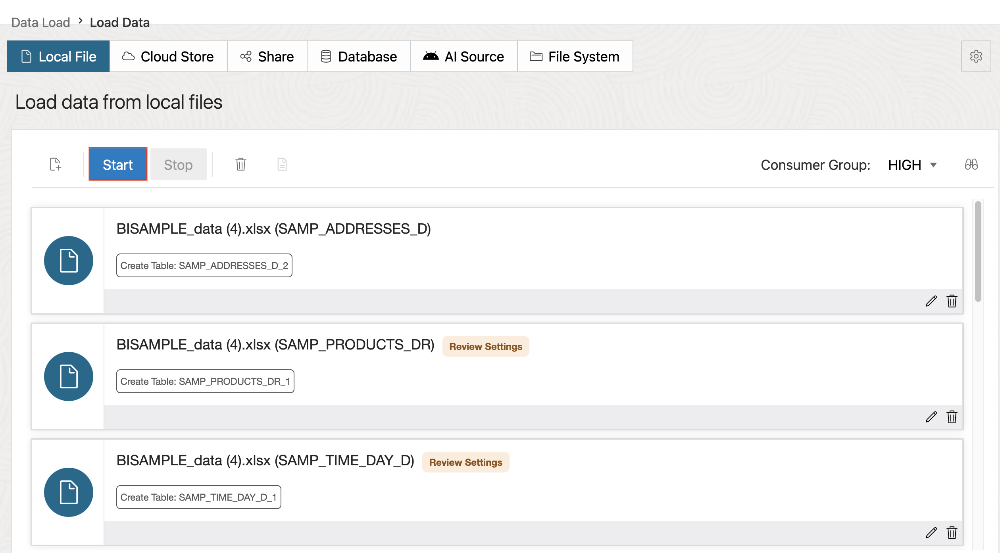
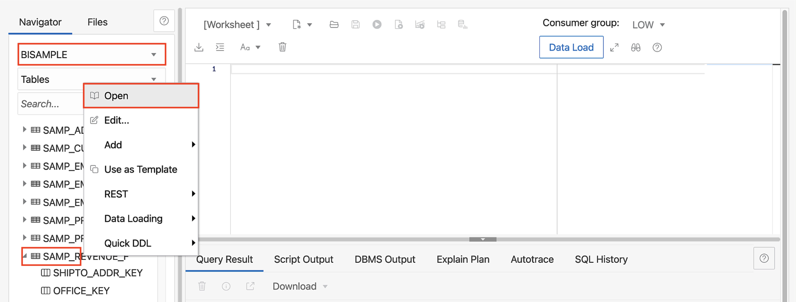

# Load data into the ADW and connect to OAC

## Introduction

In this lab, you will walk through the steps to create a database user, load data into the ADW using Data Load, and connect your ADW to your OAC instance.

Estimated Time: 15 minutes

### Objectives

In this lab, you will:
* Create a BISAMPLE user
* Load data into the Autonomous Data Warehouse
* Connect OAC to ADW

### Prerequisites

This lab assumes you have:
* Access to Oracle Analytics Cloud
* Access to DV Content Author, BI Data Model Author, or a BI Service Administrator role
* Downloaded the BISAMPLE.data.xlsx(Enter object storage URL here) file
* All previous labs successfully completed

## Task 1: Create a BISAMPLE user
In this section we will create the necessary user/schema required for this lab.

>**Note:** This process is done by the ADMIN user

1. Navigate back to your SemanticModelerDB details page and click **Database actions**.

	

2. Scroll down to **Administration** and select **DATABASE USERS**.

	

3. Click **Create User**.

	

4. Enter the following information in the **User** tab:
	* User Name: BISAMPLE
	* Password: Choose a valid password (You will need this to log in to the BISAMPLE user in the next task)
	* Quota on tablespace DATA: Unlimited
	* Web Access: Enable

	

5. Click the **Granted Roles** tab and grant the role **"DWROLE"** and check all three options. Then click **Create User**.

	

You have just created the BISAMPLE user role in the SemanticModelerDB.

## Task 2: Load your data into the ADW
In this section, you will login to the BISAMPLE user you just created and load the BISAMPLE.data.xlsx (Enter object storage URL here) file into the BISAMPLE schema.

1. Sign out of the ADMIN user by clicking **ADMIN** on the top right of the page and selecting **Sign Out**.

	

2. Once you are signed out, click **Sign in**, enter the username, BISAMPLE and click **Next**. The enter the password you created for the BISAMPLE and **Sign in**.

	

3. Under **Data Studio**, click **DATA LOAD**.

	

4. Choose **LOAD DATA** and **LOCAL FILE**, then click **Next**.

	

5. Drag and drop or select the BISAMPLE_date.xlsx file from your local machine.

	

6. Once your files are ready, click the green **Start** button to start the data load. This should take about a minute.

	

7. Click **Done** on the bottom of the page once the data load is complete.

	

8. To verify that your data has loaded successfully, click the **Hamburger menu** and select **SQL** under Development.

	

9. All your tables should be listed here under the BISAMPLE user/schema. Right click SAMP_ REVENUE _F and select **Open**. We'll take a closer look to confirm all the data is there.

	

10. Click the **Data** column and right click on the table. Select **Count Rows** to make sure all the rows were loaded. There should be 71,000 rows.

	

You have just loaded data into the BISAMPLE schema using the Data Load feature in the ADW.

## Task 3: Download database connection wallet
In this section, you will download the SemanticModelerDB wallet which will be used to connect to the Autonomous Data Warehouse within Oracle Analytics Cloud.

1. Navigate back to the SemanticModelerDB details page and click **Database connection**.

	

2. Under wallet type, make sure **Instance Wallet** is selected and then click **Download wallet**.

	

3. Enter a wallet **Password** and click **Download**. We will use this wallet file in the next task to connect to the ADW.

	

## Task 4: Connect OAC to ADW
In this section, you define a connection to the data source to use for the Semantic Model. This lab uses the BISAMPLE schema to demonstrate the steps required to create an initial semantic model.

1. Navigate back to your Oracle Analytics Cloud instance details page and click **Analytics Home Page**. This will direct you to the OAC console.

	

2. On the Home page, click **Create**, and then select **Connection**.

	

3. In **Create Connection**, select a **relational database** connection type to use such as Oracle Database.

	

4. In the connection dialog, enter the following:

	* Connection Name: BISAMPLE
	* Description:
	* Client Credentials: Select the wallet zip file you downloaded in task 3
	* Username: ADMIN
	* Password: (The ADMIN password you created for the ADW)
	* Service Name: This will auto load once you upload the wallet
	* System connection: Check

	

5. Select **System Connection**, and then click **Save**.

You have just created the connection to the Autonomous Data Warehouse.

## Learn More
* [Autonomous Data Warehouse](https://docs.oracle.com/en/cloud/paas/autonomous-data-warehouse-cloud/)
* [OAC Connect to Data](https://docs.oracle.com/en/cloud/paas/analytics-cloud/upload-data.html)

## Acknowledgements
* **Author** - Nagwang, Product Manager, Analytics Product Strategy
* **Contributors** -  Lucian Dinescu, Peter Monteiro
* **Last Updated By/Date** - Nagwang Gyamtso, January, 2023
