# Create the Logical Layer

## Introduction

In this lab, you create your business model in the logical layer using the physical table aliases and the joins from the physical layer. You modify the tables by removing unnecessary columns and renaming columns.

Estimated Time: -- minutes

### Objectives

In this lab, you will:
* Create your business model in the logical layer
* Modify the tables by removing unnecessary columns and renaming columns

### Prerequisites

This lab assumes you have:
* Access to Oracle Analytics Cloud
* Access to DV Content Author, BI Data Model Author, or a BI Service Administrator role
* Access to the Sample Sales Semantic Model
* All previous labs successfully completed

## Task 1: Create the Business Model

Begin with step 3 if you're continuing this lab directly after completing the steps in Create the Physical Layer lab.

1. If you closed your semantic model, sign in to Oracle Analytics Cloud using one of DV Content Author, BI Data Model Author or Service Administrator credentials. On the **Home page**, click the **Navigator Navigator** icon, and then click **Semantic Models**.

	

2. In the Semantic Models page, select **Sample Sales**, click **Actions menu** icon, and then select **Open**.

	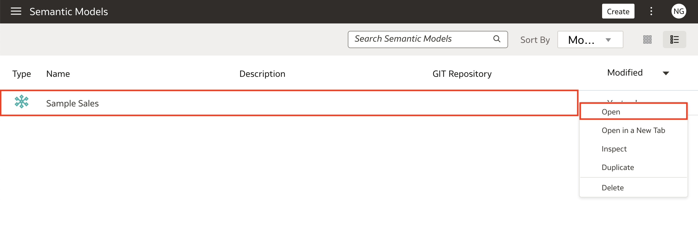

3. Click the **Logical Layer** icon, click **Create** icon, and then select **Create Business Model**.

	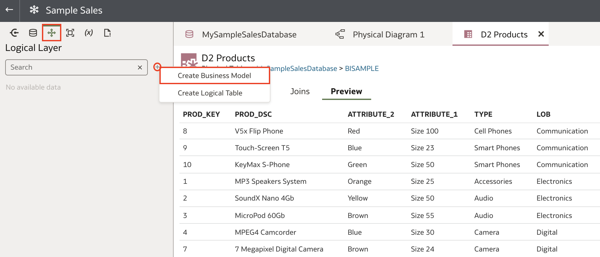

4. In Create Business Model, enter <code>Sample Sales BM</code> in **Name**, and then click **OK**. The Semantic Modeler opens an empty business model.

	

## Task 2: Set Logical Layer Naming Preferences

In this section, you set preferences for the names of tables and columns in the Logical Layer. You change the tables and column names to use initial capitalization and replace the underscores with spaces.

1. In the empty Sample Sales business model, click the **Physical Layer** icon.

	

2. In the **Physical Layer**, select **D1 Time** and drag it to **Dimensions** in the Logical Tables.

	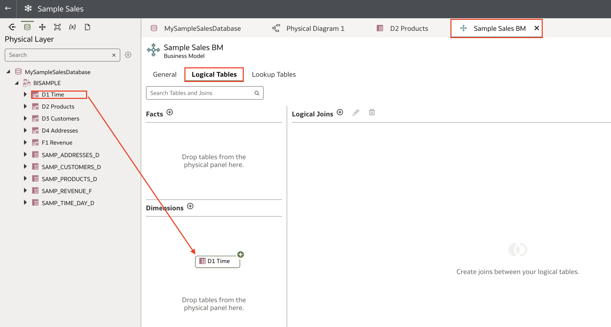

3. Double-click **D1 Time** to view the table's columns.

	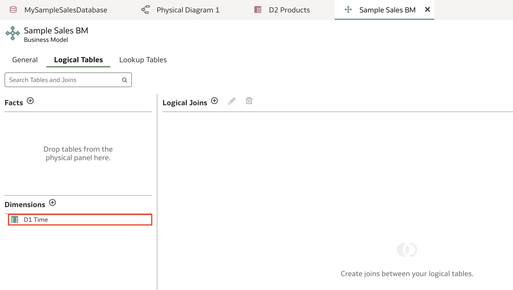

4. The table and columns use upper case, and the column names include underscores. Double-click **CALENDAR_DATE**, enter <code>Calendar Date</code> to rename the column. Manually renaming every column would take valuable time. Save changes if prompted.

	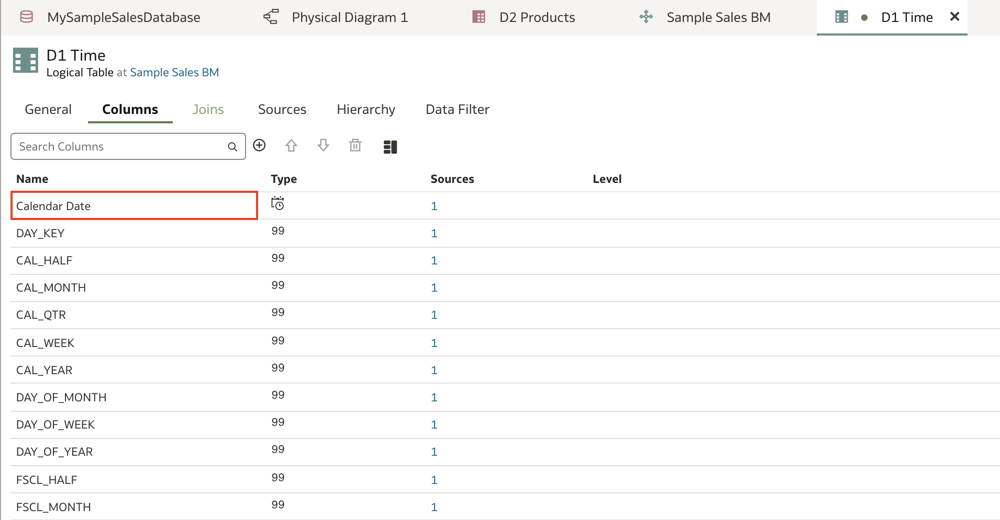

5. In the **Sample Sales BM** page, right-click **D1 Time** and select **Delete**. Select **Yes** when promted to confirm delete.

	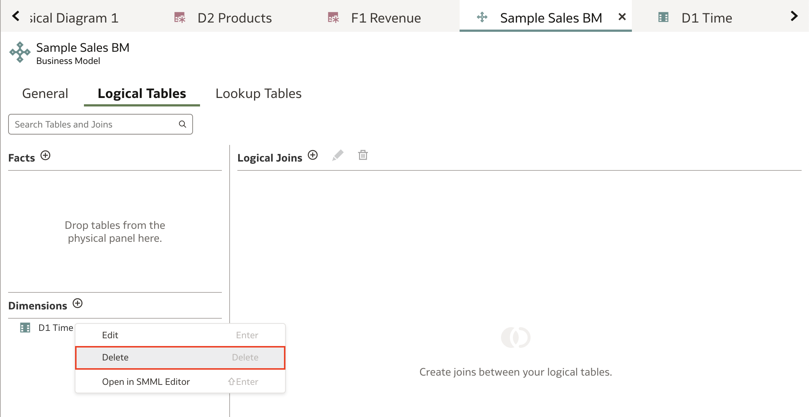

6. Click the **Page Menu** icon and select **Preferences**.

	

7. In **Preferences**, click **Logical Layer**. Select the **Rename Actions** icon. Select **Change each underscore (_) to a space**, **All lowercase**, and **Initial Capitals**.

	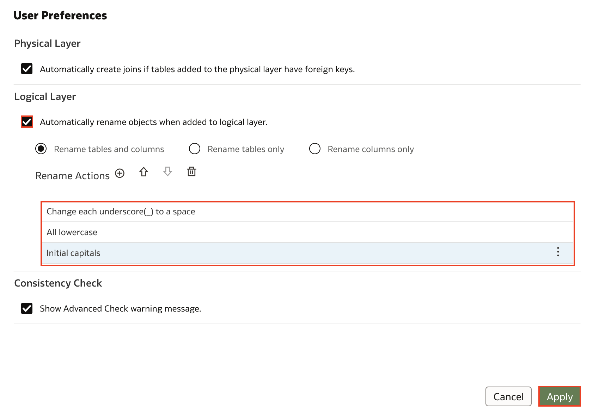

8. Click the toggle to **enable the preferences**, and then click **Apply**.

	

9. From the **Physical Layer**, select **D1 Time** and drag it to **Dimensions** in the **Sample Sales BM** business model.

	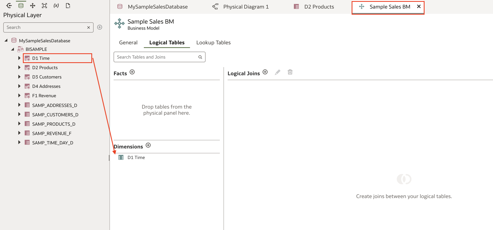

10. Double-click **D1 Time** to see the renamed columns.

	

## Task 3: Add Tables to the Logical Layer

1. In the **Samples Sales BM** page, click the **Logical Tables** tab. Click the **Physical Layer** icon pane.

	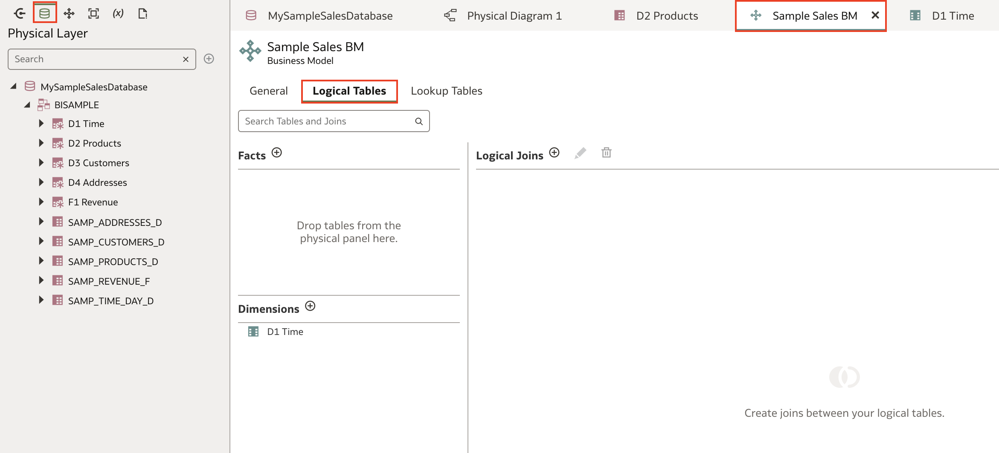

2. Expand **MySampleSalesDatabase**, expand the **BISAMPLE** schema, and then drag **F1 Revenue** to **Facts**. Select **D2 Products** and **D3 Customers**, and then drag them to **Dimensions**.

	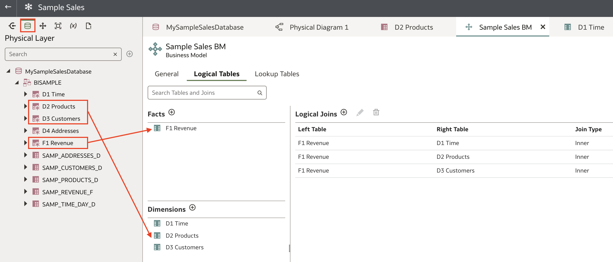

3. Click and open each logical dimension table, **D1 Time**, **D2 Products**, and **D3 Customers**.

	

4. In the **D1 Time** logical table's **General tab**, click in the **Primary Key** field and select **CALENDAR DATE**. **Repeat** the same step for **D2 Products** and add its **Primary Key**, **PROD KEY**. For **D3 Customers** add its **Primary Key**, **CUST KEY**.

	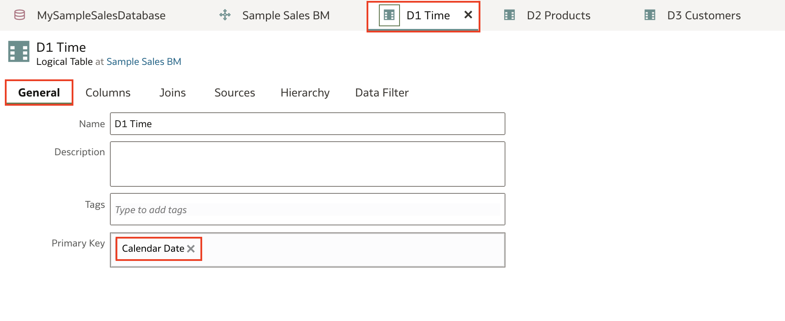

5. In the **Logical Layer** icon, expand **Sample Sales BM**, right-click **F1 Revenue**, select **Show Logical Diagram**, and then select **Selected Tables and Direct Joins**.

	

6. The logical diagram shows the logical joins between the fact and dimension tables.

	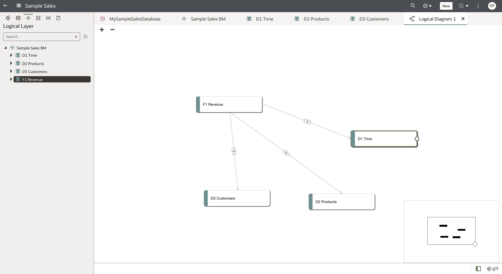

7. If you don't see the logical joins, close the **Logical Diagram** and take the following steps:

	* In the **Logical Layer**, hold the **Ctrl key**, select **D1 Time**, **D2 Products**, **D3 Customers**, and **F1 Revenue**.
	* Right-click on any of the tables, select **Show Logical Diagram**, and then select **Selected Tables Only**.
	* Hover over to **F1 Revenue**, grab the **Connector** icon and drag to **D1 Time**, and then in the **Add Join** dialog, click **Add**. **Repeat** this step by grabbing the **Connector** icon from **F1 Revenue** and adding joins to **D2 Products** and **D3 Customers**.
	* Click **Save**.

8. In the **Samples Sales BM** page, click the **Logical Tables** tab. The logical joins between the fact and dimension tables are listed.

	

## Task 4: Modify the Logical tables

In this section, you rename columns, remove columns for tables, and set the aggregation rules to create measures.

1. In the **Sample Sales BM** page, double-click the **F1 Revenue** table.

	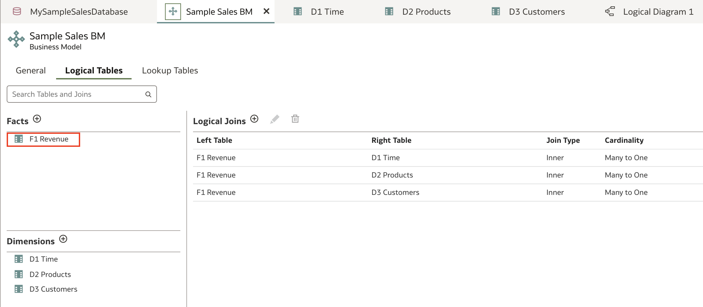

2. In the **Columns** tab, keep the **UNITS** and the **REVENUE** columns. Hold down the **Shift key** and use the **Down Arrow** icon to select the remaining columns.

	

3. Right-click the selected columns and select **Delete**. In **Delete Logical Column**, click **Yes**.

	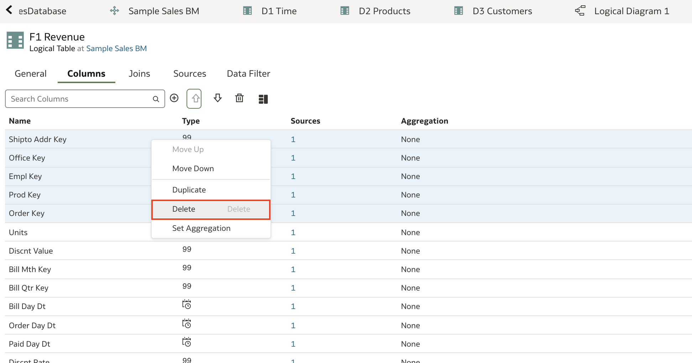

4. Select **Revenue**, and click the **Detail View** icon. Under **Aggregation Rule**, select **Sum** to create a simple measure.

	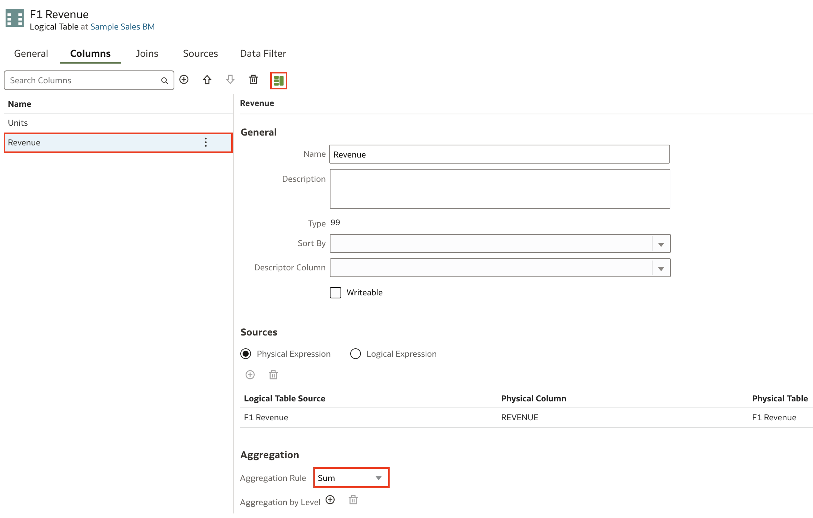

5. Select **Units**, and click the **Detail View** icon. Under **Aggregation**, select **Count** to create a simple measure.

	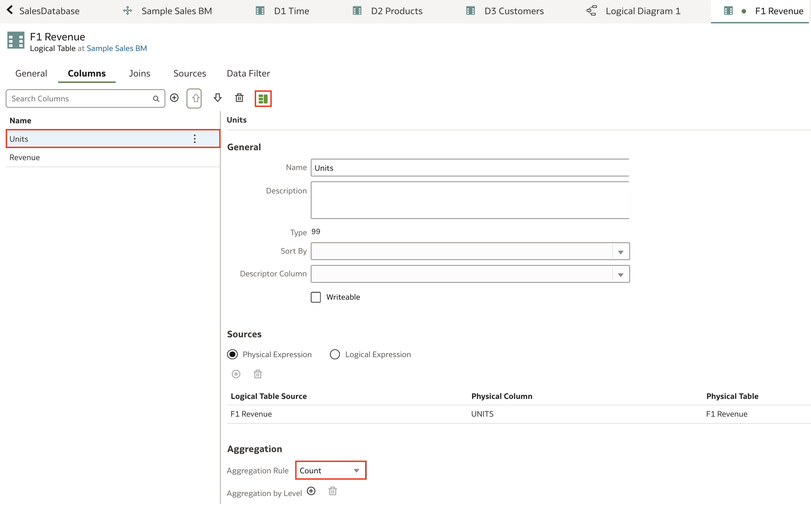

6. Click **Save**.

	

## Learn More
* [What is the Logical Layer?](https://docs.oracle.com/en/cloud/paas/analytics-cloud/acmdg/what-is-logical-layer.html)
* [Plan the Logical Layer](https://docs.oracle.com/en/cloud/paas/analytics-cloud/acmdg/plan-logical-layer.html#GUID-AED3B120-70F8-4837-9F2A-D9236F7BCCF0)
* [About Logical Joins](https://docs.oracle.com/en/cloud/paas/analytics-cloud/acmdg/work-logical-joins.html#GUID-3810662A-AFAE-4EF9-B7C9-0A70D81A5A9A)
* [Automatically Rename Logical Layer Objects](https://docs.oracle.com/en/cloud/paas/analytics-cloud/acmdg/automatically-rename-logical-layer-objects.html)

## Acknowledgements
* **Author** - Nagwang, Product Manager, Analytics Product Strategy
* **Contributors** -
* **Last Updated By/Date** - Nagwang Gyamtso, January, 2023
