# Create the Physical Layer

## Introduction

This lab shows you how to create an initial semantic model in Oracle Analytics Cloud, starting with the physical layer.

Estimated Lab Time: -- minutes

### About
This lab describes how to build governed semantic models using the Semantic Modeler. Ask your administrator to enable the Semantic Modeler preview feature in Console.

In the Oracle Analytics Semantic Modeler, you define the physical, logical, and presentation layers to create a semantic model, along with related objects such as variables, and initialization blocks. In this lab, you select the objects from a supported relational data source to define the physical layer of the semantic model.

This lab shows you how to create the system connection required to use a relational data source with the Semantic Modeler. In an empty model, you create a schema and add tables selected from relational data sources.

### Objectives

In this lab, you will:
* Select the objects from a supported relational data source to define the physical layer of the semantic model
* Create a schema in an empty model and add tables selected from relational data sources

### Prerequisites

This lab assumes you have:
* Access to Oracle Analytics Cloud
* Access to DV Content Author, BI Data Model Author, or a BI Service Administrator Problems
* Ability to connect to a relational data source
* Access to the BISAMPLE schema to perform the steps in this lab

## Task 1: Create a Semantic Model

In this section, you create an empty semantic model.

1. On the Home page, click **Create**, and then select **Semantic Model**.

	

2. In Create Semantic Model, enter <code>Sample Sales</code> in **Name**, and then click **Create**.

	

3. In Create Semantic Model, click **Start with Empty Model**.

	

4. In the **MyDatabase** tab, click **General**. In **Name**, enter <code>MySampleSalesDatabase</code>. Click **Save**.

	

## Task 2: Add Physical tables

In this section, you add physical tables from the data source to the empty semantic model.

1. In MySampleSalesDatabase, click the **Tables** tab.

	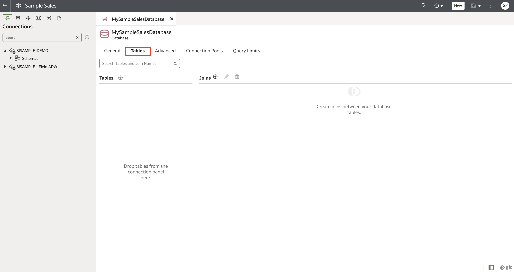

2. In the Connections Connections pane icon pane, expand the BISAMPLE connection, and then expand Schemas.

	

3. Expand the BISAMPLE schema.

	

4. Hold down the Ctrl key and select these tables:
	* SAMP_ ADDRESSES_D
	* SAMP_ CUSTOMERS_D
	* SAMP_ PRODUCTS_D
	* SAMP_ REVENUE_F
	* SAMP_ TIME_ DAY_D

5. Drag the selected tables to Tables in the MySampleSalesDatabase tab

	

## Task 3: Create Physical Table Aliases

In this section, you create physical table aliases that enables reusing the physical source tables. You also prefix the physical alias table's name with the table type such as F for fact and D for dimension, and use a number along with the F or D to change the original physical table name. For example, D1 Time for the SAMP_ TIME_ DAY_ D table and D2 Products for the SAMP_ PRODUCTS_D table.

1. In Tables, right-click **SAMP_ TIME_ DAY_D** and select **Create Physical Table** Alias.

	

2. In Create Physical Table Alias, enter <code>D1 Time</code> in **Name**, and then click **Add**. Close D1 Time.

	

3. Right-click **SAMP_ PRODUCTS_D** and select **Create Physical Table Alias**.

	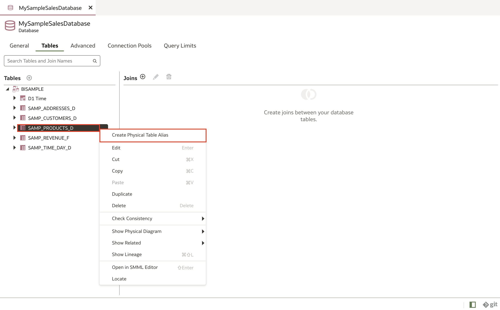

4. In **Create Physical Table Alias**, enter <code>D2 Products</code> in **Name**, and then click **Add**. Close D2 Products.

	

5. Create physical table aliases for **SAMP_ CUSTOMERS_ D, SAMP_ ADDRESSES_ D, and SAMP_ REVENUE_F** with the following instructions:

	* Right-click **SAMP_ CUSTOMERS_D** and select **Create Physical Table Alias**.
		* In Create Physical Table Alias, enter <code>D3 Customers</code> in **Name**, and then click **Add**. Close D3 Customers.
	* Right-click **SAMP_ ADDRESSES_D** and select **Create Physical Table Alias**.
		* In Create Physical Table Alias, enter <code>D4 Addresses</code> in **Name**, and then click **Add**. Close D4 Addresses.
	* Right-click **SAMP_ REVENUE_F** and select **Create Physical Table Alias**.
		* In Create Physical Table Alias, enter <code>F1 Revenue</code> in **Name**, and then click **Add**. Close F1 Revenue

6. You should now have the D1 Time, D2 Products, D3 Customers, D4 Addresses, and F1 Revenue tables.

	

## Task 4: Create Physical Joins

In this section, you define joins between alias tables to express relationships between tables in the Physical layer.

1. In the **Joins** section, click the **Add Join** icon.

	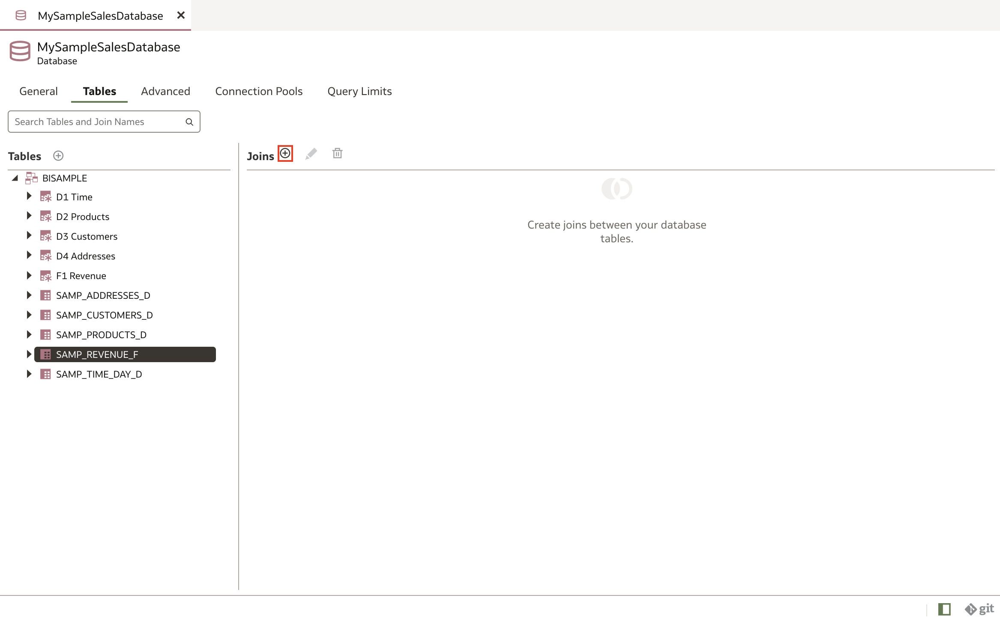

2. In **Add Physical Join**, click the dropdown in the Left Table. Expand the database, expand the schema, and then click **F1 Revenue**. Click the dropdown in the Right Table. Expand the database, expand the schema, and then click **D1 Time**.

	

3. In **Join Conditions**, click the dropdown under Left Table (F1 Revenue), select the **BILL_ DAY_ DT** column. Under the Right Table (D1 Time), click the dropdown, and select the **CALENDAR_ DATE** column. Click **Add**.

	

4. Click **Save** icon.

	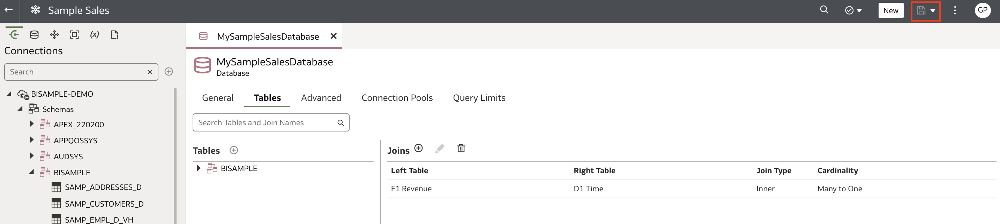

5. Let's add another join. Click the **Add Join** icon. In **Add Physical Join**, click the dropdown in the Left Table. Expand the database, expand the schema, and then click **F1 Revenue**. Click the dropdown in the Right Table. Expand the database, expand the schema, and then click **D2 Products**.

	

6. In **Join Conditions**, click the dropdown under Left Table (F1 Revenue), select the **PROD_ KEY** column. Under the Right Table (D2 Products), click the dropdown, and select the **PROD_ KEY** column. Then click **Add**.

	

7. Click the **Physical Layer** icon. Under the BISAMPLE schema, right-click **F1 Revenue**, select **Show Physical Diagram**, and then click **Selected Tables and Direct Joins**.

	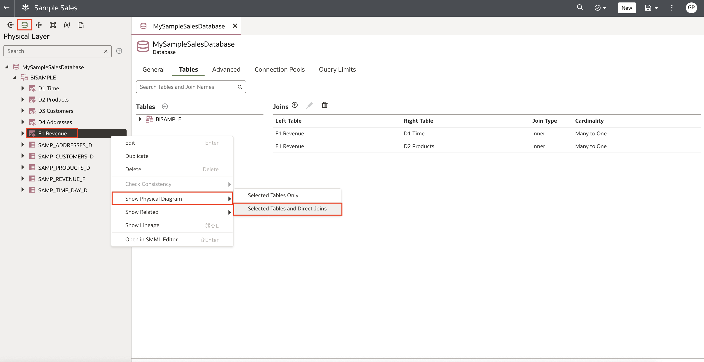

8. Drag **D3 Customers** to the **Physical Diagram**. Drag the **F1 Revenue** from the Physical Diagram away so that it's not blocking D1 Time. Re-arrange as you see fit.

	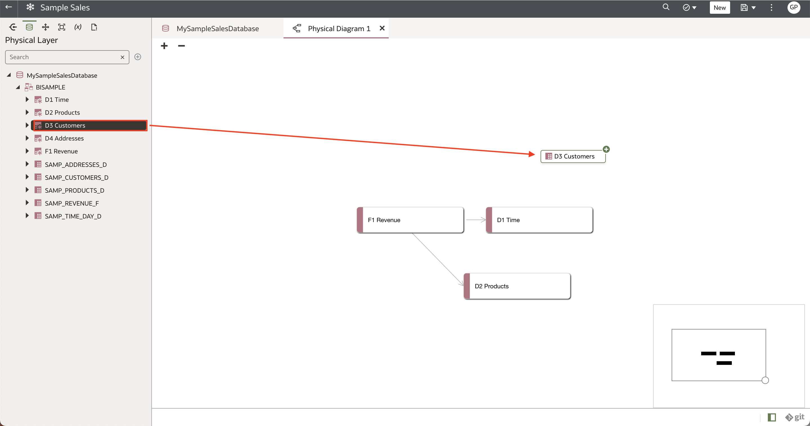

9. From the **F1 Revenue connector**, draw a line to **D3 Customers**.

	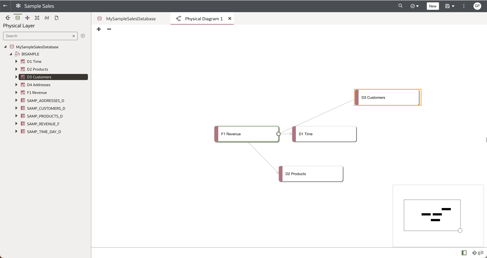

10. In **Add Physical Join** under **Join Conditions**, click the dropdown under Left Table (F1 Revenue), select the **CUST_ KEY** column. Under the Right Table (D3 Customers), click the dropdown, and select the **CUST_ KEY** column. Then click **Add**.

	

11. Drag **D4 Addresses** to the Physical Diagram.

	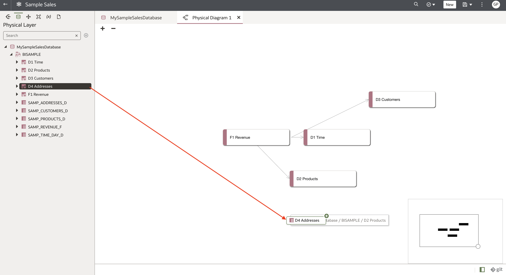

12. From the D3 Customers connector, draw a line to D4 Addresses.

	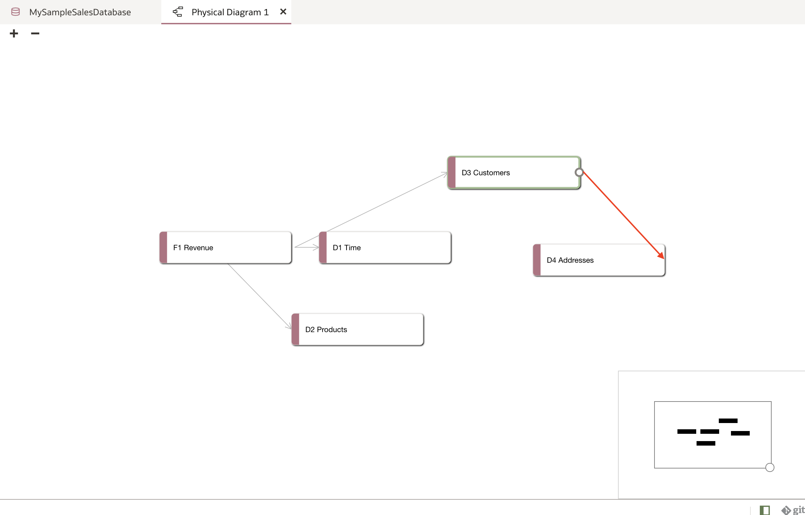

13. In Add Physical Join under **Join Conditions**, click the list icon on the left, and select the **ADDRESS_ KEY** column. Click list icon on the right, and then select the **ADDRESS_ KEY column**. Click **Add**.

	

14. Click the **Save** icon.

	

## Task 5: Review Physical Layer tables

In this section, you can review columns, joins, and data in the Physical Layer tables.

1. In the Physical Layer, double-click the **D2 Products** table.

	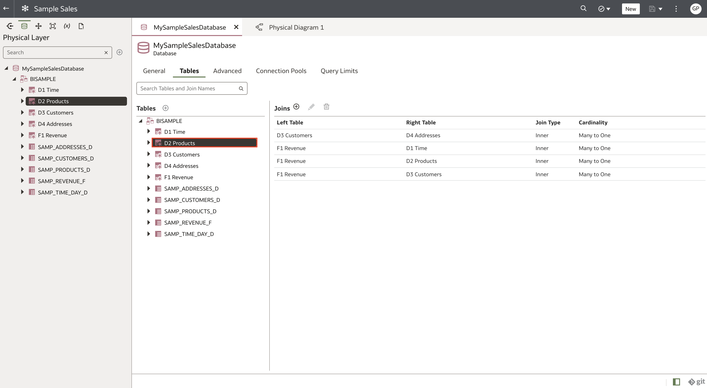

2. The Physical Layer table opens in the **Columns** tab.

	

3. Click **Joins** to view the joins to the F1 Revenue table.

	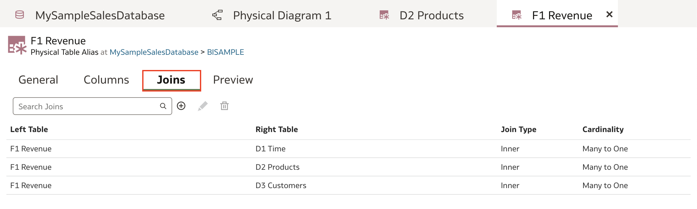

4. Click **Preview** to see a sample of the data in the columns.

	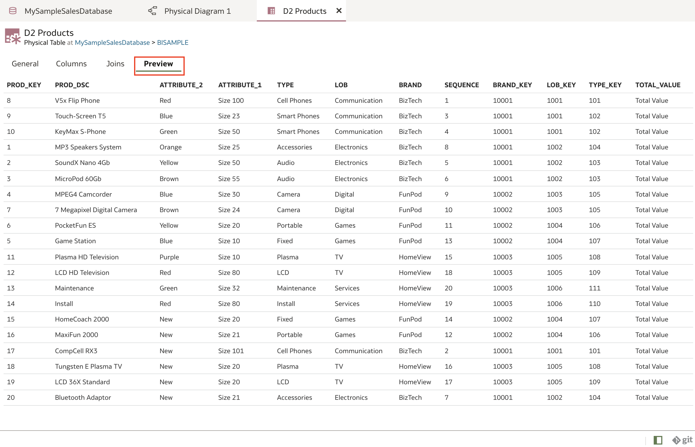

## Learn More
* [What Is a Semantic Model?](https://docs.oracle.com/en/cloud/paas/analytics-cloud/acmdg/what-is-semantic-model.html)
* [Understand a Semantic Model's Requirements](https://docs.oracle.com/en/cloud/paas/analytics-cloud/acmdg/understand-semantic-models-requirements.html)
* [Plan the Physical Layer](https://docs.oracle.com/en/cloud/paas/analytics-cloud/acmdg/plan-physical-layer.html#GUID-D7D6E064-F9C8-4B8B-A02F-B9E0358063F1)

## Acknowledgements
* **Author** - Nagwang, Product Manager, Analytics Product Strategy
* **Contributors** -
* **Last Updated By/Date** - Nagwang Gyamtso, January, 2023
