# Create the Presentation Layer

## Introduction

In this lab, you will crate the presentation layer using the tables that you modified in the logical layer.

The presentation layer provides the tables, relationships, and hierarchies using terms understood by business users. The presentation layer's subject area contains the business data that closely aligns with user roles and goals. For customers in sales and sales support roles, you could create a subject area that has tables and columns related to product sales, revenue, and customer orders. For customers in human resources, the subject area tables and columns could include employee retention, promotion, and hire data.

Estimated Lab Time: 25 minutes

### Objectives

In this lab, you will:
* Create the presentation layer

### Prerequisites

This lab assumes you have:
* Access to Oracle Analytics Cloud
* Access to DV Content Author, BI Data Model Author, or a BI Service Administrator role
* Access to the Sample Sales Semantic Model
* All previous labs successfully completed

## Task 1: Create the Subject Area

In this section, you create the Sample Sales subject area that displays in Oracle Analytics when the semantic model is deployed.

Begin with step 3 if you're continuing this lab directly after completing the steps in Create the Logical Layer lab.

1. If you closed your semantic model, sign in to Oracle Analytics Cloud using one of DV Content Author, BI Data Model Author or Service Administrator credentials. On the **Home page**, click the **Navigator** icon, and then click **Semantic Models**.

	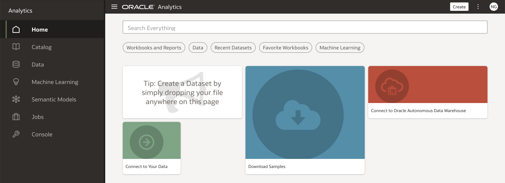

2. In the **Semantic Models** page, select **Sample Sales**, click **Actions menu**, and then select **Open**.

	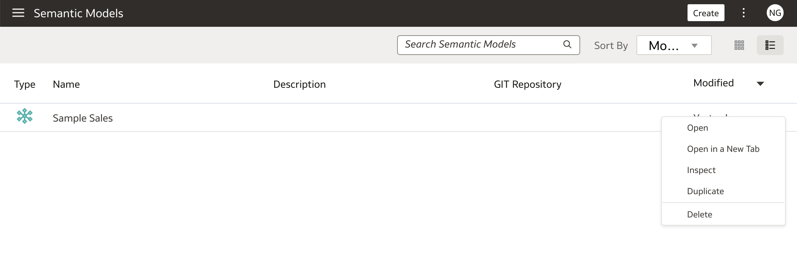

3. Click the **Presentation Layer** icon. Click the **Create** icon, and then select **Create Subject Area**.

	

4. In **Create Subject Area**, enter <code>Sample Sales</code> in **Name**, and then click **OK**.

	

5. In the **Sample Sales** subject area on the **Tables** tab, click **Add Tables**, and then select **Create Presentation Table**.

	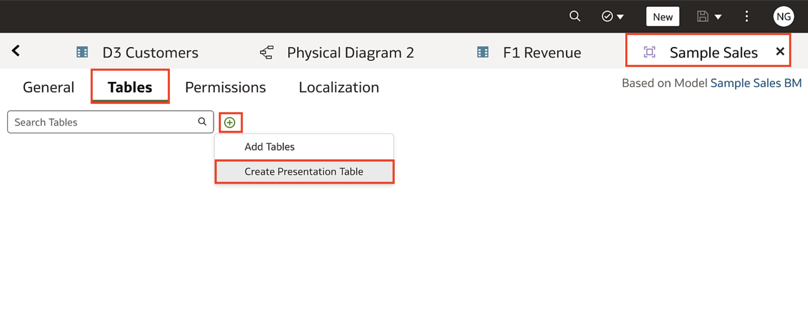

6. In **Create Presentation Table**, enter <code>Time</code> in **Name**, and then click **OK**. Close the Time tab.

	

7. In the **Sample Sales** subject area, click the **Add Tables** icon and select **Add Tables**.

	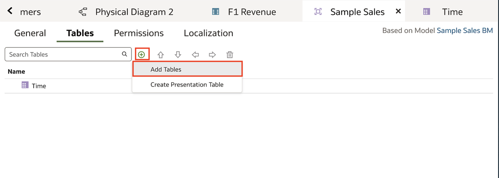

8. In **Select Logical Table**, click **D2 Products**, and then click **Select**.

	

9. Double-click **D2 Products**.

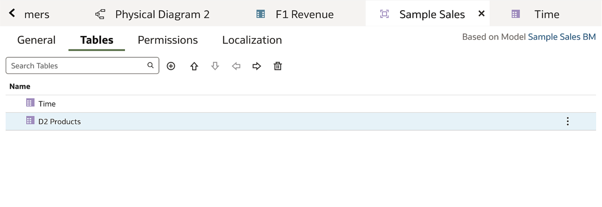

10. Click the **General** tab. In **Name**, enter <code>Products</code>, and then click the **Save** icon.

	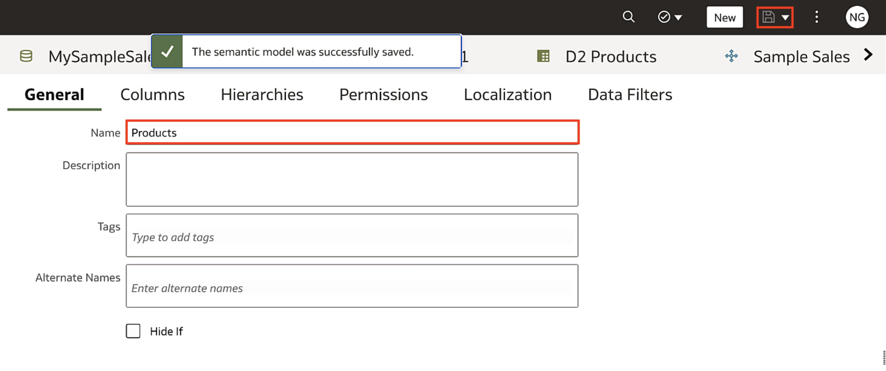

11. In the **Sample Sales** subject area, click **Add Tables**, and select **Create Presentation Table**.

	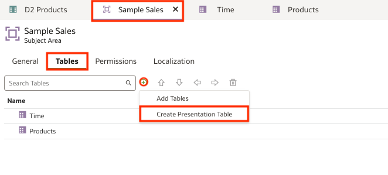

12. In **Create Presentation Table**, enter <code>Customers</code> in **Name**, and then click **OK**.

	

13. Add another **Presentation Table** and name this one <code>Base Facts</code>, and then click **OK**.

	

14. Click the Presentation Layer's **Table** tabs, and then click and open each table to review the table columns.

	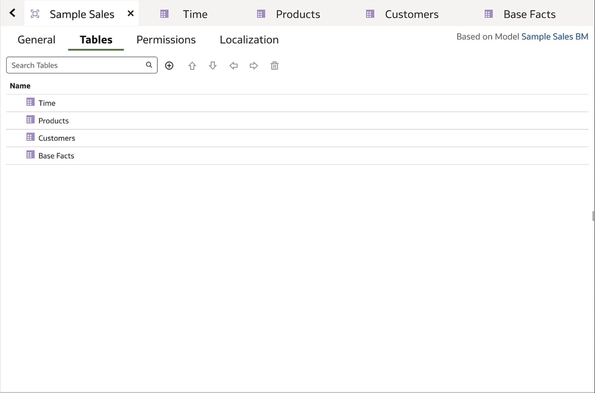

15. The **Products** table contains columns imported from the **D2 Products** table in the business model. The **Time**, **Customers**, and **Base Facts** tables don't yet have columns because they aren't connected to a source table.

	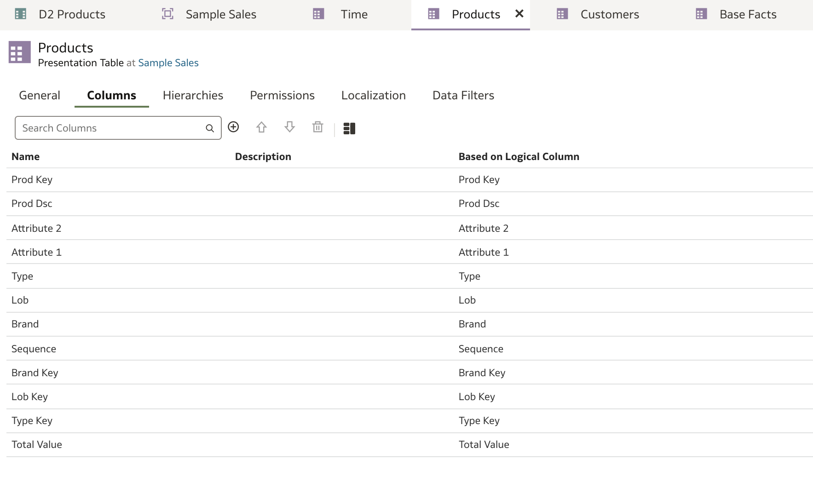

## Task 2: Add Columns to the Presentation Tables

In this section, you select columns from the logical tables to use in the presentation tables.

1. In the **Logical Layer**, expand the **Sample Sales BM** and then expand **D1 Time**. Click the **Logical Layer** icon, expand **Sample Sales BM**, and then expand **D1 Time**.

	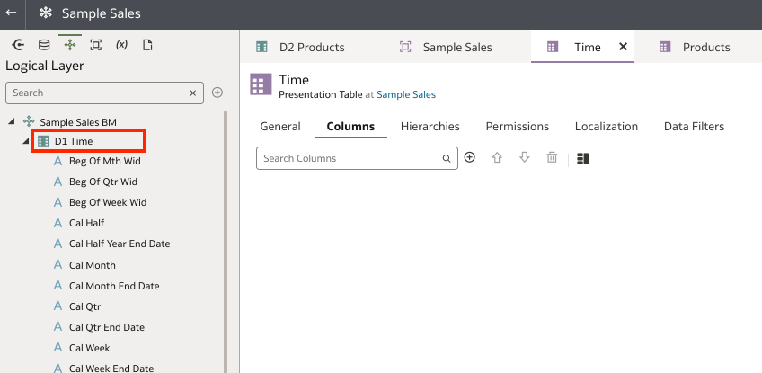

2. Hold down the **Ctrl** or **Command** key, and select and drag the following columns to the **Columns** tab in the **Time** presentation table:
	* Calendar date
	* Per name half
	* per name month
	* Per name qtr
	* Per name week
	* Per name year

	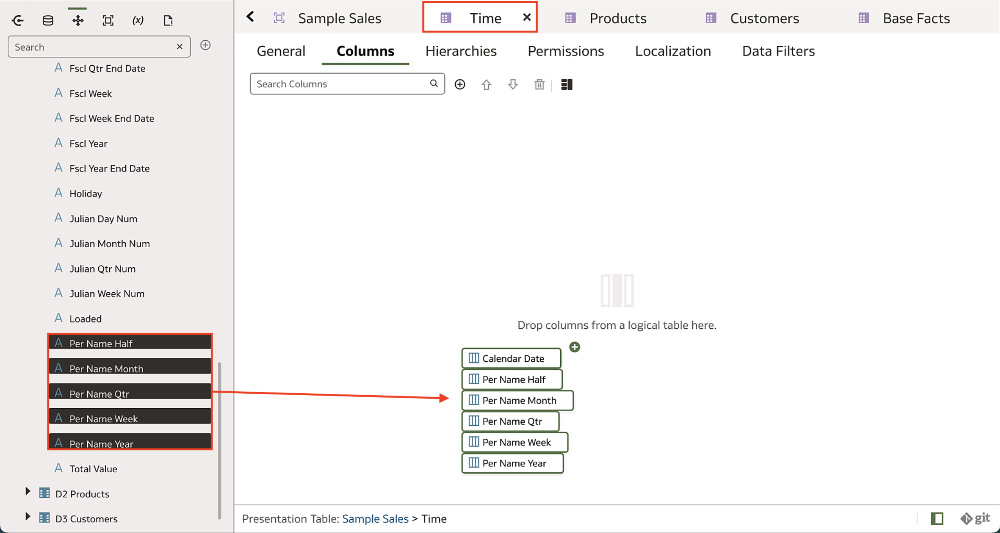

3. Click **Save**.

	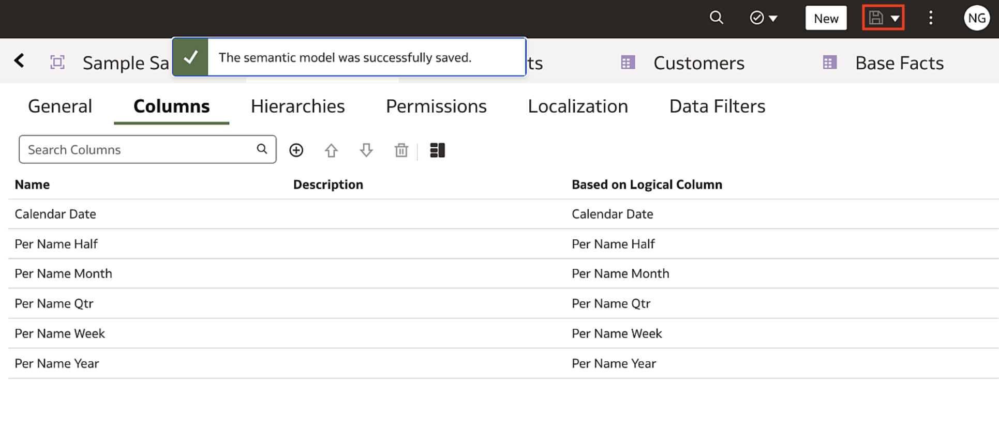

4. Double-click **Customers** in the **Sample Sales** subject area.

	

5. In the **Logical Layer**, expand **D3 Customers**. Hold down the **Ctrl (Command for Mac)** key, select **Cust Key** and **Name**, and then drag them to the **Columns** tab in the **Customers** table.

	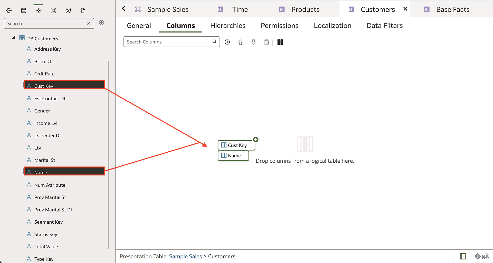

6. Click **Save**.

	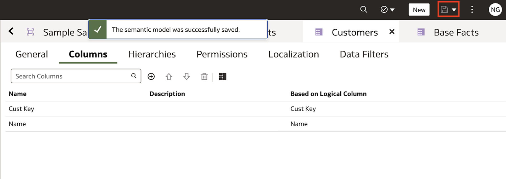

7. Double-click **Base Facts** in the **Sample Sales** subject area. In the **Logical Layer** icon, expand **F1 Revenue**. Hold down the **Ctrl (Command for Mac)** key, select **Revenue** and **Units**, and then drag them to the **Columns** tab.

	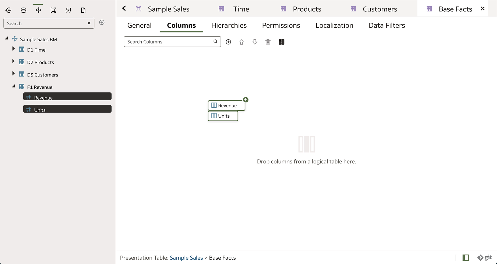

8. Click **Save**.

	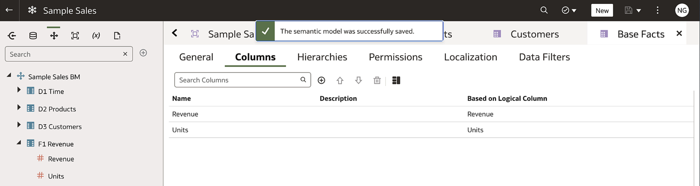

## Task 3: Modify Columns to the Presentation Tables

In this section, you change the names of some columns, remove columns, and reorder columns in the semantic model's presentation tables.

1. Click the **Products** tab. Hold down the **Ctrl (Command for Mac)** key, select the **Prod key**, **Attribute 1**, **Attribute 2**, and **Total Value** columns, and then click the **Delete** icon. Click **Yes** when prompted to delete the presentation columns.

	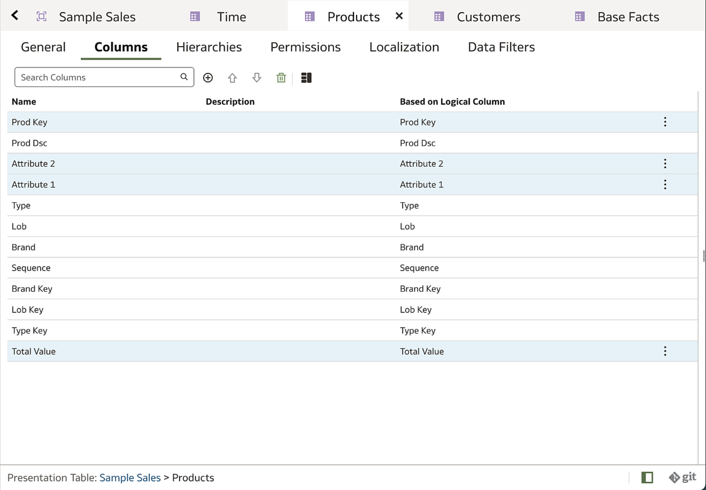

2. Double-click **Prod Dsc**. Enter **'Product'** in **Name**.

	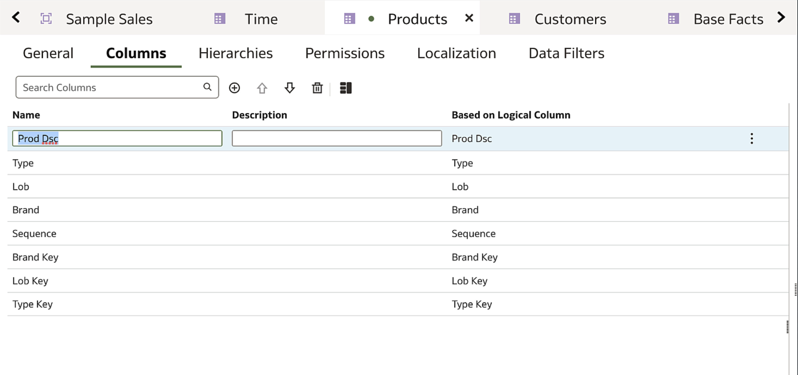

3. Double-click **Lob**. Enter **'Line of Business'** in **Name**.

	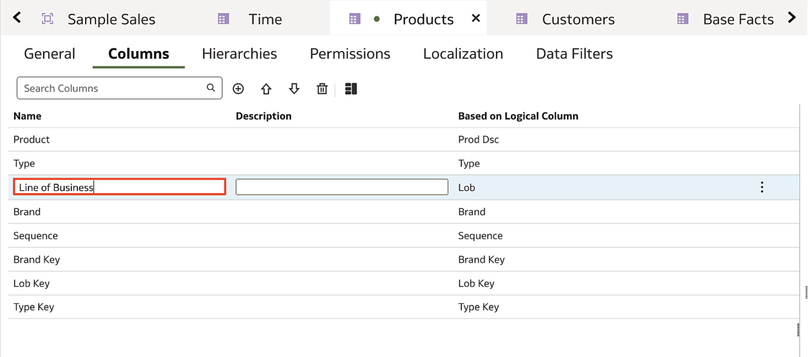

4. Click **Save**.

	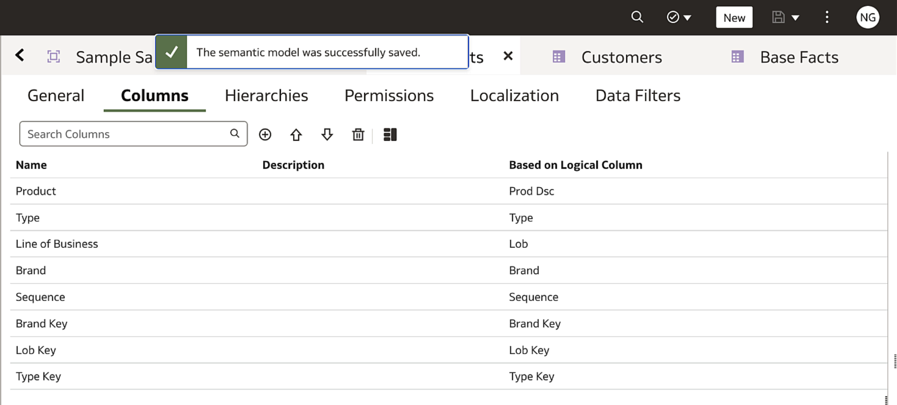

5. Select a column, and then click the **Move Up** arrow icon and **Move Down** arrow icon to arrange the Products columns in the following order:

	* Brand
	* Product
	* Type
	* Line of Business
	* Sequence
	* Brand key
	* Lob key
	* Type key

	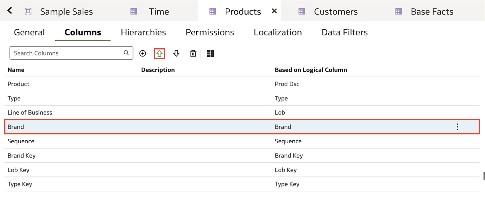

6. Click **Save** icon.

	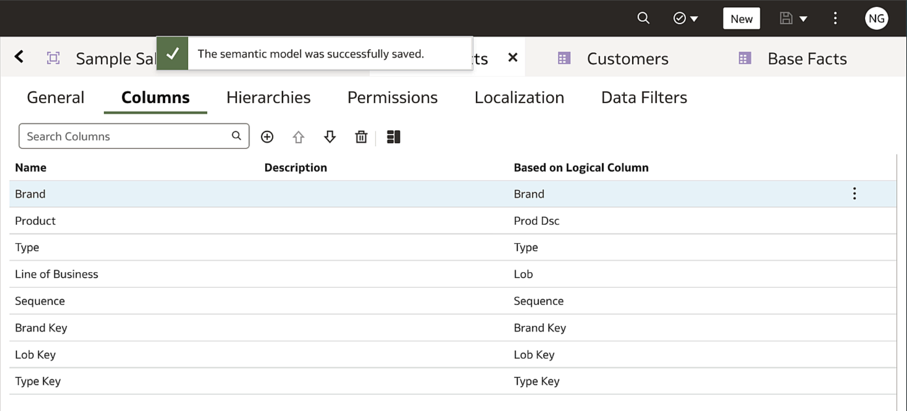

## Learn More
* [What is the Presentation Layer?](https://docs.oracle.com/en/cloud/paas/analytics-cloud/acmdg/what-is-presentation-layer.html)
* [About Creating Subject Areas](https://docs.oracle.com/en/cloud/paas/analytics-cloud/acmdg/work-subject-areas.html#GUID-BB34F6A4-6CC1-40B6-8EC1-E8B8E65D4F3C)
* [About Presentation Tables](https://docs.oracle.com/en/cloud/paas/analytics-cloud/acmdg/work-presentation-tables-and-columns.html#GUID-B5109E7A-314C-4DF5-BCDD-CD2374084AE9)

## Acknowledgements
* **Author** - Nagwang Gyamtso, Product Manager, Analytics Product Strategy
* **Contributors** - Pravin Janardanam, Gabrielle Prichard
* **Last Updated By/Date** - Nagwang Gyamtso, February, 2024
