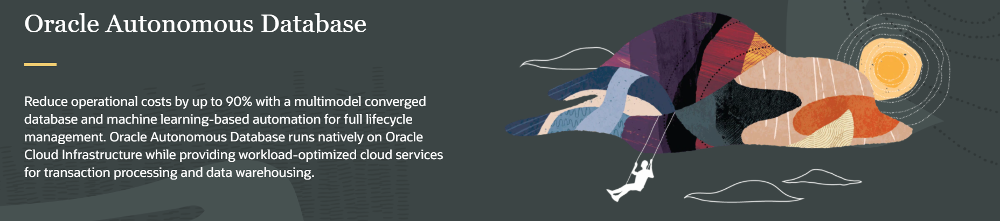
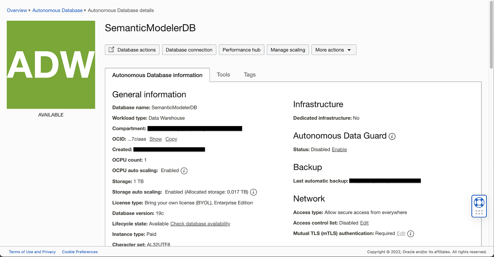
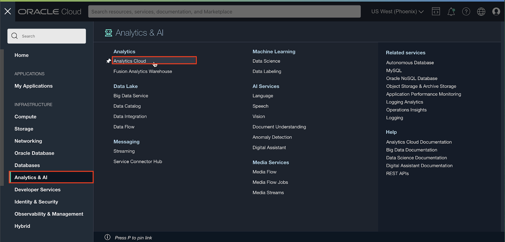
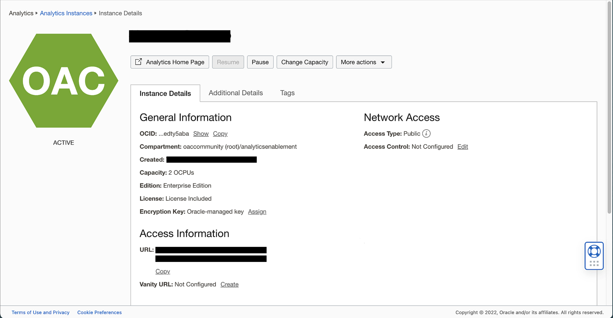

# Provision your Oracle Autonomous Data Warehouse Database (ADW) and Oracle Analytics Cloud (OAC) Instances

## Introduction

This lab walks you through the steps of creating an Autonomous Data Warehouse and an Oracle Analytics Cloud instance. You will provision a new database and an OAC instance in less than 10 minutes.

_Estimated Time:_ 15 minutes

### Objectives
- Create an Autonomous Database
- Create an Oracle Analytics Cloud instance

### Prerequisites

* An [_Oracle Cloud Free Tier Account_](https://www.oracle.com/cloud/free/) or a Paid account.  

  > **Note:** If you have a **Free Trial** account, when your Free Trial expires your account will be converted to an **Always Free** account. You will not be able to conduct Free Tier workshops unless the Always Free environment is available. **[Click here for the Free Tier FAQ page.](https://www.oracle.com/cloud/free/faq.html)**

## Task 1: Create a new Autonomous Data Warehouse Database

1. Click on the hamburger **menu (Navigator)** link at the upper left corner of the page and select **Autonomous Data Warehouse.**  
    

2. To create a new instance, click the blue **Create Autonomous Database** button.

    

3. Choose a compartment and enter <code> SemanticModelerDB </code> for the display name. Choose Data Warehouse for the workload type.

    >**Note:** Verify that a compartment is selected. By default, any OCI tenancy has a default root compartment, named after the tenancy itself. The tenancy administrator (default root compartment administrator) is any user who is a member of the default Administrators group. For the workshop purpose, you can use **root** or create your own **Compartment** under the **root** folder.

  

4. Under Configure the database, choose the following options:

  

    >**Note:** **Not recommended for this lab**, but you can select Always Free configuration to start enjoying your free Autonomous Database. With the Always Free option you will not be able to scale the database when needed.

  If you select 'Always Free Tier On', please click this [link](https://www.oracle.com/uk/cloud/free/#always-free).

5. Enter a password under **Create administration credentials**. Select Secure access from everywhere under **Choose network access**.

    >**Reminder:** Record your password in a safe location as this cannot be easily reset.

  

6. Under **Choose a license type**, select **License Type: License Included**. When you have completed the required fields, scroll down and click on the blue **Create Autonomous Database** button.  

  

6. A summary of your instance status is shown in the large box on the left. In this example, the color is amber and the status is **Provisioning.**  

  

7. After a short while, the status turns to **Available State** and the "ADW" box will change to green.
  

8. Once the Instance Status is **Available**, additional summary information about your instance is populated, including workload type and other details. The provisioning process should take **under 5 minutes**.

9. This page is known as the **Autonomous Database Details Page**. It provides you with status information about your database, and its configuration. Get **familiar** with the buttons and tabs on this page.  

  

You have just created an Autonomous Database with the latest features of Oracle Databases.

## Task 2: Create an Oracle Analytics Cloud (OAC) Instance

Return to the Oracle Cloud Infrastructure Console accessing from **Oracle Home Page** (oracle.com) and sign in into your cloud account.
Click in **View Account** and **Sign in to Cloud**.  

1. Go to **Home Console Page** and navigate to **Analytics & AI** section and then select **Analytics Cloud**.

    

2. Select **Create Instance**.

  

3. Enter the following options and click **Create**.
    * Instance name: Enter an instance name
    * Compartment: Choose a valid compartment in your tenancy
    * Capacity: OCPU
    * OCPU Count: 2
      > **Important:** 1 OCPU OAC instance is for Trials Only; you cannot scale up an 1 OCPU instance once needed, and the shape you choose comes with [Limits for Querying, Displaying, Exporting Data](https://docs.oracle.com/en/cloud/paas/analytics-cloud/acsom/create-services-oracle-analytics-cloud.html#GUID-164D8568-9AE3-4A74-9F1A-0D87B78713C9) => **DO NOT create an 1 OCPU instance for OAC Production environments**

    * License type: License Included
    * Edition: Enterprise Edition

  
  

4. The Analytics instance page will be displayed with a status of ***CREATING***.

    ***Reminder***: Provisioning an Oracle Analytics Cloud instance can take over **40 minutes**.

6. The Analytics instance page will be displayed with a status of ***ACTIVE***.  

    

You may now **proceed to the next lab**.

## **Acknowledgements**

* **Author** - Nagwang, Product Manager, Analytics Product Strategy
* **Contributors** -  Lucian Dinescu, Peter Monteiro
- **Reviewed by** -
- **Last Updated By/Date** - Nagwang Gyamtso, January, 2023
