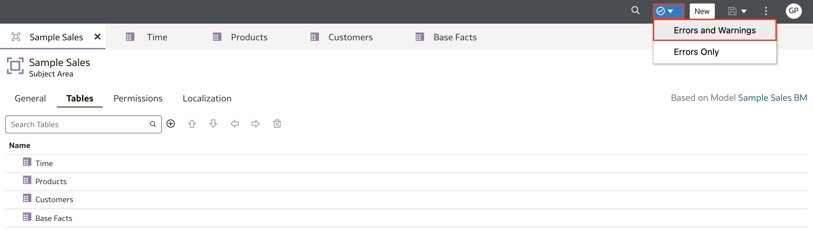
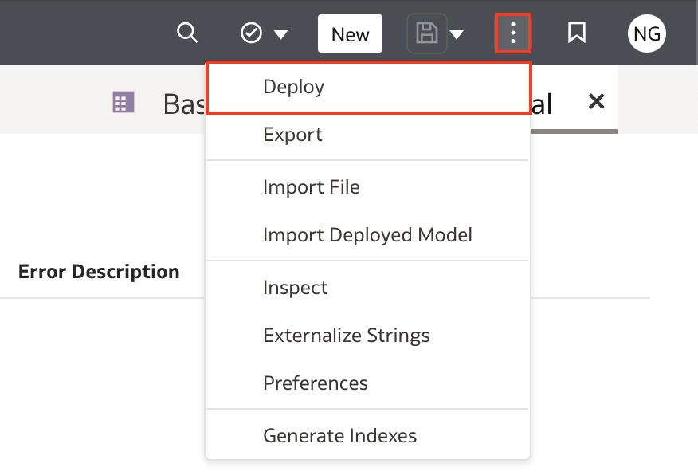
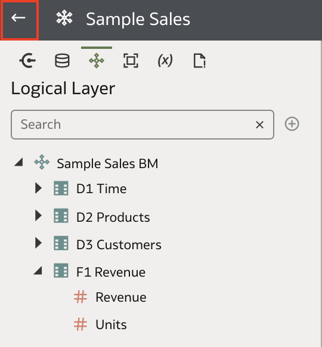
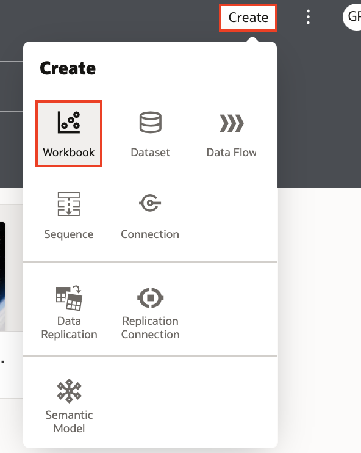
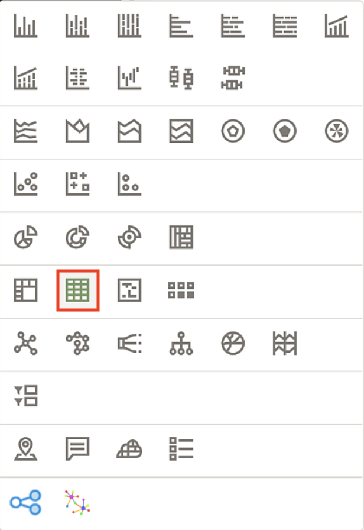

# Test, Deploy, and Validate a Semantic Model

## Introduction

In this lab, you run the consistency checker on the Sample Sales semantic model, deploy the semantic model, and validate the subject area by creating visualizations in Oracle Analytics Cloud.

Estimated Time: -- minutes

### Objectives

In this lab, you will:
* Run the consistency checker
* Deploy the Sample Sales semantic model
* Validate the subject area by creating visualizations in Oracle Analytics Cloud

### Prerequisites

This lab assumes you have:
* Access to Oracle Analytics Cloud
* Access to DV Content Author, BI Data Model Author, or a BI Service Administrator role
* Access to the Sample Sales Semantic Model
* All previous labs successfully completed

## Task 1: Run the Consistency Checker

Begin with step 3 if you're continuing this tutorial directly after completing the steps in Create the Presentation Layer tutorial.

1. If you closed your semantic model, sign in to Oracle Analytics Cloud using one of DV Content Author, BI Data Model Author or service administrator credentials. On the Home page, click the Navigator Navigator icon, and then click Semantic Models.

	

2. In the Semantic Models page, select Sample Sales, click Actions menu Actions menu icon, and then select Open.

	

3. Click Check Consistency Consistency Checker icon and select Errors and Warnings.

	

4. Oracle Analytics didn't find any errors in the Sample Sales semantic model.

	

## Task 2: Deploy the Semantic Modeler

1. In the semantic model, click the Page Menu Page Menu icon, and select Deploy. Click Deploy when asked to confirm.

	

2. The message, "Deploy successful" appears when the deployment process is complete.

	

3. Click Go back icon.

	

## Task 3: Validate the Semantic Model

1. Refresh your OAC metadata by signing out and signing back in. Sign out of your OAC instance by clicking the Page menu and selecting **Sign Out**.

	

2. Enter your Oracle Cloud credentials and click **Sign In**.

	

3. On the OAC homepage, click Create, and then click Workbook.

	

4. In Add Dataset, click Select Data, and select Subject Areas. In Subject Areas, click Sample Sales, and then click Add to Workbook.

	

5. In the Data pane, expand Time, Base Facts, and Products. Hold down the Ctrl key, select Per Name Year from Time, select Revenue from Base Facts, and select Type from Products. Right-click, select Pick Visualization.

	

6. Select the Table visualization type.

	

7. The data has been populated which means that the subject area is validated.

	

6. Click Save. In Save Workbook, enter Validate SM in Name, and then click Save.

	

You have just learned how to create a semantic model user the Semantic Modeler in Oracle Analytics Cloud!

## Learn More
* [Deploy a Semantic Model](https://docs.oracle.com/en/cloud/paas/analytics-cloud/acmdg/deploy-semantic-model.html)
* [Work with the Consistency Checker](https://docs.oracle.com/en/cloud/paas/analytics-cloud/acmdg/work-consistency-checker.html#GUID-DBBDF46F-2CB0-4EBD-BD98-0B75D9F0FD3E)

## Acknowledgements
* **Author** - Nagwang, Product Manager, Analytics Product Strategy
* **Contributors** -  Lucian Dinescu, Peter Monteiro
* **Last Updated By/Date** - <Name, Month Year>
