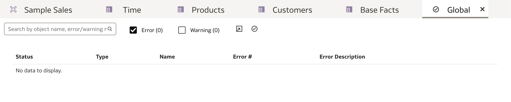

# Test, Deploy, and Validate a Semantic Model

## Introduction

In this lab, you run the consistency checker on the Sample Sales semantic model, deploy the semantic model, and validate the subject area by creating visualizations in Oracle Analytics Cloud.

Estimated Time: 15 minutes

### Objectives

In this lab, you will:
* Run the consistency checker
* Deploy the Sample Sales semantic model
* Validate the subject area by creating visualizations in Oracle Analytics Cloud

### Prerequisites

This lab assumes you have:
* Access to Oracle Analytics Cloud
* Access to DV Content Author, BI Data Model Author, or a BI Service Administrator role
* Access to the Sample Sales Semantic Model
* All previous labs successfully completed

## Task 1: Run the Consistency Checker

Begin with step 3 if you're continuing this tutorial directly after completing the steps in Create the Presentation Layer tutorial.

1. If you closed your semantic model, sign in to Oracle Analytics Cloud using one of DV Content Author, BI Data Model Author or Service Administrator credentials. On the **Home page**, click the **Navigator** icon, and then click **Semantic Models**.

	

2. In the **Semantic Models** page, select **Sample Sales**, click the **Actions menu** icon, and then select **Open**.

	

3. Click the **Check Consistency** icon and select **Include Warnings**.

	

4. Oracle Analytics didn't find any errors in the Sample Sales semantic model.

	

## Task 2: Deploy the Semantic Modeler

1. In the semantic model, click the **Page Menu** icon, and select **Deploy**. Click **Deploy** when asked to confirm.

	

2. The message, **"Deploy successful"** appears when the deployment process is complete.
	>**Note:** Deployment takes 2 to 3 minutes to complete.

	

3. Click the **Go back** icon.

	

## Task 3: Validate the Semantic Model

1. Refresh your OAC metadata by signing out and signing back in. Sign out of your OAC instance by clicking your **User** and selecting **Sign Out**.

	

2. Enter your Oracle Cloud credentials and click **Sign In**.

	

3. On the OAC homepage, click **Create**, and then click **Workbook**.

	

4. In **Add Dataset**, click **Select Data**, and select **Subject Areas**. In Subject Areas, click **Sample Sales**, and then click **Add to Workbook**.

	

5. In the **Data pane**, expand **Time**, **Base Facts**, and **Products**. Hold down the **Ctrl (Command for Mac) key**, select **Per Name Year** from Time, select **Revenue** from Base Facts, and select **Type** from Products. Right-click, select **Pick Visualization**.

	

6. Select the **Table visualization** type.

	

7. The data has been populated which means that the subject area is validated.

	

8. Click **Save**. In Save Workbook, enter <code>Validate SM</code> in **Name**, and then click **Save**.

	

## Task 4: (Optional) View the Logcal and Physical SQL Executions

1. Click on your user icon and select **Profile**.

	

2. Click the **Advanced** tab and toggle **Enable Developer Options**. Click **Save** and **Close** the profile settings window.

	

3. In your workbook, click the **workbook menu icon** and select **Developer**.

	

4. Click **Refresh** in the **Performance Tools** tab. This will show you the queries you've run and its performance metrics.

	

5. Click the **Execution Log** tab which is where you will see the SQL executions. The first query that was run is the Logical SQL. If you scroll down further, you will find the Physical SQL that was executed.

	
	

You have just learned how to create a semantic model user the Semantic Modeler in Oracle Analytics Cloud!

## Learn More
* [Deploy a Semantic Model](https://docs.oracle.com/en/cloud/paas/analytics-cloud/acmdg/deploy-semantic-model.html)
* [Work with the Consistency Checker](https://docs.oracle.com/en/cloud/paas/analytics-cloud/acmdg/work-consistency-checker.html#GUID-DBBDF46F-2CB0-4EBD-BD98-0B75D9F0FD3E)

## Acknowledgements
* **Author** - Nagwang Gyamtso, Product Manager, Analytics Product Strategy
* **Contributors** - Pravin Janardanam, Gabrielle Prichard
* **Last Updated By/Date** - Nagwang Gyamtso, February, 2024
