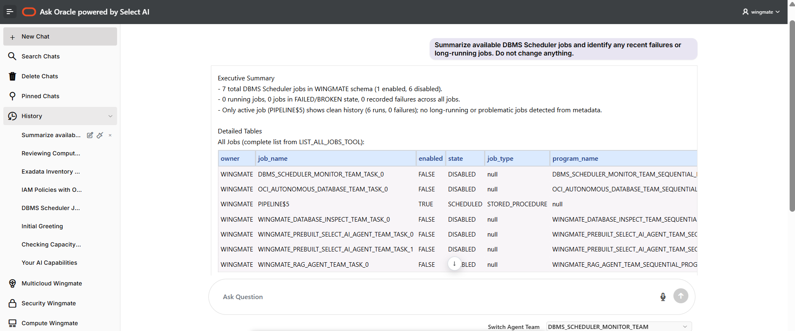
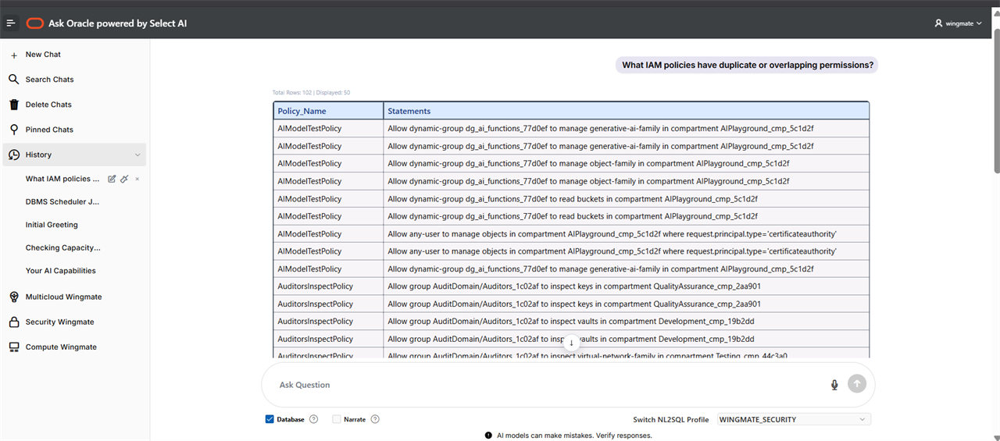
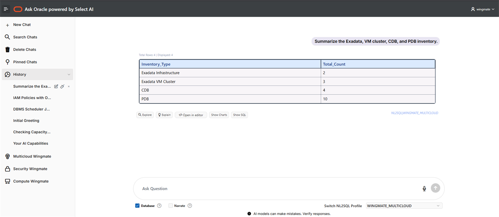
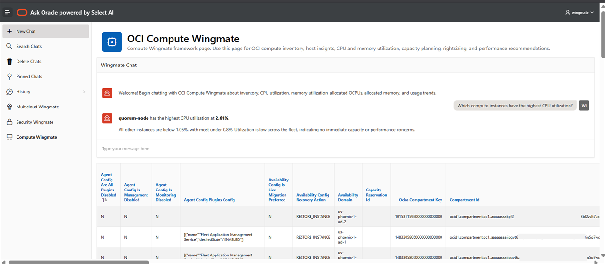
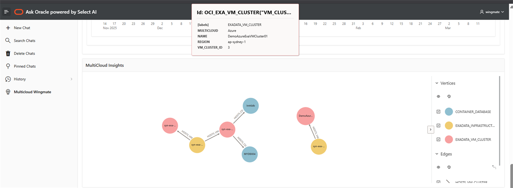

# Introduction

## About this Workshop

The scope of this workshop is to create an Oracle Cloud Infrastructure (OCI) Operations Wingmate that helps monitor security, compute, database, storage, networking, and multicloud operational signals for a tenancy. This workshop uses OCI Resource Analytics, the Resource Analytics-provisioned Oracle Autonomous AI Database, Oracle APEX, OCI Generative AI, Select AI, and APEX AI Configurations to build an agentic operations assistant.

[**Resource Analytics**](https://www.oracle.com/manageability/resource-analytics/) provides near real-time information to enhance visibility across IT infrastructure. In this workshop, Resource Analytics becomes the primary data foundation for the Wingmate application.

The workshop starts with Resource Analytics and a small Wingmate data bundle, then uses page imports to keep the APEX build focused. Lab 2 imports the base Ask Oracle chat application. Labs 3, 4, and 5 each import one Wingmate page into that existing application, then configure the assistant and supporting data for that domain.

The Ask Oracle home page demonstrates three AI patterns:

* **NL2SQL** profiles for asking natural-language questions over Resource Analytics, security, multicloud, and compute data.
* **Doc Research RAG** for documentation-grounded answers using a vector index and in-database embeddings.
* **AI Ops Agent Team** for natural-language Autonomous Database provisioning, scaling, and lifecycle requests.

The AI Ops Agent Team is different from a dashboard or a RAG chatbot. It uses Select AI Agent tools to reason over database operational context, inspect scheduler and database activity, and call Autonomous Database lifecycle operations. In the lab, you use natural language to ask whether a database should be provisioned or adjusted, and the Agent Team turns that request into the appropriate database operation.

The Security, Multicloud, and Compute Wingmate pages use inline APEX AI Assistants. Each page is connected to a reusable RAG AI Configuration so answers come from the SQL sources created in the lab instead of hidden page-item prompts.

The workshop is designed to help you build an app from multiple data sources:

* Resource Analytics tables and views for OCI inventory and operational context.
* Curated materialized views for APEX-ready access patterns.
* Synthetic flat files to support repeatable dashboard and assistant examples.
* OCI Monitoring metrics collected into Autonomous Database by the OCI Metrics Collector.
* Optional RESTful OCI API sources, such as Operations Insights endpoints.
* Optional ShowOCI exports after the data mapping is confirmed.

> **Note:** Wingmate is not an Oracle-branded product. In this workshop, Wingmate is the application pattern you build with Oracle APEX, OCI Resource Analytics, Oracle Database 26ai capabilities, and OCI Generative AI.

Using Ask Oracle Chat and Select AI to query tenancy information makes operations oversight easier.

Using the features of a converged database allows deeper insights into how resources depend on each other. For example, databases, compute resources, network components, and storage relationships can be explored through dashboard, assistant, chart, and graph-style views.

Visualize resources from an interactive experience.

> **NOTE:** Your tenancy must be subscribed to the **US Midwest (Chicago), US-Phoenix-1, or US-Ashburn-1** region in order to run this workshop. See the [OCI documentation](https://docs.oracle.com/en-us/iaas/Content/Identity/Tasks/managingregions.htm) for more details.

### What is Generative AI?

Generative AI enables users to quickly generate new content based on a variety of inputs. Inputs and outputs to these models can include text, images, sounds, animation, 3D models, and other types of data.

### What is Natural Language?

Natural language processing is the ability of a computer application to understand human language as it is spoken and written. It is a component of artificial intelligence (AI). This workshop uses natural language interactions to query and explain OCI operational data through Wingmate agents.

Estimated Workshop Time: 90 minutes

### Objectives

In this workshop, you will learn how to:

* Provision OCI Resource Analytics and prepare Wingmate data
* Build an Agentic Operations Wingmate with Oracle APEX, Select AI, and OCI Generative AI
* Import and configure Security, Multicloud, and Compute Wingmate pages in the Ask Oracle app
* Configure RAG-backed APEX AI Assistants for each Wingmate page
* Use OCI Metrics Collector data with Resource Analytics metadata for compute analysis

### Prerequisites

* An OCI cloud account
* Subscription to the US Midwest (Chicago), US-Ashburn-1, or US-Phoenix-1 region
* Permissions to configure Resource Analytics prerequisites and provision Resource Analytics
* Basic database and SQL knowledge
* Familiarity with Oracle Cloud Infrastructure (OCI)
* Familiarity with REST services is helpful for optional data-source tasks

You may now **proceed to the next lab**.

## Learn more

* [Oracle Autonomous Database Documentation](https://docs.oracle.com/en/cloud/paas/autonomous-data-warehouse-cloud/index.html)
* [Additional Autonomous Database Tutorials](https://docs.oracle.com/en/cloud/paas/autonomous-data-warehouse-cloud/tutorials.html)
* [Overview of Generative AI Service](https://docs.oracle.com/en-us/iaas/Content/generative-ai/overview.html)
* [Resource Analytics Product Page](https://www.oracle.com/manageability/resource-analytics/)
* [Resource Analytics Compute Data Model Reference](https://docs.oracle.com/en-us/iaas/Content/resource-analytics/reference-compute.htm)

## Acknowledgements

* **Authors:**
	* Nicholas Cusato - Cloud Architect
	* Royce Fu - Master Principal Cloud Architect
* **Last Updated by/Date** - Nicholas Cusato, June 2026
