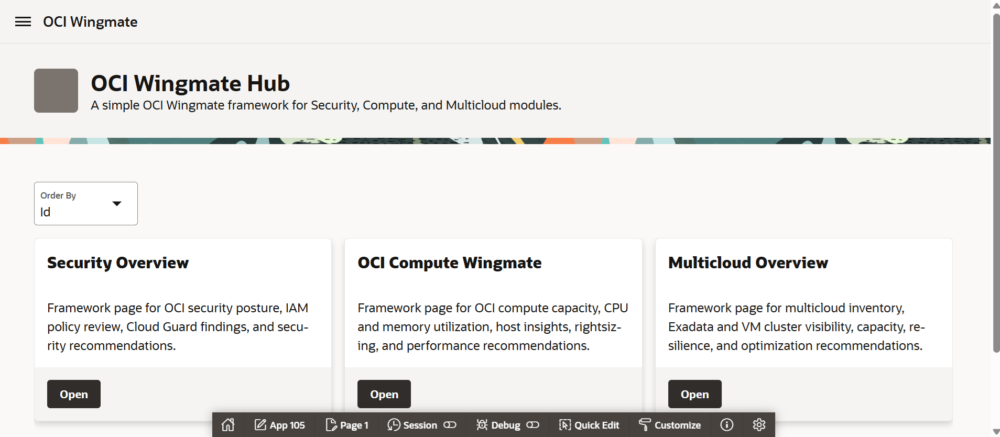

# Lab 2: Build an Agentic Operations Wingmate with Oracle APEX and OCI Generative AI

## Introduction

This lab walks you through creating the Wingmate APEX application on the Resource Analytics-provisioned Autonomous AI Database prepared in Lab 1. You will use the `WINGMATE` APEX workspace, generate OCI API keys, configure APEX Web Credentials, create an OCI Generative AI service object, and start the Wingmate application using Resource Analytics tables, views, and materialized views.

Estimated Time: 45 minutes

### Objectives

In this lab, you will:

* Generate API keys for OCI access
* Update APEX Web Credentials to connect to OCI resources
* Create the OCI Generative AI service object in APEX
* Import the Wingmate APEX framework application that provides the hub and lab landing pages

### Prerequisites

* Completed Lab 1
* `WINGMATE` database user created on the Resource Analytics-provisioned Autonomous AI Database
* `WINGMATE` APEX workspace and developer user created
* Resource Analytics materialized views created in Lab 1
* `wingmate_data.zip` downloaded and extracted from Lab 1, including `oci_wingmate_framework.sql`
* Subscription to US Midwest (Chicago), US East (Ashburn), or US West (Phoenix)

## Task 1: Generate API Keys

1. Navigate back to the OCI Console and click your profile icon on the upper-right side of the screen. Select **User Settings**.

	

2. On the menu in the center, select **Tokens and keys**.

	

3. Make sure **Generate API Key Pair** is selected. Download your private and public keys because you will need them later. After downloading, select **Add**.

4. Save the configuration file preview in a notepad. You will use the values to create APEX Web Credentials.

	

5. Keep these values available for the next task:

	* `user`: OCI User OCID
	* `fingerprint`: API public key fingerprint
	* `tenancy`: OCI Tenancy OCID
	* `region`: OCI region identifier
	* Downloaded private key file contents

## Task 2: Update the Credentials to Connect to OCI Resources

1. In APEX, click **App Builder**.

	

2. Click **Workspace Utilities**.

	

3. Click **Web Credentials**.

	

4. Click **Create** to create OCI API credentials.

	

5. Change **Authentication Type** to **OCI Native Authentication**.

6. Enter the Web Credential values from the API key configuration preview:

	* **Name:** `api_key`
	* **Static ID:** `api_key`
	* **OCI User ID:** Use the `user` OCID from the configuration preview.
	* **OCI Private Key:** Paste the full downloaded private key contents, including the `BEGIN PRIVATE KEY` and `END PRIVATE KEY` lines.
	* **OCI Tenancy ID:** Use the `tenancy` OCID from the configuration preview.
	* **OCI Public Key Fingerprint:** Use the `fingerprint` value from the configuration preview.
	* **Valid for URLs:** Leave this blank unless your APEX environment requires a value.

7. Select **Create**.

	

## Task 3: Create the OCI Generative AI Service Object

> **SME Gate:** Confirm the approved OCI Generative AI model, region, compartment requirements, service object defaults, and workshop-safe configuration values.

1. Navigate back to **Workspace Utilities** by selecting the first menu option on the breadcrumb bar.

	

2. Select **Generative AI** to navigate to service configuration.

	

3. Create a Generative AI service by selecting **Create**.

	

4. Configure the service:

	* **Name:** `OCI_GENAI`
	* **Web Credential:** `api_key`
	* **Compartment ID:** OCID look-up from OCI console
	* **Region:** Select from the options listed that is subscribed in tenancy
	* **Base URL:** Auto-generated Generative AI inference endpoint for your subscribed region
	* **Model:** Select **xai.grok-4.3**.

	> **Note:** `xai.grok-4.3` has a large context window that is well suited for Wingmate prompts that include Resource Analytics summaries, application page context, and supporting operational data. If `xai.grok-4.3` is not available in your subscribed region, select the closest tenancy-approved OCI Generative AI chat model.

	

5. Click **Create**.

## Task 4: Import the Wingmate APEX Framework Application

> **SME Gate:** Confirm the framework export file name, imported page IDs, navigation structure, page source objects, SQL queries, assistant prompt, page item names, context SQL, welcome message, prompt examples, and expected validation responses.

1. Navigate back to **App Builder**.

	

2. Select **Import**.

	

3. Drag and drop `f1000-public-small-v3.sql` from the extracted Lab 1 files. If you need the package again, download [Wingmate Data Zip](https://objectstorage.us-phoenix-1.oraclecloud.com/p/A8D93L0AYtatdLXkIXEH2OaQDtX_-AL8gnQ8CWHWYFV_6XUUGNw43bsZbU5oNx-e/n/oraclejamescalise/b/Wingmate-LL/o/wingmate_data.zip). Confirm **File Type** is set to **Application, Page or Component Export**, then select **Next**.

	

4. Review the import summary, then select **Next**.

5. On the install page, confirm the application settings:

	* **Parsing Schema:** `WINGMATE`
	* **Build Status:** `Run and Build Application`
	* **Install As Application:** `Auto Assign New Application ID`

	

6. Select **Install Application**.

7. After the import completes, open the imported **OCI Wingmate** application.

8. Confirm the framework includes these pages:

	* **OCI Wingmate Hub**
	* **Security Overview**
	* **OCI Compute Wingmate**
	* **Multicloud Overview**

	

You may now **proceed to the next lab**.

## Learn more

* [Creating Generative AI Service Objects in APEX](https://docs.oracle.com/en/database/oracle/apex/26.1/htmdb/creating-generative-ai-service-objects.html)
* [Manage User Access to Resource Analytics ADW](https://docs.oracle.com/en-us/iaas/Content/resource-analytics/manage-user-access-adw.htm)
* [Resource Analytics Compute Data Model Reference](https://docs.oracle.com/en-us/iaas/Content/resource-analytics/reference-compute.htm)

## Acknowledgements

* **Authors:**
	* Nicholas Cusato - Cloud Architect
	* Royce Fu - Master Principal Cloud Architect
* **Last Updated by/Date** - Royce Fu, May 2026
