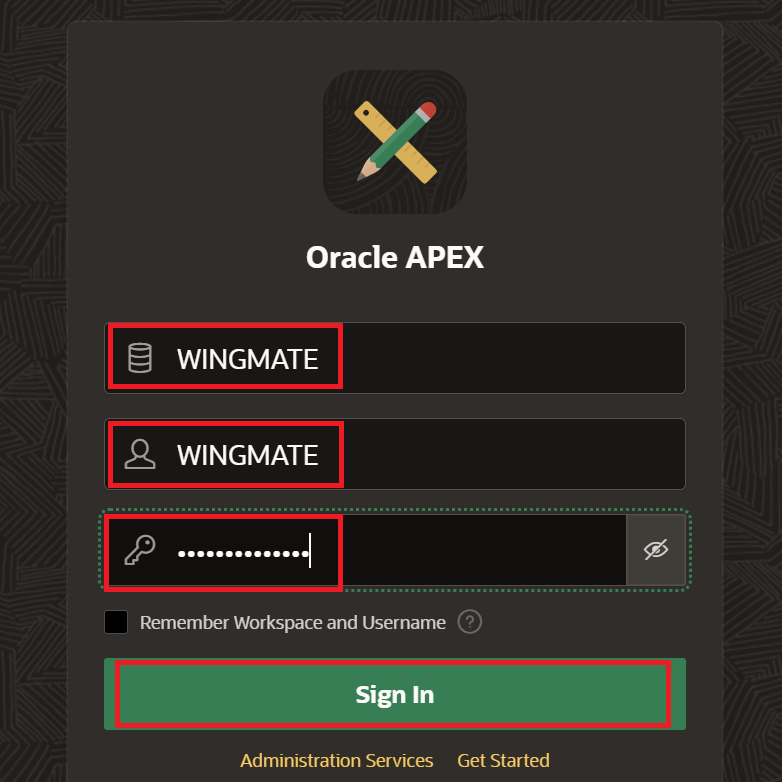
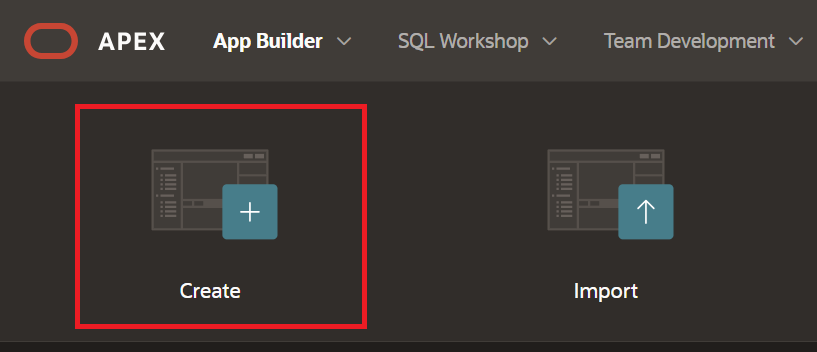

# Lab 2: Build an Agentic Operations Wingmate with Oracle APEX and OCI Generative AI

## Introduction

This lab walks you through creating the Wingmate APEX application on the Resource Analytics-provisioned Autonomous AI Database prepared in Lab 1. You will use the `WINGMATE` APEX workspace, generate OCI API keys, configure APEX Web Credentials, create an OCI Generative AI service object, and start the Wingmate application using Resource Analytics tables, views, and materialized views.

> **SME Review Gate:** The exact APEX page sources, report regions, assistant prompts, hidden items, and Resource Analytics materialized view mappings require SME confirmation. This lab provides the implementation flow and sample SQL source patterns for review.

Estimated Time: 45 minutes

### Objectives

In this lab, you will:

* Sign in to the `WINGMATE` APEX workspace on the Resource Analytics Autonomous AI Database
* Generate API keys for OCI access
* Update APEX Web Credentials to connect to OCI resources
* Create the OCI Generative AI service object in APEX
* Create the Wingmate APEX application using Resource Analytics data

### Prerequisites

* Completed Lab 1
* `WINGMATE` database user created on the Resource Analytics-provisioned Autonomous AI Database
* `WINGMATE` APEX workspace and developer user created
* Resource Analytics materialized view selection reviewed by SME
* Subscription to US Midwest (Chicago), US East (Ashburn), or US West (Phoenix)

## Task 1: Sign in to the Wingmate APEX Workspace

1. Open the Oracle APEX URL for the Resource Analytics-provisioned Autonomous AI Database.

	

2. Sign in using the workspace created in Lab 1:

	* **Workspace Name:** `WINGMATE`
	* **Workspace Username:** `WINGMATE`
	* **Workspace Password:** Use the password created in Lab 1.

	

3. Confirm that **App Builder**, **SQL Workshop**, and **Workspace Utilities** are available from the workspace home page.

## Task 2: Generate API Keys

1. Navigate back to the OCI Console and click your profile icon on the upper-right side of the screen. Select **User Settings**.

	

2. On the menu in the center, select **Tokens and keys**.

	

3. Make sure **Generate API Key Pair** is selected. Download your private and public keys because you will need them later. After downloading, select **Add**.

4. Save the configuration file preview in a notepad. You will use the values to create APEX Web Credentials.

	

## Task 3: Update the Credentials to Connect to OCI Resources

1. In APEX, click **App Builder**.

	

2. Click **Workspace Utilities**.

	

3. Click **Web Credentials**.

	

4. Click **Create** to create OCI API credentials.

	

5. Change **Authentication Type** to **OCI Native Authentication**.

6. Paste the values from the OCI configuration preview into the corresponding fields.

7. Use these credential values:

	* **Name:** `api_key`
	* **Static ID:** `api_key`

8. Under **Valid for URLs**, include the endpoint for the subscribed region that hosts OCI Generative AI.

	```text
	<copy>https://inference.generativeai.us-chicago-1.oci.oraclecloud.com</copy>
	```

	> **Note:** Replace the region if your OCI Generative AI service is hosted in another subscribed region.

9. Select **Create**.

	

## Task 4: Create the OCI Generative AI Service Object

1. Navigate back to **Workspace Utilities** by selecting the first menu option on the breadcrumb bar.

	

2. Select **Generative AI** to navigate to service configuration.

	

3. Create a Generative AI service by selecting **Create**.

	

4. Configure the service:

	* **Name:** `OCI_GENAI`
	* **Web Credential:** `api_key`
	* **Model:** Select the approved model available in your subscribed region.

5. Click **Create**.

	> **SME Review Gate:** Confirm the model choice, compartment requirements, region, and any approved workshop defaults before publishing.

## Task 5: Create the Wingmate APEX Application

1. Navigate back to **App Builder**.

	

2. Select **Create**.

	

3. Create a new application.

4. Name the application `WINGMATE` and click **Create Application**.

	

5. After the application is created, open **SQL Workshop** and validate that the application schema can read the Lab 1 materialized views.

	```sql
	<copy>
	SELECT mview_name
	FROM user_mviews
	WHERE mview_name LIKE 'MV\_%' ESCAPE '\'
	ORDER BY mview_name;
	</copy>
	```

6. Review the candidate source objects for the first Operations Wingmate pages.

	```sql
	<copy>
	SELECT table_name
	FROM user_tables
	WHERE table_name LIKE 'MV\_%' ESCAPE '\'
	   OR table_name LIKE 'CIS\_%' ESCAPE '\'
	ORDER BY table_name;
	</copy>
	```

7. Create an initial report page or dashboard page using SME-approved Resource Analytics objects.

	> **SME Review Gate:** Confirm the final page list and data sources. Candidate sources include curated `MV_` Resource Analytics materialized views and loaded synthetic `CIS_` tables. Do not publish executable page-source instructions until the final mappings are approved.

8. Use the following sample source-query patterns for SME review.

	```sql
	<copy>
	-- Candidate compute inventory source.
	SELECT *
	FROM MV_COMPUTE_INSTANCE_DIM_V;
	</copy>
	```

	```sql
	<copy>
	-- Candidate compartment context source.
	SELECT *
	FROM MV_COMPARTMENT_DIM_V;
	</copy>
	```

	```sql
	<copy>
	-- Candidate identity policy source from synthetic data.
	SELECT *
	FROM CIS_IAM_POLICIES;
	</copy>
	```

9. Add the Operations Wingmate assistant action only after the GenAI service object and page context items are confirmed.

	> **SME Review Gate:** Confirm the assistant prompt, page item names, context SQL, and whether the assistant should use only Resource Analytics data, synthetic data, or both.

## Task 6: Validate the APEX Foundation

1. Run the application.

2. Confirm the app opens without authentication or authorization errors.

3. Confirm the report or dashboard page can query the approved Resource Analytics materialized view.

4. Confirm the `OCI_GENAI` service object appears in the APEX Generative AI service list.

5. If a test AI assistant action has been added, confirm the action can call OCI Generative AI using the `api_key` Web Credential.

You may now **proceed to the next lab**.

## Learn more

* [Creating Generative AI Service Objects in APEX](https://docs.oracle.com/en/database/oracle/apex/26.1/htmdb/creating-generative-ai-service-objects.html)
* [Manage User Access to Resource Analytics ADW](https://docs.oracle.com/en-us/iaas/Content/resource-analytics/manage-user-access-adw.htm)
* [Resource Analytics Compute Data Model Reference](https://docs.oracle.com/en-us/iaas/Content/resource-analytics/reference-compute.htm)

## Acknowledgements

* **Authors:**
	* Nicholas Cusato - Cloud Architect
	* Royce Fu - Master Principal Cloud Architect
* **Last Updated by/Date** - Royce Fu, May 2026
