# Lab 2: Build an Agentic Operations Wingmate with Oracle APEX and OCI Generative AI

## Introduction

This lab builds the shared AI operations foundation for the Wingmate workshop. You will connect the `WINGMATE` APEX workspace and database schema to OCI Generative AI, run the setup scripts, and import the base Ask Oracle APEX application that later labs extend by importing single page exports into this same application.

The Ask Oracle home page exposes three different AI patterns:

* **NL2SQL:** `sql/wingmate-select-ai-profiles.sql` creates `WINGMATE_SECURITY`, `WINGMATE_MULTICLOUD`, and `WINGMATE_COMPUTE`. Learners use **Switch NL2SQL Profile** on the Ask Oracle home page to query Resource Analytics, multicloud database inventory, security data, and compute data.
* **RAG:** `sql/wingmate-doc-research-rag.sql` creates `WINGMATE_DOC_RESEARCH_RAG`. Learners use the RAG profile selector on the Ask Oracle home page to ask documentation-grounded questions from the vector index.
* **Agent Team:** `sql/wingmate-prebuilt-select-ai-agent-team.sql` creates `WINGMATE_PREBUILT_SELECT_AI_AGENT_TEAM` for OCI Autonomous Database provisioning and lifecycle actions. The same setup also creates `DBMS_SCHEDULER_MONITOR_TEAM` for read-only scheduler diagnostics.

Estimated Time: 20 minutes

### Objectives

In this lab, you will:

* Generate API keys for OCI access
* Update APEX Web Credentials to connect to OCI resources
* Create the OCI Generative AI service object in APEX
* Grant Select AI package access to the `WINGMATE` schema
* Run the bundled setup script for Security, Multicloud, and Compute Select AI profiles
* Create a separate Doc Research RAG service for documentation-grounded answers
* Create a pre-built Select AI Agent Team for Autonomous Database operations and DBMS Scheduler monitoring
* Import the prebuilt Ask Oracle APEX application that Labs 3 through 5 extend

### Prerequisites

* Completed Lab 1
* `WINGMATE` database user created on the Resource Analytics-provisioned Autonomous AI Database
* `WINGMATE` APEX workspace and developer user created
* Resource Analytics materialized views created in Lab 1
* `wingmate_data.zip` downloaded and extracted from Lab 1, including the `sql` and `apex-pages` folders
* `ADB-AskOracle-Chatbot-2026-03-04.sql` downloaded from the Ask Oracle sample repository
* Subscription to US Midwest (Chicago), US East (Ashburn), or US West (Phoenix)

## Task 1: Generate API Keys

1. Navigate back to the OCI Console and click your profile icon on the upper-right side of the screen. Select **User Settings**.

    

2. On the menu in the center, select **Tokens and keys**.

    

3. Make sure **Generate API Key Pair** is selected. Download your private and public keys because you will need them later. After downloading, select **Add**.

4. Save the configuration file preview in a notepad. You will use the values to create APEX Web Credentials and database credentials.

    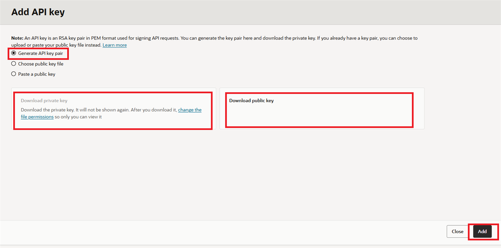

5. Keep these values available for the next tasks:

    * `user`: OCI User OCID
    * `fingerprint`: API public key fingerprint
    * `tenancy`: OCI Tenancy OCID
    * `region`: OCI region identifier
    * Downloaded private key file contents

## Task 2: Update the Credentials to Connect to OCI Resources

1. In APEX, click **App Builder**.

    

2. Click **Workspace Utilities**.

    

3. Click **Web Credentials**.

    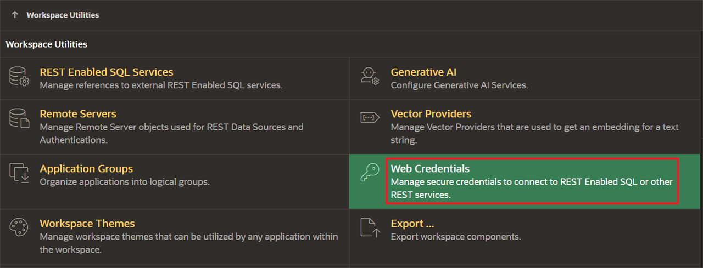

4. Click **Create** to create OCI API credentials.

    

5. Change **Authentication Type** to **OCI Native Authentication**.

6. Enter the Web Credential values from the API key configuration preview:

    * **Name:** `api_key`
    * **Static ID:** `api_key`
    * **OCI User ID:** Use the `user` OCID from the configuration preview.
    * **OCI Private Key:** Paste the full downloaded private key contents, including the `BEGIN PRIVATE KEY` and `END PRIVATE KEY` lines.
    * **OCI Tenancy ID:** Use the `tenancy` OCID from the configuration preview.
    * **OCI Public Key Fingerprint:** Use the `fingerprint` value from the configuration preview.
    * **Valid for URLs:** Leave this blank unless your APEX environment requires a value.

7. Select **Create**.

    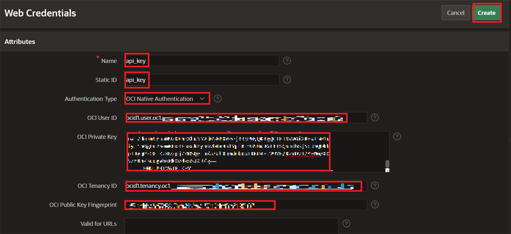

## Task 3: Create the OCI Generative AI Service Object

1. Navigate back to **Workspace Utilities** by selecting the first menu option on the breadcrumb bar.

    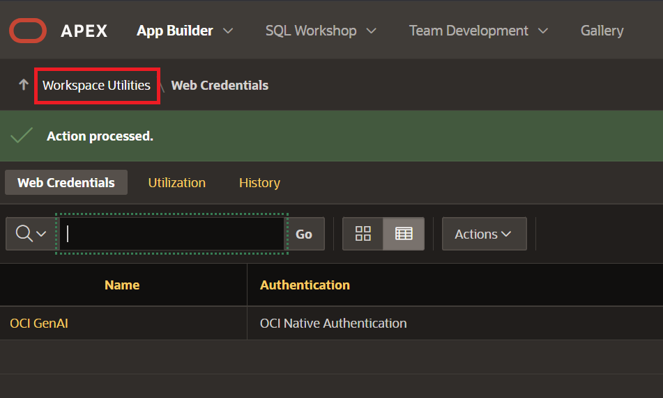

2. Select **Generative AI** to navigate to service configuration.

    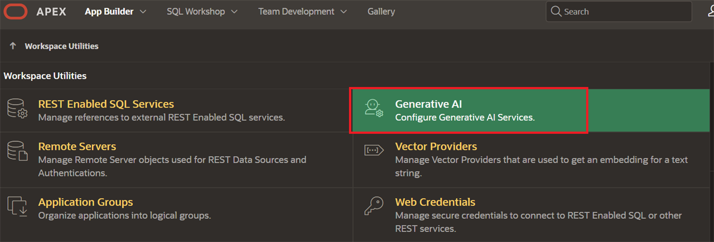

3. Create a Generative AI service by selecting **Create**.

    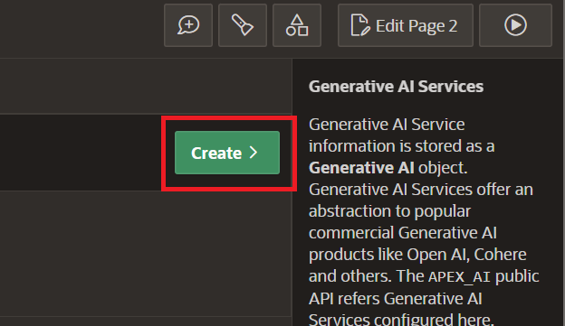

4. Configure the service:

    * **Name:** `OCI_GENAI`
    * **Web Credential:** `api_key`
    * **Compartment ID:** OCID look-up from OCI console
    * **Region:** Select from the options listed that is subscribed in tenancy
    * **Base URL:** Auto-generated Generative AI inference endpoint for your subscribed region
    * **Model:** Select **xai.grok-4.3**.

    > **Note:** `xai.grok-4.3` has a large context window that is well suited for Wingmate prompts that include Resource Analytics summaries, application page context, and supporting operational data. If `xai.grok-4.3` is not available in your subscribed region, select the closest tenancy-approved OCI Generative AI chat model.

    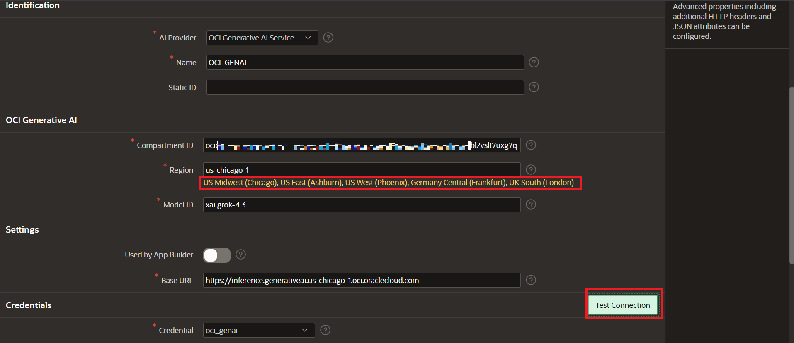

5. Click **Create**.

## Task 4: Grant Select AI Package Access to the WINGMATE Schema

Ask Oracle uses database-side PL/SQL packages that call Select AI. Stored PL/SQL requires direct package grants to the parsing schema.

1. Open **SQL Workshop**, then **SQL Commands**.

2. Connect as `ADMIN` and run these grants:

    ```sql
    <copy>
    GRANT EXECUTE ON DBMS_CLOUD TO WINGMATE;
    GRANT EXECUTE ON DBMS_CLOUD_AI TO WINGMATE;
    GRANT EXECUTE ON DBMS_CLOUD_PIPELINE TO WINGMATE;
    GRANT EXECUTE ON DBMS_CLOUD_AI_AGENT TO WINGMATE;
    GRANT EXECUTE ON DBMS_VECTOR TO WINGMATE;
    GRANT CREATE MINING MODEL TO WINGMATE;
    GRANT READ, WRITE ON DIRECTORY DATA_PUMP_DIR TO WINGMATE;
    </copy>
    ```

3. Connect as `WINGMATE` and confirm the required packages and model-loading privileges are visible to the lab schema.

    ```sql
    <copy>
    SELECT owner, object_name, object_type, status
    FROM all_objects
    WHERE object_name IN (
        'DBMS_CLOUD',
        'DBMS_CLOUD_AI',
        'DBMS_CLOUD_PIPELINE',
        'DBMS_CLOUD_AI_AGENT',
        'DBMS_VECTOR'
    )
    ORDER BY object_name, object_type;

    SELECT privilege
    FROM session_privs
    WHERE privilege = 'CREATE MINING MODEL';

    SELECT table_name, privilege
    FROM all_tab_privs
    WHERE table_name = 'DATA_PUMP_DIR'
      AND privilege IN ('READ', 'WRITE')
    ORDER BY privilege;
    </copy>
    ```

4. Confirm `DBMS_CLOUD`, `DBMS_CLOUD_AI`, `DBMS_CLOUD_PIPELINE`, and `DBMS_VECTOR` return `VALID`. Confirm `CREATE MINING MODEL` appears and `DATA_PUMP_DIR` shows `READ` and `WRITE`. If `DBMS_CLOUD_AI_AGENT` is unavailable in your Autonomous Database version, continue with the Select AI profile steps and skip the Agent Team task.

## Task 5: Run the Select AI Profile Setup Script

The Select AI setup script creates one database credential and three domain-specific profiles. The profiles keep each domain focused: Security uses IAM policy and tenancy context, Multicloud uses multicloud and host-insights context, and Compute uses Resource Analytics compute views plus optional host-insights objects.

1. In the extracted `wingmate_data` folder, open `sql/wingmate-select-ai-profiles.sql`.

    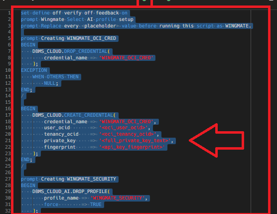

2. Replace the placeholder values in the script:

    * `<oci_user_ocid>`: OCI User OCID from the API key configuration preview.
    * `<oci_tenancy_ocid>`: OCI Tenancy OCID from the API key configuration preview.
    * `<full_private_key_text>`: Full downloaded private key contents, including the `BEGIN PRIVATE KEY` and `END PRIVATE KEY` lines.
    * `<api_key_fingerprint>`: API public key fingerprint.
    * `<genai_region>`: Subscribed OCI Generative AI region.
    * `<compartment_ocid>`: Compartment OCID used by OCI Generative AI.
    * `<oci_genai_chat_model_name_or_ocid>`: Approved chat model name or OCID.

3. In APEX navigate to **SQL Workshop > SQL Scripts**, connect as `WINGMATE` and upload/run the updated script.

    The script creates:

    * `WINGMATE_OCI_CRED`, used by Select AI to call OCI Generative AI.
    * `WINGMATE_SECURITY`, focused on IAM policy review and supporting tenancy context.
    * `WINGMATE_MULTICLOUD`, focused on Exadata, VM cluster, CDB, PDB, multicloud, and host-insights data.
    * `WINGMATE_COMPUTE`, focused on Resource Analytics compute inventory, volume relationships, and optional metrics or host-insights objects.

    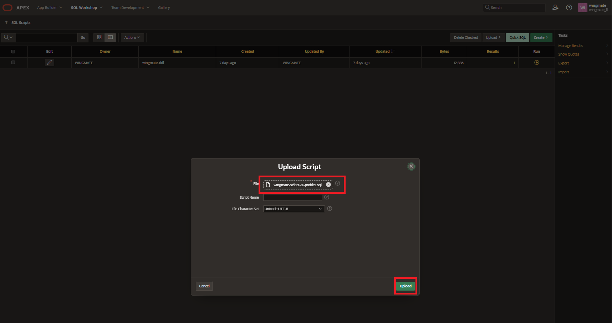

    > **Note:** Lab 1 creates `MV_` materialized views for every available `OCIRA.COMPUTE_%` view. If your Resource Analytics instance exposes additional compute materialized views, add them to `WINGMATE_COMPUTE` after the lab with `DBMS_CLOUD_AI.SET_ATTRIBUTES` or by recreating the profile with an expanded `object_list`. Lab 5 creates `OCI_COMPUTE_METRICS`; add that table to the profile after the metrics collector creates it.

4. Confirm the profiles are enabled in the `WINGMATE` schema.

    ```sql
    <copy>
    SELECT profile_name, status, description
    FROM user_cloud_ai_profiles
    WHERE profile_name IN (
        'WINGMATE_SECURITY',
        'WINGMATE_MULTICLOUD',
        'WINGMATE_COMPUTE'
    )
    ORDER BY profile_name;

    SELECT profile_name,
           attribute_name,
           DBMS_LOB.SUBSTR(attribute_value, 300, 1) AS attribute_value
    FROM user_cloud_ai_profile_attributes
    WHERE profile_name IN (
        'WINGMATE_SECURITY',
        'WINGMATE_MULTICLOUD',
        'WINGMATE_COMPUTE'
    )
    AND attribute_name = 'object_list'
    ORDER BY profile_name;
    </copy>
    ```

    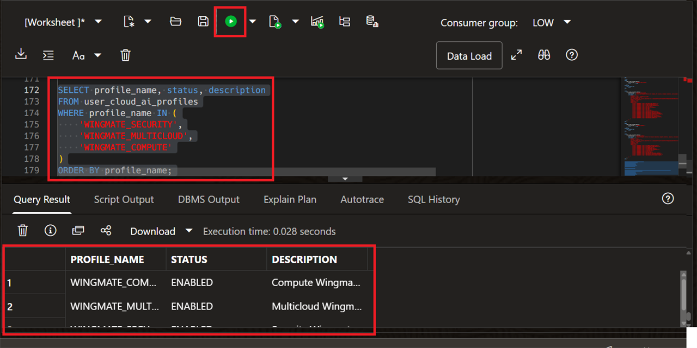

## Task 6: Create the Doc Research RAG Service

The Doc Research RAG script creates a separate `WINGMATE_DOC_RESEARCH_RAG` Select AI profile and vector index. It uses OCI Generative AI for chat responses and the in-database `ALL_MINILM_L12_V2` ONNX transformer for RAG embeddings, avoiding a separate OCI Generative AI embedding endpoint. This is the documentation-research use case in the Ask Oracle app.

1. Upload the documentation reference CSV from the extracted Lab 1 bundle to an Object Storage bucket. Use `wingmate_data/data/oci_doc_ref.csv`.

    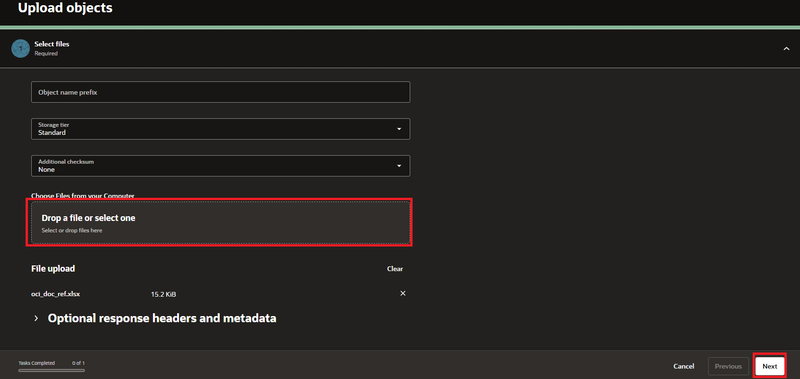

2. Create an Object Storage URI for the uploaded object or bucket prefix. Use the authenticated URI format, not a pre-authenticated request URL:

    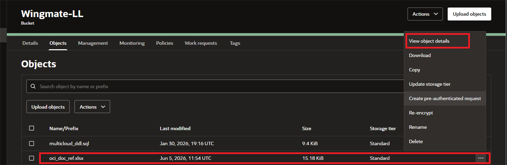

    ```text
    <copy>
    https://objectstorage.<object_storage_region>.oraclecloud.com/n/<namespace>/b/<bucket_name>/o/<object_name_or_prefix>
    </copy>
    ```

3. In the extracted `wingmate_data` folder, open `sql/wingmate-doc-research-rag.sql`.

4. Replace the placeholders:

    * `<genai_region>`: Subscribed OCI Generative AI region.
    * `<compartment_ocid>`: Compartment OCID used by OCI Generative AI.
    * `<oci_genai_chat_model_name_or_ocid>`: Approved chat model name or OCID (xai.grok-4.3).
    * `<object_storage_doc_uri>`: Object Storage URI copied in the previous step.

    > **Note:** The script uses `ALL_MINILM_L12_V2` with vector dimension `384`. If you choose a different imported ONNX embedding model, edit `c_db_embedding_model` and `c_embedding_vector_dimension` together in the script.

5. In **SQL Workshop > SQL Scripts**, connect as `WINGMATE` and run the script. The script creates `WINGMATE_DOC_RESEARCH_RAG`, `WINGMATE_DOC_RESEARCH_VECIDX`, and `WINGMATE_DOC_RESEARCH_VECTAB`.

    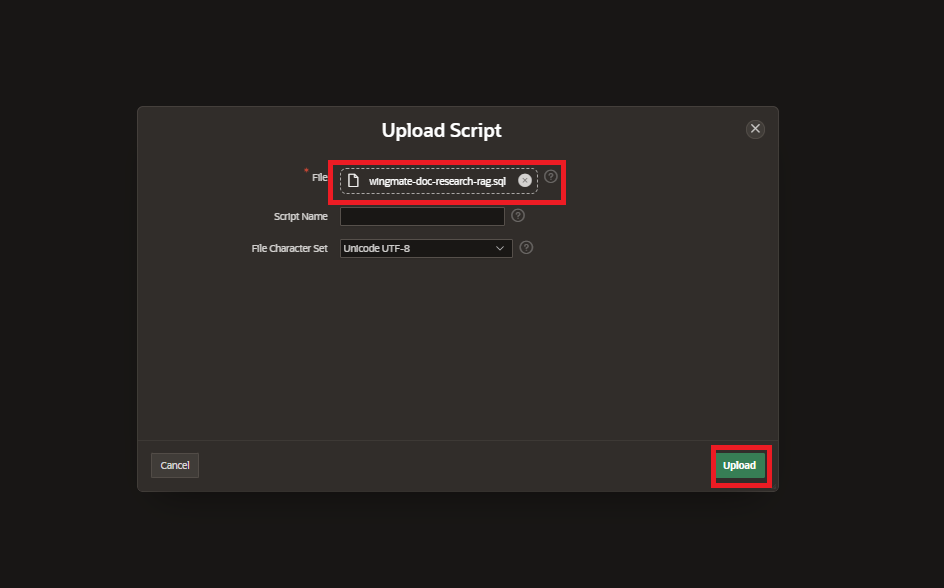

    > **Note:** If the script stops with a placeholder message, replace the named value and rerun the script. If SQL Workshop output still mentions `/actions/embedText`, upload and run the current script version; that endpoint belongs to the older OCI Generative AI embedding setup.

6. Confirm the RAG profile and vector index are ready. In **SQL Commands**, run each query one at a time. In **SQL Scripts**, you can run the full block.

    ```sql
    <copy>
    SELECT u.profile_name d,
           u.profile_name r
    FROM user_cloud_ai_profiles u
    LEFT JOIN user_cloud_ai_profile_attributes p
           ON p.profile_name = u.profile_name
          AND p.attribute_name = 'vector_index_name'
    WHERE u.profile_name NOT LIKE 'AGENT$%'
      AND p.profile_name IS NOT NULL
    ORDER BY u.profile_name;

    SELECT index_name, status
    FROM user_cloud_vector_indexes
    WHERE index_name = 'WINGMATE_DOC_RESEARCH_VECIDX';

    SELECT table_name
    FROM user_tables
    WHERE table_name = 'WINGMATE_DOC_RESEARCH_VECTAB';

    SELECT COUNT(*) AS indexed_chunks
    FROM WINGMATE_DOC_RESEARCH_VECTAB;
    </copy>
    ```

    > **Note:** If the vector table is empty, confirm that the Object Storage URI and `WINGMATE_OCI_CRED` credential can read the uploaded file.

7. Use the RAG profile to ask a documentation question.

    ```sql
    <copy>
    SELECT DBMS_CLOUD_AI.GENERATE(
        prompt       => 'Which OCI Compute documentation should I review for capacity planning?',
        profile_name => 'WINGMATE_DOC_RESEARCH_RAG',
        action       => 'chat'
    ) AS answer
    FROM dual;
    </copy>
    ```
    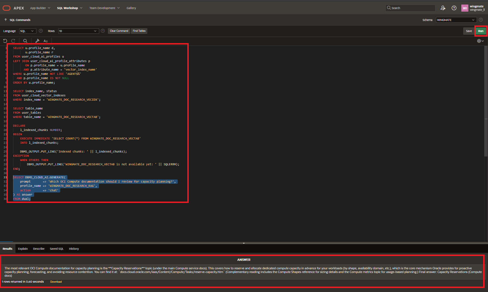

    > **Troubleshooting:** `ORA-20001: Unable to load in-database embedding model` means the model import failed. Confirm Task 4 granted `EXECUTE` on `DBMS_VECTOR`, `CREATE MINING MODEL`, and `READ`/`WRITE` on `DATA_PUMP_DIR`. If you also see `WINGMATE_DOC_RESEARCH_VECTAB does not exist`, fix the vector index error first; that table is created only after the vector index is created.

## Task 7: Create the Pre-built Select AI Agent Team

This task installs Oracle pre-built Select AI Agent tool layers and creates the Wingmate AI Ops Agent Team based on the practical Select AI Agent pattern. This is separate from the NL2SQL profiles and the Doc Research RAG profile.

The primary team, `WINGMATE_PREBUILT_SELECT_AI_AGENT_TEAM`, uses the **OCI Autonomous Database AI Agent and Tools** to provision, list, start, stop, restart, scale, update, and inspect Autonomous Database resources. The script also creates the standalone `DBMS_SCHEDULER_MONITOR_TEAM`, which monitors local `USER_SCHEDULER_*` jobs, job history, failures, runtime, CPU/load correlation, and scheduler health.

The setup creates the shared `WINGMATE_PREBUILT_AGENT_PROFILE`, the standalone `OCI_AUTONOMOUS_DATABASE_TEAM`, the standalone `DBMS_SCHEDULER_MONITOR_TEAM`, and the primary `WINGMATE_PREBUILT_SELECT_AI_AGENT_TEAM`.

1. Confirm Task 5 completed. The pre-built team uses `WINGMATE_OCI_CRED` for OCI API calls and the configured chat model for agent reasoning.

2. If you plan to test live Autonomous Database operations, confirm that the principal behind `WINGMATE_OCI_CRED` can manage Autonomous Databases in the target compartment.

    ```text
    <copy>
    Allow group <group-name> to manage autonomous-database-family in compartment <compartment-name>
    </copy>
    ```

    > **Note:** You can complete this lab task without changing OCI resources. Live operations require the IAM policy and explicit human confirmation.

3. Sign in to SQL Developer Web as `ADMIN`.

4. Open SQL Worksheet and run the two vendored Oracle sample tool scripts individually, in this order:

    * `sql/prebuilt-select-ai-agents/oci_autonomous_database_tools.sql`
    * `sql/prebuilt-select-ai-agents/dbms_scheduler_monitor_tools.sql`

    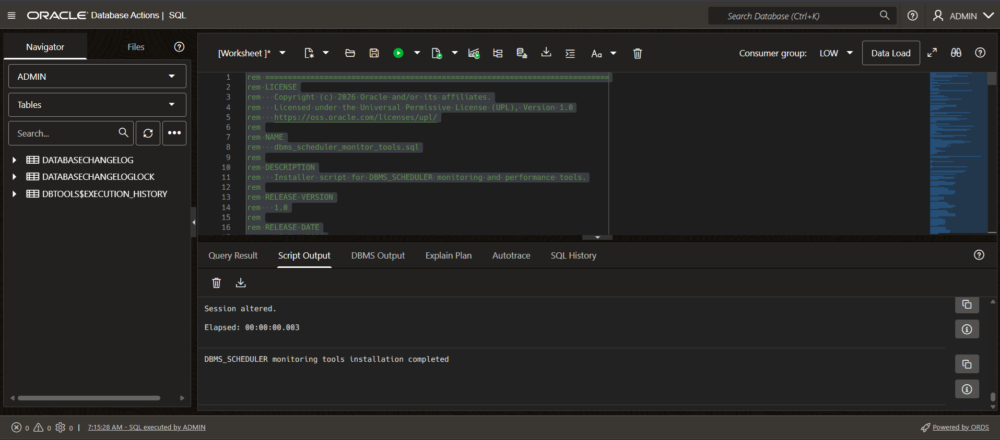

    Use the Run Script option for each full file. When prompted, provide:

    ```text
    <copy>
    SCHEMA_NAME = WINGMATE
    CONFIG_JSON = {"credential_name":"WINGMATE_OCI_CRED","use_resource_principal":false}
    </copy>
    ```

    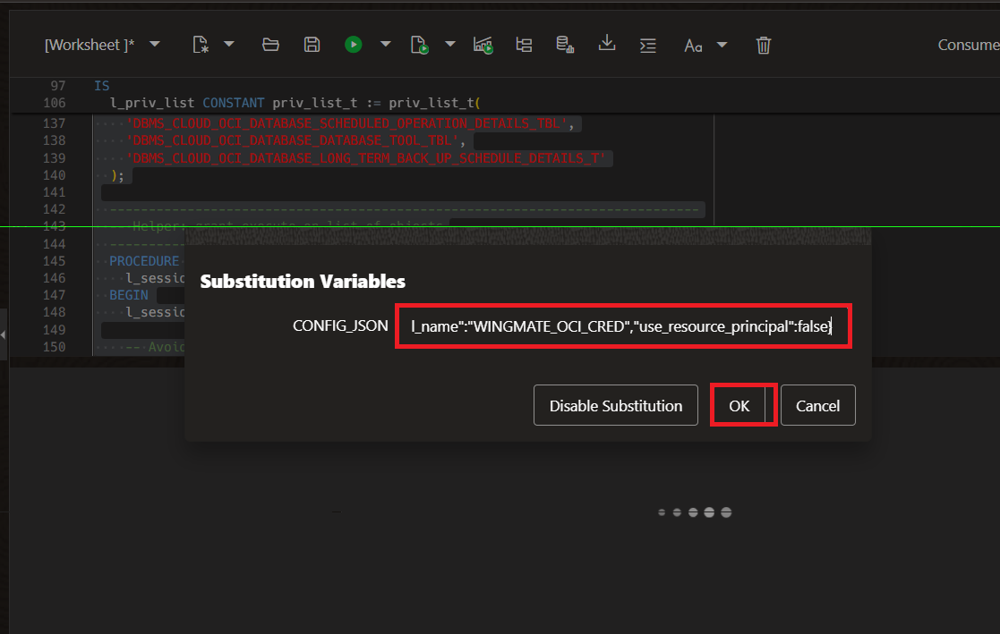

    `CONFIG_JSON` is required only by `oci_autonomous_database_tools.sql`. Optionally add `"compartment_ocid":"<target_compartment_ocid>"` if you want the OCI Autonomous Database tools to persist a default compartment.

    > **Note:** The helper file `sql/wingmate-prebuilt-select-ai-agent-tools.sql` is a SQLcl/SQL*Plus convenience wrapper that uses `@@` relative includes. For SQL Developer Web, run the two tool scripts directly as shown above.

5. Sign out of the `ADMIN` SQL Developer Web session and sign back in as `WINGMATE`.

    > **Important:** Do not run the team creation script as `ADMIN`. `ADMIN` installs the reusable tool layer, but the Agent Team, profile, agents, and tasks must be owned by the `WINGMATE` schema used by the Ask Oracle application.

6. Open `sql/wingmate-prebuilt-select-ai-agent-team.sql`.

7. Replace the placeholders:

    * `<genai_region>`: Subscribed OCI Generative AI region.
    * `<compartment_ocid>`: Compartment OCID used by OCI Generative AI.
    * `<oci_genai_chat_model_name_or_ocid>`: Approved chat model name or OCID (xai.grok-4.3).

8. Run the script with the Run Script option. The script creates:

    * `WINGMATE_PREBUILT_AGENT_PROFILE`
    * `OCI_AUTONOMOUS_DATABASE_ADVISOR`, `OCI_AUTONOMOUS_DATABASE_TASKS`, and `OCI_AUTONOMOUS_DATABASE_TEAM`
    * `SCHEDULER_MONITOR_ADVISOR`, `SCHEDULER_MONITOR_TASKS`, and `DBMS_SCHEDULER_MONITOR_TEAM`
    * `WINGMATE_PREBUILT_SELECT_AI_AGENT_TEAM`

    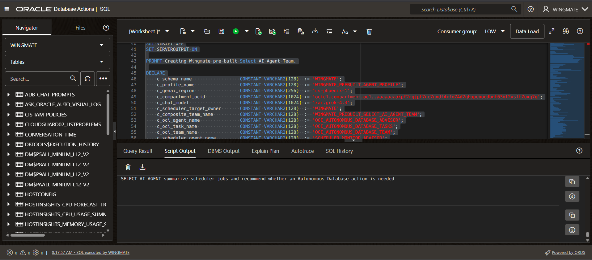

9. Confirm the profile, agents, and composite team are available.

    ```sql
    <copy>
    DECLARE
        l_count NUMBER;
    BEGIN
        SELECT COUNT(*)
        INTO l_count
        FROM user_cloud_ai_profiles
        WHERE profile_name = 'WINGMATE_PREBUILT_AGENT_PROFILE';

        DBMS_OUTPUT.PUT_LINE('Profile found: ' || l_count);

        SELECT COUNT(*)
        INTO l_count
        FROM user_ai_agents
        WHERE agent_name IN (
            'OCI_AUTONOMOUS_DATABASE_ADVISOR',
            'SCHEDULER_MONITOR_ADVISOR'
        );

        DBMS_OUTPUT.PUT_LINE('Expected agents found: ' || l_count || ' of 2');

        DBMS_CLOUD_AI_AGENT.SET_TEAM(
            team_name => 'WINGMATE_PREBUILT_SELECT_AI_AGENT_TEAM'
        );

        DBMS_OUTPUT.PUT_LINE('Primary Wingmate AI Ops team can be selected in this session.');
    END;
    /
    </copy>
    ```

    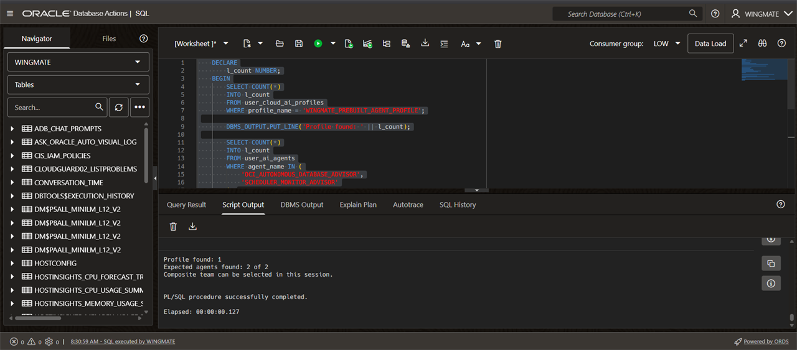

## Task 8: Import the Ask Oracle APEX Application

1. Navigate back to **App Builder**.

    

2. Select **Import**.

    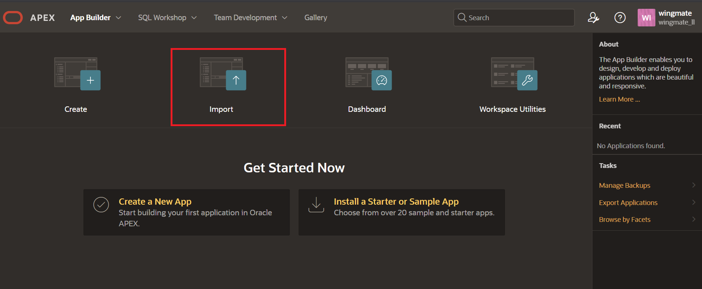

3. Download the Ask Oracle application export from the Oracle sample repository:

    [ADB-AskOracle-Chatbot-2026-03-04.sql](https://github.com/oracle-devrel/oracle-autonomous-database-samples/blob/main/apex/Ask-Oracle/ADB-AskOracle-Chatbot-2026-03-04.sql)

4. Drag and drop `ADB-AskOracle-Chatbot-2026-03-04.sql`. Confirm **File Type** is set to **Application, Page or Component Export**, then select **Next**.

    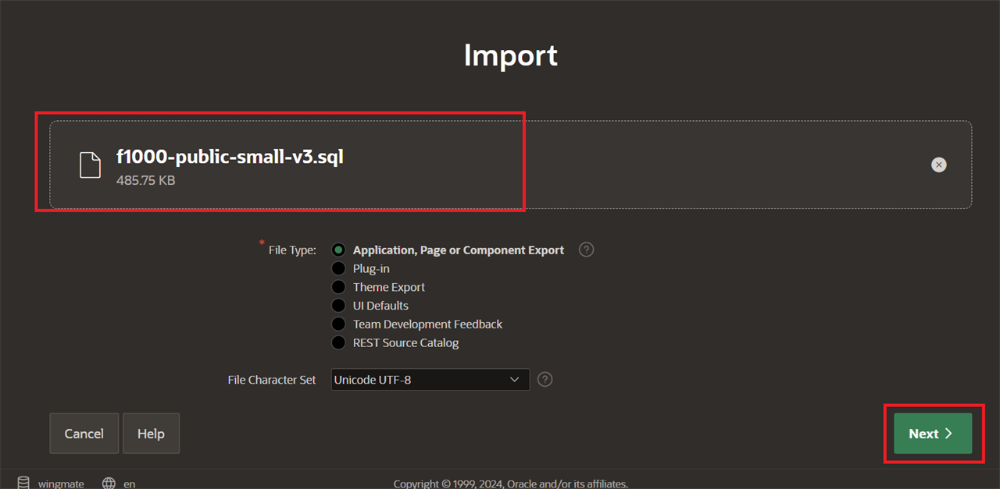

5. Review the import summary, then select **Next**.

6. On the install page, confirm the application settings:

    * **Parsing Schema:** `WINGMATE`
    * **Build Status:** `Run and Build Application`
    * **Install As Application:** `Auto Assign New Application ID`

    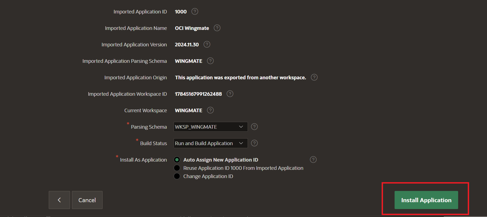

7. Select **Install Application**.

8. If APEX prompts you to install supporting objects, select **Install Supporting Objects** and complete the supporting object wizard.

9. After the import completes, open the imported **Ask Oracle** application.

    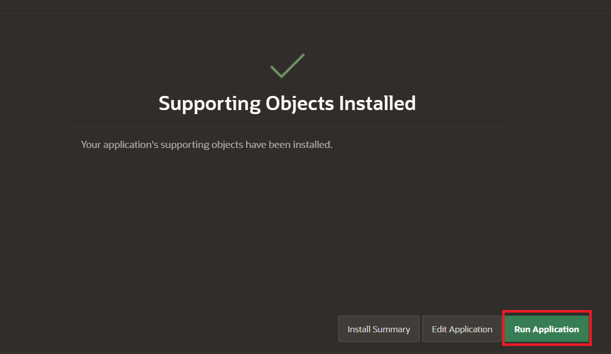

10. Confirm the application opens and shows the Ask Oracle chat interface.

    > **Note:** This application is the target app for later labs. Keep track of the application name and ID assigned by APEX; Labs 3, 4, and 5 import one additional page into this same application. When importing those pages, always select this existing application as the target rather than installing a new application.

## Task 9: Validate Ask Oracle Profiles, Doc Research RAG, and Pre-built Agent Team

1. Run the Ask Oracle application.

2. Use the Ask Oracle home page selectors to validate each AI pattern. Start with **Switch NL2SQL Profile**.

    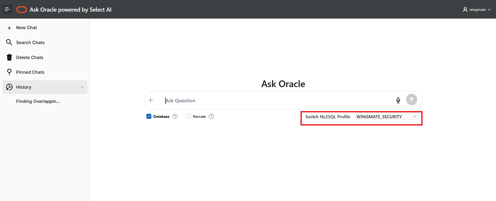

3. Confirm the profile list includes:

    * `WINGMATE_SECURITY`
    * `WINGMATE_MULTICLOUD`
    * `WINGMATE_COMPUTE`

4. Select `WINGMATE_SECURITY` and ask:

    ```text
    <copy>
    What IAM policies have duplicate or overlapping permissions?
    </copy>
    ```

5. Select `WINGMATE_COMPUTE` and ask:

    ```text
    <copy>
    Which compute instances or compartments should I review for capacity or utilization?
    </copy>
    ```

6. Select `WINGMATE_MULTICLOUD` and ask:

    ```text
    <copy>
    Summarize the Exadata, VM cluster, CDB, and PDB inventory.
    </copy>
    ```

    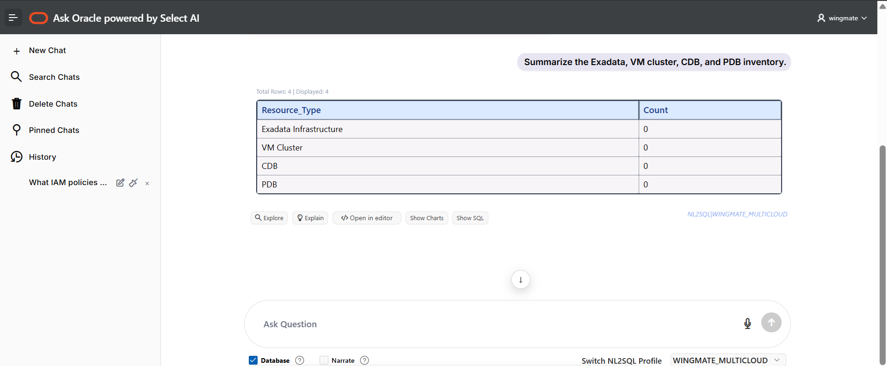

7. Open the RAG profile selector and confirm the profile list includes `WINGMATE_DOC_RESEARCH_RAG`.

8. Select `WINGMATE_DOC_RESEARCH_RAG` and ask:

    ```text
    <copy>
    Which OCI Compute documentation should I review for capacity planning, and what are the key features?
    </copy>
    ```

9. Ask a second RAG question:

    ```text
    <copy>
    Summarize the OCI documentation references for Compute operations and include any documentation URLs you used.
    </copy>
    ```

10. Open the Agent Team selector and confirm the team list includes `WINGMATE_PREBUILT_SELECT_AI_AGENT_TEAM`.

    You may also see the two standalone teams created by the script:

    * `OCI_AUTONOMOUS_DATABASE_TEAM`
    * `DBMS_SCHEDULER_MONITOR_TEAM`

11. To test scheduler monitoring, select `DBMS_SCHEDULER_MONITOR_TEAM` and ask for a read-only monitoring summary:

    ```text
    <copy>
    Summarize available DBMS Scheduler jobs and identify any recent failures or long-running jobs. Do not change anything.
    </copy>
    ```

    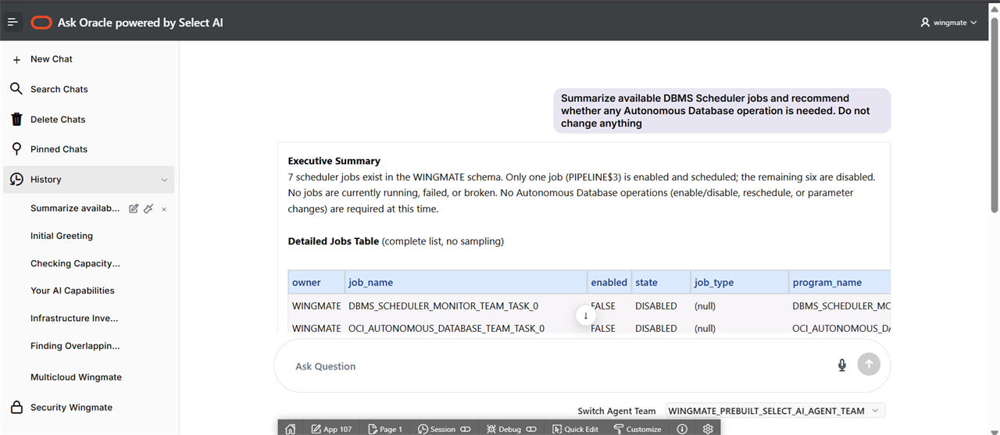

12. Select `WINGMATE_PREBUILT_SELECT_AI_AGENT_TEAM` and ask the Agent Team to prepare an Autonomous Database workflow without executing it:

    ```text
    <copy>
    Help me provision a small OLTP Autonomous Database named WINGLAB01 in <adb_region>. Ask for any missing inputs and do not execute without explicit confirmation.
    </copy>
    ```

    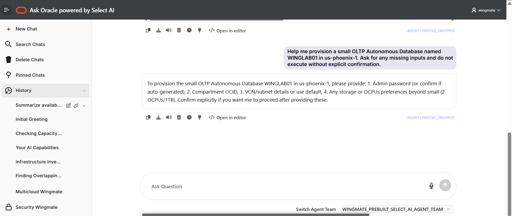

    > **Note:** Stop at the confirmation step unless you intentionally want to test live operations and have the required IAM policy and temporary ADB admin password.

13. If the NL2SQL profile dropdown is empty, confirm the profiles exist in `USER_CLOUD_AI_PROFILES` while connected as `WINGMATE`.

14. If the RAG profile dropdown is empty, confirm the RAG profile appears in the application list of values.

    ```sql
    <copy>
    SELECT u.profile_name d,
           u.profile_name r
    FROM user_cloud_ai_profiles u
    LEFT JOIN user_cloud_ai_profile_attributes p
           ON p.profile_name = u.profile_name
          AND p.attribute_name = 'vector_index_name'
    WHERE u.profile_name NOT LIKE 'AGENT$%'
      AND p.profile_name IS NOT NULL
    ORDER BY u.profile_name;
    </copy>
    ```

15. If the Agent Team dropdown is empty, rerun the validation block from Task 7 and confirm the output says `Primary Wingmate AI Ops team can be selected in this session`.

    ```sql
    <copy>
    EXEC DBMS_CLOUD_AI_AGENT.SET_TEAM(team_name => 'WINGMATE_PREBUILT_SELECT_AI_AGENT_TEAM');
    </copy>
    ```

You may now **proceed to the next lab**.

## Learn more

* [Creating Generative AI Service Objects in APEX](https://docs.oracle.com/en/database/oracle/apex/26.1/htmdb/creating-generative-ai-service-objects.html)
* [Ask Oracle APEX Sample App](https://github.com/oracle-devrel/oracle-autonomous-database-samples/blob/main/apex/Ask-Oracle/ADB-AskOracle-Chatbot-2026-03-04.sql)
* [DBMS_CLOUD_AI Package](https://docs.oracle.com/en/cloud/paas/autonomous-database/adbsa/dbms-cloud-ai-package.html)
* [DBMS_CLOUD_AI_AGENT Package](https://docs.oracle.com/en/cloud/paas/autonomous-database/serverless/adbsb/dbms-cloud-ai-agent-package.html)
* [Build your agentic solution using Oracle ADB Select AI Agent](https://blogs.oracle.com/machinelearning/build-your-agentic-solution-using-oracle-adb-select-ai-agent)
* [Oracle pre-built Select AI Agent samples](https://github.com/oracle-devrel/oracle-autonomous-database-samples/tree/main/autonomous-ai-agents)
* [Manage User Access to Resource Analytics ADW](https://docs.oracle.com/en-us/iaas/Content/resource-analytics/manage-user-access-adw.htm)
* [Resource Analytics Compute Data Model Reference](https://docs.oracle.com/en-us/iaas/Content/resource-analytics/reference-compute.htm)

## Acknowledgements

* **Authors:**
    * Nicholas Cusato - Cloud Architect
    * Royce Fu - Master Principal Cloud Architect
* **Last Updated by/Date** - Nicholas Cusato, June 2026
