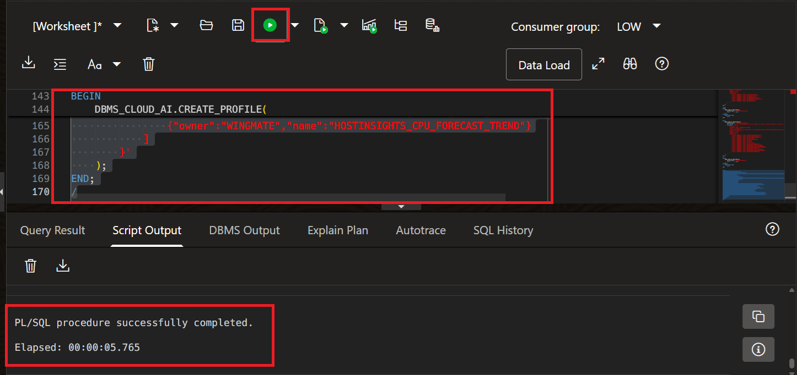

# Lab 2: Build an Agentic Operations Wingmate with Oracle APEX and OCI Generative AI

## Introduction

This lab walks you through creating the Wingmate assistant foundation on the Resource Analytics-provisioned Autonomous AI Database prepared in Lab 1. You will use the `WINGMATE` APEX workspace, generate OCI API keys, configure APEX Web Credentials, create an OCI Generative AI service object, grant Select AI package access, create Select AI profiles that query Resource Analytics and supporting flat-file objects, and import the prebuilt Ask Oracle APEX application.

Estimated Time: 60 minutes

### Objectives

In this lab, you will:

* Generate API keys for OCI access
* Update APEX Web Credentials to connect to OCI resources
* Create the OCI Generative AI service object in APEX
* Grant Select AI package access to the `WINGMATE` schema
* Create Select AI profiles for Security, Multicloud, and Compute questions
* Import the prebuilt Ask Oracle APEX application

### Prerequisites

* Completed Lab 1
* `WINGMATE` database user created on the Resource Analytics-provisioned Autonomous AI Database
* `WINGMATE` APEX workspace and developer user created
* Resource Analytics materialized views created in Lab 1
* `wingmate_data.zip` downloaded and extracted from Lab 1
* `ADB-AskOracle-Chatbot-2026-03-04.sql` downloaded from the Ask Oracle sample repository
* Subscription to US Midwest (Chicago), US East (Ashburn), or US West (Phoenix)

## Task 1: Generate API Keys

1. Navigate back to the OCI Console and click your profile icon on the upper-right side of the screen. Select **User Settings**.

    

2. On the menu in the center, select **Tokens and keys**.

    

3. Make sure **Generate API Key Pair** is selected. Download your private and public keys because you will need them later. After downloading, select **Add**.

4. Save the configuration file preview in a notepad. You will use the values to create APEX Web Credentials.

    

5. Keep these values available for the next task:

    * `user`: OCI User OCID
    * `fingerprint`: API public key fingerprint
    * `tenancy`: OCI Tenancy OCID
    * `region`: OCI region identifier
    * Downloaded private key file contents

## Task 2: Update the Credentials to Connect to OCI Resources

1. In APEX, click **App Builder**.

    

2. Click **Workspace Utilities**.

    

3. Click **Web Credentials**.

    

4. Click **Create** to create OCI API credentials.

    

5. Change **Authentication Type** to **OCI Native Authentication**.

6. Enter the Web Credential values from the API key configuration preview:

    * **Name:** `api_key`
    * **Static ID:** `api_key`
    * **OCI User ID:** Use the `user` OCID from the configuration preview.
    * **OCI Private Key:** Paste the full downloaded private key contents, including the `BEGIN PRIVATE KEY` and `END PRIVATE KEY` lines.
    * **OCI Tenancy ID:** Use the `tenancy` OCID from the configuration preview.
    * **OCI Public Key Fingerprint:** Use the `fingerprint` value from the configuration preview.
    * **Valid for URLs:** Leave this blank unless your APEX environment requires a value.

7. Select **Create**.

    

## Task 3: Create the OCI Generative AI Service Object

> **SME Gate:** Confirm the approved OCI Generative AI model, region, compartment requirements, service object defaults, and workshop-safe configuration values.

1. Navigate back to **Workspace Utilities** by selecting the first menu option on the breadcrumb bar.

    

2. Select **Generative AI** to navigate to service configuration.

    

3. Create a Generative AI service by selecting **Create**.

    

4. Configure the service:

    * **Name:** `OCI_GENAI`
    * **Web Credential:** `api_key`
    * **Compartment ID:** OCID look-up from OCI console
    * **Region:** Select from the options listed that is subscribed in tenancy
    * **Base URL:** Auto-generated Generative AI inference endpoint for your subscribed region
    * **Model:** Select **xai.grok-4.3**.

    > **Note:** `xai.grok-4.3` has a large context window that is well suited for Wingmate prompts that include Resource Analytics summaries, application page context, and supporting operational data. If `xai.grok-4.3` is not available in your subscribed region, select the closest tenancy-approved OCI Generative AI chat model.

    

5. Click **Create**.

## Task 4: Grant Select AI Package Access to the WINGMATE Schema

Ask Oracle uses database-side PL/SQL packages that call Select AI. Stored PL/SQL requires direct package grants to the parsing schema.

1. Open **SQL Workshop**, then **SQL Commands**.

2. Connect as `ADMIN` and run these grants:

    ```sql
    <copy>
    GRANT EXECUTE ON DBMS_CLOUD TO WINGMATE;
    GRANT EXECUTE ON DBMS_CLOUD_AI TO WINGMATE;
    GRANT EXECUTE ON DBMS_CLOUD_AI_AGENT TO WINGMATE;
    </copy>
    ```

3. Connect as `WINGMATE` and confirm the required packages are visible to the lab schema.

    ```sql
    <copy>
    SELECT owner, object_name, object_type, status
    FROM all_objects
    WHERE object_name IN (
        'DBMS_CLOUD',
        'DBMS_CLOUD_AI',
        'DBMS_CLOUD_AI_AGENT'
    )
    ORDER BY object_name, object_type;
    </copy>
    ```

4. Confirm `DBMS_CLOUD` and `DBMS_CLOUD_AI` return `VALID`. If `DBMS_CLOUD_AI_AGENT` is unavailable in your Autonomous Database version, continue with the Select AI profile steps and skip any optional agent-team features.

## Task 5: Create Select AI Profiles for Wingmate Domains

Create one database credential and three Select AI profiles. Each profile has a focused `object_list` so Ask Oracle can route questions to the right domain without giving every prompt the entire schema.

1. In **SQL Commands**, connect as `WINGMATE`.

2. Create a database credential for Select AI. Use the same OCI API key values you captured in Task 1.

    ```sql
    <copy>
    BEGIN
        DBMS_CLOUD.DROP_CREDENTIAL(
            credential_name => 'WINGMATE_OCI_CRED'
        );
    EXCEPTION
        WHEN OTHERS THEN
            NULL;
    END;
    /

    BEGIN
        DBMS_CLOUD.CREATE_CREDENTIAL(
            credential_name => 'WINGMATE_OCI_CRED',
            user_ocid       => '<oci_user_ocid>',
            tenancy_ocid    => '<oci_tenancy_ocid>',
            private_key     => '<full_private_key_text>',
            fingerprint     => '<api_key_fingerprint>'
        );
    END;
    /
    </copy>
    ```

    > **Note:** Paste the full private key text, including the `BEGIN PRIVATE KEY` and `END PRIVATE KEY` lines. Keep this credential private to the lab schema.

3. In each profile block, replace `<genai_region>`, `<compartment_ocid>`, and `<oci_genai_chat_model_name_or_ocid>` with the subscribed OCI Generative AI region, target compartment OCID, and approved chat model for your tenancy.

4. Create the Security profile. This profile focuses on IAM policy review, CIS policy findings, and supporting tenancy or compartment context from Resource Analytics materialized views.

    ```sql
    <copy>
    BEGIN
        DBMS_CLOUD_AI.DROP_PROFILE(
            profile_name => 'WINGMATE_SECURITY',
            force        => TRUE
        );
    EXCEPTION
        WHEN OTHERS THEN
            NULL;
    END;
    /

    BEGIN
        DBMS_CLOUD_AI.CREATE_PROFILE(
            profile_name => 'WINGMATE_SECURITY',
            description  => 'Security Wingmate profile for IAM policy review, CIS findings, tenancy, compartment, and tag context.',
            attributes   => '{
                "provider": "oci",
                "credential_name": "WINGMATE_OCI_CRED",
                "region": "<genai_region>",
                "oci_compartment_id": "<compartment_ocid>",
                "model": "<oci_genai_chat_model_name_or_ocid>",
                "comments": true,
                "temperature": 0,
                "object_list": [
                    {"owner":"WINGMATE","name":"CIS_IAM_POLICIES"},
                    {"owner":"WINGMATE","name":"CIS_IAM_POLICIES_SV"},
                    {"owner":"WINGMATE","name":"MV_TENANCY_DIM_V"},
                    {"owner":"WINGMATE","name":"MV_COMPARTMENT_DIM_V"},
                    {"owner":"WINGMATE","name":"MV_COMPARTMENT_HIERARCHY_V"},
                    {"owner":"WINGMATE","name":"MV_REGION_DIM_V"},
                    {"owner":"WINGMATE","name":"MV_TAGS_DIM_V"}
                ]
            }'
        );
    END;
    /
    </copy>
    ```

5. Create the Multicloud profile. This profile covers Exadata, VM clusters, CDB/PDB inventory, multicloud inventory views, documentation reference context, and host-insights fallback objects loaded from flat files.

    ```sql
    <copy>
    BEGIN
        DBMS_CLOUD_AI.DROP_PROFILE(
            profile_name => 'WINGMATE_MULTICLOUD',
            force        => TRUE
        );
    EXCEPTION
        WHEN OTHERS THEN
            NULL;
    END;
    /

    BEGIN
        DBMS_CLOUD_AI.CREATE_PROFILE(
            profile_name => 'WINGMATE_MULTICLOUD',
            description  => 'Multicloud Wingmate profile for Exadata, VM clusters, database inventory, multicloud views, and host insights.',
            attributes   => '{
                "provider": "oci",
                "credential_name": "WINGMATE_OCI_CRED",
                "region": "<genai_region>",
                "oci_compartment_id": "<compartment_ocid>",
                "model": "<oci_genai_chat_model_name_or_ocid>",
                "comments": true,
                "temperature": 0,
                "object_list": [
                    {"owner":"WINGMATE","name":"CIS_MULTICLOUD_DETAILS_V"},
                    {"owner":"WINGMATE","name":"RA_MULTICLOUD_DETAILS_V"},
                    {"owner":"WINGMATE","name":"RA_MULTICLOUD_INVENTORY_V"},
                    {"owner":"WINGMATE","name":"OCI_EXA_INFR"},
                    {"owner":"WINGMATE","name":"OCI_EXA_VM_CLUSTER"},
                    {"owner":"WINGMATE","name":"OCI_CDB"},
                    {"owner":"WINGMATE","name":"OCI_PDB"},
                    {"owner":"WINGMATE","name":"OCI_DOC_REF"},
                    {"owner":"WINGMATE","name":"OCI_DOC_REF_COMPUTE_SV"},
                    {"owner":"WINGMATE","name":"HOSTINSIGHTS_REPORT_PERIOD"},
                    {"owner":"WINGMATE","name":"HOSTINSIGHTS_CPU_USAGE_SUMMARY"},
                    {"owner":"WINGMATE","name":"HOSTINSIGHTS_MEMORY_USAGE_SUMMARY"},
                    {"owner":"WINGMATE","name":"HOSTINSIGHTS_RES_STAT"},
                    {"owner":"WINGMATE","name":"HOSTINSIGHTS_RES_STAT_MEMORY"},
                    {"owner":"WINGMATE","name":"HOSTINSIGHTS_CPU_FORECAST_TREND"},
                    {"owner":"WINGMATE","name":"HOSTINSIGHTS_REPORT_SV"}
                ]
            }'
        );
    END;
    /
    </copy>
    ```

6. Create the Compute profile. This profile covers Resource Analytics compute materialized views, volume relationships, compartment context, and optional metric or host-insights flat-file objects.

    ```sql
    <copy>
    BEGIN
        DBMS_CLOUD_AI.DROP_PROFILE(
            profile_name => 'WINGMATE_COMPUTE',
            force        => TRUE
        );
    EXCEPTION
        WHEN OTHERS THEN
            NULL;
    END;
    /

    BEGIN
        DBMS_CLOUD_AI.CREATE_PROFILE(
            profile_name => 'WINGMATE_COMPUTE',
            description  => 'Compute Wingmate profile for Resource Analytics compute inventory, capacity, utilization, metrics, volumes, and compartment context.',
            attributes   => '{
                "provider": "oci",
                "credential_name": "WINGMATE_OCI_CRED",
                "region": "<genai_region>",
                "oci_compartment_id": "<compartment_ocid>",
                "model": "<oci_genai_chat_model_name_or_ocid>",
                "comments": true,
                "temperature": 0,
                "object_list": [
                    {"owner":"WINGMATE","name":"MV_COMPUTE_INSTANCE_DIM_V"},
                    {"owner":"WINGMATE","name":"MV_INSTANCE_VOLUME_DETAILS_V"},
                    {"owner":"WINGMATE","name":"MV_TENANCY_DIM_V"},
                    {"owner":"WINGMATE","name":"MV_COMPARTMENT_DIM_V"},
                    {"owner":"WINGMATE","name":"MV_COMPARTMENT_HIERARCHY_V"},
                    {"owner":"WINGMATE","name":"MV_REGION_DIM_V"},
                    {"owner":"WINGMATE","name":"MV_AD_DIM_V"},
                    {"owner":"WINGMATE","name":"MV_TAGS_DIM_V"},
                    {"owner":"WINGMATE","name":"HOSTINSIGHTS_CPU_USAGE_SUMMARY"},
                    {"owner":"WINGMATE","name":"HOSTINSIGHTS_MEMORY_USAGE_SUMMARY"},
                    {"owner":"WINGMATE","name":"HOSTINSIGHTS_CPU_FORECAST_TREND"}
                ]
            }'
        );
    END;
    /
    </copy>
    ```

    > **Note:** Lab 1 creates `MV_` materialized views for every available `OCIRA.COMPUTE_%` view. If your Resource Analytics instance exposes additional compute materialized views, add them to `WINGMATE_COMPUTE` with `DBMS_CLOUD_AI.SET_ATTRIBUTES` or recreate the profile with an expanded `object_list`. Lab 5 creates `OCI_COMPUTE_METRICS`; add that table to the profile after the metrics collector has created it.

    

7. Confirm the profiles are enabled in the `WINGMATE` schema.

    ```sql
    <copy>
    SELECT profile_name, status, description
    FROM user_cloud_ai_profiles
    WHERE profile_name IN (
        'WINGMATE_SECURITY',
        'WINGMATE_MULTICLOUD',
        'WINGMATE_COMPUTE'
    )
    ORDER BY profile_name;

    SELECT profile_name, attribute_name, DBMS_LOB.SUBSTR(attribute_value, 300, 1) AS attribute_value
    FROM user_cloud_ai_profile_attributes
    WHERE profile_name IN (
        'WINGMATE_SECURITY',
        'WINGMATE_MULTICLOUD',
        'WINGMATE_COMPUTE'
    )
    AND attribute_name = 'object_list'
    ORDER BY profile_name;
    </copy>
    ```

    

## Task 6: Import the Ask Oracle APEX Application

> **SME Gate:** Confirm the Ask Oracle export file name, imported application ID, supporting object install prompts, page source objects, profile dropdown item names, assistant prompt behavior, and expected validation responses.

1. Navigate back to **App Builder**.

    

2. Select **Import**.

    

3. Download the Ask Oracle application export from the Oracle sample repository:

    [ADB-AskOracle-Chatbot-2026-03-04.sql](https://github.com/oracle-devrel/oracle-autonomous-database-samples/blob/main/apex/Ask-Oracle/ADB-AskOracle-Chatbot-2026-03-04.sql)

4. Drag and drop `ADB-AskOracle-Chatbot-2026-03-04.sql`. Confirm **File Type** is set to **Application, Page or Component Export**, then select **Next**.

    

5. Review the import summary, then select **Next**.

6. On the install page, confirm the application settings:

    * **Parsing Schema:** `WINGMATE`
    * **Build Status:** `Run and Build Application`
    * **Install As Application:** `Auto Assign New Application ID`

    

7. Select **Install Application**.

8. If APEX prompts you to install supporting objects, select **Install Supporting Objects** and complete the supporting object wizard.

9. After the import completes, open the imported **Ask Oracle** application.

    

10. Confirm the application opens and shows the Ask Oracle chat interface.

## Task 7: Validate Ask Oracle Profile Selection

1. Run the Ask Oracle application.

2. Open a new chat and select **Switch NL2SQL Profile**.

    

3. Confirm the profile list includes:

    * `WINGMATE_SECURITY`
    * `WINGMATE_MULTICLOUD`
    * `WINGMATE_COMPUTE`

4. Select `WINGMATE_SECURITY` and ask:

    ```text
    <copy>
    What IAM policies have duplicate or overlapping permissions?
    </copy>
    ```

5. Select `WINGMATE_COMPUTE` and ask:

    ```text
    <copy>
    Which compute instances or compartments should I review for capacity or utilization?
    </copy>
    ```

6. Select `WINGMATE_MULTICLOUD` and ask:

    ```text
    <copy>
    Summarize the Exadata, VM cluster, CDB, and PDB inventory.
    </copy>
    ```

    

7. If the profile dropdown is empty, confirm the profiles exist in `USER_CLOUD_AI_PROFILES` while connected as `WINGMATE`.

You may now **proceed to the next lab**.

## Learn more

* [Creating Generative AI Service Objects in APEX](https://docs.oracle.com/en/database/oracle/apex/26.1/htmdb/creating-generative-ai-service-objects.html)
* [Ask Oracle APEX Sample App](https://github.com/oracle-devrel/oracle-autonomous-database-samples/blob/main/apex/Ask-Oracle/ADB-AskOracle-Chatbot-2026-03-04.sql)
* [DBMS_CLOUD_AI Package](https://docs.oracle.com/en/cloud/paas/autonomous-database/adbsa/dbms-cloud-ai-package.html)
* [Manage User Access to Resource Analytics ADW](https://docs.oracle.com/en-us/iaas/Content/resource-analytics/manage-user-access-adw.htm)
* [Resource Analytics Compute Data Model Reference](https://docs.oracle.com/en-us/iaas/Content/resource-analytics/reference-compute.htm)

## Acknowledgements

* **Authors:**
    * Nicholas Cusato - Cloud Architect
    * Royce Fu - Master Principal Cloud Architect
* **Last Updated by/Date** - Royce Fu, May 2026
