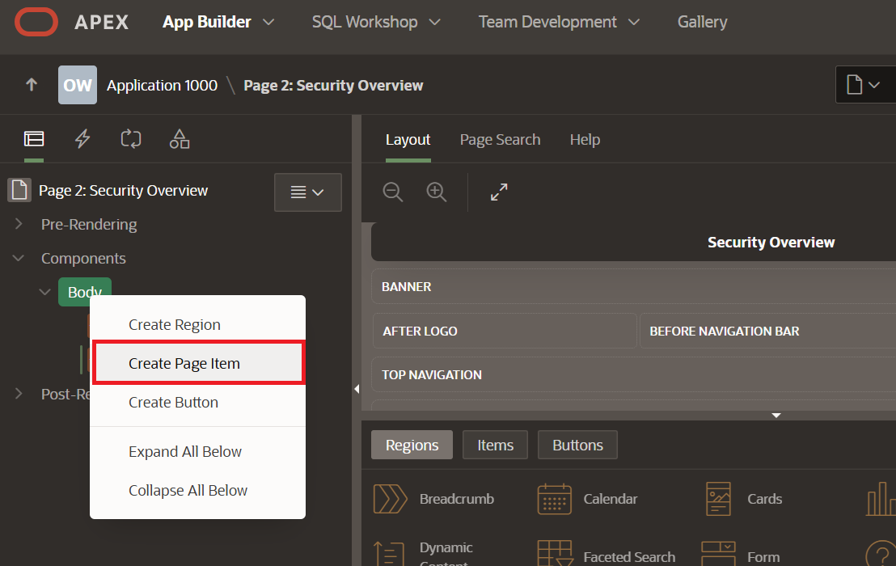
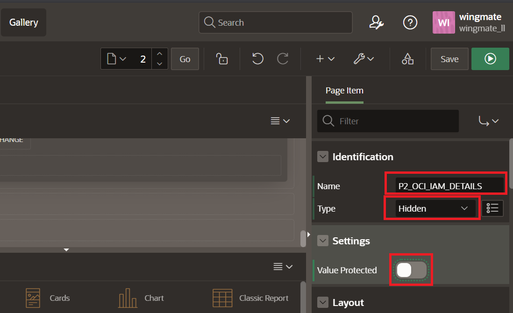
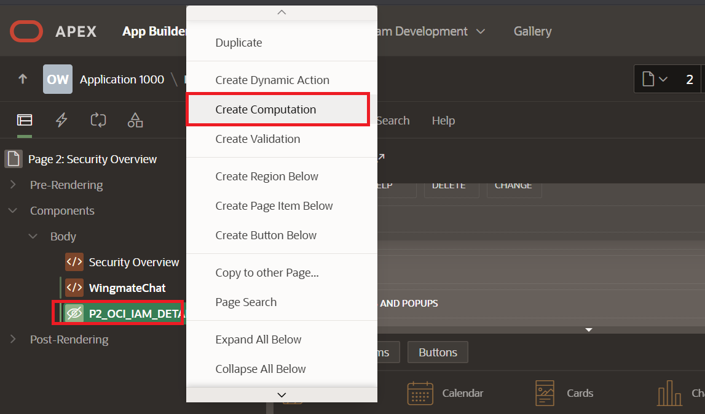
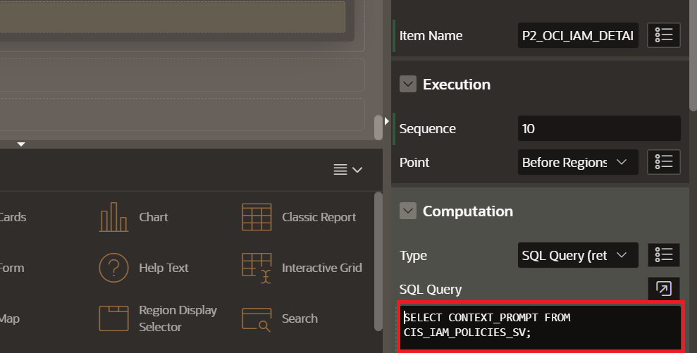

# Lab 3: Build a Security Wingmate Agent

## Introduction
This lab walks you through setting up the Security Wingmate Agent page for the APEX application. You will chat with your Wingmate about identity and access management policies.

Estimated Time: 10 minutes

### Objectives

In this lab, you will:
* Configure the imported Security Overview page for OCI Security Wingmate
* Add IAM policy context to the AI Assistant
* Connect the page to the OCI Generative AI service created in Lab 2
* Test the app's chat feature

### Prerequisites

This lab assumes you have the following:

* Completed Labs 1 and 2
* Access to the `WINGMATE` APEX application
* Imported `OCI Wingmate` framework application from Lab 2
* `OCI_GENAI` Generative AI service object created in APEX
* `CIS_IAM_POLICIES` loaded in the `WINGMATE` schema
* Some SQL knowledge is preferred but not necessary

> **Note:** If you need to load or refresh the policy dataset, navigate to **Utilities**, select **Data Workshop**, and use **Load Data**.


## Task 1: Build a Security Wingmate Agent Page

> **SME Gate:** Confirm the final security source tables or views, APEX page layout, region names, dynamic action settings, assistant prompt, welcome message, prompt examples, screenshots, and expected validation responses.

1. In App Builder, open the imported **OCI Wingmate** framework application.

2. Open the existing **Security Overview** page.

	

3. Confirm Page Designer shows the **Security Overview** page, then use the Rendering tree for the remaining page updates.

4. Right-click **Body** on the application tree to the left and select **Create Region**.

	

5. On the right side panel under Identification for the region, Enter the name **WingmateChat**.

	

6. With the **WingmateChat** region selected, set the region **Static ID** to `wingmate-chat`.

	

7. Right-click **Security Overview** in the Rendering tree and select **Create Page Item**.

	

	Configure the page item:

	* **Name:** `P2_OCI_IAM_DETAILS`
	* **Type:** `Hidden`
	* **Value Protected:** `Off`

	

8. Right-click `P2_OCI_IAM_DETAILS` and select **Create Computation**.

	

	Configure the computation:

	* **Type:** `SQL Query (return single value)`
	* **SQL Query:**

		```sql
		<copy>
		SELECT CONTEXT_PROMPT FROM CIS_IAM_POLICIES_SV;
		</copy>
		```

	

9. In the center of the App Builder, select the **Buttons** menu, and drag and drop the **text button** to the Region Body of WingmateChat region.

	

10. Name the button on the right panel **StartWingmate**.

	

11. Right-click the new button and select **Create Dynamic Action**.

	

12. Name the dynamic action **Chat**.

	

13. Select the **True** Action on the left panel.

	
	
14. Select **Show AI Assistant** on the right panel. Select the source to match the `OCI_GENAI` service from Lab 2. Paste the following in the **System Prompt**:

	

	```
	<copy>
	I want you to be an OCI Security expert who is providing guidance to the customers about their OCI tenancy IAM security best practices.
	The following list is the policy name and corresponding policy statements, please use these details for answering questions related to OCI policy.
	----
	&P2_OCI_IAM_DETAILS.
	</copy>
	```

	Under **Welcome Message**, enter:

	```
	<copy>
	Welcome! You can chat with OCI Security Wingmate!
	</copy>
	```

	Under **Quick Actions**, add these messages:

	* **Message 1:** `How many policies do I have in my OCI tenancy?`
	* **Message 2:** `Do I have any duplicate policy statements across policies?`

	

15. Right-click **Show AI Assistant** on the left panel and click **Create Action**.

	

16. Select **Hide** for the Action, and under affected elements, select **Button** and **Start Wingmate** for the object.

	

17. Save the work done and view the page by clicking the **Green Run Button** on the top right of the screen.

	

## Task 2: Test the App's Chat Feature

1. On the Security Overview page, select **Start Wingmate Chat**.

	

2. Select the first prompt **How many policies do I have in my OCI tenancy?**.

	

3. Ask a follow-up question:

	```text
	<copy>Do I have any duplicate policy statements across policies?</copy>
	```

	

4. If the assistant says it cannot see policy data, confirm `P2_OCI_IAM_DETAILS` has a computation that returns `CONTEXT_PROMPT` from `CIS_IAM_POLICIES_SV` and is referenced in the AI Assistant system prompt.

You may now **proceed to the next lab**.

## Acknowledgements

* **Authors:**
	* Nicholas Cusato - Cloud Architect
	* Royce Fu - Master Principal Cloud Architect
* **Last Updated by/Date** - Royce Fu, May 2026
