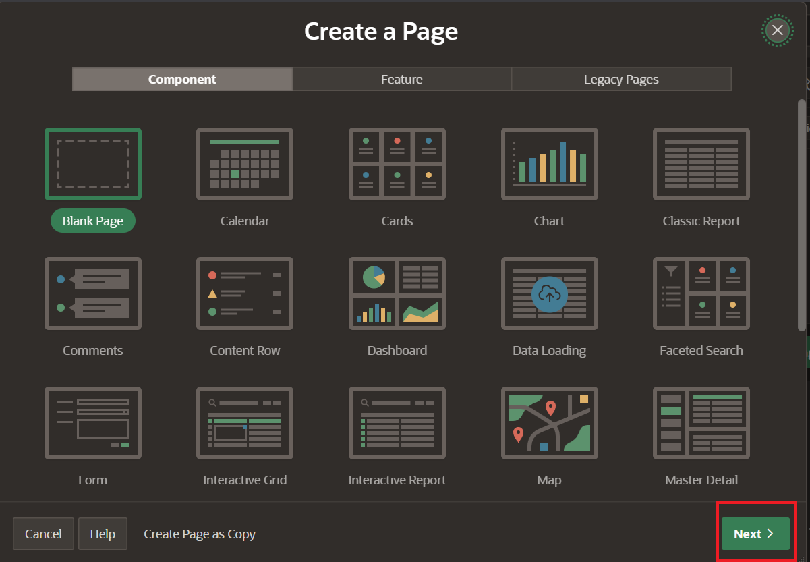
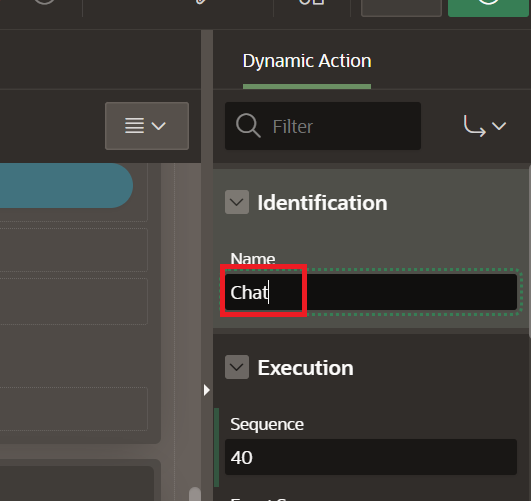
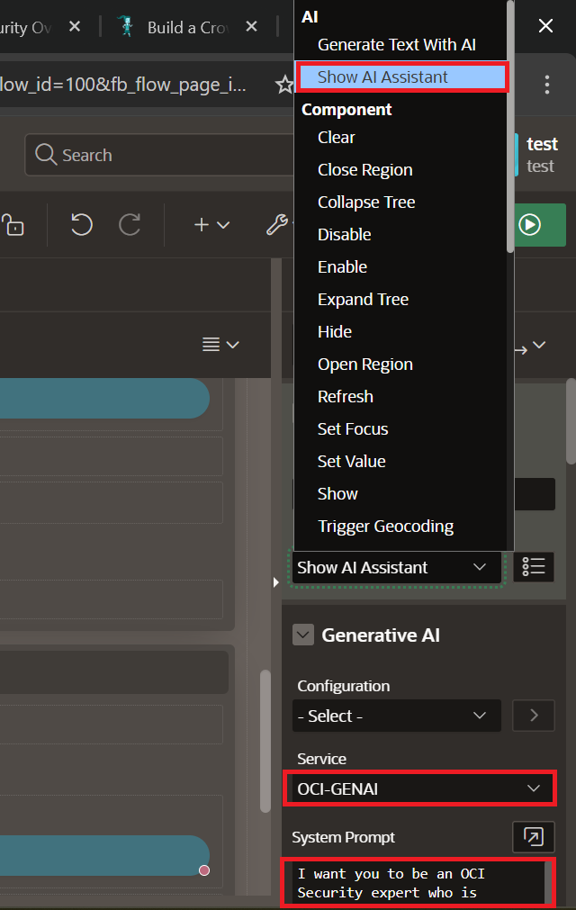

# Lab 3: Build a Security Wingmate Agent

## Introduction
This lab walks you through setting up the Security Wingmate Agent page for the APEX application. You will chat with your Wingmate about identity and access management policies.

Estimated Time: 10 minutes

### Objectives

In this lab, you will:
* Build a Security Wingmate Agent page
* Connect the page to the OCI Generative AI service created in Lab 2
* Test the app's chat feature

### Prerequisites

This lab assumes you have the following:

* Completed Labs 1 and 2
* Access to the `WINGMATE` APEX application
* `OCI_GENAI` Generative AI service object created in APEX
* Security policy data loaded or mapped in the `WINGMATE` schema
* Some SQL knowledge is preferred but not necessary

## Task 1: Build a Security Wingmate Agent Page

> **SME Gate:** Confirm the final security source tables or views, APEX page layout, region names, dynamic action settings, assistant prompt, welcome message, prompt examples, screenshots, and expected validation responses.

1. Navigate to the APEX app WINGMATE, and select **Create Page**.

	

2. Leave the default blank page settings, and select **Next**.

	

3. Name the blank page **Security Wingmate** and select **Create Page**.

	

4. Right-click **Body** on the application tree to the left and select **Create Region**.

	

5. On the right side panel under Identification for the region, Enter the name **WingmateChat**.

	

6. In the center of the App Builder, select the **Buttons** menu, and drag and drop the **text button** to the Region Body of WingmateChat region.

	

7. Name the button on the right panel **StartWingmate**.

	

8. Right-click the new button and select **Create Dynamic Action**.

	

9. Name the dynamic action **Chat**.

	

10. Select the **True** Action on the left panel.

	
	
11. Select **Show AI Assistant** on the right panel. Select the source to match the `OCI_GENAI` service from Lab 2. Paste the following in the **System Prompt**:

	```
	<copy>
	You are OCI Security Wingmate, an assistant for OCI identity and access management policy review. Answer questions using the application's loaded security policy data. Be concise, explain the policy impact, and call out missing data instead of guessing.
	</copy>
	```

	

12. Right-click **Show AI Assistant** on the left panel and click **Create Action**.

	

13. Select **Hide** for the Action, and under affected elements, select **Button** and **Start Wingmate** for the object.

	

14. Save the work done and view the page by clicking the **Green Run Button** on the top right of the screen.

	

## Task 2: Test the App's Chat Feature

1. On the popup screen, login using the same credentials from when you created the workspace. 

2. On the Security Wingmate page, select **Start Wingmate Chat**. 

	

3. Select the first prompt **How many policies do I have in my OCI tenancy?**.

	

4. Observe and validate the response. Refresh the page to compare the other prompt and validate the data matches expectations.

You may now **proceed to the next lab**.

## Acknowledgements

* **Authors:**
	* Nicholas Cusato - Cloud Architect
	* Royce Fu - Master Principal Cloud Architect
* **Last Updated by/Date** - Royce Fu, May 2026
