# Lab 3: Import and Configure Security Wingmate with RAG

## Introduction

This lab adds the Security Wingmate page to the Ask Oracle application imported in Lab 2. You will import one APEX page into the existing application, create a reusable Security RAG AI Configuration, and show the AI Assistant inline on the page.

Estimated Time: 10 minutes

### Objectives

In this lab, you will:

* Import the Security Overview Page
* Create the Security RAG AI Configuration
* Configure the Security Wingmate Page
* Test the App's Chat Feature

### Prerequisites

This lab assumes you have the following:

* Completed Labs 1 and 2
* Access to the Ask Oracle APEX application imported in Lab 2
* `OCI_GENAI` Generative AI service object created in APEX
* `CIS_IAM_POLICIES` and `CIS_IAM_POLICIES_SV` loaded in the `WINGMATE` schema
* `wingmate_data.zip` extracted, including `apex-pages/security-page.sql`
* Some SQL knowledge is preferred but not necessary

> **Note:** If you need to load or refresh the policy dataset, navigate to **Utilities**, select **Data Workshop**, and use **Load Data**.

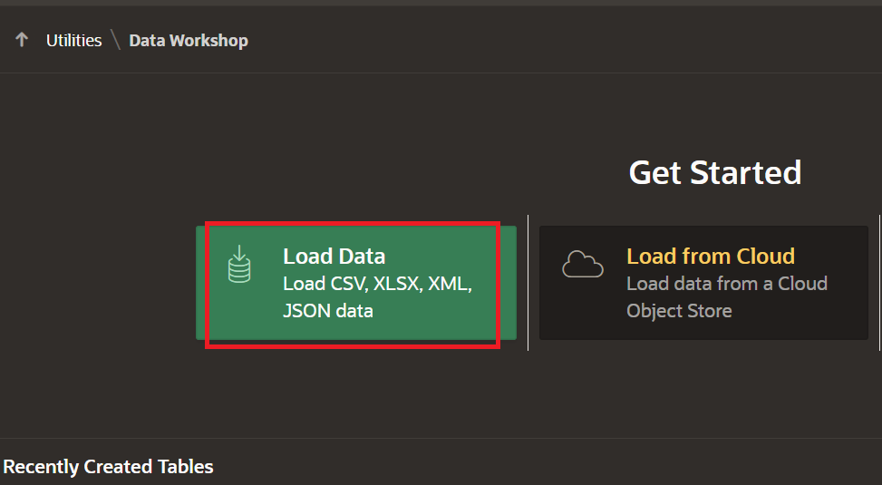

## Task 1: Import the Security Overview Page

1. Return to **App Builder** and select **Import**.

    Do not run the page export in SQL Commands, SQL Developer Web, or SQLcl. Use the APEX App Builder import wizard so the page is installed into the selected application.

2. Drag and drop `wingmate_data/apex-pages/security-page.sql`.

3. Confirm **File Type** is set to **Application, Page or Component Export**, then select **Next**.

    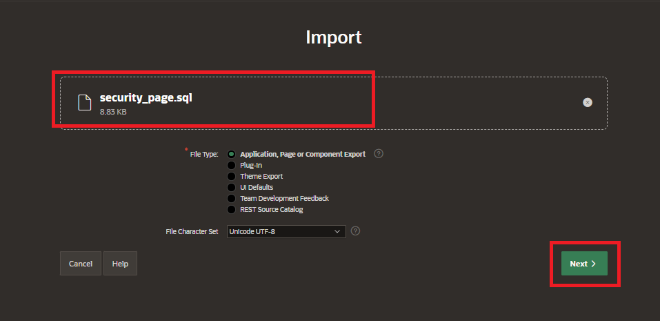

3. Confirm details and select **Install Page**.

  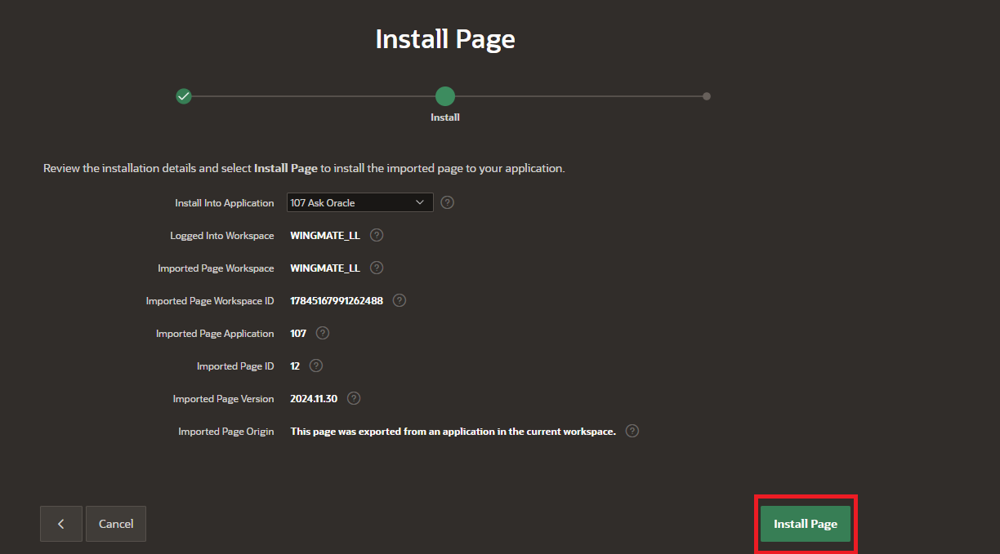

4. On the confirmation page, select **Edit Application**.

  

5. Modify the **Templates** to match the expected layout and save the page. Select the **OCI Security Wingmate** Region. Modify the template to **Hero**.

  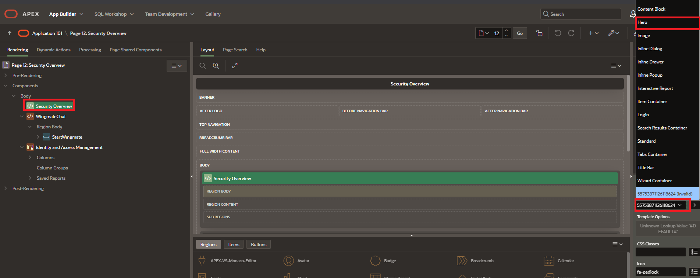

6. Select the **WingmateChat** Region and modify the template to **Standard**.

  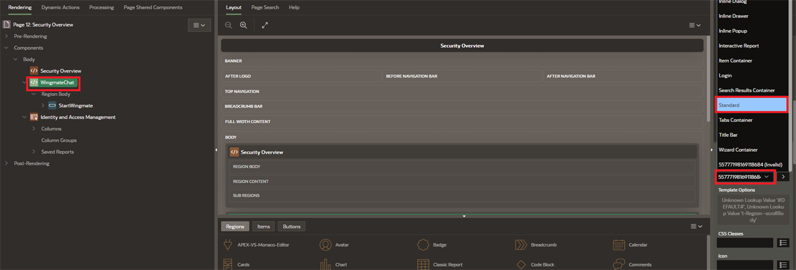

7. Select the button **StartWingmate** to modify the template to **Text** and save.

  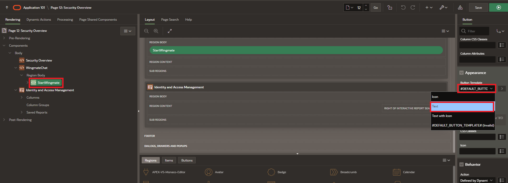

8. Select the region **Identity and Access Management** and modify the template to **Interactive Report**.

  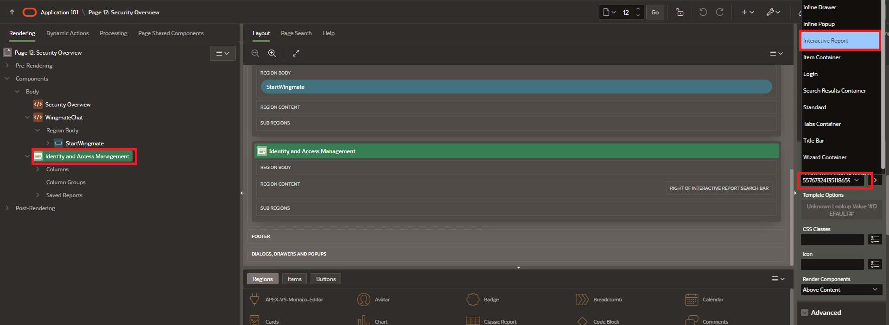

9. Navigate to the Shared Components of the app, select **Lists**, then open **LLM Conversations - Top**.

  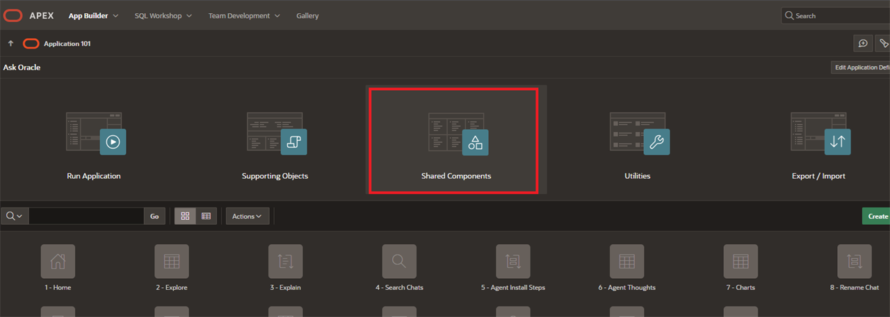

  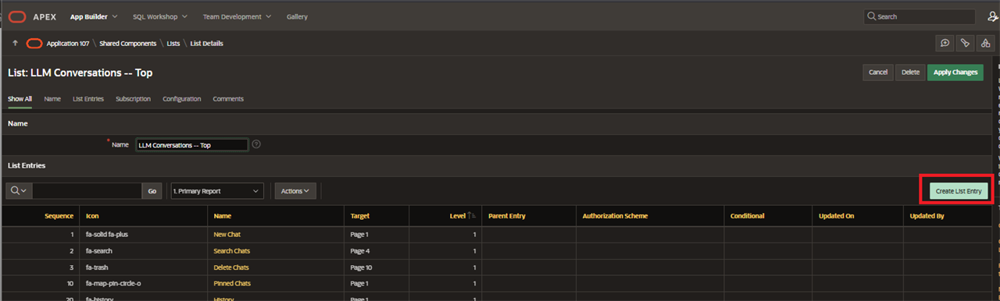

10. Edit the following at the end sequence and select **Create**.
    * **image/class:** `fa-lock`
    * **List Entry Label:** `Security Wingmate`
    * **Page:** `12`

    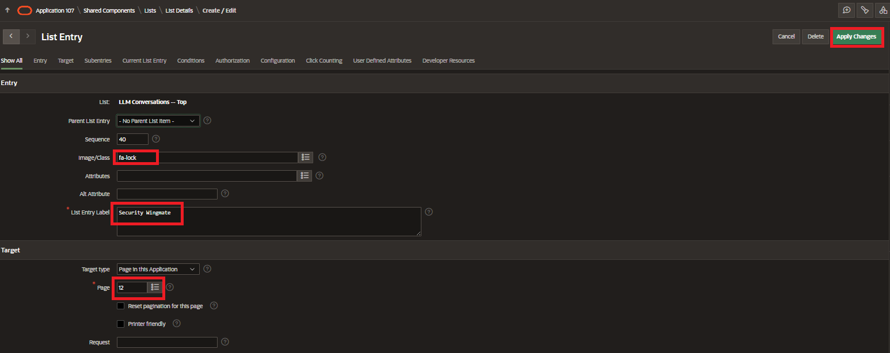

11. Open Page 12, **Security Overview**, in Page Designer to verify the list entry.

    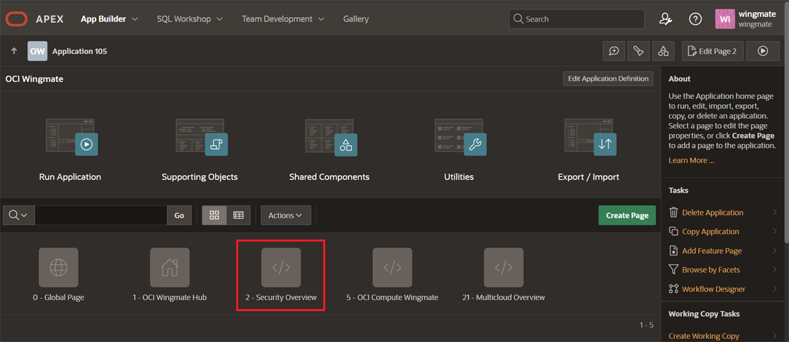

12. Confirm the imported **Show AI Assistant** action exists. You will connect it to `wingmate_security_rag` after creating the AI Configuration in Task 2.

    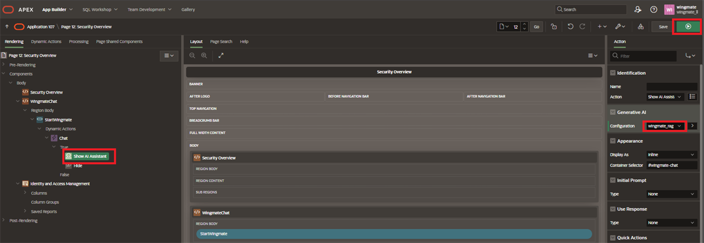


## Task 2: Create the Security RAG AI Configuration

APEX 24.2 uses **AI Configurations** and **RAG Sources**. In APEX 26.1, the same capability appears under AI Agent tooling. Use the labels shown in your APEX environment, but keep the static ID values in this lab unchanged.

1. Navigate to **Shared Components**, then **AI Configurations**.

    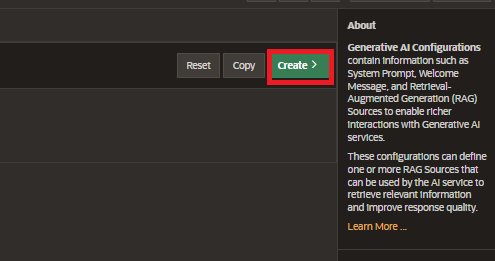

2. Create an AI Configuration with these values:

    * **Name:** `Security Wingmate RAG`
    * **Static ID:** `security_wingmate_rag`
    * **Service:** `OCI_GENAI`
    * **System Prompt:** `You are OCI Security Wingmate. Answer IAM policy and tenancy security questions using the configured RAG source. Be concise, explain security impact, and say when the retrieved policy context is insufficient.`
    * **Welcome Message:** `Welcome! Begin chatting with OCI Security Wingmate about policies and tenancy security questions.`

  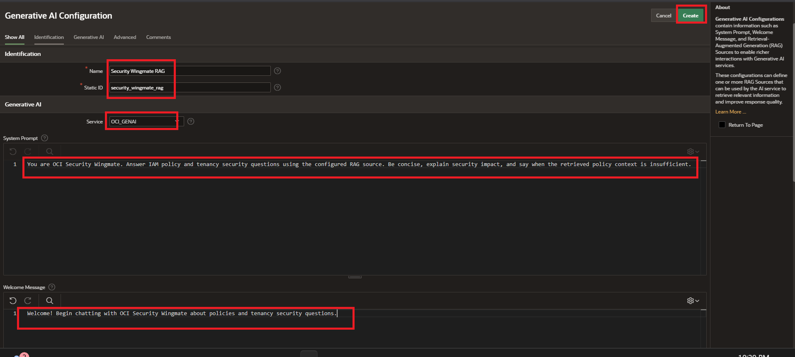

3. Add a SQL-based RAG Source to `wingmate_security_rag`:

    ```sql
    <copy>
    SELECT context_prompt
    FROM cis_iam_policies_sv
    </copy>
    ```

    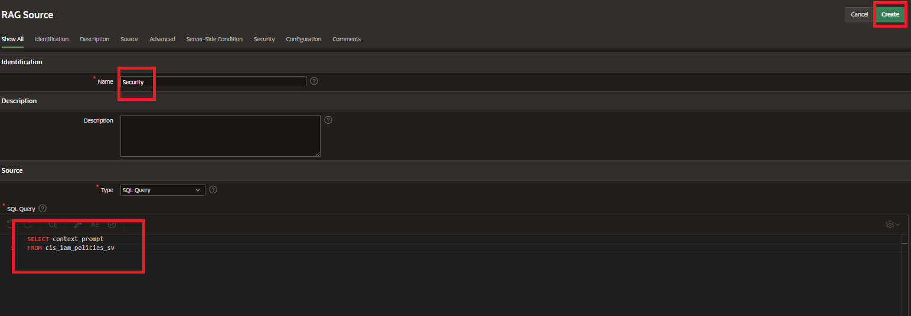

4. Save the AI Configuration.

5. Validate the source SQL as `WINGMATE`.

    ```sql
    <copy>
    SELECT context_prompt
    FROM cis_iam_policies_sv;
    </copy>
    ```

    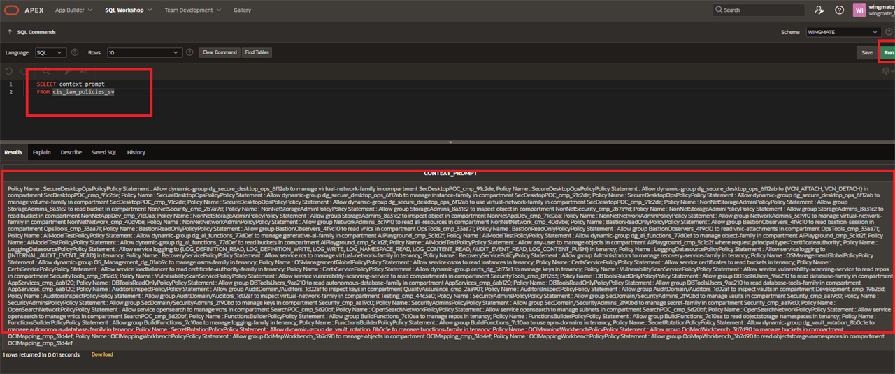

## Task 3: Configure the Security Wingmate Page

1. In Page Designer, confirm Page 12 shows **Security Overview**.

2. In the Rendering tree, select the imported **WingmateChat** region.

    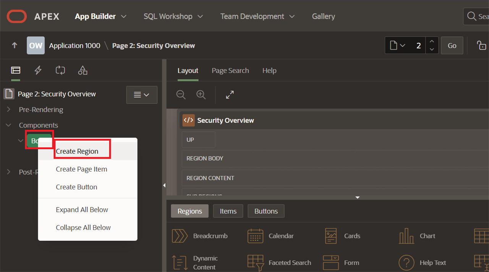

3. Confirm the region name is **WingmateChat**.

    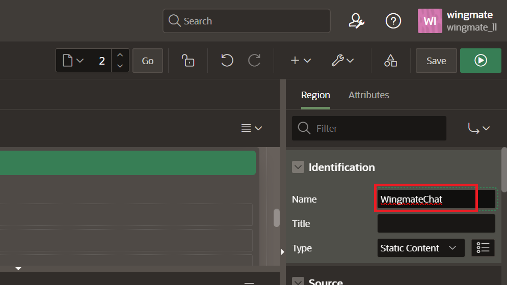

4. With the **WingmateChat** region selected, confirm the region **Static ID** is `wingmate-chat`.

    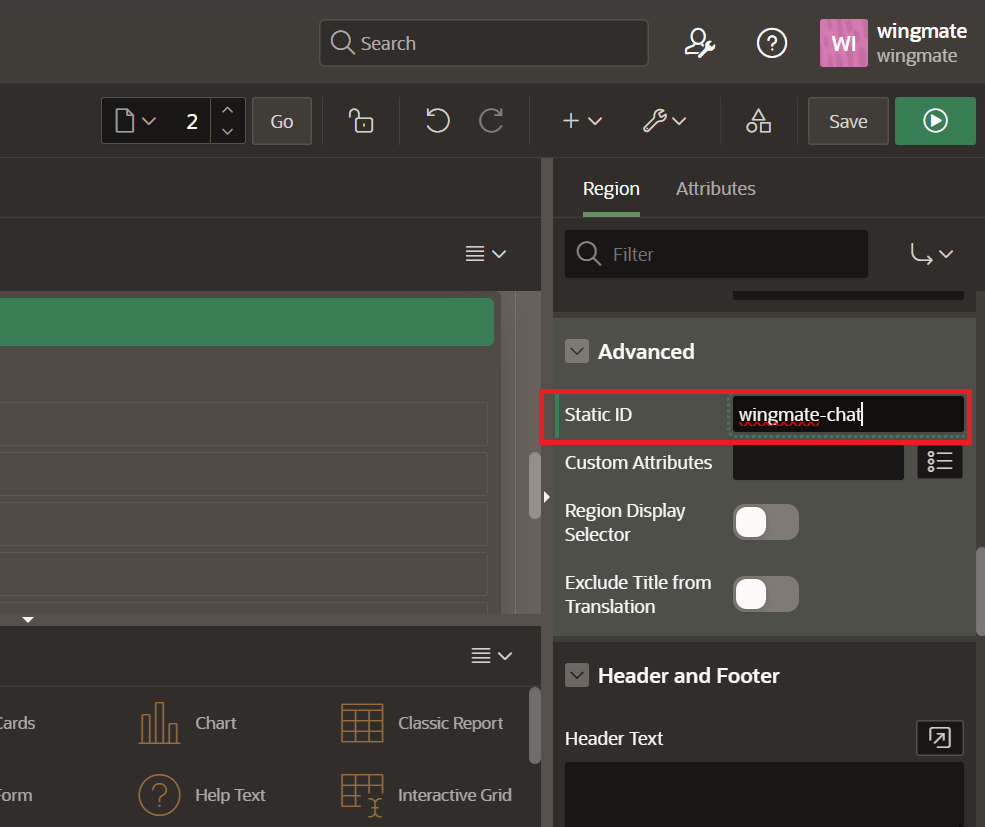

5. In the Rendering tree, select the imported **StartWingmate** button in the **WingmateChat** region.

    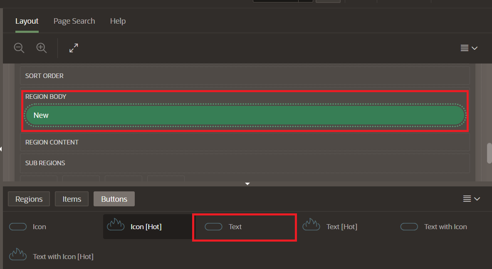

6. Confirm the button name is **StartWingmate**.

    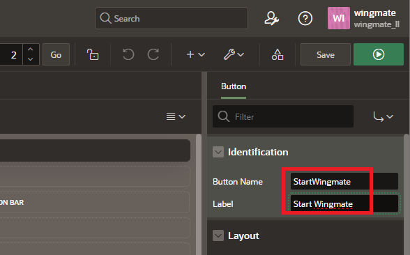

7. Select the imported **Chat** dynamic action for the **StartWingmate** button.

    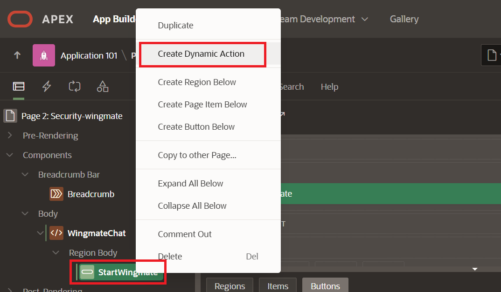

8. Confirm the dynamic action name is **Chat**.

    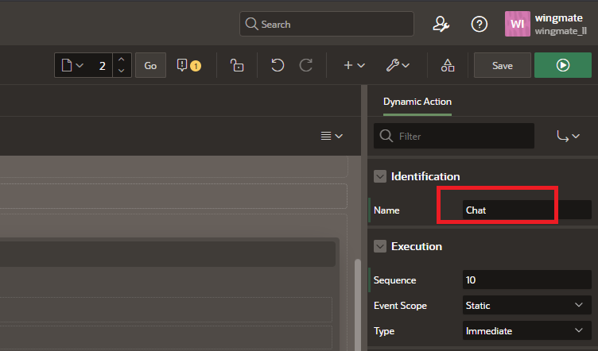

9. Select the **True** action.

    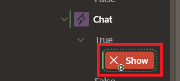

10. Set the action to **Show AI Assistant** and configure it:

    * **Configuration:** `wingmate_security_rag`
    * **Display As:** `Inline`
    * **Container Selector:** `#wingmate-chat`

    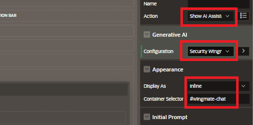

11. Under **Welcome Message**, enter:

    ```text
    <copy>
    Welcome! You can chat with OCI Security Wingmate.
    </copy>
    ```

12. Under **Quick Actions**, add these messages:

    * **Message 1:** `How many policies do I have in my OCI tenancy?`
    * **Message 2:** `Do I have any duplicate policy statements across policies?`

    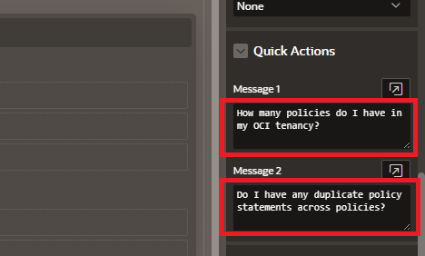

13. Confirm a **Hide** action exists after **Show AI Assistant**.

    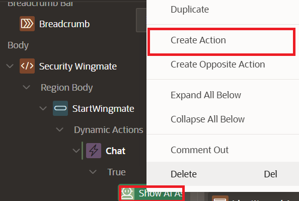

14. Select the **Hide** action and confirm the affected element is **Button** and **StartWingmate**.

    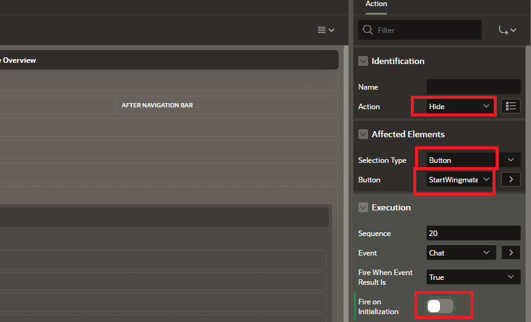

15. Add an interactive report for the imported OCI IAM policy data if the imported page does not already include one.

    In Page Designer, right-click **Body** on the Rendering tree and select **Create Region**. Configure the new region:

    * **Name:** `IAM Policy Statements`
    * **Type:** `Interactive Report`
    * **Source Type:** `SQL Query`
    * **SQL Query:**

    ```sql
    <copy>
    SELECT *
    FROM CIS_IAM_POLICIES_COPY
    </copy>
    ```

    This report lets you inspect the same IAM policy records that feed the Security Wingmate context.

16. Save the page and run it.

    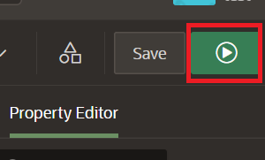

## Task 4: Test the App's Chat Feature

1. On the Security Overview page, select **Start Wingmate Chat**.

    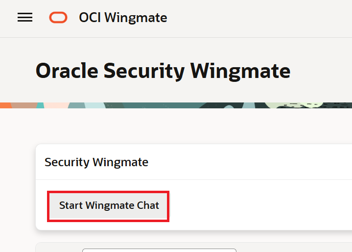

2. Select the first prompt **How many policies do I have in my OCI tenancy?**.

    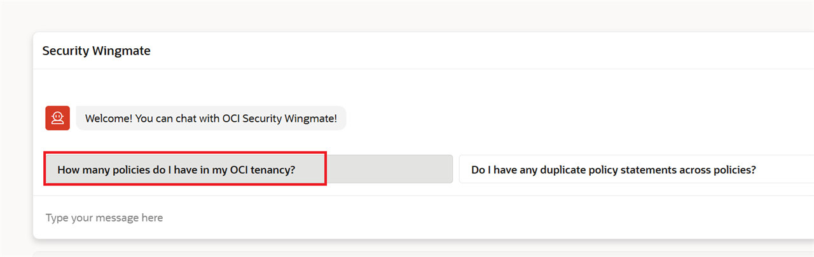

3. Ask a follow-up question:

    ```text
    <copy>Do I have any duplicate policy statements across policies?</copy>
    ```

    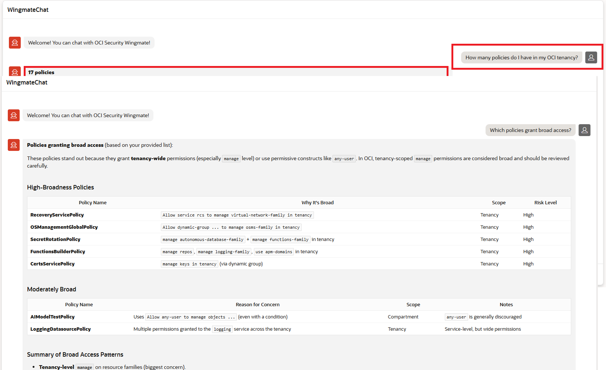

4. If the assistant says it cannot see policy data, validate:

    * `wingmate_security_rag` is selected in the **Show AI Assistant** action.
    * The action is displayed **Inline** with container selector `#wingmate-chat`.
    * The RAG Source SQL returns `CONTEXT_PROMPT` from `CIS_IAM_POLICIES_SV`.

You may now **proceed to the next lab**.

## Acknowledgements

* **Authors:**
    * Nicholas Cusato - Cloud Architect
    * Royce Fu - Master Principal Cloud Architect
* **Last Updated by/Date** - Nicholas Cusato, June 2026
