# Lab 4: Build a Multicloud Wingmate Agent

## Introduction

This lab walks you through the creation of a Multicloud Wingmate Agent dashboard. This is helpful for managing compute and resources across multiple cloud service providers.

Estimated Time: 60 minutes

### Objectives

* Build a Multicloud Wingmate Agent page
* Generate Report Period View
* Create Host Insights Widgets
* Compare Insights Across CPU and Memory
* Visualize CPU Combinations for Historical and Forecast Analysis
* Operationalize MultiCloud with Property Graph
* Review MultiCloud Insights

### Prerequisites

* Completed Labs 1, 2, and 3
* Access to the `WINGMATE` APEX application
* `OCI_GENAI` Generative AI service object created in APEX
* Multicloud and host-insights data loaded or mapped in the `WINGMATE` schema
* Some SQL knowledge is preferred but not necessary

## Task 1: Build a Multicloud Wingmate Agent Page

> **SME Gate:** Confirm the final multicloud data model, host-insights objects, copied page number assumptions, hidden page item names, assistant prompt, welcome message, page context, screenshots, and expected validation responses.

1. Use the existing template from the Security Wingmate Agent to create the Multicloud Wingmate Agent by selecting the plus sign in the top right of the page and selecting **Copy Page**.

	

2. Select **Next** to use the existing page.

	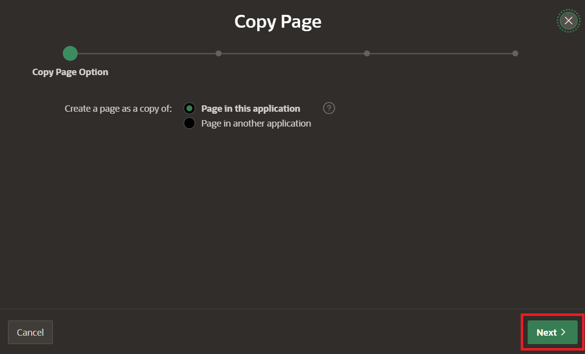

3. Name the page **MultiCloud Wingmate** and select **Next**.

	

4. Select **Create a new navigation menu entry** and **Next**. Leave menu entry as _No parent selected_.

	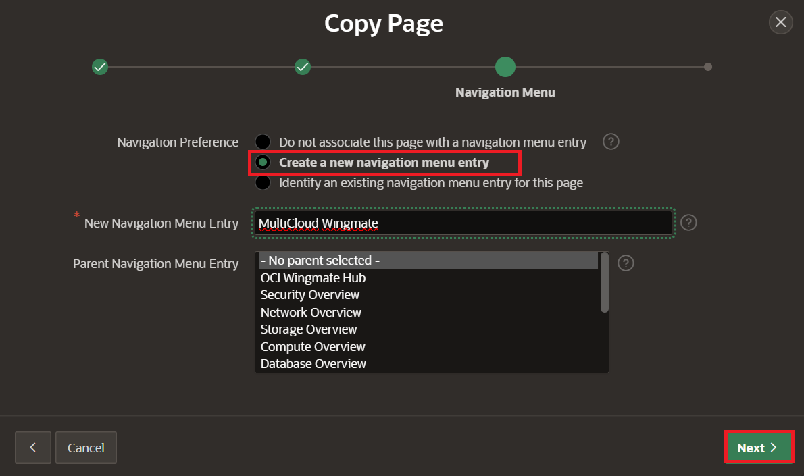

5. Rename Security to MultiCloud in the highlighted sections for value and static-id and select **Copy**.

	

6. Update AI Assistant by navigating to **Show AI Assistant** in the navigation tree under MultiCloud Wingmate Region -> StartWingmate -> Chat -> Show AI Assistant. Update System Prompt with the following:

	```
	<copy>
	I want you to be an OCI compute expert who is providing guidance to the customers about resource capacity planning best practices. 
	The following list is the oci compute host insights details we have captured, please use these compute metrics data for answering questions. 
	--------
	&P4_OCI_HOSTINSIGHTS_DETAILS.
	--------
	The following list is the OCI documentation references for compute, please use these documentation references for answering recommendation related questions.
	--------
	&P4_OCI_DOC_REF_COMPUTE.

	</copy>
	```

	> **Note:** Ensure you update the reference page number if it does not match your copied page.

	Update the **Welcome Message** from OCI Security Wingmate to OCI MultiCloud Wingmate as well.

7. Select the table previously created in the last lab that copied over named **Identity and Access Management**.

	

8. Update the name **MultiCloud Insights** and change the **SQL Query** to the following:

	```
	<copy>
	select * from oci_exa_infr
	union
	select * from oci_exa_vm_cluster
	union
	select * from oci_cdb
	union
	select * from oci_pdb
	</copy>
	```

	

	> **Note:** This will serve as the bottom of the dashboard so any regions created will be placed above this table.

9. Navigate to the bottom of the Navigation Tree to the hidden items. Select the OCI_CLOUDGUARD item and rename it to **P4_OCI_DOC_REF_COMPUTE** on the right side under Identification.

	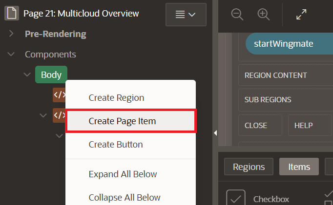

	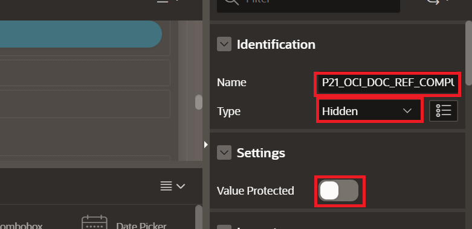

10. Update the computation as the following:

	```
	<copy>
	Select CONTEXT_PROMPT FROM oci_doc_ref_compute_sv
	</copy>
	```

	

11. Create another **Hidden Item** by right-clicking **P4_HOSTINSIGHTS_Listed**, selecting **Duplicate**, and naming it **P4_OCI_HOSTINSIGHTS_DETAILS**.

	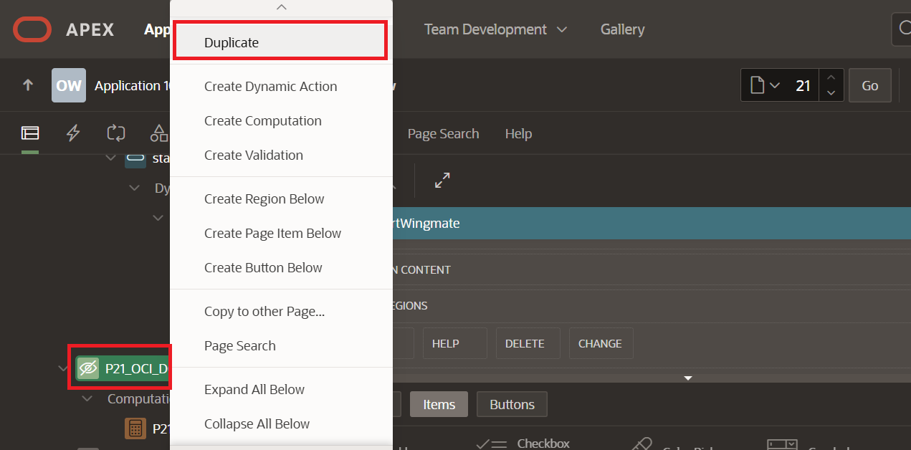

	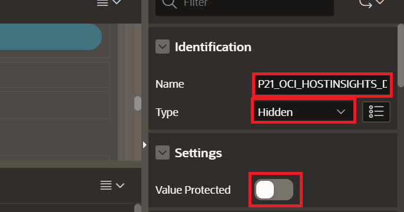

12. Right-click **P4_OCI_HOSTINSIGHTS_DETAILS** and select **Create Computation**. Paste this under **SQL Query** on the right side:

	```
	<copy>
	Select CONTEXT_PROMPT FROM hostinsights_report_sv
	</copy>
	```

	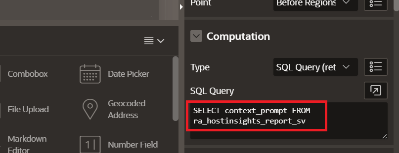

13. Repeat **Step 11** to create another hidden item named **P4_OCI_DATABASE_DETAILS**.

	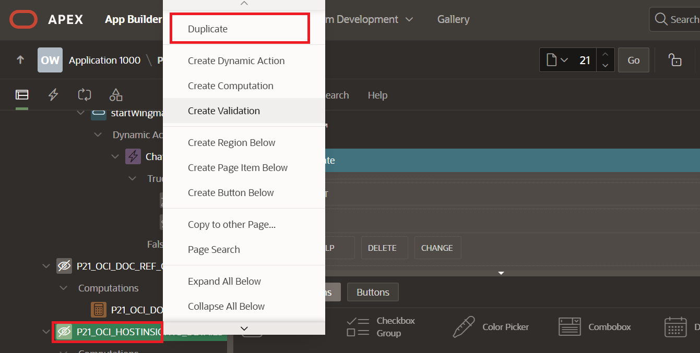

	

14. Right-click **P4_OCI_DATABASE_DETAILS** and select **Create Computation**. Paste this under SQL Query:

	```
	<copy>
	SELECT CONTEXT_PROMPT FROM CIS_MULTICLOUD_DETAILS_V
	</copy>
	```

	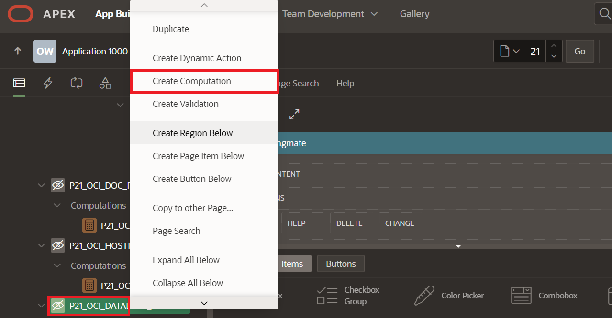

	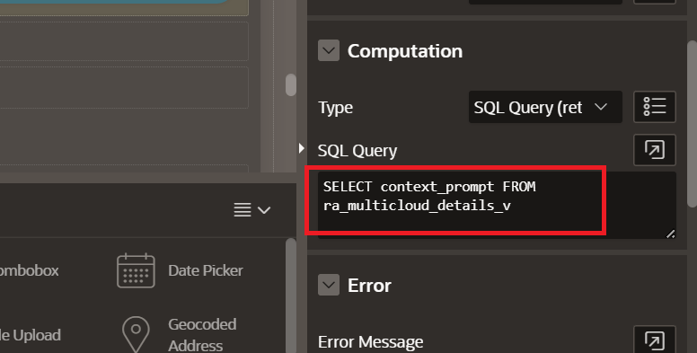

## Task 2: Generate Report Period View

> **SME Gate:** Confirm all table and view names used by the host-insights and multicloud reports, charts, hidden items, computations, and source SQL.

1. Create a table for viewing the host period by creating a region to contain it. Expand the **bottom module** (if not open) by selecting the arrow at the bottom center of the screen. Select **Regions** and pick the **Help** icon. Drop it under the Chat Region.

	

2. Name it **Host CPU Insights**.

	

3. Drag and drop **Classic Report** into the body of the newly created region.

	

4. Name the Report **ReportPeriod** and select the table **HOSTINSIGHTS_REPORT_PERIOD**.

	

5. Expand the ReportPeriod columns by clicking **the arrow** and and right-click **USAGEUNIT** and **RESOURCEMETRIC**, selecting **Comment Out**.

	

## Task 3: Create Host Insights Widgets

1. Drag and drop **Static Content** into the sub-region. Name the region **HOST INSIGHTS Metrics**.

	

2. Drag and drop **Chart** in the sub region of the HOST INSIGHTS Metrics static content. Name it **CPU Usage over Capacity**

	

3. Select **Attributes** at the top of the right module and change the chart type to **Status Gauge**. 

	

4. Update the style of the gauge by scrolling down on the right and change the **Indicator Size** to **.5** and **Inner Radius** to **.9**.

	

5. Scroll down more change **Value** and **Format** to **Percent** with 0 decimal places.

	

6. Select **Series** under the chart created and name it **CPU Metrics**. Change from Table/View to **SQL Query** and paste the following:

	```
	<copy>
	SELECT usage as cpu_usage, capacity as cpu_capacity FROM HOSTINSIGHTS_CPU_USAGE_SUMMARY
	</copy>
	```

	

7. Scroll down and add a mapping of **CPU Usage** for **Label** and **Value** and **CPU Capacity** for **Maximum Value**.  

	

8. Right-click to duplicate the **CPU Usage Over Capacity** gauge. Update the **Name** to **Memory Usage over Capacity**. Select **Attributes** and adjust the gauge size:
	* Indicator Size: **.5**
	* Inner Radius: **.6**

	

9. Select Series and rename it **Memory Metrics**. Update the SQL Query to the following:

	```
	<copy>
	SELECT usage as mem_usage, capacity as mem_capacity FROM HOSTINSIGHTS_MEMORY_USAGE_SUMMARY
	</copy>
	```

	

10. Scroll down and change the mapping with **Memory Usage** for **Label** and **Value** and **Memory Capacity** for **Maximum Value**. 

	

Next, Visuals for Host Insights across both CPU and Memory will be generated.

## Task 4: Compare Insights Across CPU and Memory

1. Drag and drop another **Static Region** into the same region **Host CPU Insights**. Name this Sub Region **HOST INSIGHTS CPU and MEMORY**. 

	

2. Drag and drop a chart into the Body and name it **CPU Usage across Host**. 

	

3. Select Attributes and change it to **Pie**. 

	

4. Scroll down and toggle off **Dim On Hover** and select **Highlight and Explode** for **Settings**.

	

5. For the series, name it **Tasks**. Add the following **SQL Query**:

	```
	<copy>
	SELECT
    hostname,
    capacity,
    usage,
    average,
    usagechangepercent
	FROM
    hostinsights_res_stat
	</copy>
	```

	

6. Scroll down and Select **HOSTNAME** for Label and **USAGE** for Value.

	

7. Drag and drop a second chart next to CPU Usage across Hosts and name it **Key Metrics Distribution**.

	

8. Select **Attributes** and change chart type to **Polar**.

	

9. Scroll down and toggle **Stack** under Appearance to **ON**.

	

10. Update the series name to **CPU Utilization** and change the type to **Line with Area**.

11. Update the **CPU Utilization SQL Query** to match:

	```
	<copy>
	select HOSTNAME, 
       UTILIZATIONPERCENT AS CPU_UTIL, 
       'CPU Utilization' as MetricType
	from HOSTINSIGHTS_RES_STAT
	</copy>
	```

	

12. Scroll down and update the mapping to the following:
	* Label: **HOSTNAME**
	* Value: **CPU_UTIL**

	

13. Right-click **Series** and select **Create Series**.

	

14. Name the Series **Memory Utilization** and change **Type** to **Line with Area**.

	

15. Scroll down and change **Type** to **SQL Query** and paste the following into the query box:

	```
	<copy>
	select HOSTNAME, 
		UTILIZATIONPERCENT AS MEM_UTIL, 
		'MEMORY Utilization' as MetricType
	from VECTOR.HOSTINSIGHTS_RES_STAT_MEMORY
	</copy>
	```

	

16. Right-click **CPU Usage across Hosts** and select **Duplicate**. Rename the new chart: **Memory Usage across Hosts**.

	

17. Select the **Tasks** Series and update the SQL Query to the following:

	```
	<copy>
	SELECT
    hostname,
    capacity,
    usage,
    average,
    usagechangepercent
	FROM
    hostinsights_res_stat_memory
	</copy>
	```

	

18. Adjust the charts to be aligned on the horizontal axis by selecting the new chart in the center module and dragging it to the right of the **Key Metrics Distribution Chart**.

	

## Task 5: Visualize CPU Combinations for Historical and Forecasting Analysis

1. Drag and drop a **static region** into the body of **Host CPU Insights** and name it **CPU Combination Chart**.

	

	

2. Drag and drop a **chart** into the body of **CPU Combination Chart** region. Name it **CPU Usage Historic and Forecast**.

	

3. Change the chart type to **Combination**.

	

4. Untoggle the **Dim on Hover** to off.

	

5. Select the **Series** and rename it to **CPU Historic Usage**.

	

6. Scroll down and paste the following SQL Query:

	```
	<copy>
	SELECT 
    to_char(cut.endTimestamp, 'DD-MON-YYYY HH24:MI:SS') AS HISTORIC_TIMESTAMP,
    cut.usage as historical_usage,
    'CPU Historic Usage' as CPU_HIST
	FROM 
    HOSTINSIGHTS_CPU_FORECAST_TREND CPU_FORECAST_TREND,
    JSON_TABLE(
        CPU_FORECAST_TREND.HISTORICALDATA,
        '$[*]' 
        COLUMNS (
            endTimestamp DATE PATH '$.endTimestamp',
            usage NUMBER PATH '$.usage'
        )
    ) cut
	ORDER BY cut.endTimestamp ASC
	</copy>
	```

	

7. Scroll down and update the **Column Mapping** to the following:
		* Label: **HISTORIC_TIMESTAMP**
		* Value: **HISTORICAL_USAGE**

	

8. Right-click **Series** and select **Create Series**.

	

9. Name the new series **CPU Forecast Usage** and select the type as **Line with Area**

	

10. Scroll down and change the source to **SQL Query** and paste the following SQL Query:

	```
	<copy>
	SELECT 
    to_char(cft.endTimestamp, 'DD-MON-YYYY HH24:MI:SS') AS PROJECTED_TIMESTAMP,
    cft.usage as projected_usage,
    cft.highValue as projected_highValue,
    cft.lowValue as projected_lowValue,
    'CPU Historic Usage' as CPU_HIST    
	FROM 
    HOSTINSIGHTS_CPU_FORECAST_TREND CPU_FORECAST_TREND,
    JSON_TABLE(
        CPU_FORECAST_TREND.PROJECTEDDATA,
        '$[*]' 
        COLUMNS (
            endTimestamp DATE PATH '$.endTimestamp',
            usage NUMBER PATH '$.usage',
            highValue NUMBER PATH '$.highValue',
            lowValue NUMBER PATH '$.lowValue'
        )
    ) cft
	ORDER BY cft.endTimestamp ASC
	</copy>
	```

	

11. Drag and drop a **Chart** inside the body of **CPU Combination Chart** region. 

	

12. Name the chart **CPU Usage Historic and Forecast - Mixed Frequency**.

	

13. Select **Attributes** and change the Type to **Combination**.

	

14. Scroll down and change the settings for Time Axis Type to **Mixed Frequency**.

	

15. Select the **Series** and change the name to **CPU Historic Usage**. 

	

16. Scroll down and select **SQL Query** and paste the following SQL:

	```
	<copy>
	SELECT 
    to_char(cut.endTimestamp, 'DD-MON-YYYY HH24:MI:SS') AS HISTORIC_TIMESTAMP,
    cut.usage as historical_usage,
    'CPU Historic Usage' as CPU_HIST
	FROM 
    HOSTINSIGHTS_CPU_FORECAST_TREND CPU_FORECAST_TREND,
    JSON_TABLE(
        CPU_FORECAST_TREND.HISTORICALDATA,
        '$[*]' 
        COLUMNS (
            endTimestamp DATE PATH '$.endTimestamp',
            usage NUMBER PATH '$.usage'
        )
    ) cut
	ORDER BY cut.endTimestamp ASC
	</copy>
	```

	

17. Right-click **Series** and select **Create Series**. 

	

18. Name the series **CPU Forecast MAX** and change the Type to **Line**.

	

19. Scroll down and change the Source Type to **SQL Query** and paste the following in the SQL Query:

	```
	<copy>
	SELECT 
    to_char(cft.endTimestamp, 'DD-MON-YYYY HH24:MI:SS') AS PROJECTED_TIMESTAMP,
    cft.highValue as projected_highValue,
    'CPU Forecast Max Usage' as CPU_FORECAST_MAX  
	FROM 
    HOSTINSIGHTS_CPU_FORECAST_TREND CPU_FORECAST_TREND,
    JSON_TABLE(
        CPU_FORECAST_TREND.PROJECTEDDATA,
        '$[*]' 
        COLUMNS (
            endTimestamp DATE PATH '$.endTimestamp',
            usage NUMBER PATH '$.usage',
            highValue NUMBER PATH '$.highValue',
            lowValue NUMBER PATH '$.lowValue'
        )
    ) cft
	ORDER BY cft.endTimestamp ASC
	</copy>
	```

	

20. Right-click **Series** and select **Create Series**.

	

21. Name the series **CPU Forecast Usage** and change the Type to **Line**.

	

22. Scroll down and change the Source Type to **SQL Query** and paste the following in the SQL Query:

	```
	<copy>
	SELECT 
    to_char(cft.endTimestamp, 'DD-MON-YYYY HH24:MI:SS') AS PROJECTED_TIMESTAMP,
    cft.usage as projected_usage,
    cft.highValue as projected_highValue,
    cft.lowValue as projected_lowValue,
    'CPU Forecast Usage' as CPU_FORECAST
	FROM 
    HOSTINSIGHTS_CPU_FORECAST_TREND CPU_FORECAST_TREND,
    JSON_TABLE(
        CPU_FORECAST_TREND.PROJECTEDDATA,
        '$[*]' 
        COLUMNS (
            endTimestamp DATE PATH '$.endTimestamp',
            usage NUMBER PATH '$.usage',
            highValue NUMBER PATH '$.highValue',
            lowValue NUMBER PATH '$.lowValue'
        )
    ) cft
	ORDER BY cft.endTimestamp ASC
	</copy>
	```

	

23. Right-click **Series** and select **Create Series**.

	

24. Name the series **CPU Forecast MIN** and change the Type to **Line**.

	

25. Scroll down and change the Source Type to **SQL Query** and paste the following in the SQL Query:

	```
	<copy>
	SELECT 
    to_char(cft.endTimestamp, 'DD-MON-YYYY HH24:MI:SS') AS PROJECTED_TIMESTAMP,
    cft.usage as projected_usage,
    cft.highValue as projected_highValue,
    cft.lowValue as projected_lowValue,
    'CPU Forecast Usage' as CPU_FORECAST
	FROM 
    HOSTINSIGHTS_CPU_FORECAST_TREND CPU_FORECAST_TREND,
    JSON_TABLE(
        CPU_FORECAST_TREND.PROJECTEDDATA,
        '$[*]' 
        COLUMNS (
            endTimestamp DATE PATH '$.endTimestamp',
            usage NUMBER PATH '$.usage',
            highValue NUMBER PATH '$.highValue',
            lowValue NUMBER PATH '$.lowValue'
        )
    ) cft
	ORDER BY cft.endTimestamp ASC
	</copy>
	```

	

26. Save the work by clicking the **Save button** at the top right.

	

## Task 6: Operationalize MultiCloud with Property Graph

> **Note:** This task requires downloading a **Plug-in** to install for visualizing the SQL property graphs in APEX. Learn more by reading through the [documentation.](https://docs.oracle.com/en/database/oracle/property-graph/26.1/spgdg/visualizing-sql-graph-queries-using-apex-graph-visualization-plug.html#GUID-29126F4F-FF5E-4712-9BFE-535F2451AD3A)

> **SME Gate:** Confirm whether the APEX Graph Visualization plug-in is required, the supported APEX version, the approved download source, the graph object name, graph query, and validation steps.

1. Download the sql file from the github repo by clicking the link. Right-click in the new tab window and select **Save As**: [region_type_plugin_graphviz.sql](https://raw.githubusercontent.com/oracle/apex/3bb6d39634560035cac57743bbe232d2fb5cae2d/plugins/region/graph-visualization/region_type_plugin_graphviz.sql)

	

2. Navigate to **App Builder** and the **Wingmate App**. Select **Import/Export**.

	

3. Drag and drop the **region_type_plugin_graphviz.sql file**, select **Plugin** and **Next**.

	

4. Select **Next** to proceed with the import.

	

5. Select **Import** to begin the import of the plug-in.

	

6. Verify the plug-in was installed correctly. Navigate back to the **MultiCloud Overview** page of the app by selecting **Application 100** in the breadcrumbs bar and selecting the page.

	> **Note:** Notice the settings of **Page size** that can be modified if needed and this is available via **Shared Components** -> **Component Settings** (via the breadcrumbs).

	

7. Navigate back to the **MultiCloud Overview** page by selecting the **MultiCloud Overview** page.

	

8. Drag and drop the **Graph Visualization plugin** from the regions object selector.

	

9. Name the region **MultiCloud Insights**.

	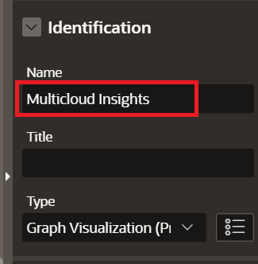

10. Scroll down and update the Source Type to **SQL Query** and paste the following SQL:

	```
	<copy>
	SELECT * FROM GRAPH_TABLE(MULTICLOUD_GRAPH
    MATCH (a) -[e]-> (b) - [f] -> (c) - [g] -> (d)
    COLUMNS(vertex_id(a) as aid, edge_id(e) as eid, vertex_id(b) as bid, edge_id(f) as fid, vertex_id(c) as cid, edge_id(g) as gid, vertex_id(d) as did)
	);
	</copy>
	```

	

## Task 7: Review MultiCloud Insights

1. Run the MultiCloud Wingmate page and verify the reports, forecast charts, and graph visualization render with the loaded data. Use the chat prompts to confirm the assistant answers from the host insights and documentation context.

You may now **proceed to the next lab**.

## Acknowledgements

* **Authors:**
	* Nicholas Cusato - Cloud Architect
	* Royce Fu - Master Principal Cloud Architect
* **Last Updated by/Date** - Royce Fu, May 2026
