# Lab 4: Build a Multicloud Wingmate Agent

## Introduction

This lab walks you through the creation of a Multicloud Wingmate Agent dashboard. You will import the Multicloud Overview page into the Ask Oracle application from Lab 2, create a reusable Multicloud RAG AI Configuration, build reports and charts for cross-cloud resource analysis, and create the synthetic SQL property graph used by the graph visualization.

Estimated Time: 60 minutes

### Objectives

* Install the Graph Visualization plug-in and import the Multicloud Overview page into the existing Lab 2 application
* Create the `wingmate_multicloud_rag` AI Configuration
* Create and validate the `MULTICLOUD_GRAPH` SQL property graph
* Generate Report Period View
* Create Host Insights Widgets
* Compare Insights Across CPU and Memory
* Optionally visualize CPU combinations for historical and forecast analysis with collected metric history
* Operationalize MultiCloud with Property Graph
* Review MultiCloud Insights

### Prerequisites

* Completed Labs 1, 2, and 3
* Access to the Ask Oracle APEX application imported in Lab 2
* `OCI_GENAI` Generative AI service object created in APEX
* Multicloud, host-insights, and documentation-reference objects loaded or mapped in the `WINGMATE` schema
* `wingmate_data.zip` extracted, including `apex-pages/multicloud-page.sql`
* Some SQL knowledge is preferred but not necessary

## Task 1: Install the Graph Visualization Plug-in and Import the Multicloud Overview Page

> **SME Gate:** Confirm the final multicloud data model, host-insights objects, imported page ID, AI Configuration settings, RAG Source SQL, screenshots, and expected validation responses.

The Multicloud page export includes a Graph Visualization region. Install the Graph Visualization helper objects and APEX plug-in before importing the page so APEX can resolve the plug-in region during page import.

1. Download the Graph Visualization helper scripts and plug-in SQL files from the Oracle APEX GitHub repository.

	Right-click each link in a new tab and select **Save As**:

	* [gvt_sqlgraph_to_json.sql](https://raw.githubusercontent.com/oracle/apex/24.2/plugins/region/graph-visualization/required-for-26ai/gvt_sqlgraph_to_json.sql)
	* [required_helper_functions.sql](https://raw.githubusercontent.com/oracle/apex/24.2/plugins/region/graph-visualization/required-for-26ai/required_helper_functions.sql)
	* [region_type_plugin_graphviz.sql](https://raw.githubusercontent.com/oracle/apex/24.2/plugins/region/graph-visualization/region_type_plugin_graphviz.sql)

	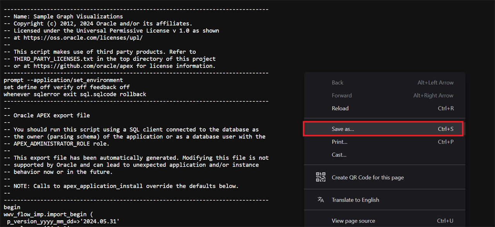

  > **Note:** Make sure to save each file as SQL rather than a text file, as SQL files are the standard for importing plugins into Oracle APEX.

2. Open **SQL Workshop**, then **SQL Scripts**.

	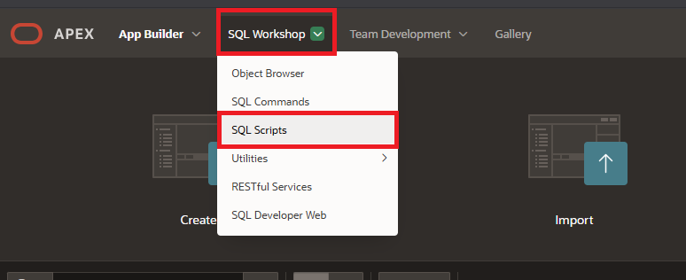

3. Upload and run `gvt_sqlgraph_to_json.sql` as the `WINGMATE` parsing schema.

	This script creates the full `DBMS_GVT` package and the SQL graph JSON conversion function required by the Graph Visualization plug-in.

	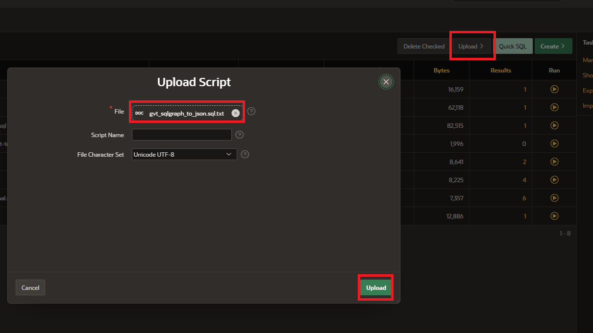

4. Upload and run `required_helper_functions.sql` as the `WINGMATE` parsing schema.

	This script creates the APEX helper functions that call the SQL graph JSON converter at runtime.

	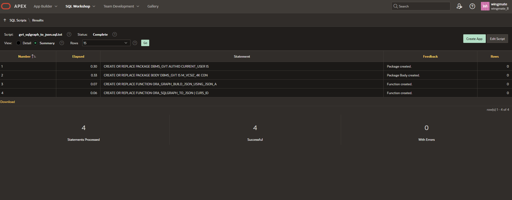

5. Navigate to SQL Commands and validate that the Graph Visualization support objects are valid.

	```
	<copy>
	SELECT object_name, object_type, status
	FROM user_objects
	WHERE object_name IN (
	    'DBMS_GVT',
	    'ORA_SQLGRAPH_TO_JSON',
	    'ORA_GRAPH_BUILD_JSON_USING_JSON_ARRAY',
	    'APEX_SQLGRAPH_JSON',
	    'GET_GRAPH_METADATA_PROC'
	)
	ORDER BY object_name, object_type;
	</copy>
	```

	Confirm that `DBMS_GVT` has both a valid `PACKAGE` and a valid `PACKAGE BODY`.

  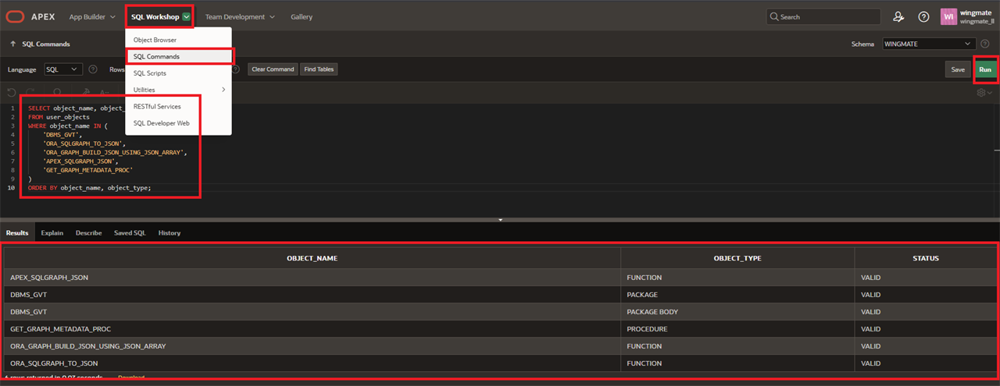

6. Navigate to **App Builder** and open the **Ask Oracle** application from Lab 2.

7. Select **Import/Export**.

	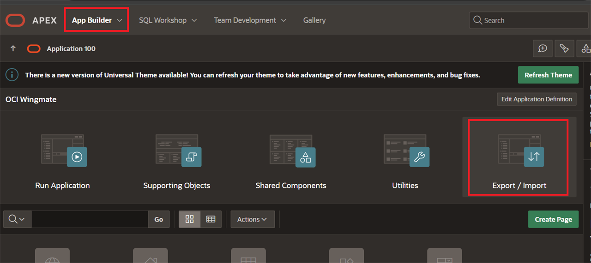

8. Drag and drop `region_type_plugin_graphviz.sql`, select **Plugin**, and select **Next**.

	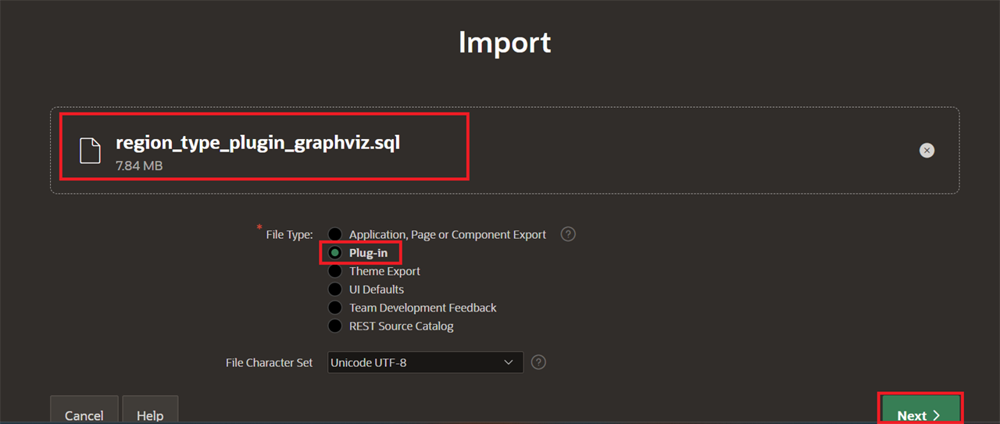

9. Select **Next** to proceed with the plug-in import.

	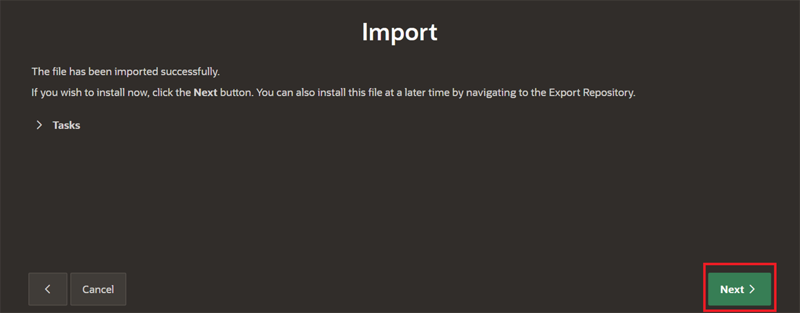

10. Select **Import** to install the plug-in.

	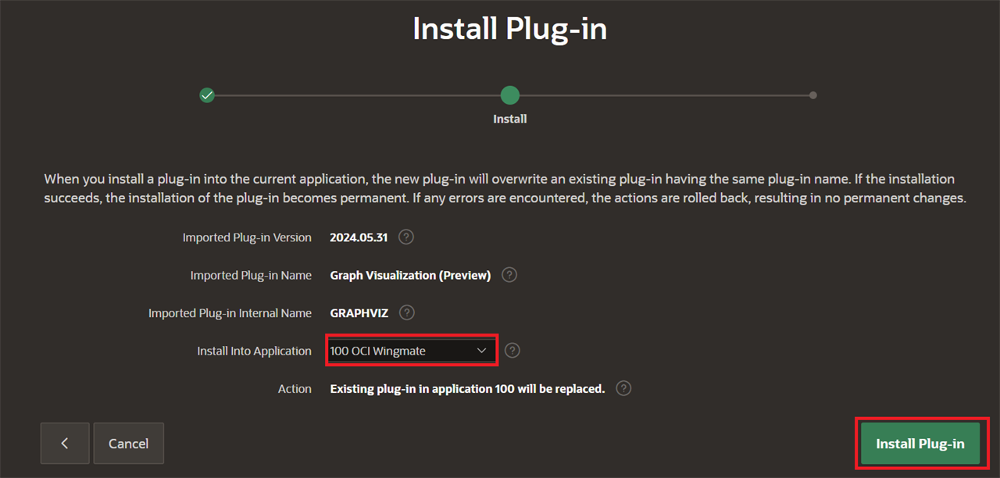

11. Verify the plug-in was installed correctly.

	> **Note:** The Graph Visualization plug-in settings can be reviewed later from **Shared Components**, then **Component Settings**.

	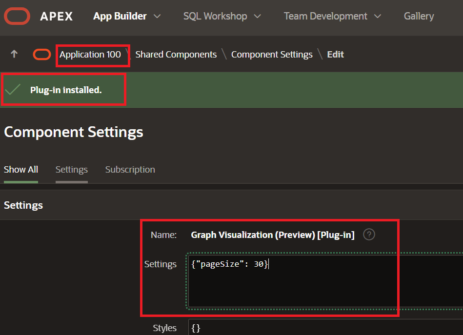

12. Return to **App Builder** and select **Import**.

13. Upload `wingmate_data/apex-pages/multicloud-page.sql`.

14. Confirm **File Type** is set to **Application, Page or Component Export**, then select **Next**.

	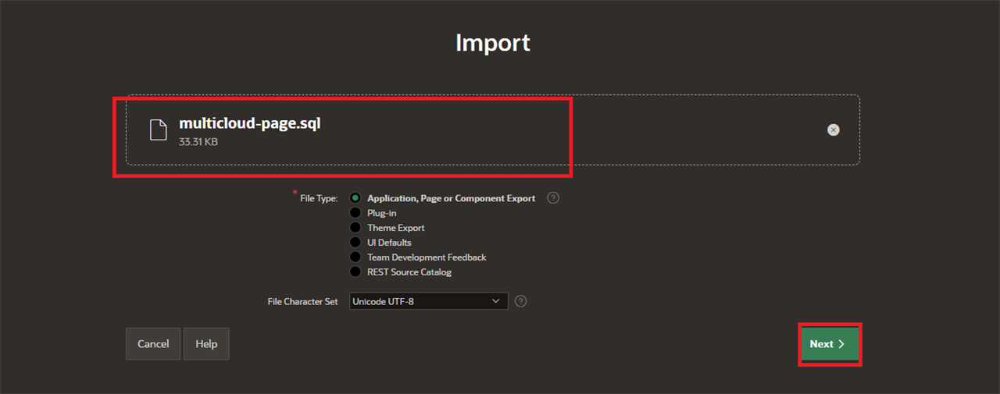

15. Confirm details and select **Install**.

	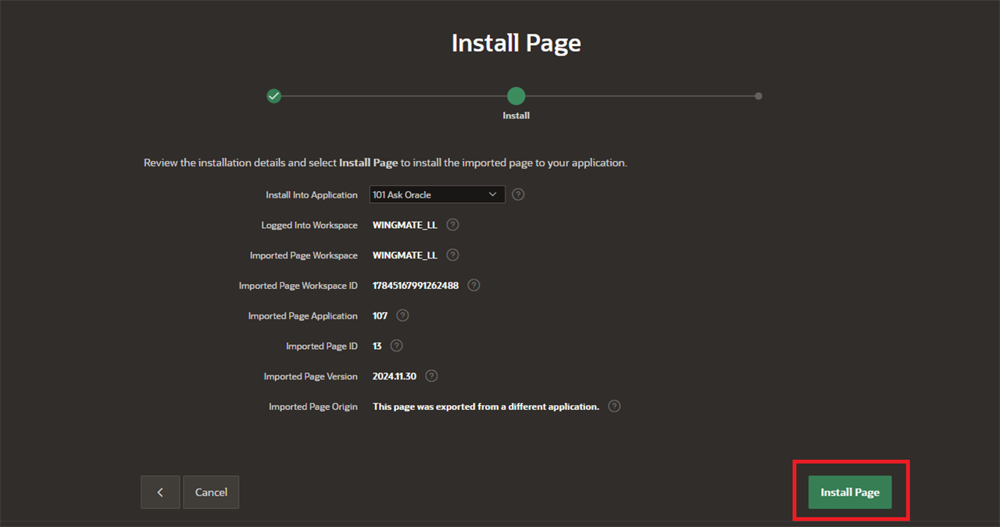

16. Select **Edit Page**, and confirm the page layout before continuing.

17. Select **Multicloud Overview** from the rendering tree on the left and modify the template to **Hero**.

	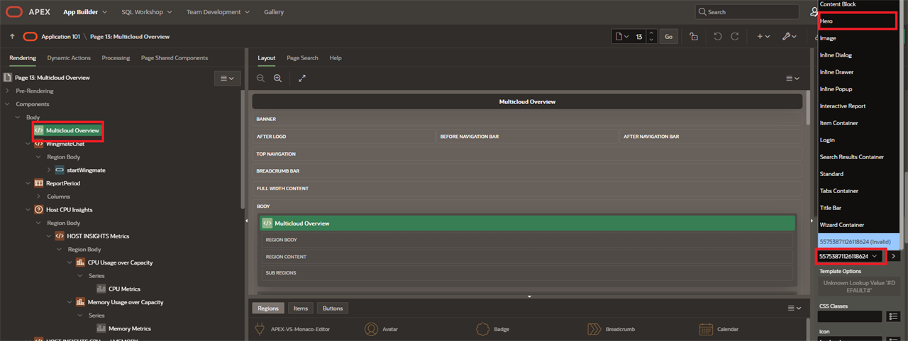

18. Select WingmateChat from the rendering tree on the left. Modify the template to **Standard**.

  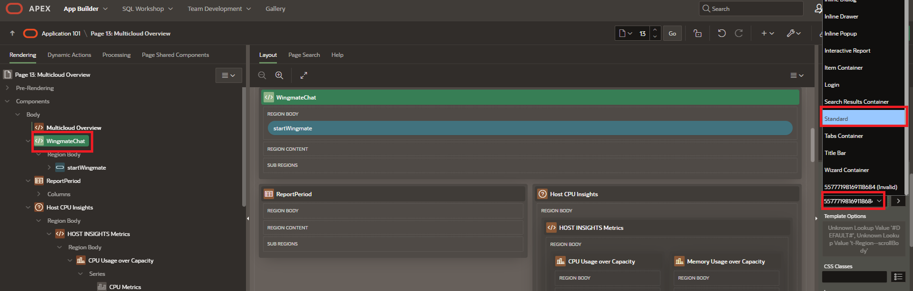

19. Select startWingmate** from the rendering tree on the left. Modify the template to **Standard**.

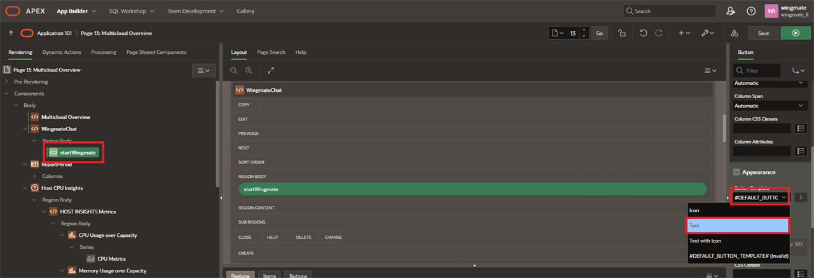

20. Repeat the process of editing the templates for the following regions in the rending tree:

* **Report Period**
* **Host CPU Insights**
* **CPU Usage Over Capacity**
* **Memory Usage Over Capacity**
* **Host Insights CPU and Memory**
* **CPU Usage Across Hosts**
* **Key Metrics Distribution**
* **CPU Combination Chart**
* **CPU Usage Historic and Forecast**
* **CPU Usage Historic and Forecast - Mixed Frequency**
* **MultiCloud Insights** graph
* **MultiCloud Insight** table

  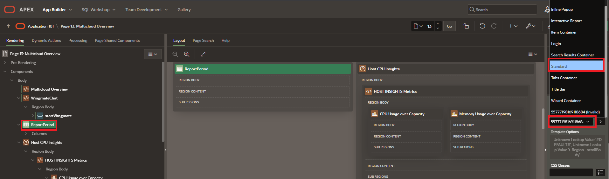

22. Navigate to the Shared Components of the app, select **Lists**, then open **LLM Conversations - Top**.

  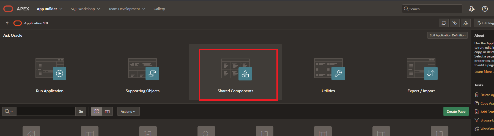

  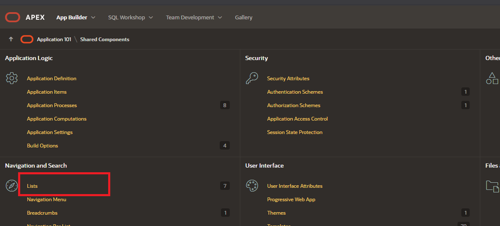

  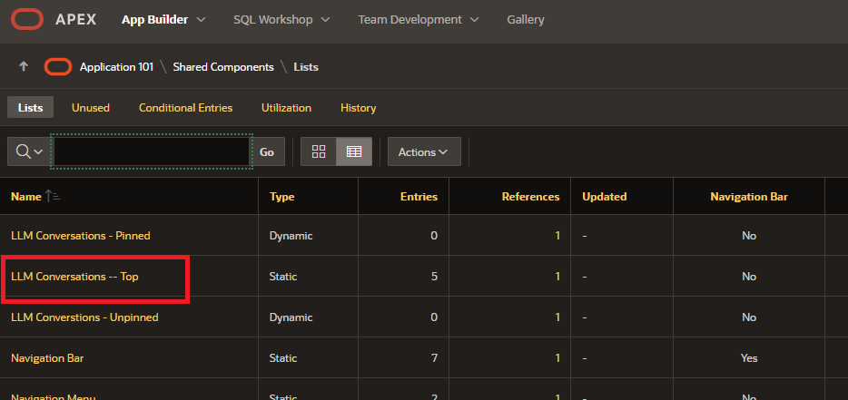

21. Edit the following at the end sequence and select **Create**.

    * **image/class:** `fa-ai-innovation-lightbulb`
    * **List Entry Label:** `Multicloud Wingmate`
    * **Page:** `13`

  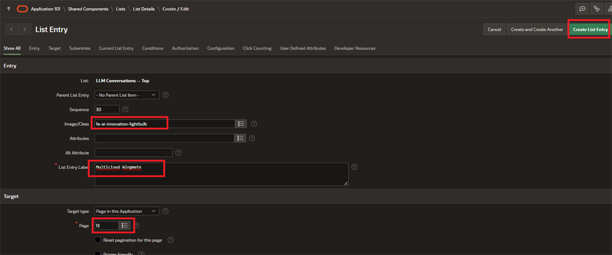

20. Open Page 13, **Multicloud Overview**, in Page Designer to verify the list entry.

21. Confirm the imported page includes a region named **WingmateChat** in the page body.

22. Select the **WingmateChat** region and confirm the region **Static ID** is `wingmate-chat`.

23. Confirm the **startWingmate** button exists in the **WingmateChat** region.

24. Confirm the imported **Chat** dynamic action is attached to the **startWingmate** button.

25. Confirm the **Show AI Assistant** true action exists. You will connect this action to `wingmate_multicloud_rag` after creating the AI Configuration.

26. Confirm the **Hide** action targets the **startWingmate** button, then save the page.

27. Create Resource Analytics adapter views for the Multicloud page.

	The Multicloud page uses the same chart and assistant patterns as the original host-insights demo, but this lab should use Resource Analytics data by default. Run the following SQL as `WINGMATE` to create app-owned views over the Resource Analytics materialized views from Lab 1.

	> **Note:** In APEX SQL Commands, run each `CREATE OR REPLACE VIEW` statement below separately. If you use SQL Worksheet, SQL Developer, or SQLcl, you can also paste all statements into a script and run them together.

	Create the base Resource Analytics host insights view.

	```
	<copy>
	CREATE OR REPLACE VIEW ra_hostinsights_base_v AS
	SELECT i.id AS instance_id,
	       i.display_name AS hostname,
	       NVL(i.lifecycle_state, 'UNKNOWN') AS lifecycle_state,
	       i.region,
	       i.availability_domain,
	       i.shape,
	       c.name AS compartment_name,
	       NVL(i.shape_config_ocpus, f.ocpu_usage) AS cpu_capacity,
	       CASE
	           WHEN i.lifecycle_state = 'RUNNING'
	           THEN NVL(f.ocpu_usage, i.shape_config_ocpus)
	           ELSE 0
	       END AS cpu_usage,
	       NVL(i.shape_config_memory_in_gbs, f.memory_usage_mb / 1024) AS memory_capacity,
	       CASE
	           WHEN i.lifecycle_state = 'RUNNING'
	           THEN NVL(f.memory_usage_mb / 1024, i.shape_config_memory_in_gbs)
	           ELSE 0
	       END AS memory_usage,
	       NVL(f.attached_volumes_count, 0) AS attached_volumes_count,
	       i.time_created,
	       i.ocira_update_date
	FROM mv_compute_instance_dim_v i
	LEFT JOIN mv_compute_fact_v f
	    ON f.instance_id = i.id
	LEFT JOIN mv_compartment_dim_v c
	    ON c.id = i.compartment_id
	WHERE NVL(i.lifecycle_state, 'UNKNOWN') <> 'TERMINATED';
	</copy>
	```

	Create the report period view.

	```
	<copy>
	CREATE OR REPLACE VIEW ra_hostinsights_report_period AS
	SELECT hostname,
	       region,
	       availability_domain,
	       compartment_name,
	       lifecycle_state,
	       shape,
	       'OCPU' AS usageunit,
	       'Configured OCPU' AS resourcemetric,
	       cpu_capacity AS capacity,
	       cpu_usage AS usage,
	       time_created,
	       ocira_update_date
	FROM ra_hostinsights_base_v
	UNION ALL
	SELECT hostname,
	       region,
	       availability_domain,
	       compartment_name,
	       lifecycle_state,
	       shape,
	       'GB' AS usageunit,
	       'Configured Memory' AS resourcemetric,
	       memory_capacity AS capacity,
	       memory_usage AS usage,
	       time_created,
	       ocira_update_date
	FROM ra_hostinsights_base_v;
	</copy>
	```

	Create the CPU summary view.

	```
	<copy>
	CREATE OR REPLACE VIEW ra_hostinsights_cpu_usage_summary AS
	SELECT SUM(cpu_usage) AS usage,
	       SUM(cpu_capacity) AS capacity
	FROM ra_hostinsights_base_v;
	</copy>
	```

	Create the memory summary view.

	```
	<copy>
	CREATE OR REPLACE VIEW ra_hostinsights_memory_usage_summary AS
	SELECT SUM(memory_usage) AS usage,
	       SUM(memory_capacity) AS capacity
	FROM ra_hostinsights_base_v;
	</copy>
	```

	Create the CPU per-host statistics view.

	```
	<copy>
	CREATE OR REPLACE VIEW ra_hostinsights_res_stat AS
	SELECT hostname,
	       cpu_capacity AS capacity,
	       cpu_usage AS usage,
	       ROUND(AVG(cpu_usage) OVER (), 2) AS average,
	       CASE
	           WHEN cpu_capacity > 0 THEN ROUND(cpu_usage / cpu_capacity * 100, 2)
	           ELSE 0
	       END AS utilizationpercent,
	       0 AS usagechangepercent,
	       region,
	       shape,
	       compartment_name,
	       lifecycle_state
	FROM ra_hostinsights_base_v
	WHERE cpu_capacity IS NOT NULL;
	</copy>
	```

	Create the memory per-host statistics view.

	```
	<copy>
	CREATE OR REPLACE VIEW ra_hostinsights_res_stat_memory AS
	SELECT hostname,
	       memory_capacity AS capacity,
	       memory_usage AS usage,
	       ROUND(AVG(memory_usage) OVER (), 2) AS average,
	       CASE
	           WHEN memory_capacity > 0 THEN ROUND(memory_usage / memory_capacity * 100, 2)
	           ELSE 0
	       END AS utilizationpercent,
	       0 AS usagechangepercent,
	       region,
	       shape,
	       compartment_name,
	       lifecycle_state
	FROM ra_hostinsights_base_v
	WHERE memory_capacity IS NOT NULL;
	</copy>
	```

	Create the host insights assistant context view.

	```
	<copy>
	CREATE OR REPLACE VIEW ra_hostinsights_report_sv AS
	WITH summary AS (
	    SELECT 'Compute inventory summary: '
	           || COUNT(*) || ' non-terminated instances; '
	           || SUM(CASE WHEN lifecycle_state = 'RUNNING' THEN 1 ELSE 0 END) || ' running; running OCPUs '
	           || ROUND(SUM(cpu_usage), 2) || ' of configured '
	           || ROUND(SUM(cpu_capacity), 2) || '; running memory GB '
	           || ROUND(SUM(memory_usage), 2) || ' of configured '
	           || ROUND(SUM(memory_capacity), 2) || '.' AS summary_text
	    FROM ra_hostinsights_base_v
	),
	host_lines AS (
	    SELECT LISTAGG(
	               '- hostname: ' || hostname
	               || '; lifecycle_state: ' || lifecycle_state
	               || '; configured_ocpus: ' || ROUND(cpu_capacity, 2)
	               || '; running_ocpus: ' || ROUND(cpu_usage, 2)
	               || '; configured_memory_gb: ' || ROUND(memory_capacity, 2)
	               || '; running_memory_gb: ' || ROUND(memory_usage, 2)
	               || '; region: ' || region
	               || '; shape: ' || shape,
	               CHR(10)
	           ) WITHIN GROUP (
	               ORDER BY cpu_usage ASC NULLS FIRST,
	                        cpu_capacity DESC NULLS LAST,
	                        hostname
	           ) AS host_detail_text
	    FROM (
	        SELECT *
	        FROM ra_hostinsights_base_v
	        ORDER BY cpu_usage ASC NULLS FIRST,
	                 cpu_capacity DESC NULLS LAST,
	                 hostname
	        FETCH FIRST 50 ROWS ONLY
	    )
	)
	SELECT summary.summary_text
	       || CHR(10) || CHR(10)
	       || 'Host allocation details sorted by lowest running OCPU allocation first:'
	       || CHR(10)
	       || host_lines.host_detail_text AS context_prompt
	FROM summary
	CROSS JOIN host_lines;
	</copy>
	```

	Create the multicloud assistant context view.

	```
	<copy>
	CREATE OR REPLACE VIEW ra_multicloud_details_v AS
	SELECT 'Resource Analytics multicloud summary: '
	       || COUNT(*) || ' non-terminated compute instances across '
	       || COUNT(DISTINCT region) || ' region(s), '
	       || COUNT(DISTINCT compartment_name) || ' compartment(s), and '
	       || COUNT(DISTINCT shape) || ' shape(s). Running configured capacity is '
	       || ROUND(SUM(cpu_usage), 2) || ' OCPUs and '
	       || ROUND(SUM(memory_usage), 2) || ' GB memory. Total configured capacity is '
	       || ROUND(SUM(cpu_capacity), 2) || ' OCPUs and '
	       || ROUND(SUM(memory_capacity), 2) || ' GB memory.'
	       AS context_prompt
	FROM ra_hostinsights_base_v;
	</copy>
	```

	Create the multicloud inventory report view.

	```
	<copy>
	CREATE OR REPLACE VIEW ra_multicloud_inventory_v AS
	SELECT 'Compute Instance' AS resource_type,
	       hostname AS resource_name,
	       region,
	       compartment_name AS compartment,
	       lifecycle_state,
	       shape AS resource_shape,
	       TO_CHAR(cpu_capacity) || ' OCPU / '
	           || TO_CHAR(memory_capacity) || ' GB memory' AS resource_summary
	FROM ra_hostinsights_base_v
	UNION ALL
	SELECT 'Attached Volume' AS resource_type,
	       volume_display_name AS resource_name,
	       region,
	       instance_compartment AS compartment,
	       volume_lifecycle_state AS lifecycle_state,
	       volume_attachment_type AS resource_shape,
	       TO_CHAR(volume_size_in_gbs) || ' GB volume attached to '
	           || instance_name AS resource_summary
	FROM mv_instance_volume_details_v
	WHERE volume_id IS NOT NULL;
	</copy>
	```

	Use these Resource Analytics adapter views in the page SQL. Keep the original synthetic `HOSTINSIGHTS_*`, `OCI_EXA_*`, `OCI_CDB`, and `OCI_PDB` objects as an optional backup only when Resource Analytics has no rows or when you need predictable demo forecast data.

	> **Flat-file fallback:** If your environment uses the uploaded flat files instead of Resource Analytics materialized views, skip the `RA_*` adapter views and use the fallback queries called out in the remaining steps.

28. Create and validate the synthetic multicloud graph.

    The APEX Graph Visualization region queries `GRAPH_TABLE(MULTICLOUD_GRAPH ...)`. The graph is not loaded from the empty `cdb_pdb_graph_*.xlsx` metadata exports, and it is not generated by `ORA_SQLGRAPH_TO_JSON`. `ORA_SQLGRAPH_TO_JSON` is a rendering helper used by the graph plug-in after a SQL property graph already exists.

    In SQL Developer Web or APEX SQL Workshop, open `wingmate_data/sql/wingmate-multicloud-graph.sql` and run the script as `WINGMATE`. The script creates relationship tables for Exadata Infrastructure to VM Cluster, VM Cluster to CDB, and CDB to PDB relationships. It then creates `MULTICLOUD_GRAPH` over the loaded synthetic `OCI_EXA_INFR`, `OCI_EXA_VM_CLUSTER`, `OCI_CDB`, and `OCI_PDB` tables.

    At the end of the script, confirm that the graph query returns rows:

    ```
    <copy>
    SELECT *
    FROM GRAPH_TABLE(MULTICLOUD_GRAPH
        MATCH (a) -[e]-> (b) -[f]-> (c) -[g]-> (d)
        COLUMNS(
            vertex_id(a) AS aid,
            edge_id(e) AS eid,
            vertex_id(b) AS bid,
            edge_id(f) AS fid,
            vertex_id(c) AS cid,
            edge_id(g) AS gid,
            vertex_id(d) AS did
        )
    );
    </copy>
    ```

29. Navigate to **Shared Components**, then **AI Configurations**.

	> **Note:** APEX 24.2 uses **AI Configurations** and **RAG Sources**. In APEX 26.1, the same capability appears under AI Agent tooling. Use the labels shown in your APEX environment, but keep the static ID values in this lab unchanged.

30. Create an AI Configuration with these values:

	* **Name:** `Multicloud Wingmate RAG`
	* **Static ID:** `wingmate_multicloud_rag`
	* **System Prompt:** `You are OCI Multicloud Wingmate. Answer capacity, allocation, inventory, and documentation-reference questions using the configured RAG sources. Treat Resource Analytics host insights data as configured capacity and running allocation, not live OCI Monitoring metrics. Be concise and say when retrieved context is insufficient.`
	* **Welcome Message:** `Welcome! Begin chatting with OCI Multicloud Wingmate about capacity, allocation, inventory, and documentation-reference questions.`

    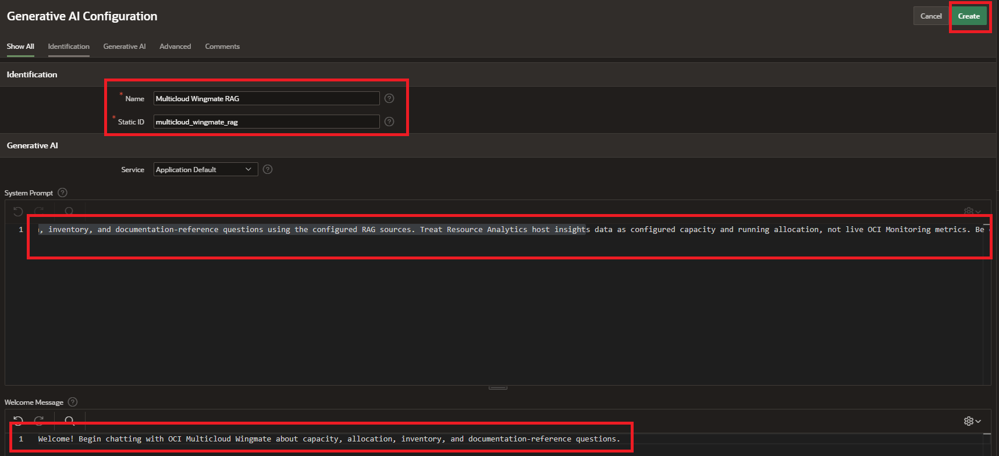

31. Add SQL-based RAG Sources to `wingmate_multicloud_rag`:

	```
	<copy>
	SELECT context_prompt
	FROM ra_hostinsights_report_sv
	</copy>
	```

    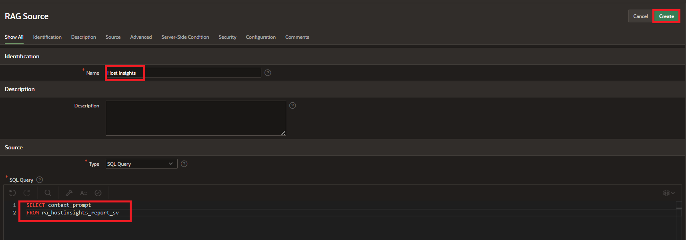

	```
	<copy>
	SELECT context_prompt
	FROM ra_multicloud_details_v
	</copy>
	```

    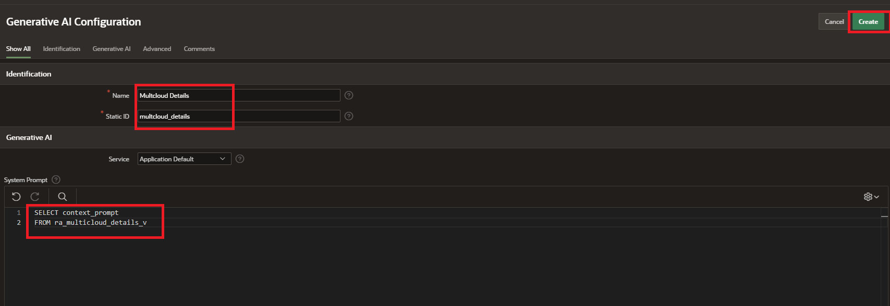

	```
	<copy>
	SELECT context_prompt
	FROM oci_doc_ref_compute_sv
	</copy>
	```

    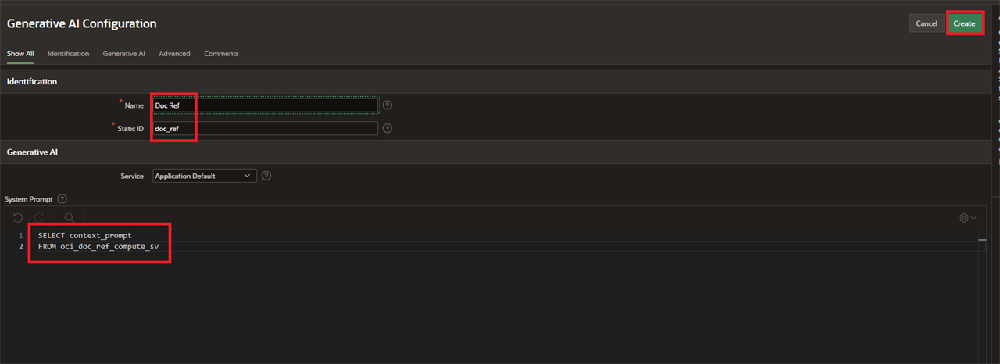

	**Flat-file fallbacks:**

	```
	<copy>
	SELECT context_prompt
	FROM hostinsights_report_sv
	</copy>
	```

	```
	<copy>
	SELECT context_prompt
	FROM cis_multicloud_details_v
	</copy>
	```

32. Navigate to SQL Commands in the SQL Workshop and validate the RAG source SQL as `WINGMATE`.

	```
	<copy>
	SELECT 'host_insights' AS source_name, context_prompt
	FROM ra_hostinsights_report_sv
	UNION ALL
	SELECT 'multicloud_summary' AS source_name, context_prompt
	FROM ra_multicloud_details_v
	UNION ALL
	SELECT 'doc_ref_compute' AS source_name, context_prompt
	FROM oci_doc_ref_compute_sv;
	</copy>
	```

    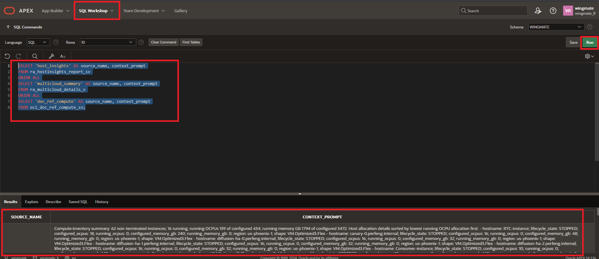

33. Configure the imported AI Assistant action by navigating to **Show AI Assistant** in the navigation tree under the Multicloud chat region: **startWingmate** -> **Chat** -> **Show AI Assistant**.

	Configure the action:

	* **Configuration:** `wingmate_multicloud_rag`
	* **Display As:** `Inline`
	* **Container Selector:** `#wingmate-chat`

	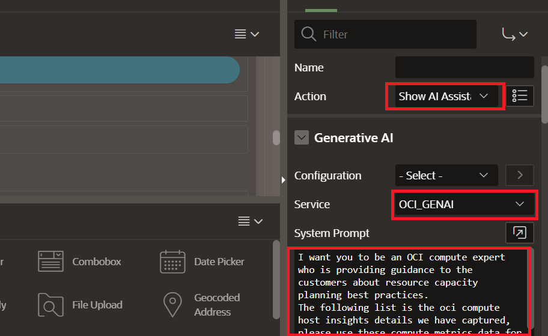

	Under **Quick Actions**, add these messages:

	* **Message 1:** `What are the allocated CPUs for the hosts with the hostname?`
	* **Message 2:** `Which hostnames have the lowest or zero running OCPU allocation?`

	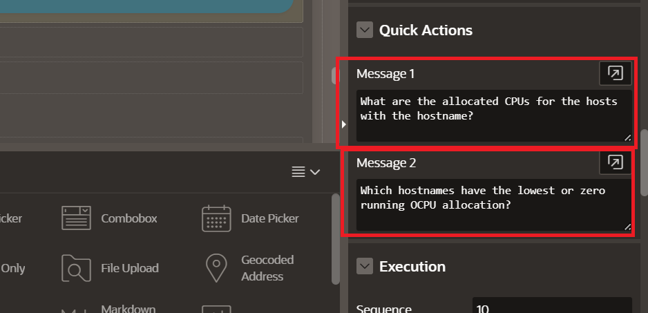

34. Save the page.

35. Create a **Classic Report** region for the Multicloud inventory summary.

	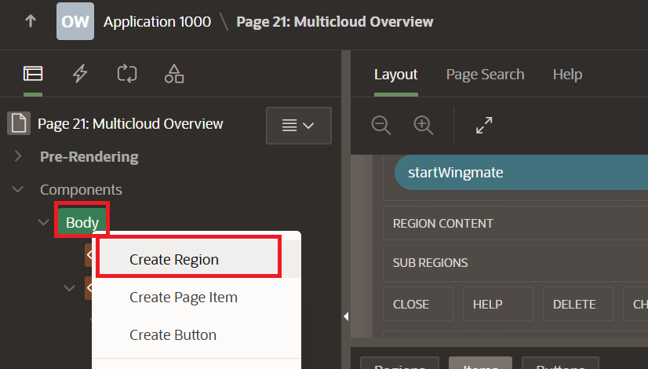

36. Name the report **MultiCloud Insights** and set the **SQL Query** to the following:

	```
	<copy>
	SELECT *
	FROM ra_multicloud_inventory_v
	</copy>
	```

	**Flat-file fallback:**

	```sql
	<copy>
	SELECT *
	FROM oci_exa_infr
	UNION
	SELECT *
	FROM oci_exa_vm_cluster
	UNION
	SELECT *
	FROM oci_cdb
	UNION
	SELECT *
	FROM oci_pdb
	</copy>
	```

	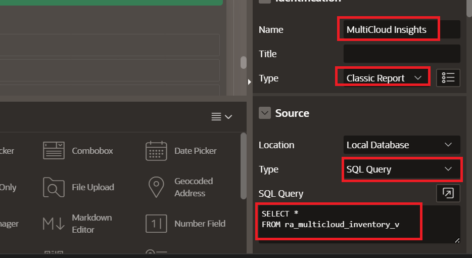

	> **Note:** This report serves as the bottom of the dashboard. Place the host insights regions you create later above this table.

## Task 2: Generate Report Period View

> **SME Gate:** Confirm all table and view names used by the host-insights and multicloud reports, charts, AI Configuration RAG sources, and source SQL.

1. Create a table for viewing the host period by creating a region to contain it. Expand the **bottom module** (if not open) by selecting the arrow at the bottom center of the screen. Select **Regions** and pick the **Help** icon. Drop it under the Chat Region.

	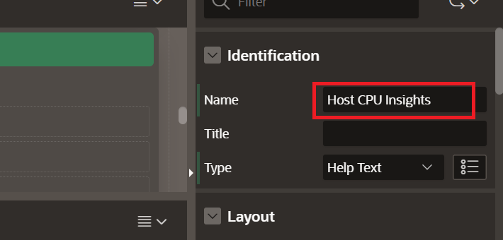

2. Name it **Host CPU Insights**.

	

3. Drag and drop **Classic Report** into the body of the newly created region.

	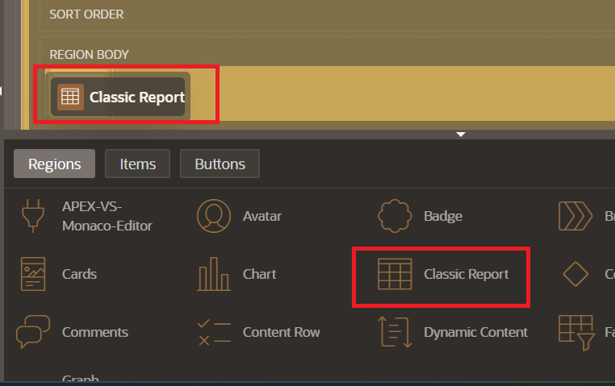

4. Name the Report **ReportPeriod** and select the table **RA_HOSTINSIGHTS_REPORT_PERIOD**.

	**Flat-file fallback:** Select **HOSTINSIGHTS_REPORT_PERIOD** instead.

	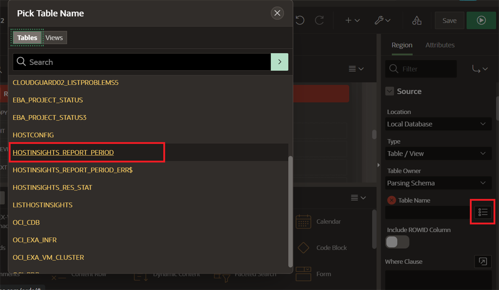

5. Expand the ReportPeriod columns by clicking **the arrow** and and right-click **USAGEUNIT** and **RESOURCEMETRIC**, selecting **Comment Out**.

	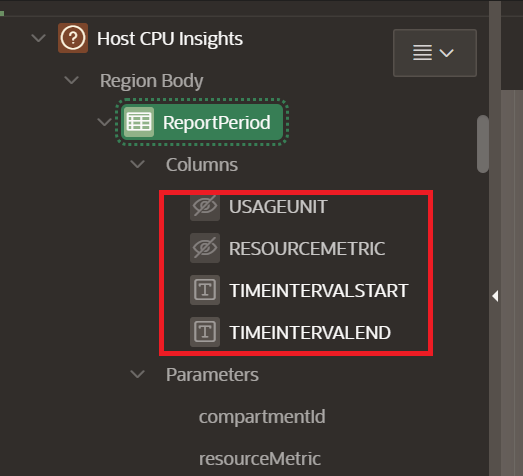

## Task 3: Learn how to create Host Insights Widgets

> **Note:** This task is for only educational purposes. The Page import creates all of this content for you.

1. Drag and drop **Static Content** into the sub-region. Name the region **HOST INSIGHTS Metrics**.

	

2. Drag and drop **Chart** in the sub region of the HOST INSIGHTS Metrics static content. Name it **CPU Usage over Capacity**

	

3. Select **Attributes** at the top of the right module and change the chart type to **Status Gauge**. 

	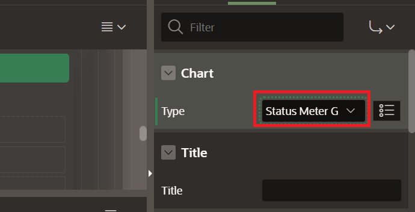

4. Update the style of the gauge by scrolling down on the right and change the **Indicator Size** to **.5** and **Inner Radius** to **.9**.

	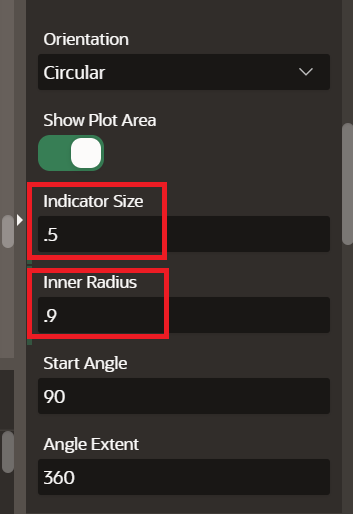

5. Scroll down more change **Value** and **Format** to **Percent** with 0 decimal places.

	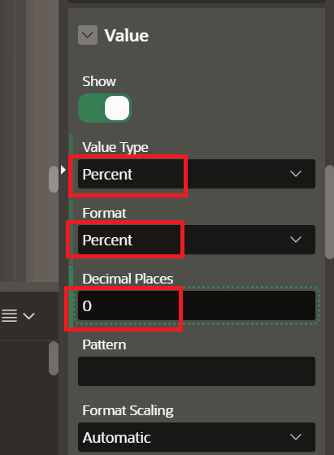

6. Select **Series** under the chart created and name it **CPU Metrics**. Change from Table/View to **SQL Query** and paste the following:

	```
	<copy>
	SELECT usage as cpu_usage, capacity as cpu_capacity FROM RA_HOSTINSIGHTS_CPU_USAGE_SUMMARY
	</copy>
	```

	**Flat-file fallback:**

	```sql
	<copy>
	SELECT usage AS cpu_usage, capacity AS cpu_capacity
	FROM hostinsights_cpu_usage_summary
	</copy>
	```

	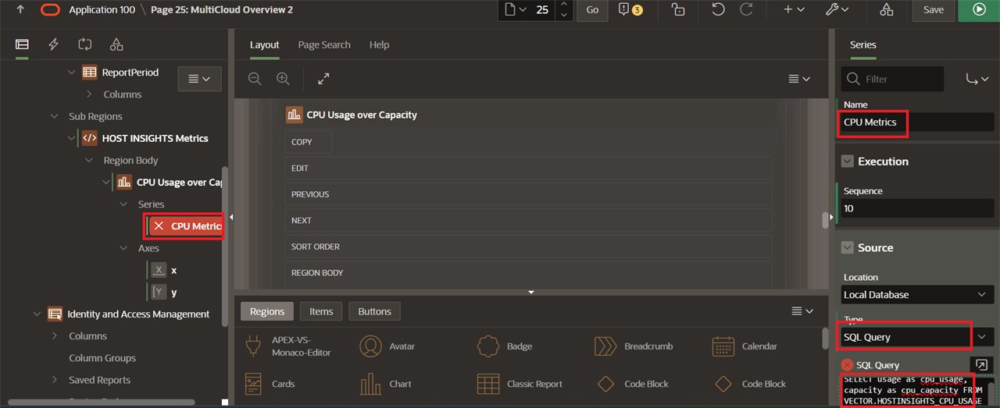

7. Scroll down and add a mapping of **CPU Usage** for **Label** and **Value** and **CPU Capacity** for **Maximum Value**.  

	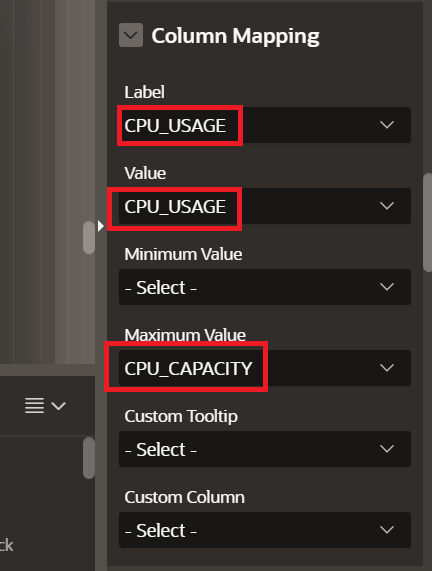

8. Right-click to duplicate the **CPU Usage Over Capacity** gauge. Update the **Name** to **Memory Usage over Capacity**. Select **Attributes** and adjust the gauge size:
	* Indicator Size: **.5**
	* Inner Radius: **.6**

	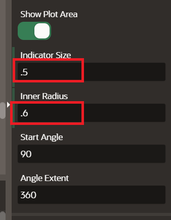

9. Select Series and rename it **Memory Metrics**. Update the SQL Query to the following:

	```
	<copy>
	SELECT usage as mem_usage, capacity as mem_capacity FROM RA_HOSTINSIGHTS_MEMORY_USAGE_SUMMARY
	</copy>
	```

	**Flat-file fallback:**

	```sql
	<copy>
	SELECT usage AS mem_usage, capacity AS mem_capacity
	FROM hostinsights_memory_usage_summary
	</copy>
	```

	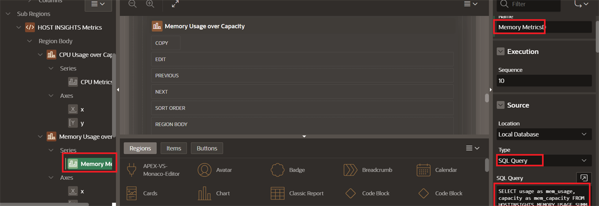

10. Scroll down and change the mapping with **Memory Usage** for **Label** and **Value** and **Memory Capacity** for **Maximum Value**. 

	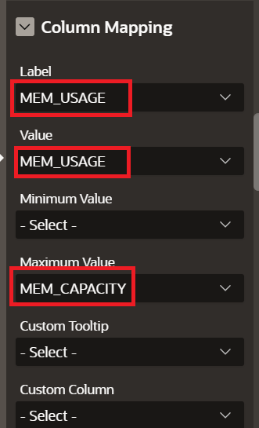

Next, Visuals for Host Insights across both CPU and Memory will be generated.

## Task 4: Compare Insights Across CPU and Memory

1. Drag and drop another **Static Region** into the same region **Host CPU Insights**. Name this Sub Region **HOST INSIGHTS CPU and MEMORY**. 

	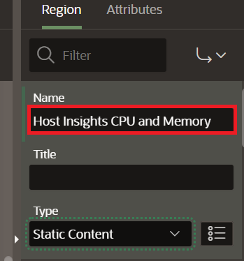

2. Drag and drop a chart into the Body and name it **CPU Usage across Host**. 

	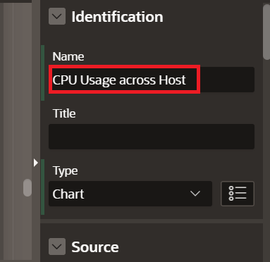

3. Select Attributes and change it to **Pie**. 

	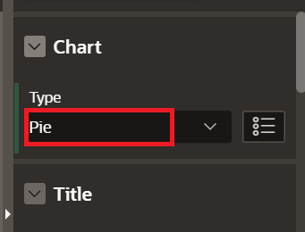

4. Scroll down and toggle off **Dim On Hover** and select **Highlight and Explode** for **Settings**.

	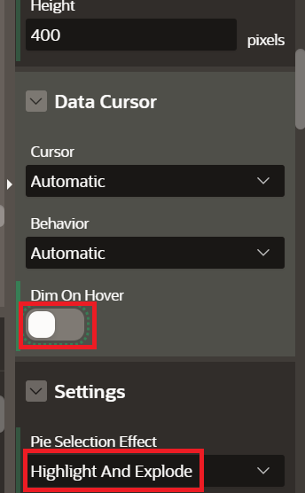

5. For the series, name it **Tasks**. Add the following **SQL Query**:

	```
	<copy>
	SELECT
    hostname,
    capacity,
    usage,
    average,
    usagechangepercent
	FROM
    ra_hostinsights_res_stat
	</copy>
	```

	**Flat-file fallback:**

	```sql
	<copy>
	SELECT
    hostname,
    capacity,
    usage,
    average,
    usagechangepercent
	FROM
    hostinsights_res_stat
	</copy>
	```

	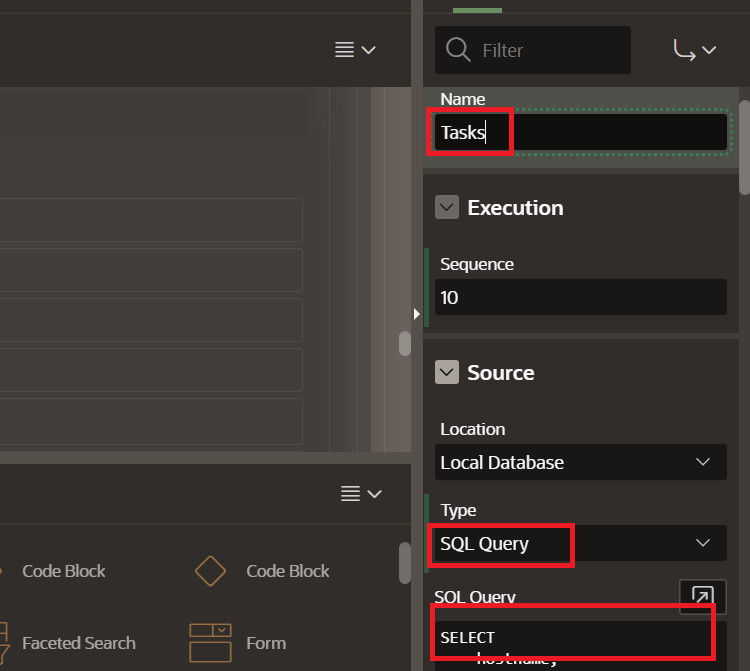

6. Scroll down and Select **HOSTNAME** for Label and **USAGE** for Value.

	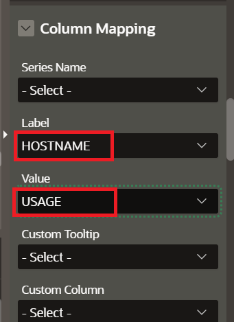

7. Drag and drop a second chart next to CPU Usage across Hosts and name it **Key Metrics Distribution**.

	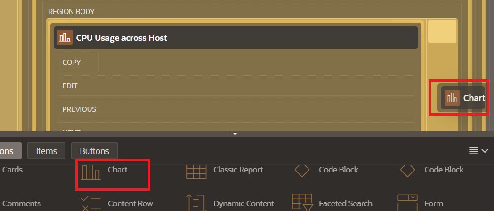

8. Select **Attributes** and change chart type to **Polar**.

	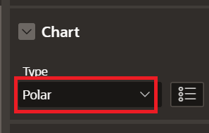

9. Scroll down and toggle **Stack** under Appearance to **ON**.

	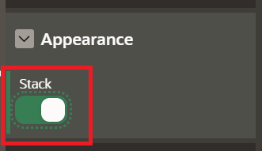

10. Update the series name to **CPU Utilization** and change the type to **Line with Area**.

11. Update the **CPU Utilization SQL Query** to match:

	```
	<copy>
	select HOSTNAME, 
       UTILIZATIONPERCENT AS CPU_UTIL, 
       'CPU Utilization' as MetricType
	from RA_HOSTINSIGHTS_RES_STAT
	</copy>
	```

	**Flat-file fallback:**

	```sql
	<copy>
	select HOSTNAME,
       UTILIZATIONPERCENT AS CPU_UTIL,
       'CPU Utilization' as MetricType
	from hostinsights_res_stat
	</copy>
	```

	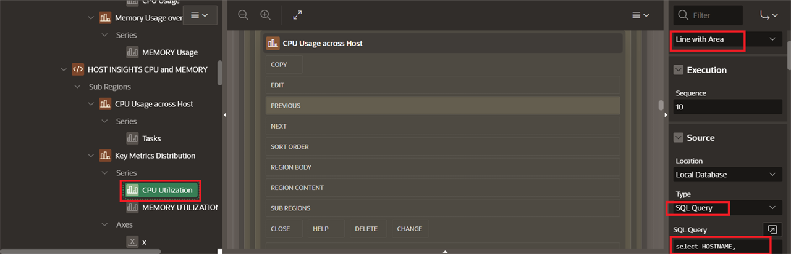

12. Scroll down and update the mapping to the following:
	* Label: **HOSTNAME**
	* Value: **CPU_UTIL**

	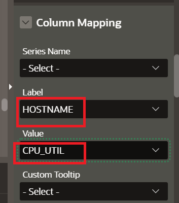

13. Right-click **Series** and select **Create Series**.

	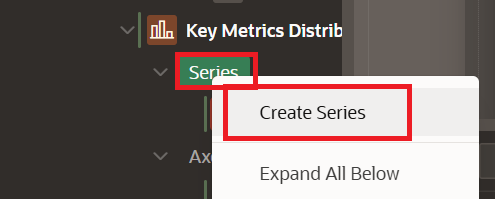

14. Name the Series **Memory Utilization** and change **Type** to **Line with Area**.

	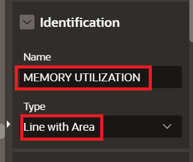

15. Scroll down and change **Type** to **SQL Query** and paste the following into the query box:

	```
	<copy>
	select HOSTNAME, 
		UTILIZATIONPERCENT AS MEM_UTIL, 
		'MEMORY Utilization' as MetricType
	from RA_HOSTINSIGHTS_RES_STAT_MEMORY
	</copy>
	```

	**Flat-file fallback:**

	```sql
	<copy>
	select HOSTNAME,
		UTILIZATIONPERCENT AS MEM_UTIL,
		'MEMORY Utilization' as MetricType
	from hostinsights_res_stat_memory
	</copy>
	```

	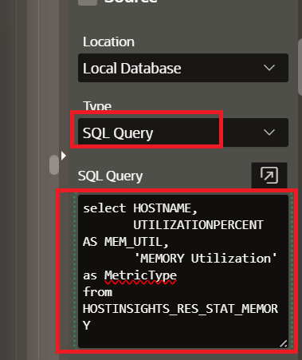

16. Right-click **CPU Usage across Hosts** and select **Duplicate**. Rename the new chart: **Memory Usage across Hosts**.

	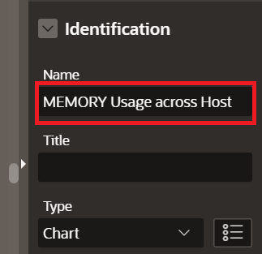

17. Select the **Tasks** Series and update the SQL Query to the following:

	```
	<copy>
	SELECT
    hostname,
    capacity,
    usage,
    average,
    usagechangepercent
	FROM
    ra_hostinsights_res_stat_memory
	</copy>
	```

	**Flat-file fallback:**

	```sql
	<copy>
	SELECT
    hostname,
    capacity,
    usage,
    average,
    usagechangepercent
	FROM
    hostinsights_res_stat_memory
	</copy>
	```

	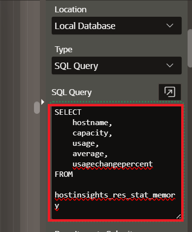

18. Adjust the charts to be aligned on the horizontal axis by selecting the new chart in the center module and dragging it to the right of the **Key Metrics Distribution Chart**.

	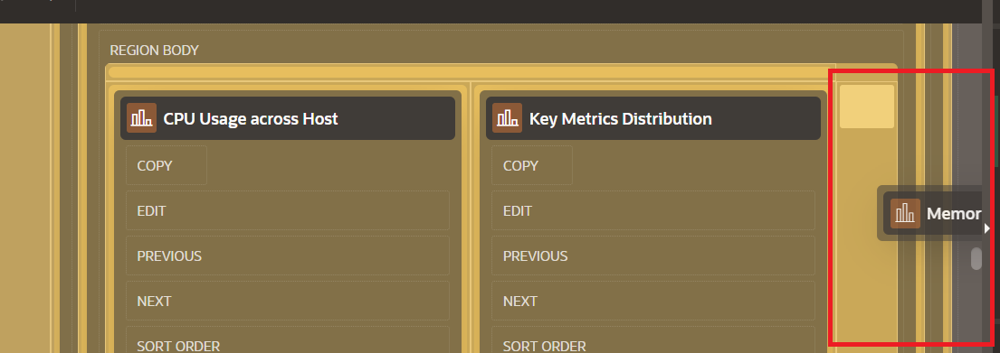

## Task 5: Optionally Visualize CPU Combinations for Historical and Forecasting Analysis

> **Optional forecast data:** The Resource Analytics adapter views created earlier in this lab use current inventory, configured capacity, and current allocation measures. They do not provide the historical CPU metric samples or projected forecast JSON used by the charts in this task. Use this task only when you have loaded forecast-ready host metric data.

This task is simplified with bundled flat-file data so every learner can build the same historical and forecast chart without first configuring metric collection. Keep the simplified lab path separate from the optional real-data path:

* **Simplified lab path:** Use the synthetic `HOSTINSIGHTS_CPU_FORECAST_TREND` flat-file data loaded from `wingmate_data.zip`. This data already includes historical and projected values in the table shape used by the chart SQL below.
* **Resource Analytics path:** Use Resource Analytics for inventory, compartments, shapes, configured capacity, and current allocation measures. Resource Analytics helps identify which compute resources exist, but the adapter views in this lab are not a historical CPU metric feed.
* **Optional real-history path:** Use OCI Monitoring or Operations Insights when you want real CPU history. These services provide the timestamped metric samples that can be loaded, modeled, and transformed into the chart table used below. Resource Analytics can help identify the target resources, but it does not replace Monitoring or Operations Insights for historical samples.

To use real metric history instead of the bundled demo data:

* Load rows with at least `HOSTNAME`, `SAMPLE_TS`, and `CPU_USAGE_PERCENT`.
* If you want an in-database forecast, run an Oracle Machine Learning for SQL time-series model, such as Exponential Smoothing, against those ordered historical samples. OML can forecast from history, but it cannot create a forecast from a single Resource Analytics inventory snapshot.
* Transform the historical and projected rows into the `HOSTINSIGHTS_CPU_FORECAST_TREND` shape used below, with `HISTORICALDATA` and `PROJECTEDDATA` JSON arrays.
* Keep the chart SQL in this task unchanged after your real data is mapped into that table shape.

1. Drag and drop a **static region** into the body of **Host CPU Insights** and name it **CPU Combination Chart**.

	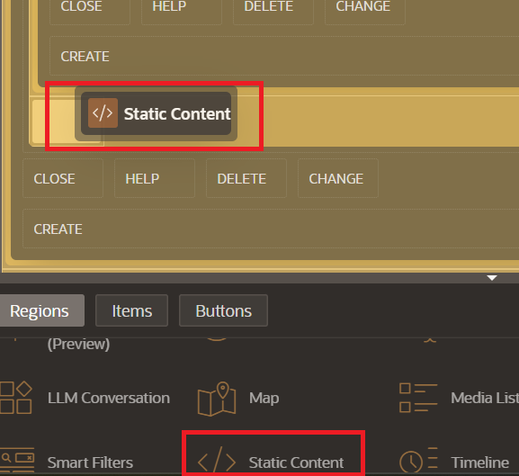

	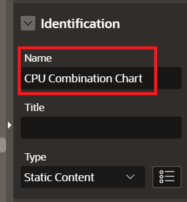

2. Drag and drop a **chart** into the body of **CPU Combination Chart** region. Name it **CPU Usage Historic and Forecast**.

	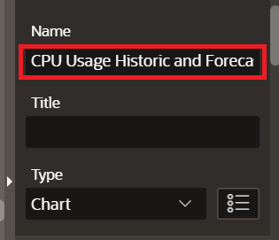

3. Change the chart type to **Combination**.

	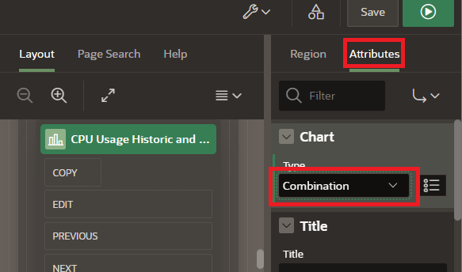

4. Untoggle the **Dim on Hover** to off.

	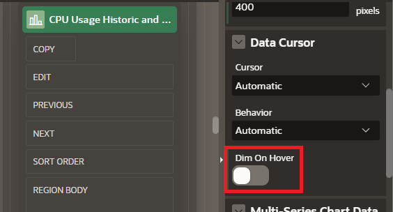

5. Select the **Series** and rename it to **CPU Historic Usage**.

	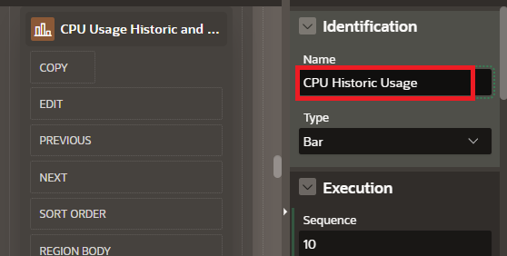

6. Scroll down and paste the following SQL Query:

	```
	<copy>
	SELECT 
    to_char(cut.endTimestamp, 'DD-MON-YYYY HH24:MI:SS') AS HISTORIC_TIMESTAMP,
    cut.usage as historical_usage,
    'CPU Historic Usage' as CPU_HIST
	FROM 
    HOSTINSIGHTS_CPU_FORECAST_TREND CPU_FORECAST_TREND,
    JSON_TABLE(
        CPU_FORECAST_TREND.HISTORICALDATA,
        '$[*]' 
        COLUMNS (
            endTimestamp DATE PATH '$.endTimestamp',
            usage NUMBER PATH '$.usage'
        )
    ) cut
	ORDER BY cut.endTimestamp ASC
	</copy>
	```

	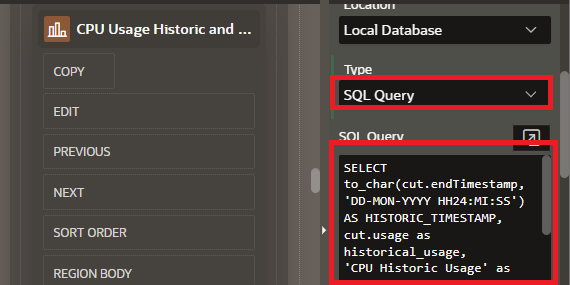

7. Scroll down and update the **Column Mapping** to the following:
		* Label: **HISTORIC_TIMESTAMP**
		* Value: **HISTORICAL_USAGE**

	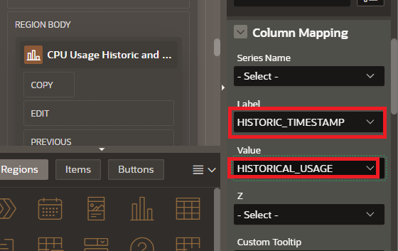

8. Right-click **Series** and select **Create Series**.

	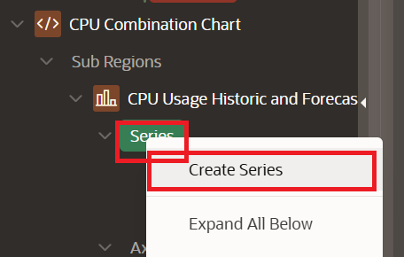

9. Name the new series **CPU Forecast Usage** and select the type as **Line with Area**

	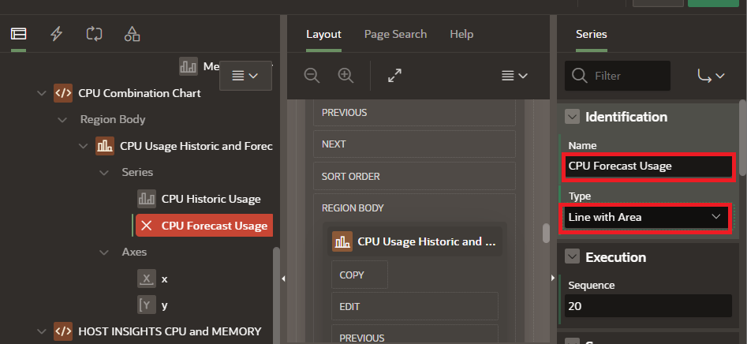

10. Scroll down and change the source to **SQL Query** and paste the following SQL Query:

	```
	<copy>
	SELECT 
    to_char(cft.endTimestamp, 'DD-MON-YYYY HH24:MI:SS') AS PROJECTED_TIMESTAMP,
    cft.usage as projected_usage,
    cft.highValue as projected_highValue,
    cft.lowValue as projected_lowValue,
    'CPU Historic Usage' as CPU_HIST    
	FROM 
    HOSTINSIGHTS_CPU_FORECAST_TREND CPU_FORECAST_TREND,
    JSON_TABLE(
        CPU_FORECAST_TREND.PROJECTEDDATA,
        '$[*]' 
        COLUMNS (
            endTimestamp DATE PATH '$.endTimestamp',
            usage NUMBER PATH '$.usage',
            highValue NUMBER PATH '$.highValue',
            lowValue NUMBER PATH '$.lowValue'
        )
    ) cft
	ORDER BY cft.endTimestamp ASC
	</copy>
	```

	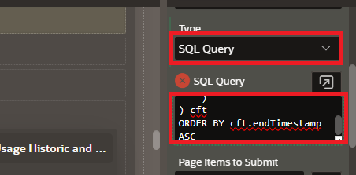

11. Drag and drop a **Chart** inside the body of **CPU Combination Chart** region. 

	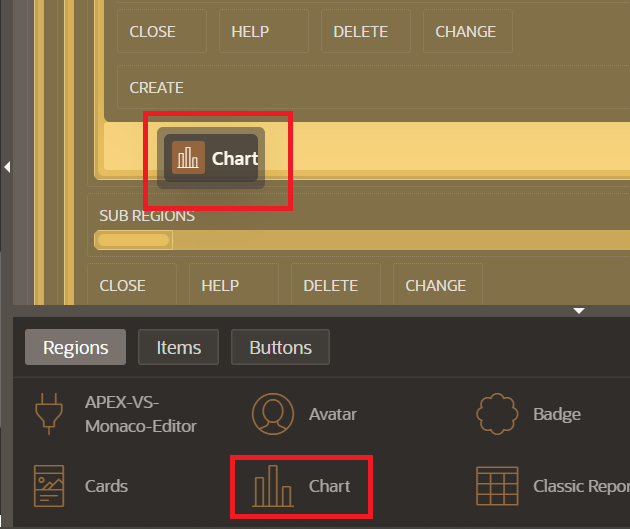

12. Name the chart **CPU Usage Historic and Forecast - Mixed Frequency**.

	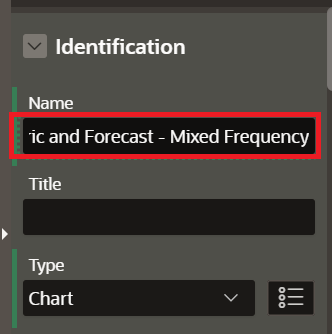

13. Select **Attributes** and change the Type to **Combination**.

	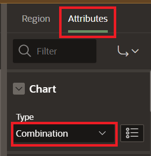

14. Scroll down and change the settings for Time Axis Type to **Mixed Frequency**.

	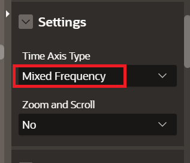

15. Select the **Series** and change the name to **CPU Historic Usage**. 

	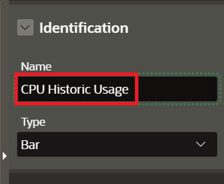

16. Scroll down and select **SQL Query** and paste the following SQL:

	```
	<copy>
	SELECT 
    to_char(cut.endTimestamp, 'DD-MON-YYYY HH24:MI:SS') AS HISTORIC_TIMESTAMP,
    cut.usage as historical_usage,
    'CPU Historic Usage' as CPU_HIST
	FROM 
    HOSTINSIGHTS_CPU_FORECAST_TREND CPU_FORECAST_TREND,
    JSON_TABLE(
        CPU_FORECAST_TREND.HISTORICALDATA,
        '$[*]' 
        COLUMNS (
            endTimestamp DATE PATH '$.endTimestamp',
            usage NUMBER PATH '$.usage'
        )
    ) cut
	ORDER BY cut.endTimestamp ASC
	</copy>
	```

	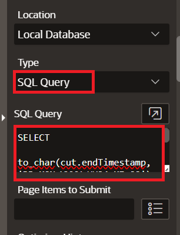

17. Scroll down and update the `label` to **Historic Timestamp** and `value` to **Historical Usage**. 

18. Right-click **Series** and select **Create Series**. 

	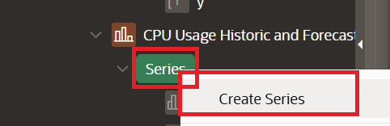

19. Name the series **CPU Forecast MAX** and change the Type to **Line**.

	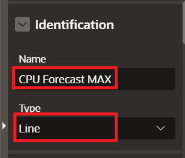

20. Scroll down and change the Source Type to **SQL Query** and paste the following in the SQL Query:

	```
	<copy>
	SELECT 
    to_char(cft.endTimestamp, 'DD-MON-YYYY HH24:MI:SS') AS PROJECTED_TIMESTAMP,
    cft.highValue as projected_highValue,
    'CPU Forecast Max Usage' as CPU_FORECAST_MAX  
	FROM 
    HOSTINSIGHTS_CPU_FORECAST_TREND CPU_FORECAST_TREND,
    JSON_TABLE(
        CPU_FORECAST_TREND.PROJECTEDDATA,
        '$[*]' 
        COLUMNS (
            endTimestamp DATE PATH '$.endTimestamp',
            usage NUMBER PATH '$.usage',
            highValue NUMBER PATH '$.highValue',
            lowValue NUMBER PATH '$.lowValue'
        )
    ) cft
	ORDER BY cft.endTimestamp ASC
	</copy>
	```

	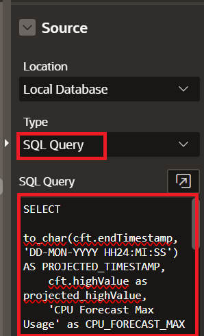

21. Scroll down and update the `label` to **Projected Timestamp** and `value` to **Projected High Value**. 

22. Right-click **Series** and select **Create Series**.

	

23. Name the series **CPU Forecast Usage** and change the Type to **Line**.

	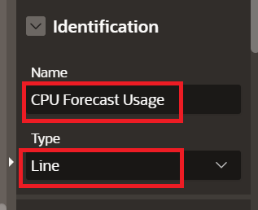

24. Scroll down and change the Source Type to **SQL Query** and paste the following in the SQL Query:

	```
	<copy>
	SELECT 
    to_char(cft.endTimestamp, 'DD-MON-YYYY HH24:MI:SS') AS PROJECTED_TIMESTAMP,
    cft.usage as projected_usage,
    cft.highValue as projected_highValue,
    cft.lowValue as projected_lowValue,
    'CPU Forecast Usage' as CPU_FORECAST
	FROM 
    HOSTINSIGHTS_CPU_FORECAST_TREND CPU_FORECAST_TREND,
    JSON_TABLE(
        CPU_FORECAST_TREND.PROJECTEDDATA,
        '$[*]' 
        COLUMNS (
            endTimestamp DATE PATH '$.endTimestamp',
            usage NUMBER PATH '$.usage',
            highValue NUMBER PATH '$.highValue',
            lowValue NUMBER PATH '$.lowValue'
        )
    ) cft
	ORDER BY cft.endTimestamp ASC
	</copy>
	```

	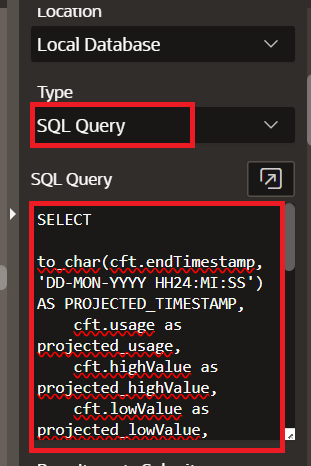

25. Scroll down and update the `label` to **Projected Timestamp** and `value` to **Projected Usage**. 

26. Right-click **Series** and select **Create Series**.

	

27. Name the series **CPU Forecast MIN** and change the Type to **Line**.

	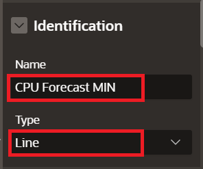

28. Scroll down and change the Source Type to **SQL Query** and paste the following in the SQL Query:

	```
	<copy>
	SELECT 
    to_char(cft.endTimestamp, 'DD-MON-YYYY HH24:MI:SS') AS PROJECTED_TIMESTAMP,
    cft.usage as projected_usage,
    cft.highValue as projected_highValue,
    cft.lowValue as projected_lowValue,
    'CPU Forecast Usage' as CPU_FORECAST
	FROM 
    HOSTINSIGHTS_CPU_FORECAST_TREND CPU_FORECAST_TREND,
    JSON_TABLE(
        CPU_FORECAST_TREND.PROJECTEDDATA,
        '$[*]' 
        COLUMNS (
            endTimestamp DATE PATH '$.endTimestamp',
            usage NUMBER PATH '$.usage',
            highValue NUMBER PATH '$.highValue',
            lowValue NUMBER PATH '$.lowValue'
        )
    ) cft
	ORDER BY cft.endTimestamp ASC
	</copy>
	```

	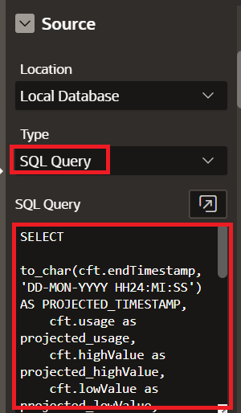

29. Scroll down and update the `label` to **Projected Timestamp** and `value` to **Projected Low Value**. 

30. Save the work by clicking the **Save button** at the top right.

	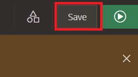

## Task 6: Operationalize MultiCloud with Property Graph

> **Note:** The Graph Visualization helper scripts and APEX plug-in were installed in Task 1 before importing the Multicloud page. This task reviews the imported graph region configuration and validates that the SQL property graph renders correctly.

> **Graph data note:** The graph visualization depends on the `MULTICLOUD_GRAPH` SQL property graph created earlier with `wingmate_data/sql/wingmate-multicloud-graph.sql`. The APEX plug-in and `ORA_SQLGRAPH_TO_JSON` render graph query results; they do not create the graph data.

> **Graph helper note:** The Graph Visualization plug-in also requires the `DBMS_GVT` package and helper functions from the Oracle APEX Graph Visualization `required-for-26ai` scripts. A package specification alone is not enough; the `DBMS_GVT` package body must be valid or the graph region can remain stuck at loading.

1. Validate that the Graph Visualization support objects are valid.

	```sql
	<copy>
	SELECT object_name, object_type, status
	FROM user_objects
	WHERE object_name IN (
	    'DBMS_GVT',
	    'ORA_SQLGRAPH_TO_JSON',
	    'ORA_GRAPH_BUILD_JSON_USING_JSON_ARRAY',
	    'APEX_SQLGRAPH_JSON',
	    'GET_GRAPH_METADATA_PROC'
	)
	ORDER BY object_name, object_type;
	</copy>
	```

	Confirm that `DBMS_GVT` has both a valid `PACKAGE` and a valid `PACKAGE BODY`.

2. Test that the helper function can convert the `MULTICLOUD_GRAPH` query to graph JSON.

	```sql
	<copy>
	SELECT JSON_VALUE(
	           apex_sqlgraph_json(q'[
	SELECT *
	FROM GRAPH_TABLE(MULTICLOUD_GRAPH
	    MATCH (a) -[e]-> (b) -[f]-> (c) -[g]-> (d)
	    COLUMNS(
	        vertex_id(a) AS aid,
	        edge_id(e) AS eid,
	        vertex_id(b) AS bid,
	        edge_id(f) AS fid,
	        vertex_id(c) AS cid,
	        edge_id(g) AS gid,
	        vertex_id(d) AS did
	    )
	)
	]'),
	           '$.graphName'
	       ) AS graph_name
	FROM dual;
	</copy>
	```

	The query should return `MULTICLOUD_GRAPH`. If it errors, fix the helper script installation before continuing.

3. Navigate back to the **MultiCloud Overview** page.

	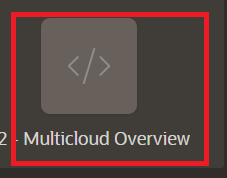

4. Select the imported **MultiCloud Insights** Graph Visualization region.

	If you are rebuilding the page manually and the region is missing, drag and drop the **Graph Visualization** plug-in from the regions object selector.

	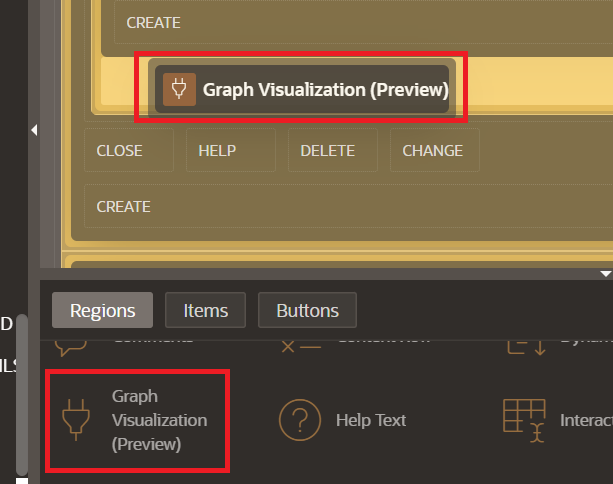

5. Confirm the region name is **MultiCloud Insights**.

	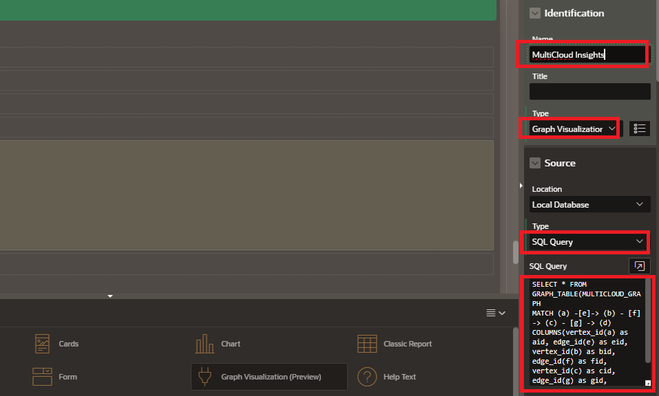

6. Confirm the Source Type is **SQL Query** and the SQL is:

	```
	<copy>
	SELECT *
	FROM GRAPH_TABLE(MULTICLOUD_GRAPH
	    MATCH (a) -[e]-> (b) -[f]-> (c) -[g]-> (d)
	    COLUMNS(
	        vertex_id(a) AS aid,
	        edge_id(e) AS eid,
	        vertex_id(b) AS bid,
	        edge_id(f) AS fid,
	        vertex_id(c) AS cid,
	        edge_id(g) AS gid,
	        vertex_id(d) AS did
	    )
	)
	</copy>
	```

	

7. Run the page and confirm the graph renders.

	If the graph toolbar appears but the graph keeps loading, open the browser developer tools and inspect the APEX AJAX response for the graph region. The most common cause is a missing or invalid `DBMS_GVT` package body or helper function.

## Task 7: Review MultiCloud Insights

1. Run the MultiCloud Wingmate page and verify the reports, forecast charts, and graph visualization render with the loaded data. Use the chat prompts to confirm the assistant answers from the host insights and documentation context.

2. Compare your completed page with the reference screenshots.

    The top of the page should show the Multicloud overview, assistant entry point, and the first summary regions.

    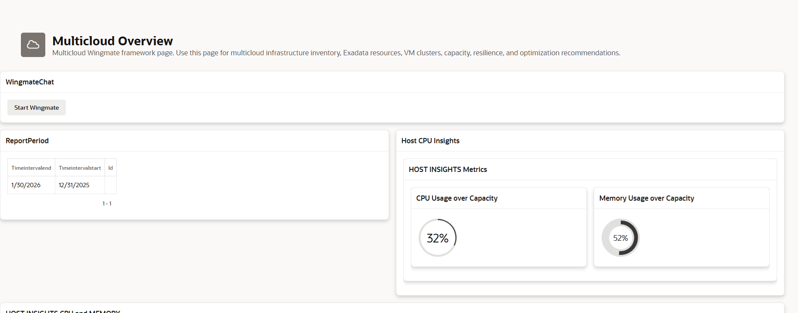

    The middle of the page should show the imported Multicloud analysis regions and supporting visual widgets.

    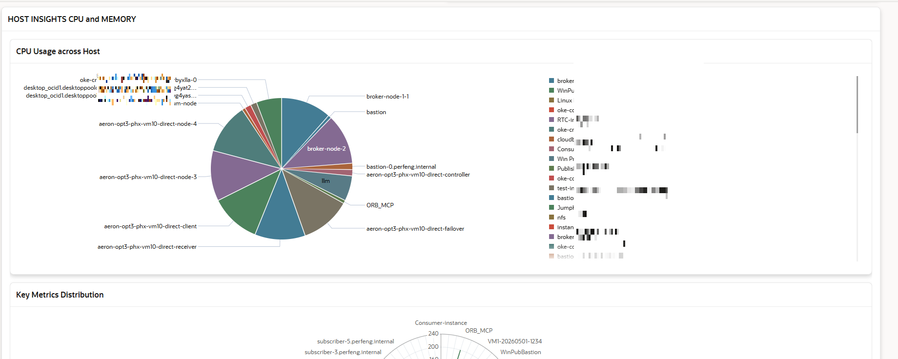

    Continue reviewing the middle section to confirm the remaining Multicloud widgets render with the loaded data.

    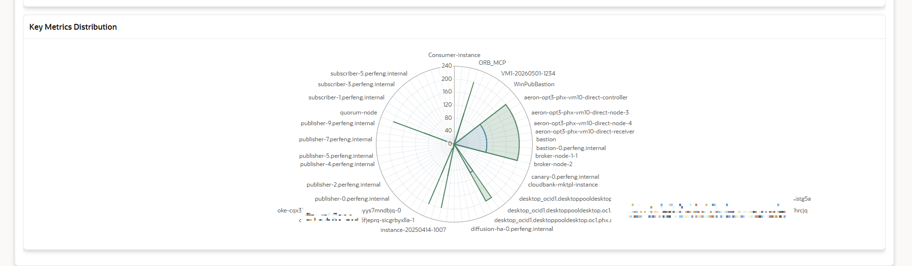

    Review the final middle section to confirm the remaining capacity and forecast widgets render correctly.

    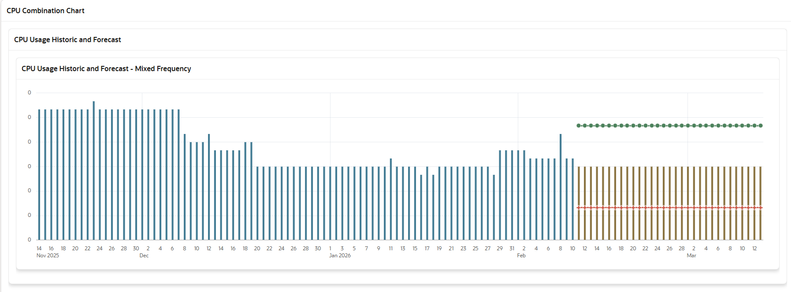

    The graph region should render the synthetic Exadata Infrastructure, VM Cluster, CDB, and PDB relationships created earlier in this lab.

    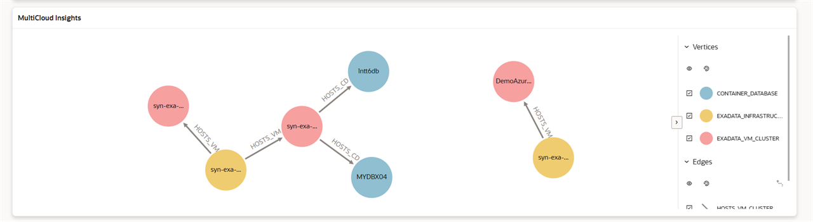

You may now **proceed to the next lab**.

## Acknowledgements

* **Authors:**
	* Nicholas Cusato - Cloud Architect
	* Royce Fu - Master Principal Cloud Architect
* **Last Updated by/Date** - Royce Fu, May 2026
