# Lab 5: Build a Compute Wingmate Agent

## Introduction

This lab walks you through adding and configuring the Compute Wingmate Agent page in Oracle APEX. You will import one APEX page into the Ask Oracle application from Lab 2, use Resource Analytics materialized views from Lab 1, or query the `OCIRA` schema views directly, to provide compute instance metadata. You will also configure the OCI Metrics Collector to write compute utilization metrics into Autonomous Database so the APEX app can overlay CPU and memory metrics on top of compute instance metadata.

The result is a Compute Wingmate page that can answer natural language questions about compute inventory and utilization while also displaying APEX visualization widgets for operational monitoring.

> **SME Gate:** Confirm the final Resource Analytics compute view columns before publishing. The metrics collector writes a known `OCI_COMPUTE_METRICS` table, but the join column from Resource Analytics compute metadata must be verified in the target tenancy.

Estimated Time: 60 minutes

### Objectives

In this lab, you will:

* Confirm Resource Analytics compute metadata sources
* Import the Compute Wingmate page into the existing Lab 2 application
* Configure OCI Metrics Collector for compute CPU and memory metrics
* Load compute metrics into the `WINGMATE` Autonomous Database schema
* Create SQL views that overlay metrics on compute instance metadata
* Configure APEX visualization widgets on the Compute Wingmate page
* Configure the `wingmate_compute_rag` AI Configuration and AI assistant

### Prerequisites

* Completed Labs 1 through 4
* Access to the Ask Oracle APEX application imported in Lab 2
* `OCI_GENAI` Generative AI service object created in APEX
* Resource Analytics compute materialized views created in Lab 1, or direct access to the `OCIRA` schema views through `OCIRA_RO`
* `wingmate_data.zip` extracted, including `apex-pages/wingmate-page-05-oci-compute-wingmate.sql`
* An OCI VM or local environment that can run Python and access OCI Monitoring
* Autonomous Database wallet downloaded for the Resource Analytics-provisioned Autonomous AI Database
* `WINGMATE` database user with privileges to create and insert into tables

## Task 1: Import the Compute Wingmate Page

> **SME Gate:** Confirm the final page export filename, import wizard screenshots, target page number, and expected import prompts.

1. In App Builder, open the **Ask Oracle** application imported in Lab 2.

2. Select **Import**, then upload `wingmate_data/apex-pages/wingmate-page-05-oci-compute-wingmate.sql`.

3. Confirm **File Type** is set to **Application, Page or Component Export**, select the existing Lab 2 application as the target, and keep the page number as **5**.

4. Continue through the wizard and select **Import**.

	> **Note:** The page export removes and recreates only Page 5. It does not change the Ask Oracle application pages from Lab 2, the Security page from Lab 3, or the Multicloud page from Lab 4.

5. Open Page 5, **OCI Compute Wingmate**, in Page Designer.

6. Navigate to the Shared Components of the app, select **Lists**, then open **LLM Conversations - Top**.

7. Edit the following at the end sequence and select **Create**.

    * **image/class:** `fa-server`
    * **List Entry Label:** `Compute Wingmate`
    * **Page:** `5`

8. Open Page 5, **OCI Compute Wingmate**, in Page Designer to verify the list entry.

9. You will connect the page's **Show AI Assistant** action to `wingmate_compute_rag` in Task 7.

## Task 2: Confirm Compute Metadata Sources

Compute Wingmate can use the materialized views created in Lab 1 or query the `OCIRA` schema views directly. The materialized view option is recommended for APEX because the app owns stable objects in the `WINGMATE` schema.

1. Sign in to Database Actions as `WINGMATE`.

2. Confirm which Resource Analytics compute materialized views are available.

	```sql
	<copy>
	SELECT mview_name
	FROM user_mviews
	WHERE mview_name LIKE 'MV_COMPUTE\_%' ESCAPE '\'
	   OR mview_name = 'MV_INSTANCE_VOLUME_DETAILS_V'
	ORDER BY mview_name;
	</copy>
	```

3. If the materialized views are not available, confirm direct `OCIRA` view access.

	```sql
	<copy>
	SELECT view_name
	FROM all_views
	WHERE owner = 'OCIRA'
	AND (
	       view_name LIKE 'COMPUTE\_%' ESCAPE '\'
	    OR view_name = 'INSTANCE_VOLUME_DETAILS_V'
	)
	ORDER BY view_name;
	</copy>
	```

4. Preview the compute instance metadata source.

	```sql
	<copy>
	SELECT *
	FROM MV_COMPUTE_INSTANCE_DIM_V
	FETCH FIRST 10 ROWS ONLY;
	</copy>
	```

	> **Note:** If you did not create the materialized view in Lab 1, replace `MV_COMPUTE_INSTANCE_DIM_V` with `OCIRA.COMPUTE_INSTANCE_DIM_V`.

5. Validate the Resource Analytics compute instance OCID column.

	The metrics collector writes the OCI Monitoring `resourceId` value into `OCI_COMPUTE_METRICS.INSTANCE_ID`. Resource Analytics stores the same compute instance OCID in `MV_COMPUTE_INSTANCE_DIM_V.ID`, so later views join metrics to metadata on this value.

	```sql
	<copy>
	SELECT id,
	       display_name,
	       lifecycle_state
	FROM mv_compute_instance_dim_v
	WHERE id LIKE 'ocid1.instance.%'
	FETCH FIRST 10 ROWS ONLY;
	</copy>
	```

## Task 3: Configure OCI Metrics Collector

The OCI Metrics Collector collects compute metrics from OCI Monitoring, enriches the data with compute instance metadata, and writes the results to Autonomous Database.

1. Provision or select an OCI VM to run the collector. Use default configuration and select the appropriate compartment. Provide the console a public key or download a key pair.

	> **Note:** An OCI VM is recommended because the collector can use instance principal authentication and run continuously with `systemd`.

    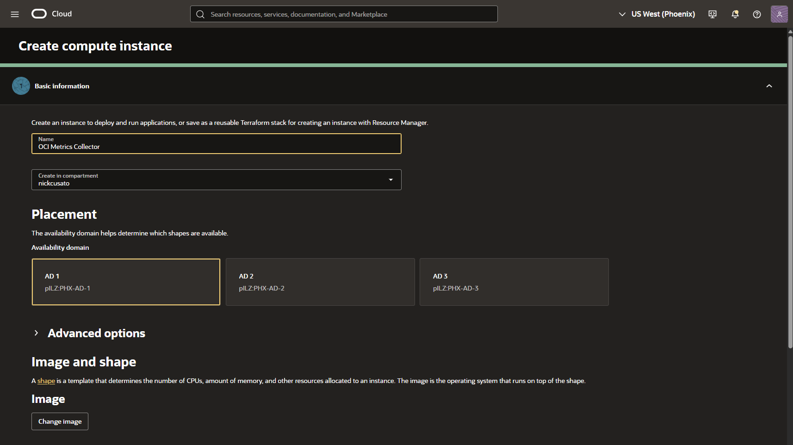

2. Create a dynamic group for the collector VM. Copy the OCID from the VM details. Use lab 1 steps to help create the dynamic group.

	Example matching rule:

	```text
	<copy>
	instance.id = 'ocid1.instance.oc1..YOUR_INSTANCE_OCID'
	</copy>
	```

	For a workshop environment where you may rebuild the collector VM, use a compartment-based matching rule instead.

	```text
	<copy>
	instance.compartment.id = 'ocid1.compartment.oc1..YOUR_COLLECTOR_COMPARTMENT_OCID'
	</copy>
	```

    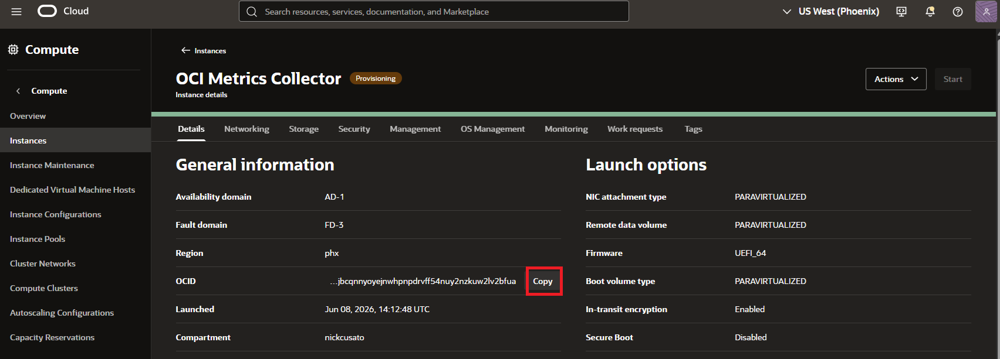

3. Add IAM policies for the dynamic group.

	```text
	<copy>
	Allow dynamic-group <dg-name> to read metrics in tenancy
	Allow dynamic-group <dg-name> to read instances in tenancy
	Allow dynamic-group <dg-name> to inspect compartments in tenancy
	</copy>
	```

  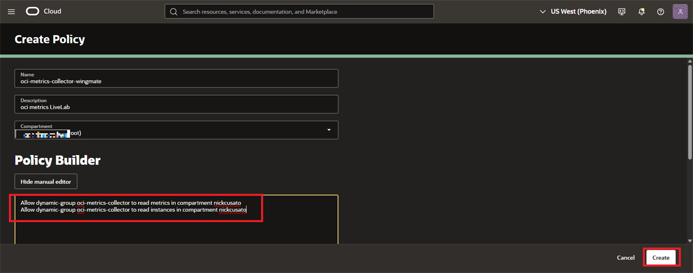

	> **Note:** The collector configuration in this lab uses `compartment_strategy: "tenancy_subtree"`, so the dynamic group needs tenancy-level read access for metrics and instances. Add Log Analytics permissions only if you also enable the Log Analytics destination.

4. Connect to the collector VM and clone the metrics collector repository.

	```bash
	<copy>
	sudo dnf install git
	git clone https://github.com/jujufugh/oci-metrics-collector-py /home/opc/oci-metrics-collector-py
	cd /home/opc/oci-metrics-collector-py
	</copy>
	```

5. Create and activate a Python virtual environment.

	```bash
	<copy>
	python3 -m venv venv
	source venv/bin/activate
	pip install -e .
	</copy>
	```

6. Copy the sample configuration.

	```bash
	<copy>
	cp config.yaml.example config.yaml
	</copy>
	```
7. Download the Autonomous Database wallet to your local machine, then copy it to the collector VM.

    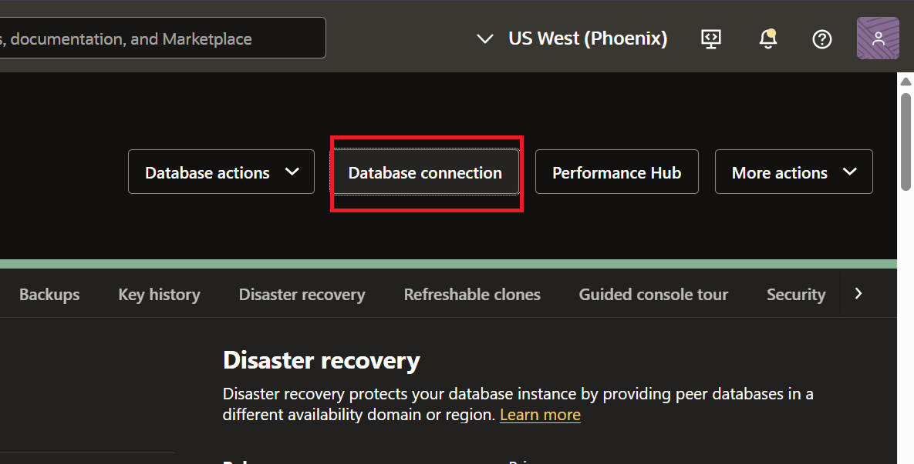
    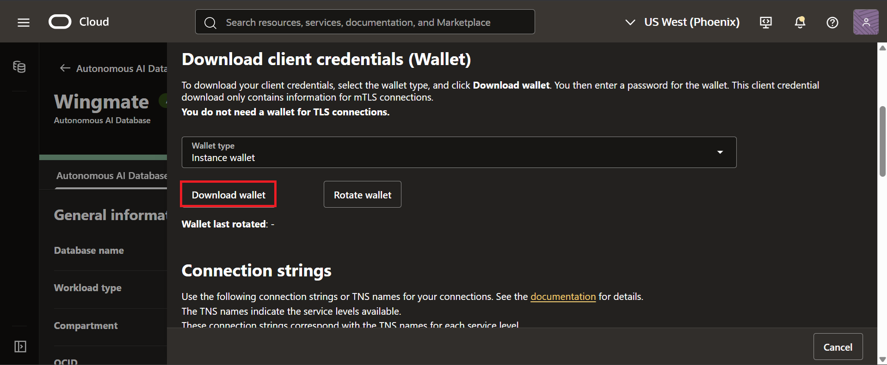

	```bash
	<copy>
	scp -i <private_key_file> <path_to_wallet_zip> opc@<collector_public_ip>:/home/opc/
	</copy>
	```

	On the collector VM, unzip the wallet into a dedicated wallet directory.

	```bash
	<copy>
	mkdir -p /home/opc/wallet_<adb_name>
	unzip /home/opc/<wallet_zip_file>.zip -d /home/opc/wallet_<adb_name>
	chmod 700 /home/opc/wallet_<adb_name>
	ls -l /home/opc/wallet_<adb_name>/tnsnames.ora
	</copy>
	```
8. If the Autonomous Database uses a private endpoint, add the wallet hostname to `/etc/hosts` on the collector VM.

	Find the **Private endpoint IP** on the Autonomous Database details page. Then find the ADB hostname from the wallet.

	```bash
	<copy>
	grep -o "host=[^)]*" /home/opc/wallet_<adb_name>/tnsnames.ora | head -1
	</copy>
	```

	Add the mapping using the ADB private endpoint IP and the hostname from the wallet. The entry must use `IP address` first, then `hostname`.

	```bash
	<copy>
	sudo sh -c 'echo "<adb_private_endpoint_ip> <adb_hostname_from_wallet>" >> /etc/hosts'
	getent hosts <adb_hostname_from_wallet>
	</copy>
	```

	> **Note:** Use the Autonomous Database private endpoint IP, not the collector VM private IP or public IP. If the hostname already exists in `/etc/hosts`, remove the old line before adding the corrected mapping.

9. Collect the tenancy OCID, target region, and wallet location and edit `config.yaml`.

	Use the following values as the starting point. The collector queries each listed region under the configured tenancy source.

	```yaml
	<copy>
	oci:
	  auth_method: "instance_principal"

	tenancies:
	  - name: "parent"
	    tenancy_id: "<tenancy_ocid>"
	    regions:
	      - "<target_region>"
	    compartment_strategy: "tenancy_subtree"

	metrics:
	  namespace: "oci_computeagent"
	  resolution: "5m"
	  lookback_minutes: 10

	adb:
	  enabled: true
	  wallet_dir: "/home/opc/wallet_<adb_name>"
	  dsn: "<adb_name>_high"
	  user: "WINGMATE"
	  table_name: "OCI_COMPUTE_METRICS"

	log_analytics:
	  enabled: false
	</copy>
	```

	> **Note:** The collector sample file defaults to `auth_method: "config_file"`. Change it to `auth_method: "instance_principal"` for this lab so the VM authenticates through the dynamic group policies created earlier. Use an absolute wallet path such as `/home/opc/wallet_<adb_name>`. Do not use `~/wallet_<adb_name>` because the collector passes that value to the database driver without shell expansion. Use a `dsn` value that exactly matches an alias in `tnsnames.ora`; for example, use `<adb_name>_high` only if that alias exists in the wallet. The collector VM must also be able to resolve and reach the Autonomous Database endpoint from its VCN.

	Confirm the authentication method before running the collector.

	```bash
	<copy>
	grep -n "auth_method" config.yaml
	</copy>
	```

10. Store database secrets in `/home/opc/.env`.

	```bash
	<copy>
	cat > /home/opc/.env <<'EOF'
	OCI_METRICS_ADB_PASSWORD=<wingmate_database_password>
	OCI_METRICS_ADB_WALLET_PASSWORD=<wallet_password>
	EOF

	chmod 600 /home/opc/.env
	</copy>
	```

11. Load the environment variables and test connectivity.

	```bash
	<copy>
	set -a; source /home/opc/.env; set +a
	source /home/opc/oci-metrics-collector-py/venv/bin/activate
	oci-metrics-collector test-connection --config config.yaml
	</copy>
	```

12. Run one collection cycle.

	```bash
	<copy>
	oci-metrics-collector collect --config config.yaml
	</copy>
	```

	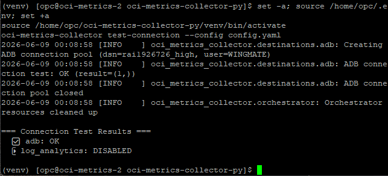

13. Optional: run the collector continuously.

	```bash
	<copy>
	oci-metrics-collector collect --config config.yaml --continuous
	</copy>
	```

14. Optional: install the collector as a `systemd` service for continuous collection.

	```bash
	<copy>
	sudo tee /etc/systemd/system/oci-metrics-collector.service >/dev/null <<'EOF'
	[Unit]
	Description=OCI Metrics Collector
	After=network-online.target
	Wants=network-online.target

	[Service]
	Type=simple
	User=opc
	WorkingDirectory=/home/opc/oci-metrics-collector-py
	EnvironmentFile=/home/opc/.env
	ExecStart=/home/opc/oci-metrics-collector-py/venv/bin/oci-metrics-collector collect --config config.yaml --continuous
	Restart=on-failure
	RestartSec=10

	[Install]
	WantedBy=multi-user.target
	EOF

	sudo systemctl daemon-reload
	sudo systemctl enable --now oci-metrics-collector
	sudo systemctl status oci-metrics-collector
	</copy>
	```

	> **Note:** Do not also schedule the collector with `cron` if you enable the `systemd` service. Continuous mode already performs recurring collection cycles.

## Task 4: Validate the Metrics Table in Autonomous Database

The metrics collector creates and writes to `OCI_COMPUTE_METRICS` in the `WINGMATE` schema.

1. Sign in to Database Actions as `WINGMATE`.

2. Confirm that the table exists.

	```sql
	<copy>
	SELECT table_name
	FROM user_tables
	WHERE table_name = 'OCI_COMPUTE_METRICS';
	</copy>
	```

3. Review the table columns.

	```sql
	<copy>
	SELECT column_name, data_type
	FROM user_tab_columns
	WHERE table_name = 'OCI_COMPUTE_METRICS'
	ORDER BY column_id;
	</copy>
	```

4. Confirm recent metric rows.

	```sql
	<copy>
	SELECT collection_time,
	       instance_id,
	       instance_name,
	       shape,
	       cpu_utilization_pct,
	       memory_utilization_pct,
	       cpu_usage_ocpus,
	       memory_used_gbs
	FROM oci_compute_metrics
	ORDER BY collection_time DESC
	FETCH FIRST 20 ROWS ONLY;
	</copy>
	```

	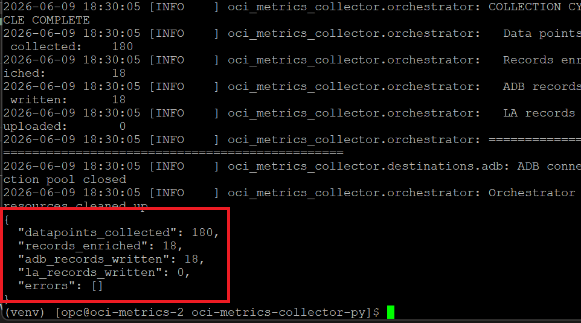

## Task 5: Create Compute Overlay Views

Create APEX-friendly views that combine compute metadata with the latest metrics.

1. Create a latest-metrics view.

	```sql
	<copy>
	CREATE OR REPLACE VIEW compute_metrics_latest_v AS
	SELECT *
	FROM (
	    SELECT m.*,
	           row_number() OVER (
	               PARTITION BY instance_id
	               ORDER BY collection_time DESC
	           ) AS rn
	    FROM oci_compute_metrics m
	)
	WHERE rn = 1;
	</copy>
	```

2. Create a metadata and metrics overlay view.

	```sql
	<copy>
	CREATE OR REPLACE VIEW compute_wingmate_overlay_v AS
	SELECT ci.*,
	       ml.collection_time,
	       ml.cpu_allocated_ocpus,
	       ml.memory_allocated_gbs,
	       ml.cpu_utilization_pct,
	       ml.cpu_utilization_pct_p95,
	       ml.cpu_utilization_pct_p99,
	       ml.memory_utilization_pct,
	       ml.memory_utilization_pct_p95,
	       ml.memory_utilization_pct_p99,
	       ml.cpu_usage_ocpus,
	       ml.memory_used_gbs
	FROM mv_compute_instance_dim_v ci
	LEFT JOIN compute_metrics_latest_v ml
	    ON ml.instance_id = ci.id;
	</copy>
	```

	> **Note:** If you are querying Resource Analytics directly instead of using materialized views, replace `mv_compute_instance_dim_v` with `OCIRA.COMPUTE_INSTANCE_DIM_V`.

3. Create an assistant context view.

	```sql
	<copy>
	CREATE OR REPLACE VIEW compute_wingmate_context_v AS
	SELECT json_object(
	           'instance_id' VALUE instance_id,
	           'instance_name' VALUE instance_name,
	           'shape' VALUE shape,
	           'lifecycle_state' VALUE lifecycle_state,
	           'cpu_utilization_pct' VALUE cpu_utilization_pct,
	           'memory_utilization_pct' VALUE memory_utilization_pct,
	           'cpu_usage_ocpus' VALUE cpu_usage_ocpus,
	           'memory_used_gbs' VALUE memory_used_gbs,
	           'collection_time' VALUE to_char(collection_time, 'YYYY-MM-DD HH24:MI:SS')
	       RETURNING CLOB) AS context_prompt
	FROM compute_metrics_latest_v;
	</copy>
	```

## Task 6: Configure the Compute Wingmate APEX Page

Use the Compute Wingmate page imported at the start of this lab, but focus the page content on compute metadata and metrics.

1. In App Builder, open the `WINGMATE` application.

2. Open the **OCI Compute Wingmate** page.

3. Create or select a region named **Compute Overview**.

4. Add a **Classic Report** region using the source:

	```sql
	<copy>
	SELECT *
	FROM compute_wingmate_overlay_v
	</copy>
	```

	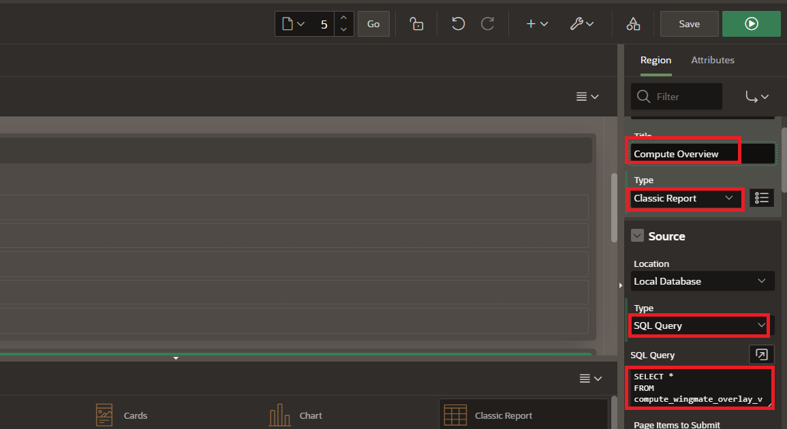

5. Add a **Chart** region named **CPU Utilization by Instance**.

	Use this source query:

	```sql
	<copy>
	SELECT instance_name,
	       cpu_utilization_pct
	FROM compute_metrics_latest_v
	WHERE cpu_utilization_pct IS NOT NULL
	ORDER BY cpu_utilization_pct DESC
	</copy>
	```

	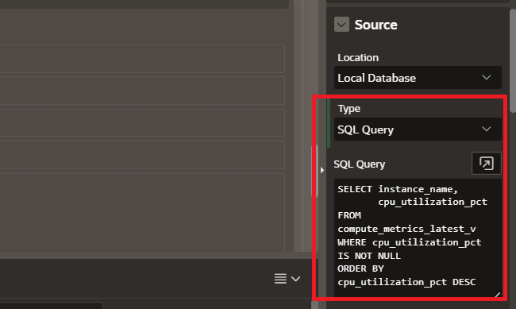

	Recommended chart settings:

	* **Type:** Bar
	* **Label:** `INSTANCE_NAME`
	* **Value:** `CPU_UTILIZATION_PCT`

6. Add a **Chart** region named **Memory Utilization by Instance**.

	Use this source query:

	```sql
	<copy>
	SELECT instance_name,
	       memory_utilization_pct
	FROM compute_metrics_latest_v
	WHERE memory_utilization_pct IS NOT NULL
	ORDER BY memory_utilization_pct DESC
	</copy>
	```

	Recommended chart settings:

	* **Type:** Bar
	* **Label:** `INSTANCE_NAME`
	* **Value:** `MEMORY_UTILIZATION_PCT`

7. Add a **Chart** region named **CPU and Memory Usage Trend**.

	Use this source query:

	```sql
	<copy>
	SELECT collection_time,
	       instance_name,
	       cpu_utilization_pct,
	       memory_utilization_pct
	FROM oci_compute_metrics
	WHERE collection_time >= systimestamp - INTERVAL '24' HOUR
	ORDER BY collection_time
	</copy>
	```

	Recommended chart settings:

	* **Type:** Line

	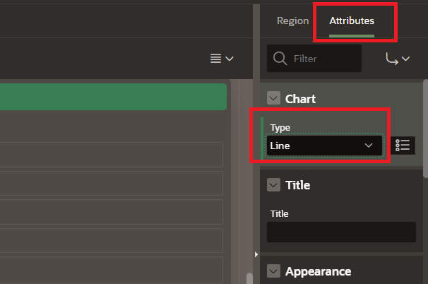
	
	* **Label:** `COLLECTION_TIME`

	* **Series:** one series for CPU utilization and one series for memory utilization

	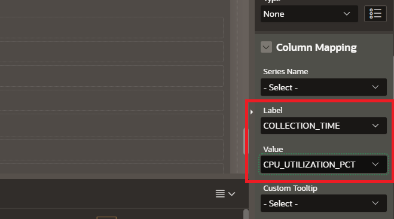

	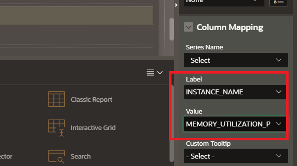

## Task 7: Configure the Compute Wingmate Agent

1. Navigate to **Shared Components**, then **AI Configurations**.

	> **Note:** APEX 24.2 uses **AI Configurations** and **RAG Sources**. In APEX 26.1, the same capability appears under AI Agent tooling. Use the labels shown in your APEX environment, but keep the static ID values in this lab unchanged.

2. Create an AI Configuration with these values:

	* **Name:** `Compute Wingmate RAG`
	* **Static ID:** `wingmate_compute_rag`
	* **System Prompt:** `You are OCI Compute Wingmate, an assistant for OCI compute operations. Use the configured RAG source for Resource Analytics compute metadata and OCI compute metrics data. Answer questions about inventory, CPU utilization, memory utilization, allocated OCPUs, allocated memory, and usage trends. Be concise, explain operational impact, and call out missing data instead of guessing.`
	* **Welcome Message:** `Welcome! Begin chatting with OCI Compute Wingmate about inventory, CPU utilization, memory utilization, allocated OCPUs, allocated memory, and usage trends.`

	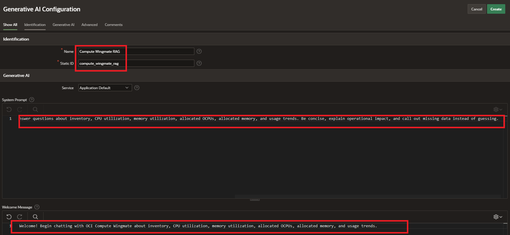

3. Add a SQL-based RAG Source to `wingmate_compute_rag`:

	```sql
	<copy>
	SELECT context_prompt
	FROM compute_wingmate_context_v
	FETCH FIRST 100 ROWS ONLY
	</copy>
	```

	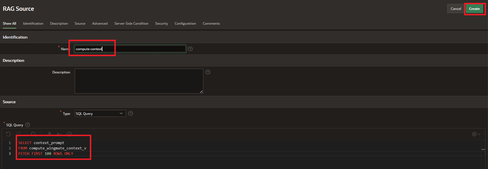

	> **SME Gate:** Confirm the final RAG source row limit and whether the assistant should include only latest metrics or a time window of historical metrics.

4. Validate the RAG source SQL as `WINGMATE`.

	```sql
	<copy>
	SELECT context_prompt
	FROM compute_wingmate_context_v
	FETCH FIRST 100 ROWS ONLY
	</copy>
	```

	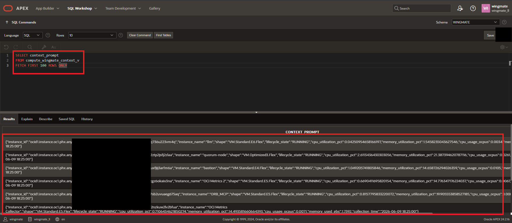

5. Return to Page 5, **OCI Compute Wingmate**.

6. Create or select a region named **WingmateChat** and set its **Static ID** to `wingmate-chat`.

7. Add or select a button named **StartComputeWingmate** in the **WingmateChat** region.

8. Create or update a dynamic action named **Chat** for the button.

9. Add or update the **Show AI Assistant** true action.

10. Configure the action:

	* **Configuration:** `wingmate_compute_rag`
	* **Display As:** `Inline`
	* **Container Selector:** `#wingmate-chat`

11. Save and run the page.

## Task 8: Validate Compute Wingmate

1. Confirm the **Compute Overview** report renders metadata and metric fields.

2. Confirm the CPU and memory charts display recent metrics.

3. Start the Compute Wingmate chat.

4. Ask:

	```text
	<copy>Which compute instances have the highest CPU utilization?</copy>
	```

5. Ask:

	```text
	<copy>Which compute instances look underutilized based on CPU and memory?</copy>
	```

6. Compare the assistant responses with the chart values and SQL query results.

7. If the assistant cannot answer, validate:

	* `OCI_COMPUTE_METRICS` contains recent rows
	* `compute_metrics_latest_v` returns one row per instance
	* The `wingmate_compute_rag` RAG Source SQL returns rows
	* The **Show AI Assistant** action uses `wingmate_compute_rag`, displays inline, and targets `#wingmate-chat`
	* The `OCI_GENAI` service object and `api_key` web credential still work

You have completed the workshop.

## Learn more

* [OCI Metrics Collector](https://github.com/jujufugh/oci-metrics-collector-py)
* [Resource Analytics Compute Data Model Reference](https://docs.oracle.com/en-us/iaas/Content/resource-analytics/reference-compute.htm)

## Acknowledgements

* **Authors:**
  * Royce Fu - Master Principal Cloud Architect
  * Nicholas Cusato - Senior Cloud Engineer
* **Last Updated by/Date** - Nicholas Cusato, June 2026
