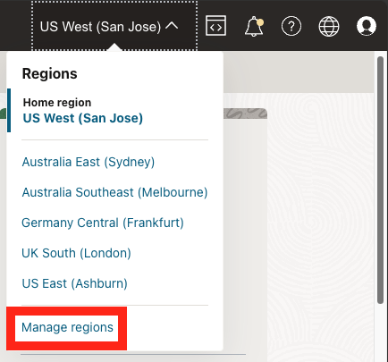
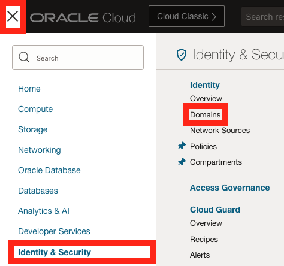
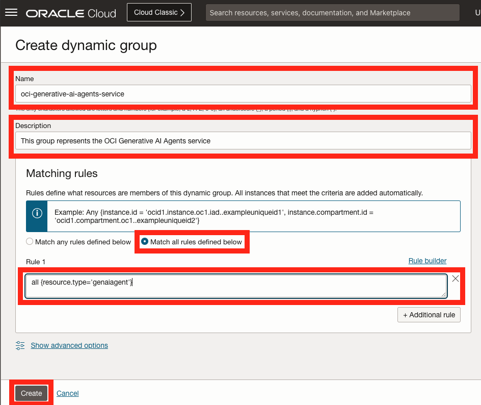
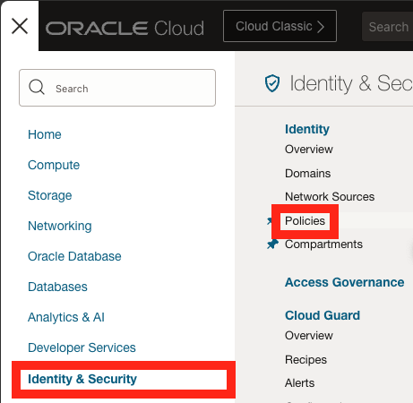

# Setup

## Introduction

In this lab we are going to perform the actions required to enable the service on our tenancy.
After that, we will create the objects required for subsequent labs.

Estimated Time: 20 minutes

### Objectives

In this lab, you will:

* Make sure that our tenancy is subscribed to the Chicago region.
* Create the required permissions for us to be able to use the service in our tenancy.

### Prerequisites

This lab assumes you have:

* An Oracle Cloud account

## Task 1: Ensure Chicago region subscription

The OCI Generative AI Agents service is currently only available in the Chicago region.
If your tenancy is already subscribed to the Chicago region, please skip to the next task.

1. On the top right, click the Regions drop down menu.

  

1. Review the list of regions your tenancy is subscribed in. If you find the **US Midwest (Chicago)** region in the list, please skip to the next task.

1. Click the Manage Regions link at the bottom of the list.

1. In the **Infrastructure Regions** list, locate the **US Midwest (Chicago)** region and click the subscribe button to it's right.

  > **Note:** When you subscribe to a region, you cannot unsubscribe from it.

  

1. Click the **Subscribe** button at the bottom of the **Subscribe to New Region** dialog.

  

The operation might take a few minutes to complete. When complete, the new region will appear on the **US Midwest (Chicago)** will appear in the **Regions** drop down menu on the main screen.

## Task 2: Create access policies

In this task, we are going to create policies which will grant us access to the OCI Generative AI Agents service as well as the Object Storage service.
We will use Object Storage to store the dataset required for this workshop.

First, we are going to create a dynamic group which will allow us to grant access to the OCI Generative AI Agent service to the dataset uploaded to Object Storage.

1. Click the navigation menu on the top left.

1. Click **Identity & Security**.

1. Click **Domains**.

  

1. Under the **List scope**, make sure that the **root** compartment is selected.

1. Click the **Default** domain from the **Domains** table.

  

1. On the left click **Dynamic Groups**.

1. Click thd **Create dynamic group** button at the top of the **Dynamic groups** table.

  

1. Name the dynamic group (example: oci-generative-ai-agents-service)

1. Provide an optional description (example: This group represents the OCI Generative AI Agents service)

1. Select the **Match all rules defined below** option in the **Matching rules** section.

1. Enter the following expression in the **Rule 1** textbox:

    ```text
    <copy>
    all {resource.type='genaiagent'}
    </copy>
    ```

  

Next, we will create the access policies:

1. Click **Identity & Security**.

1. Click **Policies**.

  

1. On the left under **List scope**, select the root compartment. The root compartment should appear first in the list, have the same name as the tenancy itself and have the text **(root)** next to it's name.

1. Click the **Create Policy** button on the top left of the **Policies** table.

  

1. Provide a name for the policy (example: oci-generative-ai-agents-service).

1. Provide a description (example: OCI Generative AI Agents CloudWorld 2024 Hands-On-Lab Policy).

1. Make sure that the root compartment is selected.

1. Enable the **Show manual editor** option.

1. In the policy editor, enter the following policy statements:

  ```text
  <copy>
  allow group <your-user-group-name> to manage genai-agent-family in tenancy
  allow group <your-user-group-name> to manage object-family in tenancy
  allow dynamic-group <dynamic-group-name-created-above> to manage all-resources in tenancy
  </copy>
  ```

  Make sure to replace `<your-user-group-name>` with the user group your user is associated with (for example: `Administrators`).
  Also, please replace `<dynamic-group-name-created-above>` with the name you've provided for the dynamic group created above.

  

## Task 3: Verify access to the service

1. On the top right, click the Regions drop down menu.

1. Click the **US Midwest (Chicago)**.

1. Verify that the appears in bold to indicate it is the active region.

  

1. Click the navigation menu on the top left.

1. Click **Analytics & AI**.

1. Click **Generative AI Agents** under **AI Services**.

  If the **Generative AI Agents** service does not appear under **AI Services**, please review previous tasks.

  

## Learn More

* [Region subscription](https://docs.oracle.com/en-us/iaas/Content/Identity/Tasks/managingregions.htm#ariaid-title7)
* [Managing Dynamic Groups](https://docs.oracle.com/en-us/iaas/Content/Identity/Tasks/managingdynamicgroups.htm)

## Acknowledgements

* **Author** - Lyudmil Pelov, Senior Principal Product Manager, Yanir Shahak, Senior Principal Software Engineer
